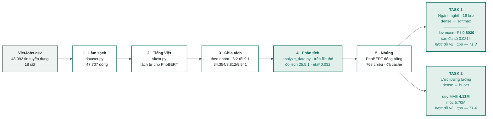

# VietJobs — khung sườn dự án

Bản đồ tổng thể: từ file CSV thô đến hệ thống dự đoán. Mọi con số trong tài
liệu này đều được đo trực tiếp, không phải ước lượng.

> Mermaid hiển thị trực tiếp trong VS Code (Ctrl+Shift+V) và trên GitHub.
> Không cần cài đặt gì thêm.

> **Tài liệu sống.** Kho tài liệu này phải được cập nhật ngay sau mỗi thay đổi
> thực sự — một thí nghiệm mới, một module mới, một hạng mục công việc hoàn
> thành. Các quy tắc nằm trong [../AGENTS.md](../AGENTS.md).

> **Thay đổi hướng đi, 2026-09-08.** Mô hình chính của luận văn này là một
> **mạng sâu trên biểu diễn PhoBERT**, hiện giải hai tác vụ bằng hai mạng riêng
> biệt. Mốc để đối chiếu là hai lần chạy nền `dl-cat-s2` và `dl-sal-s2` cùng các
> sàn không dùng mô hình trong [04-results.md](04-results.md).

---

## Bắt đầu từ đâu

| Bạn là ai | Đọc theo thứ tự này |
|---|---|
| **Mới với ML/DL** | [nen-tang/](nen-tang/00-index.md) trước → rồi đến [01](01-data-audit.md) → [05](05-phan-tich-du-lieu.md) → [06](06-baseline-dl.md) |
| **Đã quen bài toán, muốn hiểu dự án** | [01](01-data-audit.md) → [05](05-phan-tich-du-lieu.md) → [06](06-baseline-dl.md) → [09](09-lo-trinh.md) |
| **Muốn thay đổi code** | [08](08-ma-nguon.md) → [03](03-protocol.md) → [09](09-lo-trinh.md) |
| **Muốn xem kết quả** | [04-results.md](04-results.md) → [06](06-baseline-dl.md) |
| **Muốn viết báo cáo luận văn** | [bao-cao/](bao-cao/00-index.md) — bảng điều khiển cho biết chương nào đã xong và chương nào đang chờ số liệu đo |

---

## 1. Khung sườn tổng thể

**Xanh lá = đã đo, có dòng kết quả.**

| Giai đoạn | Trạng thái | Bằng chứng | Chi tiết |
|---|---|---|---|
| Làm sạch | đã xong | `manifest.json` — 47.707 dòng, đã loại 385 bản trùng | [01](01-data-audit.md) |
| Xử lý tiếng Việt | đã xong | tách từ, 0 lỗi trên 48 nghìn tin tuyển dụng; PhoBERT **yêu cầu bắt buộc** văn bản đã tách từ | [02](02-vietnamese-nlp.md) |
| Chia tách | **làm lại 2026-09-09** | `train:test` = 8:2, sau đó `train:dev` = 9:1 → 34.354 / 3.812 / 9.541 · 0 nhóm bị rò rỉ, đủ 16 lớp trong cả ba tập | [01](01-data-audit.md#7-chia-tách-dữ-liệu--theo-nhóm-không-theo-dòng) |
| **Phân tích dữ liệu** | **đã xong, 2026-09-12 (T1.1)** | Phạm vi là **file gốc**, 47.707 dòng (Quy tắc 8). Cả 7 hình đã được tạo lại, bao gồm hình 07 (độ dài token) — độ lệch 25,5 : 1 · tỉ lệ công khai lương 71,5 % · eta² = 0,032 · `max_len=256` giữ lại 91,5 % số token. `summary.json` được tạo lại toàn bộ; các mốc sàn không mô hình đã đo lại trên các tập chia v2 | [05](05-phan-tich-du-lieu.md) |
| Vector nhúng PhoBERT | **đã xong, 2026-09-13 (T1.2)** | đã mã hóa lại trên lược đồ chia v2: `artifacts/embeddings/{train,dev}-{raw,masked}-len256.npy`, shape (34354, 768) / (3812, 768) | [06](06-baseline-dl.md) |
| **Baseline phân lớp (DL)** | **đã xong, đo lại trên `cpu` 2026-09-20 (T1.3, T2.4)** | `dl-cat-ce-cpu-0920` macroF1=0.6030 · F1=0.6413 · acc=0.6501; `dl-cat-focal-cpu-0920` (focal γ=2) macroF1=0.5972 — lược đồ chia v2, tập `dev` (3.812 dòng) | [06](06-baseline-dl.md#51-phân-lớp-nghề-nghiệp) |
| **Baseline ước lượng lương (DL)** | **đã xong, đo lại trên `cpu` 2026-09-20 (T1.4)** | `dl-sal-cpu-0920` MAE=4.13tr · RMSE=8.13tr · R2log=0.515 · ±20%=52.6% trên lược đồ chia v2, tập `dev` (2.698 dòng có công khai lương) | [06](06-baseline-dl.md#52-ước-lượng-lương) |
| **Đánh giá chéo trên tập ngoài** | **đã chạy, 2026-09-17 (T7.3) — số tham khảo** | `dl-cat-s2` trên VietJobs-37K sau khử trùng (< 2 %) và ánh xạ 60 → 16: Gold-1000 strict macroF1=0.3977 [0.353, 0.443] · F1=0.5094 (n=529); test 37K strict macroF1=0.4525. Bảng ánh xạ còn `draft` | [10](10-danh-gia-ngoai.md) |

Việc còn lại: [09-lo-trinh.md](09-lo-trinh.md) và [../TASKS.md](../TASKS.md).

---

## 2. Mục lục — mỗi ghi chú trả lời một câu hỏi

| Ghi chú | Trả lời câu hỏi gì | Khi nào cần cập nhật |
|---|---|---|
| [01-data-audit.md](01-data-audit.md) | Dữ liệu thô bẩn ở đâu, được làm sạch thế nào, được chia tách ra sao | `clean()` thay đổi hoặc cách chia tách thay đổi |
| [02-vietnamese-nlp.md](02-vietnamese-nlp.md) | Xử lý tiếng Việt · chín bước · đường văn bản vào PhoBERT | Một bước tiền xử lý được thêm/bỏ · có dòng ablation mới |
| [03-protocol.md](03-protocol.md) | Luật chơi: seed, việc đụng vào test, ghi log, các chỉ số | Gần như không bao giờ — đây là hợp đồng |
| [04-results.md](04-results.md) | Mọi lượt chạy thí nghiệm (khởi động lại từ 2026-09-08) | **Mọi** lượt huấn luyện (tự động, chỉ thêm không sửa) |
| [05-phan-tich-du-lieu.md](05-phan-tich-du-lieu.md) | Độ lệch, phân phối, ranh giới · độ trải rộng lương theo ngành · mốc sàn không mô hình | Việc làm sạch thay đổi, hoặc có phép đo mới được thêm vào |
| [06-baseline-dl.md](06-baseline-dl.md) | Kiến trúc PhoBERT → dense · cả hai baseline · đường cong học | Một cấu hình DL tốt hơn hoàn tất |
| [07-bai-toan-luong.md](07-bai-toan-luong.md) | Tác vụ lương · cạm bẫy đã đo · thiên lệch chọn mẫu | Đầu ra lương hoàn tất một lượt chạy |
| [08-ma-nguon.md](08-ma-nguon.md) | Module nào làm việc gì, và chúng phụ thuộc lẫn nhau ra sao | Một module trong `src/` được thêm/sửa/xóa |
| [09-lo-trinh.md](09-lo-trinh.md) | Còn những việc gì phải làm, theo thứ tự nào | Một hạng mục công việc hoàn thành |
| [10-danh-gia-ngoai.md](10-danh-gia-ngoai.md) | Mô hình có tổng quát hóa sang tin tuyển dụng của người khác không · VietJobs-37K · khử trùng · ánh xạ 60 → 16 · hai quy ước chấm | Chạy lại `scripts/eval_external.py`, hoặc bảng ánh xạ được duyệt/sửa |
| [nen-tang/](nen-tang/00-index.md) | Khái niệm nền tảng cho người mới | Hiếm khi — các ghi chú nền tảng **không chứa số liệu kết quả** |
| [bao-cao/](bao-cao/00-index.md) | **Bản thảo luận văn** — sáu chương, viết bằng tiếng Việt, được ghép thành file Word cuối cùng | **Mọi** thay đổi thực sự — xem [../AGENTS.md](../AGENTS.md) Quy tắc 7 |

---

## 3. Đọc số liệu đúng chỗ nào

| Nguồn | Nội dung |
|---|---|
| [`data/processed/manifest.json`](../data/processed/manifest.json) | Số dòng, số nhóm, kích thước từng tập chia, seed, sha256 của file thô |
| [`artifacts/eda/summary.json`](../artifacts/eda/summary.json) | Mọi con số trong [05](05-phan-tich-du-lieu.md) — tạo lại bằng `python scripts/analyze_data.py` |
| [04-results.md](04-results.md) | Mỗi dòng ứng với một lượt huấn luyện — chỉ thêm không sửa |
| `artifacts/<run_id>/metrics.json` | Toàn bộ tập chỉ số của một lượt chạy |
| `artifacts/<run_id>/history.jsonl` | Mỗi dòng ứng với một epoch — đường cong học nằm ở đây |

---

**Những quy tắc không thay đổi:** test chỉ được đụng vào một lần, ở cuối cùng ·
[04-results.md](04-results.md) chỉ thêm không sửa · một bước tiền xử lý không
cải thiện được gì thì bị loại bỏ · **mọi thay đổi thực sự đều cập nhật lại kho
tài liệu này, và cả chương luận văn báo cáo nó**
([bao-cao/](bao-cao/00-index.md)). Chi tiết trong
[03-protocol.md](03-protocol.md) và [../AGENTS.md](../AGENTS.md).
