# VietJobs — project skeleton

The overall map: from the raw CSV to a prediction system. Every number in this
document is measured directly, not estimated.

> Mermaid renders natively in VS Code (Ctrl+Shift+V) and on GitHub. Nothing to
> install.

> **Living documentation.** This vault must be updated right after every real
> change — a new experiment, a new module, a completed work item. The rules are
> in [../AGENTS.md](../AGENTS.md).

> **Track change, 2026-09-08.** The main model of this thesis is a **deep network
> on PhoBERT representations**, solving the two tasks separately first and only
> then merging them into a multi-task model. The whole machine-learning track
> (101 experiments, test macro-F1 **0.6112**) is closed and moved to
> [archive/](archive/README.md) — it is the **bar to beat**, not junk.

---

## Where to start

| Who you are | Read in this order |
|---|---|
| **New to ML/DL** | [nen-tang/](nen-tang/00-index.md) first → then [01](01-data-audit.md) → [05](05-phan-tich-du-lieu.md) → [06](06-baseline-dl.md) |
| **Know ML, want to understand the project** | [01](01-data-audit.md) → [05](05-phan-tich-du-lieu.md) → [06](06-baseline-dl.md) → [09](09-lo-trinh.md) |
| **Want to change the code** | [08](08-ma-nguon.md) → [03](03-protocol.md) → [09](09-lo-trinh.md) |
| **Want to see results** | [04-results.md](04-results.md) → [06](06-baseline-dl.md) · the old benchmark is in [archive/](archive/README.md) |
| **Want to write the thesis report** | [bao-cao/](bao-cao/00-index.md) — the control panel says which chapter is done and which is waiting on a measurement |

---

## 1. The overall skeleton

```mermaid
%%{init:{'theme':'base','themeVariables':{
  'primaryColor':'#EFF3F1','primaryTextColor':'#141F1D','primaryBorderColor':'#54625E',
  'lineColor':'#54625E','fontSize':'13px','fontFamily':'Be Vietnam Pro, Segoe UI, sans-serif',
  'clusterBkg':'#FFFFFF','clusterBorder':'#C3CFCB','edgeLabelBackground':'#FFFFFF',
  'secondaryColor':'#FFFFFF','tertiaryColor':'#FFFFFF','mainBkg':'#FFFFFF',
  'nodeTextColor':'#141F1D','titleColor':'#141F1D'}}}%%
flowchart LR
    classDef default fill:#FFFFFF,stroke:#54625E,stroke-width:1.5px,color:#141F1D
    RAW["<b>VietJobs.csv</b><br/>48,092 postings<br/>18 columns"]
    CLEAN["<b>1 · Clean</b><br/>dataset.py<br/>→ 47,707 rows"]
    VI["<b>2 · Vietnamese</b><br/>vitext.py<br/>segment for PhoBERT"]
    SPLIT["<b>3 · Split</b><br/>by group · 8:2 then 9:1<br/>34,354/3,812/9,541"]
    EDA["<b>4 · Analyse</b><br/>analyze_data.py · on the raw file<br/>skew 25.5:1 · eta² 0.032"]
    ENC["<b>5 · Embed</b><br/>frozen PhoBERT<br/>768 dims · cached"]
    A["<b>TASK 1</b><br/>Occupation · 16 classes<br/>dense → softmax<br/>─────────<br/>dev macro-F1 <b>0.5987</b><br/>old bar 0.6050<br/><i>scheme v1 — re-run due</i>"]
    B["<b>TASK 2</b><br/>Salary estimation<br/>dense → huber<br/>─────────<br/>dev MAE <b>4.83M</b><br/>bar 5.86M<br/><i>scheme v1 — re-run due</i>"]
    MT["<b>MULTI-TASK</b><br/>shared trunk → 2 heads<br/>joint masked loss<br/>─────────<br/>not done"]
    SYS["<b>predict.py</b><br/>raw description<br/>→ occupation + salary"]

    RAW --> CLEAN --> VI --> SPLIT --> EDA --> ENC
    ENC --> A --> MT
    ENC --> B --> MT
    MT --> SYS

    classDef done fill:#E2F0EC,stroke:#0E6B5B,stroke-width:2px,color:#0E6B5B
    classDef todo fill:#F8EDE2,stroke:#9E5C22,stroke-width:2px,color:#9E5C22
    classDef ok fill:#FFFFFF,stroke:#0E6B5B,stroke-width:1.5px,color:#141F1D
    classDef data fill:#EFF3F1,stroke:#54625E,stroke-width:1.5px,color:#141F1D
    class RAW data
    class CLEAN,VI,SPLIT,ENC ok
    class EDA,A,B done
    class MT,SYS todo
```

**Green = done and measured. Orange = no number yet.**

| Stage | Status | Evidence | Detail |
|---|---|---|---|
| Cleaning | done | `manifest.json` — 47,707 rows, 385 duplicates dropped | [01](01-data-audit.md) |
| Vietnamese processing | done | segmentation, 0 failures over 48k postings; PhoBERT **requires** segmented text | [02](02-vietnamese-nlp.md) |
| Splitting | **redone 2026-09-09** | `train:test` = 8:2, then `train:dev` = 9:1 → 34,354 / 3,812 / 9,541 · 0 groups leaking, all 16 classes in all three | [01](01-data-audit.md#7-splitting--by-group-not-by-row) |
| **Data analysis** | **done, 2026-09-12 (T1.1)** | Scope is the **original file**, 47,707 rows (Rule 8). All 7 figures regenerated, including figure 07 (token length) — skew 25.5 : 1 · disclosure 71.5 % · eta² = 0.032 · `max_len=256` keeps 91.5 % of tokens. `summary.json` fully regenerated; no-model floors re-measured on the v2 splits | [05](05-phan-tich-du-lieu.md) |
| PhoBERT embeddings | **stale** | the cache was built on the old splits and moved to `artifacts/embeddings-scheme-v1/`; must be re-encoded | [06](06-baseline-dl.md) |
| **Classification baseline (DL)** | **stale** | `dl-cat-v2` scored 0.5987 on the *old* 70/15/15 dev — not comparable with anything measured from here on; must be re-run | [06](06-baseline-dl.md#51-occupation-classification) |
| **Salary baseline (DL)** | **stale** | `dl-sal-v2` scored MAE 4.83 on the *old* dev — must be re-run against the new splits | [06](06-baseline-dl.md#52-salary-estimation) |
| PhoBERT fine-tuning | not run | this machine has no GPU/MPS | [09](09-lo-trinh.md#priority-2--fine-tune-phobert-old-level-4b) |
| Multi-task | not run | comes after both heads have their own numbers | [09](09-lo-trinh.md#priority-3--merge-into-multi-task) |
| `predict.py` system | skeleton done | the DL path is not wired in yet | [09](09-lo-trinh.md#priority-5--the-system) |

---

## 2. Table of contents — each note answers one question

| Note | Which question it answers | When to update it |
|---|---|---|
| [01-data-audit.md](01-data-audit.md) | Where the raw data is dirty, how it is cleaned, how it is split | `clean()` or the splitting changes |
| [02-vietnamese-nlp.md](02-vietnamese-nlp.md) | Vietnamese processing · nine steps · which ones PhoBERT actually needs | A preprocessing step is added/removed · a new ablation row |
| [03-protocol.md](03-protocol.md) | The rules of the game: seed, touching test, logging, metrics | Almost never — this is the contract |
| [04-results.md](04-results.md) | Every experiment run (restarted 2026-09-08) | **Every** training run (automatic, append-only) |
| [05-phan-tich-du-lieu.md](05-phan-tich-du-lieu.md) | Skew, distributions, boundaries · salary spread by sector · the model-free bar | Cleaning changes, or a new measurement is added |
| [06-baseline-dl.md](06-baseline-dl.md) | The PhoBERT → dense architecture · both baselines · learning curves | A better DL configuration finishes |
| [07-bai-toan-luong.md](07-bai-toan-luong.md) | The salary task · the traps known in advance | The salary head finishes a run |
| [08-ma-nguon.md](08-ma-nguon.md) | Which module does what, and how they depend on each other | A module in `src/` is added/changed/removed |
| [09-lo-trinh.md](09-lo-trinh.md) | What is left to do, in which order | A work item is completed |
| [archive/](archive/README.md) | The closed machine-learning track · 101 experiments · the 0.6112 bar | **Do not edit** — it is the record of a phase |
| [nen-tang/](nen-tang/00-index.md) | Background concepts for newcomers | Rarely — the background notes **hold no result numbers** |
| [bao-cao/](bao-cao/00-index.md) | **The thesis manuscript** — six chapters, written in Vietnamese, assembled into the final Word document | **Every** real change — see [../AGENTS.md](../AGENTS.md) Rule 7 |

---

## 3. Where to read a number correctly

| Source | What it holds |
|---|---|
| [`data/processed/manifest.json`](../data/processed/manifest.json) | Row counts, group counts, the size of each split, the seed, the sha256 of the raw file |
| [`artifacts/eda/summary.json`](../artifacts/eda/summary.json) | Every number in [05](05-phan-tich-du-lieu.md) — regenerate with `python scripts/analyze_data.py` |
| [04-results.md](04-results.md) | One row per training run — append-only |
| `artifacts/<run_id>/metrics.json` | The full metric set of one run |
| `artifacts/<run_id>/history.jsonl` | One row per epoch — the learning curves live here |

---

**The rules that do not change:** test is touched once, at the end ·
[04-results.md](04-results.md) is append-only · a preprocessing step that does
not improve anything gets removed · **every real change updates this vault
again, and the thesis chapter that reports it** ([bao-cao/](bao-cao/00-index.md)).
Details in [03-protocol.md](03-protocol.md) and [../AGENTS.md](../AGENTS.md).
