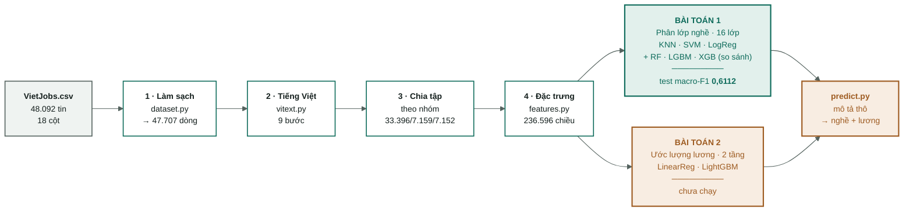

# Sườn dự án VietJobs

Bản đồ tổng thể: từ file CSV thô đến hệ thống dự đoán. Mọi con số trong tài liệu này
đo trực tiếp, không phải ước lượng.

> Mermaid render sẵn trong VS Code (Ctrl+Shift+V) và GitHub. Không cần cài gì thêm.

> **Tài liệu sống.** Vault này phải được cập nhật ngay sau mỗi thay đổi có thật —
> thí nghiệm mới, module mới, hạng mục xong. Quy tắc ở [../CLAUDE.md](../CLAUDE.md).

---

## Bắt đầu từ đâu

| Bạn là ai | Đọc theo thứ tự này |
|---|---|
| **Mới vào ML/DL** | [nen-tang/](nen-tang/00-index.md) trước → rồi [01](01-data-audit.md) → [02](02-vietnamese-nlp.md) → [05](05-dac-trung-tfidf.md) → [06](06-mo-hinh-phan-lop.md) |
| **Đã biết ML, muốn hiểu dự án** | [01](01-data-audit.md) → [02](02-vietnamese-nlp.md) → [05](05-dac-trung-tfidf.md) → [06](06-mo-hinh-phan-lop.md) → [07](07-bai-toan-luong.md) |
| **Muốn sửa code** | [08](08-ma-nguon.md) → [03](03-protocol.md) → [09](09-lo-trinh.md) |
| **Muốn xem kết quả** | [04-results.md](04-results.md) → [06](06-mo-hinh-phan-lop.md) → [10](10-so-sanh-mo-hinh.md) |

---

## 1. Sườn tổng thể

**Xanh = đã xong và đã đo. Cam = chưa làm.**

| Giai đoạn | Trạng thái | Bằng chứng | Chi tiết |
|---|---|---|---|
| Làm sạch | xong | `manifest.json` — 47.707 dòng, bỏ 385 trùng | [01](01-data-audit.md) |
| Xử lý tiếng Việt | xong | 73 test xanh, tách từ 0 lỗi trên 48k tin | [02](02-vietnamese-nlp.md) |
| Chia tập | xong | 0 nhóm lọt giữa các tập, 16 lớp đủ ở cả ba | [01](01-data-audit.md#7-chia-tập--theo-nhóm-không-theo-dòng) |
| Đặc trưng | xong | 236.596 chiều, test chống rò rỉ lương xanh | [05](05-dac-trung-tfidf.md) |
| **Bài toán 1 — phân lớp** | **xong** | **test macro-F1 0,6112 · 100 thí nghiệm** | [06](06-mo-hinh-phan-lop.md) |
| **So sánh mô hình** | **xong** | **11 thuật toán × 6 cấu hình, paired bootstrap** | [10](10-so-sanh-mo-hinh.md) |
| Bài toán 2 — lương | chưa chạy | code đã có, chưa huấn luyện | [07](07-bai-toan-luong.md) |
| Hệ thống `predict.py` | khung xong | chưa chạy thử đầu-cuối | [09](09-lo-trinh.md#ưu-tiên-0--khoá-trainserve-skew-chặn-mọi-thứ-khác) |

---

## 2. Mục lục — mỗi note trả lời một câu hỏi

| Note | Trả lời câu hỏi gì | Cập nhật khi nào |
|---|---|---|
| [01-data-audit.md](01-data-audit.md) | Dữ liệu thô bẩn ở đâu, làm sạch bằng cách nào, chia tập ra sao | Đổi `clean()` hoặc cách chia tập |
| [02-vietnamese-nlp.md](02-vietnamese-nlp.md) | Vì sao TF-IDF cần xử lý tiếng Việt riêng · chín bước · bước nào sống sót | Thêm/gỡ bước tiền xử lý · thêm dòng ablation |
| [03-protocol.md](03-protocol.md) | Luật chơi: seed, chạm test, log, metric | Hầu như không bao giờ — đây là hợp đồng |
| [04-results.md](04-results.md) | Mọi thí nghiệm đã chạy | **Mỗi lần** `train.py` chạy (tự động, chỉ ghi thêm) |
| [05-dac-trung-tfidf.md](05-dac-trung-tfidf.md) | Chữ biến thành ma trận 236.596 chiều thế nào · từng tham số TF-IDF | Đổi `features.py` |
| [06-mo-hinh-phan-lop.md](06-mo-hinh-phan-lop.md) | Bài toán 1 · bậc thang kết quả · vì sao macro-F1 | Có thí nghiệm phân lớp mới tốt hơn |
| [07-bai-toan-luong.md](07-bai-toan-luong.md) | Bài toán 2 · kiến trúc 2 tầng · bẫy đã biết trước | Chạy xong bài toán lương |
| [08-ma-nguon.md](08-ma-nguon.md) | Chín module làm gì, phụ thuộc nhau ra sao | Thêm/sửa/xoá module trong `src/` |
| [09-lo-trinh.md](09-lo-trinh.md) | Còn phải làm gì, theo thứ tự nào | Xong một hạng mục |
| [10-so-sanh-mo-hinh.md](10-so-sanh-mo-hinh.md) | Mười một thuật toán, sáu cấu hình mỗi cái · paired bootstrap · điểm yếu từng mô hình · chọn cái nào và vì sao | Chạy lại cụm quét công bằng |
| [nen-tang/](nen-tang/00-index.md) | Khái niệm nền cho người mới: TF-IDF, n-gram, rò rỉ, chính quy hoá, **cách đọc một bảng so sánh** | Hiếm — note nền tảng **không chứa con số kết quả** |

---

## 3. Đọc con số ở đâu cho đúng

Mỗi con số trong vault này phải truy được về một trong ba nguồn:

| Nguồn | Chứa gì |
|---|---|
| [`data/processed/manifest.json`](../data/processed/manifest.json) | Số dòng, số nhóm, kích thước từng tập, seed, sha256 file thô |
| [04-results.md](04-results.md) | Mọi metric của mọi lần chạy — append-only |
| `artifacts/<run_id>/metrics.json` | Metric đầy đủ của một lần chạy cụ thể |

Bảng chín bước trong [02](02-vietnamese-nlp.md) đo lại được bằng
`python scripts/measure_vitext.py`.

> **Về cột lệch trong [04-results.md](04-results.md):** đã sửa cho dòng mới
> (dấu ngăn ` · ` thay cho `|`). 34 dòng cũ giữ nguyên vì log là append-only.

---

**Quy tắc không đổi:** test chỉ chạm một lần ở cuối · [04-results.md](04-results.md)
chỉ ghi thêm · bước tiền xử lý nào không cải thiện thì gỡ bỏ · **mỗi thay đổi thật
đều phải cập nhật lại vault này**. Chi tiết ở [03-protocol.md](03-protocol.md) và
[../CLAUDE.md](../CLAUDE.md).
