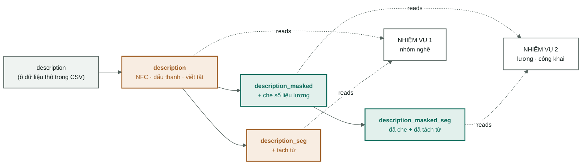

[← Tổng quan](00-tong-quan.md) · [Xử lý tiếng Việt →](02-vietnamese-nlp.md)

# Dữ liệu và làm sạch

Từ `VietJobs.csv` đến ba tệp CSV đã cố định. Toàn bộ việc này diễn ra **trước**
khi có bất kỳ mô hình nào tồn tại — và đây là nơi hầu hết các lỗi chí mạng xảy
ra, bởi vì chúng không hề báo lỗi.

Mã nguồn: [`dataset.py`](../src/vietjobs/dataset.py) — `clean()` và
`group_stratified_split()`.
Bằng chứng: [`data/processed/manifest.json`](../data/processed/manifest.json).

> Chưa rõ vì sao cần làm sạch dữ liệu? Hãy đọc
> [nền tảng: vì sao phải làm sạch](nen-tang/01-vi-sao-phai-lam-sach.md) trước.

---

## 1. Nguồn dữ liệu

| Thuộc tính | Giá trị | Nguồn |
|---|---|---|
| Tệp | `data/raw/VietJobs.csv` | `manifest.source_file` |
| Số dòng | **48.092** | `manifest.source_rows` |
| Số cột | **18** | tiêu đề của tệp CSV |
| sha256 | `85862b06fda…c49d477` | `manifest.source_sha256` |
| Đơn vị lương | triệu VNĐ/tháng | `manifest.salary_unit` |

sha256 trong manifest chỉ có đúng một nhiệm vụ: nếu tệp gốc thay đổi, mọi con số
trong [04-results.md](04-results.md) sẽ mất tính so sánh được, và ta phải biết điều đó ngay lập tức, chứ không phải ba tuần sau. Cùng một
hash này cũng neo giữ phần phân tích mô tả, vốn được đo trên tệp này chứ không
phải trên một tập chia tách ([AGENTS.md Quy tắc 8](../AGENTS.md#rule-8--data-analysis-is-measured-on-the-original-file),
[05](05-phan-tich-du-lieu.md)).

Mười tám cột gốc được chia thành bốn nhóm:

| Nhóm | Các cột | Dùng để làm gì |
|---|---|---|
| Văn bản tự do | `job_title` · `description` · `requirements_text` | Tín hiệu chính, đưa vào PhoBERT |
| Danh sách | `qualifications` · `technical_skills` · `soft_skills` · `benefits` | Vừa là văn bản, vừa là một cột đếm |
| Có cấu trúc | `location` · `country` · `languages_required` · `experience_required` · `contract_type` · `working_hours` | Các cột one-hot và số |
| **Nhãn** | `category` · `salary` · `salary_min` · `salary_max` · `salary_avg` | Đáp án chuẩn. Bốn cột lương **không bao giờ** được đưa vào ma trận đặc trưng |

`load_raw` đọc **mọi cột dưới dạng chuỗi** (`dtype=str`) và chỉ coi chuỗi rỗng
là giá trị thiếu (`keep_default_na=False`). Lý do: để pandas tự suy luận kiểu
dữ liệu nghĩa là để nó âm thầm biến `"01"` thành `1`, và biến `"NA"` (một mã
ngành có thật) thành giá trị thiếu. Ép kiểu chuỗi rồi tự phân tích tuy chậm hơn
nhưng không có bất ngờ nào.

---

## 2. Loại trùng lặp — hai tầng, hai mục đích khác nhau

Đây là điều dễ gây nhầm lẫn nhất trong toàn bộ pipeline, nên hãy nói rõ ràng:

| Tầng | Hàm | Nó làm gì | Kết quả |
|---|---|---|---|
| **1. Trùng lặp hoàn toàn** | `df.drop_duplicates()` | **Xóa** các dòng giống hệt nhau trên toàn bộ 18 cột | 48.092 → **47.707** (loại bỏ **385** dòng) |
| **2. Gom nhóm gần trùng lặp** | `V.group_key()` | **Không xóa gì cả.** Chỉ gán một id chung cho các tin đăng gần giống nhau | 47.707 dòng → **34.899 nhóm** |

**Tầng 1 xóa, tầng 2 thì không.** Vì sao chúng khác nhau:

- Các dòng giống hệt nhau trên toàn bộ 18 cột là một **lỗi nhập liệu**, không
  phải thông tin. Giữ lại chúng chỉ khiến mô hình đếm một tin đăng hai lần —
  điều đó tái trọng số dữ liệu một cách ngẫu nhiên và không thêm được gì cả.
- Các tin đăng *gần* giống nhau ("Nhân viên bán hàng" được đăng lại tuần sau đó
  với một câu phúc lợi được sửa) **vẫn là dữ liệu thật**. Xóa chúng đi là vứt
  bỏ mẫu dữ liệu. Nhưng để chúng rơi vào hai tập chia tách khác nhau lại là rò
  rỉ dữ liệu. Vì vậy: giữ lại chúng, và buộc toàn bộ nhóm vào cùng một tập chia
  tách — xem [mục 7](#7-chia-tách-dữ-liệu--theo-nhóm-không-theo-dòng).

**12.808 dòng (26,8 %)** là tin đăng lại. Nhóm lớn nhất có 33 dòng.

---

## 3. Bốn bản sao cho mỗi cột văn bản

Đây là cơ chế thực thi **Quy tắc 3 — ngăn rò rỉ dữ liệu**. Mỗi cột văn bản tồn
tại dưới tối đa bốn dạng, được xây dựng một lần bên trong `clean()`:



**Cam = có thể vẫn chứa số liệu lương. Xanh lá = đã được che.**

| Bản sao | Được tạo bởi | Ai được phép đọc |
|---|---|---|
| `<name>` | `preprocess(tone, abbrev, mask=False)` | chỉ phân lớp nhóm nghề |
| `<name>_seg` | + tách từ | chỉ phân lớp nhóm nghề |
| `<name>_masked` | `preprocess(..., mask=True)` | chỉ các nhiệm vụ lương |
| `<name>_masked_seg` | đã che + đã tách từ | chỉ các nhiệm vụ lương |

Vì sao xây dựng cả bốn bản sao ngay từ đầu thay vì tính theo yêu cầu: **để việc
chọn một bản sao trở thành một phép tra bảng, chứ không phải một nhánh `if`
rải rác khắp mã nguồn.** Nơi duy nhất đưa ra quyết định này là
`features.resolve_column` — xem
[08-ma-nguon.md](08-ma-nguon.md#ba-bất-biến-giữ-cho-toàn-hệ-thống-đứng-vững).
Một cánh cửa thì có thể kiểm thử được; mười nhánh `if` thì không.

Bốn cột được che: `job_title`, `description`, `requirements_text` (thông qua
`preprocess`) và `benefits_text` (gọi trực tiếp `V.mask_salary` — phúc lợi nhắc
lại mức lương thường xuyên hơn bất kỳ cột nào khác, ở **10,65 %** số dòng).

---

## 4. Các cột dạng danh sách — một cột thô, hai đặc trưng

Bốn cột `qualifications`, `technical_skills`, `soft_skills` và `benefits` được
lưu trong CSV dưới dạng **biểu diễn repr của một list Python**:

```
"['Cao đẳng', 'Đại học']"     # "Cao đẳng", "Đại học"
```

Đó là một chuỗi, không phải một list. `parse_list_field` dùng
`ast.literal_eval` và chuyển sang phương án dự phòng
`strip("[]").split(",")` khi chuỗi bị lỗi định dạng — dữ liệu thật luôn có vài
dòng bị hỏng, và một pipeline chết ngay khi gặp một dòng hỏng là một pipeline
vô dụng.

Mỗi cột tạo ra **hai** đặc trưng khá khác nhau:

| Đặc trưng | Ví dụ | Câu hỏi mà nó trả lời |
|---|---|---|
| `<name>_text` — nối bằng `" ; "`, viết thường | `"cao đẳng ; đại học"` | ***Yêu cầu **gì**?* |
| `n_<name>` — số lượng phần tử | `2` | ***Bao nhiêu** thứ được yêu cầu?* |

Cột đếm không hề dư thừa. Một tin đăng liệt kê 12 kỹ năng chuyên môn và một tin
đăng liệt kê 2 kỹ năng là hai loại tin đăng khác nhau — thường là khác cấp
bậc. Nhánh PhoBERT **không thể thấy** sự khác biệt đó: nó chỉ đọc ba trường
văn bản và cắt ở 256 token. Các cột `n_*` giữ tín hiệu đó; chúng không đi vào
mạng học sâu hiện tại.

---

## 5. Nhãn — xây dựng và sửa lỗi

### `category` — nhiệm vụ 1

Chỉ chuẩn hóa Unicode, không gì khác. 16 lớp, lệch **27:1** giữa lớp lớn nhất
và lớp nhỏ nhất; ba lớp nhỏ nhất chỉ có 196–258 dòng
([03-protocol.md](03-protocol.md)). Đó là lý do vì sao chỉ số chính là
macro-F1 chứ không phải accuracy — [nền tảng: đo lường và
baseline](nen-tang/06-do-luong-va-baseline.md).

Lớp `nhóm_nghề_khác` ("các nhóm nghề khác") là một ngăn kéo tạp nham: nó chứa
các tin đăng về marketing, IT và sản xuất mà lẽ ra thuộc các lớp khác. Vì vậy
macro-F1 luôn được báo cáo kèm theo một biến thể loại bỏ lớp này
(`f1_macro_no_junk`).

### `salary_*` — nhiệm vụ 2

Bốn sửa lỗi, mỗi sửa lỗi xử lý một dạng bẩn dữ liệu có thật:

| Vấn đề trong dữ liệu | Cách sửa | Mã nguồn |
|---|---|---|
| Một số dòng có `salary_min > salary_max` | `np.minimum` / `np.maximum` — hoán đổi lại | [dataset.py:119](../src/vietjobs/dataset.py#L119) |
| Chỉ công khai **một** cận (min = 0, max > 0) | Dùng cận thật cho cả hai | [dataset.py:120](../src/vietjobs/dataset.py#L120) |
| Không công khai con số nào cả | `salary_mid = 0` → `salary_disclosed = 0` | [dataset.py:126](../src/vietjobs/dataset.py#L126) |
| Phân phối lương bị lệch phải nặng | Mục tiêu hồi quy là `log1p(salary_mid)` | [dataset.py:128](../src/vietjobs/dataset.py#L128) |

Các cột dẫn xuất: `salary_mid` (trung bình của hai cận) · `salary_disclosed`
(0/1) · `salary_is_range` (một khoảng đã được công bố, không phải một con số
đơn) · `salary_mid_log`.

**Các giá trị cực đoan được đánh dấu, không bị xóa.** `salary_extreme = 1` khi
điểm giữa ≥ 100 triệu. p99 là 52,5 triệu, giá trị lớn nhất là 500 triệu
([dataset.py:131](../src/vietjobs/dataset.py#L131)).

Vì sao phần đuôi không bị cắt bỏ: **phần đuôi đó là thật.** Một giám đốc điều
hành thực sự kiếm được 500 triệu. Xóa các dòng đó dạy cho mô hình rằng mức
lương cao không tồn tại — nó sẽ đạt điểm tốt hơn *trên tập đã cắt*, nhưng lại
sai một cách có hệ thống trong thực tế. Đánh dấu chúng và báo cáo riêng là
trung thực; xóa chúng đi rồi khoe một chỉ số MAE đẹp là tự lừa dối bản thân.

Dùng `log1p` làm mục tiêu hồi quy chính là cách phần đuôi đó được xử lý **mà
không phải vứt bỏ dữ liệu**: sai lệch 5 triệu ở mức lương 10 triệu là sai
nặng, sai lệch 5 triệu ở mức 200 triệu gần như đúng. Thang log phản ánh điều
đó; thang tuyến tính thì không.

---

## 6. Các cột dẫn xuất — 14 đặc trưng số

Các cột số này hiện **không** đi vào mô hình: đường PhoBERT chỉ đọc ba cột văn
bản (`dl/text.py`). Chúng được dựng sẵn trong `dataset.clean` để dùng cho phân
tích và cho các thí nghiệm sau.

Ba cột đáng chú ý:

**`n_acronyms`** — đếm số token viết hoa toàn bộ dài hơn 1 ký tự trong tiêu
đề: `SEO`, `IT`, `PHP`, `QA`, `HR`. Đây là một tín hiệu ngành cực kỳ mạnh và
gần như miễn phí. Nó chỉ tồn tại vì `normalize_unicode` **không** viết
thường — viết thường sớm sẽ làm đặc trưng này biến mất hoàn toàn.

**`experience_months`** — đưa mọi cách diễn đạt về cùng một đơn vị: `"2 năm"`
→ 24, `"6 tháng"` → 6, `"Không yêu cầu"` → 0, `"Chưa có kinh nghiệm"` → 0. Nếu
không quy đổi, `"2 năm"` và `"24 tháng"` là hai chiều không liên quan với
nhau, và không chiều nào có thể so sánh được với chiều còn lại.

**`is_major_city`** — bằng 1 nếu tỉnh/thành thuộc một trong năm thành phố lớn
nhất. Lưu ý: nó được tính từ cột `province` **bất kể** cờ `prep.province` có
được bật hay không. Đó là một điểm nhòe trong bảng ablation — xem
[02-vietnamese-nlp.md §5](02-vietnamese-nlp.md#5-ablation-của-hướng-đã-khép-lại--bằng-chứng-không-phải-định-hướng).

---

## 7. Chia tách dữ liệu — theo nhóm, không theo dòng

`group_stratified_split` phải thỏa mãn đồng thời **hai** ràng buộc, và chúng
kéo ngược chiều nhau:

1. **Không nhóm nào được nằm vắt qua nhiều tập chia tách.** Mọi dòng có cùng
   `group_id` phải nằm trọn trong một tập chia tách.
2. **Các lớp hiếm phải tồn tại được.** Một lớp có 196 dòng phải xuất hiện ở cả
   tập kiểm định và tập kiểm tra, nếu không macro-F1 sẽ được tính trên số
   lượng lớp khác nhau giữa các lần chạy, và bảng kết quả sẽ mất tính so sánh
   được.

Thuật toán: với **mỗi** lớp nghề, xáo trộn các nhóm, sau đó xếp **các nhóm lớn
nhất trước** vào bất kỳ giỏ nào đang thiếu hụt nhiều nhất so với hạn ngạch của
nó. Xếp nhóm lớn trước vì chúng khó xếp nhất — để chúng lại đến cuối thì chúng
sẽ làm lệch tỷ lệ mà không còn gì để bù lại.

```python
pick = max(fractions, key=lambda k: targets[k] - filled[k])
```

### Hai giai đoạn, không phải một lần rút

Kể từ **2026-09-09**, lần rút đó chạy **hai lần** (`two_stage_split`):

1. `train_pool : test` = **8 : 2**
2. tập pool đó được chia tiếp, `train : dev` = **9 : 1**

kết quả rơi vào tỷ lệ 72 / 8 / 20 số dòng. Hai lần rút thay vì một lần rút ba
phần, vì giai đoạn 2 phải có khả năng chạy lại — một lát cắt dev khác, một
k-fold trên tập pool — **mà không có một dòng nào của `test` bị dịch
chuyển**. Đó là điều giữ cho `test` chỉ được dùng đúng một lần, ở bước cuối
cùng. Giai đoạn 2 rút với `seed + 1` để hai giai đoạn không dùng chung một
hoán vị.

Kết quả, được cố định trong manifest:

| Tập | Số dòng | Tỷ lệ | Tin đăng có công khai lương | Số lớp |
|---|---|---|---|---|
| train | 34.354 | 72,01 % | 24.669 | 16 |
| dev | 3.812 | 7,99 % | 2.705 | 16 |
| test | 9.541 | 20,00 % | 6.719 | 16 |

**`groups_straddling_splits` = 0**, và `build()` có một `assert` để kiểm tra
điều đó. Assert này không bao giờ được phép tắt. Các tỷ lệ đạt trong phạm vi
0,01 điểm phần trăm so với mục tiêu, mặc dù đơn vị chia tách là nhóm, không
phải dòng.

Cái giá của lược đồ mới là một **tập dev mỏng**: lớp nhỏ nhất,
`nhóm_nghề_khác`, chỉ có **25** dòng ở đó (198 dòng ở train, 64 dòng ở test).
F1 theo từng lớp trên dev đối với lớp này được đo trên 25 mẫu và sẽ dao động;
hãy đọc `f1_macro_no_junk` cùng với nó, và xác nhận lại trên `test` ở bước
cuối.

`SPLIT_SEED = 20260826` không đổi, nhưng **các tỷ lệ đã thay đổi**, nên bản
thân các tập chia tách là mới. Mọi thứ được đo dưới lược đồ 70/15/15 cũ — mọi
chuẩn đối sánh lương 5,86 cũ và các embedding PhoBERT đã
lưu cache — đều được đo trên dữ liệu khác và **không thể so sánh** với bất kỳ
điều gì được đo từ đây trở đi. Các tập chia tách, manifest và cache embedding
cũ được giữ nguyên, không chỉnh sửa, tại `data/processed/splits-scheme-v1/`,
`data/processed/manifest-scheme-v1.json` và
`artifacts/embeddings-scheme-v1/`. Mốc sàn, embedding và hai baseline học sâu đã
được đo lại trên lược đồ mới (T1.1–T1.6).

---

## 8. Tách từ diễn ra ở đây — đúng một lần

Chín cột được tách từ và **lưu cache thẳng vào các tệp chia tách**. Chi phí
trên lần xây dựng lại 2026-09-09: **780,3 giây** (13 phút), **0 lỗi** trên
47.707 tin đăng.

Vì sao ở đây mà không phải bên trong vòng lặp huấn luyện: 27 thí nghiệm × 13
phút là gần 6 giờ dành để tính lại đi tính lại cùng một kết quả. Tách từ một
lần, ghi ra đĩa, và mọi lần chạy sau đó đọc trực tiếp kết quả đó. **Không có
gì trong vòng lặp huấn luyện gọi đến bộ tách từ.**

Các tập chia tách được ghi dưới dạng **CSV**, mỗi tập một tệp, để chúng có thể
mở được bằng bất cứ thứ gì — bảng tính, `head`, một ngôn ngữ khác — mà không
cần thư viện nào cản đường.

CSV đánh đổi điều đó bằng một cái giá, và cái giá này được đo chứ không phải
đoán. Đưa `dev` qua `to_csv` / `read_csv` rồi so sánh từng ô: cả 50 dtype đều
sống sót và cả 21 cột số đều khớp đến từng bit (pandas 3.0.5). Điều **không**
sống sót là sự khác biệt giữa một ô rỗng và một ô thiếu giá trị — cả hai đều
được ghi thành hai dấu phẩy liền nhau, và pandas đọc lại cả hai thành `NaN`.
Điều đó âm thầm viết lại **4.524 ô chỉ riêng trong `dev`**, `languages_text`
bị ảnh hưởng nặng nhất với 2.792 trong số 3.812 ô của nó. "Tin đăng này không
liệt kê yêu cầu ngôn ngữ" và "trường này chưa từng được điền" sẽ trở thành
cùng một giá trị.

Vì vậy không có gì đọc các tệp chia tách bằng `read_csv` trần trụi.
**`dataset.load_split` là bộ đọc duy nhất được hỗ trợ**: nó phân tích với
`na_filter=False`, giữ nguyên mọi trường đúng như đã ghi, sau đó ép kiểu các
cột số trở lại từ bản đồ `column_dtypes` mà `build` ghi lại trong
`manifest.json`. Đã được xác minh sau khi chuyển đổi — cả ba tập chia tách
khớp với bản gốc parquet từng ô một, không thêm `NaN` nào. Bất cứ thứ gì đọc
trực tiếp một tệp chia tách đều là một lỗi.

Phần còn lại là chi phí, và nó có thật: `train` là **240,4 MB** dưới dạng CSV
so với 91,3 MB dưới dạng parquet (2,6×), và `load_split("train")` mất **8,35
giây** so với **2,17 giây**. Khoảng cách này càng rộng ra khi chỉ cần một vài
cột: parquet có cấu trúc theo cột nên chỉ đọc đúng những cột đó, trong khi CSV
phải phân tích cả năm mươi cột để tìm ra chúng. Các tệp parquet cũ được giữ
lại tại `data/processed/splits-parquet/` cho ai cần tốc độ.

Đây cũng là lý do vì sao `dataset build` hiếm khi phải chạy lại — và vì sao nó
có cờ `--no-segment` để gỡ lỗi nhanh.

---

## Đọc tiếp

- [Xử lý tiếng Việt](02-vietnamese-nlp.md) — chín bước bên trong `preprocess`
- [Baseline học sâu](06-baseline-dl.md) — cách ba trong số 50 cột này trở
  thành một vector 768 chiều
- [Giao thức thí nghiệm](03-protocol.md) — quy ước train/dev/test
- Nền tảng: [vì sao phải làm sạch](nen-tang/01-vi-sao-phai-lam-sach.md) ·
  [rò rỉ dữ liệu](nen-tang/05-ro-ri-du-lieu.md)
