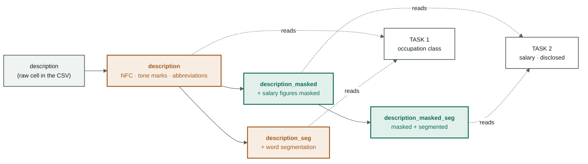

[← Overview](00-tong-quan.md) · [Vietnamese processing →](02-vietnamese-nlp.md)

# Data and cleaning

From `VietJobs.csv` to three frozen CSV files. This all happens **before**
any model exists — and it is where most of the fatal mistakes happen, because
they raise no error.

Code: [`dataset.py`](../src/vietjobs/dataset.py) — `clean()` and
`group_stratified_split()`.
Evidence: [`data/processed/manifest.json`](../data/processed/manifest.json).

> Not sure why cleaning is needed? Read
> [background: why clean at all](nen-tang/01-vi-sao-phai-lam-sach.md) first.

---

## 1. The source

| Attribute | Value | Source |
|---|---|---|
| File | `data/raw/VietJobs.csv` | `manifest.source_file` |
| Rows | **48,092** | `manifest.source_rows` |
| Columns | **18** | the CSV header |
| sha256 | `85862b06fda…c49d477` | `manifest.source_sha256` |
| Salary unit | million VND/month | `manifest.salary_unit` |

The sha256 in the manifest has exactly one job: if the raw file changes, every
number in [04-results.md](archive/04-results-ml.md) loses its comparability and
we have to know that immediately, not three weeks later.

The eighteen original columns fall into four groups:

| Group | Columns | What they are for |
|---|---|---|
| Free text | `job_title` · `description` · `requirements_text` | The main signal, feeding PhoBERT |
| Lists | `qualifications` · `technical_skills` · `soft_skills` · `benefits` | Both text and a count column |
| Structured | `location` · `country` · `languages_required` · `experience_required` · `contract_type` · `working_hours` | One-hot and numeric columns |
| **Labels** | `category` · `salary` · `salary_min` · `salary_max` · `salary_avg` | The answer key. The four salary columns **never** enter the feature matrix |

`load_raw` reads **every column as a string** (`dtype=str`) and treats only the
empty string as missing (`keep_default_na=False`). The reason: letting pandas
infer types is letting it silently turn `"01"` into `1`, and `"NA"` (a real
sector code) into a missing value. Forcing strings and parsing them ourselves is
slower but has no surprises.

---

## 2. De-duplication — two layers, two different purposes

This is the easiest thing in the whole pipeline to confuse, so let us be explicit:

| Layer | Function | What it does | Result |
|---|---|---|---|
| **1. Exact duplicates** | `df.drop_duplicates()` | **Deletes** rows identical across all 18 columns | 48,092 → **47,707** (**385** dropped) |
| **2. Near-duplicate grouping** | `V.group_key()` | **Deletes nothing.** Only assigns a shared id to near-identical postings | 47,707 rows → **34,899 groups** |

**Layer 1 deletes, layer 2 does not.** Why they differ:

- Rows identical across all 18 columns are a **data-entry fault**, not
  information. Keeping them just makes the model count one posting twice — that
  reweights the data at random and adds nothing.
- *Near*-identical postings ("Sales staff" reposted the following week with one
  benefit sentence edited) are **still real data**. Deleting them throws away
  samples. But letting them land in two different splits is a leak. So: keep
  them, and force the whole group into one split — see
  [section 7](#7-splitting--by-group-not-by-row).

**12,808 rows (26.8 %)** are reposts. The largest group has 33 rows.

---

## 3. Four copies of every text column

This is the mechanism that enforces **Rule 3 — leak prevention**. Each text
column exists in up to four forms, built once inside `clean()`:



**Orange = may still contain a salary figure. Green = masked.**

| Copy | Built by | Who may read it |
|---|---|---|
| `<name>` | `preprocess(tone, abbrev, mask=False)` | occupation classification only |
| `<name>_seg` | + segmentation | occupation classification only |
| `<name>_masked` | `preprocess(..., mask=True)` | the salary tasks only |
| `<name>_masked_seg` | masked + segmented | the salary tasks only |

Why build all four up front instead of computing them on demand: **so that
choosing a copy becomes a table lookup, not an `if` branch scattered across the
code.** The single place that decides is `features.resolve_column` — see
[08-ma-nguon.md](08-ma-nguon.md#three-invariants-that-hold-the-whole-system-up).
One door can be tested; ten `if` branches cannot.

Four columns get masked: `job_title`, `description`, `requirements_text` (through
`preprocess`) and `benefits_text` (calling `V.mask_salary` directly — benefits
restate the salary more often than anything else, in **10.65 %** of rows).

---

## 4. List-shaped columns — one raw column, two features

The four columns `qualifications`, `technical_skills`, `soft_skills` and
`benefits` are stored in the CSV as the **repr of a Python list**:

```
"['Cao đẳng', 'Đại học']"     # "College", "University"
```

That is a string, not a list. `parse_list_field` uses `ast.literal_eval` and
falls back to `strip("[]").split(",")` when the string is malformed — real data
always has a few broken rows, and a pipeline that dies on one broken row is a
useless pipeline.

Each column yields **two** quite different features:

| Feature | Example | Question it answers |
|---|---|---|
| `<name>_text` — joined with `" ; "`, lowercased | `"cao đẳng ; đại học"` | ***What** is required?* |
| `n_<name>` — the number of elements | `2` | ***How many** things are required?* |

The count column is not redundant. A posting listing 12 technical skills and one
listing 2 are different kinds of posting — usually different seniority. The
PhoBERT path **cannot see** that difference: it reads only three text fields and
truncates at 256 tokens. The `n_*` columns are how that signal gets in, and they
are waiting for the day the tabular features are concatenated to the 768-dim
vector.

---

## 5. Labels — building and repairing

### `category` — task 1

Unicode normalisation only, nothing else. 16 classes, skewed **27:1** between the
largest and the smallest; the three smallest hold only 196–258 rows
([03-protocol.md](03-protocol.md)). That is why the headline metric is macro-F1
and not accuracy — [background: metrics and baselines](nen-tang/06-do-luong-va-baseline.md).

The class `nhóm_nghề_khác` ("other occupations") is a junk drawer: it holds
marketing, IT and manufacturing postings that belong in other classes. So macro-F1
is always reported alongside a variant that drops this class (`f1_macro_no_junk`).

### `salary_*` — task 2

Four repairs, each fixing a real form of dirt:

| Problem in the data | Repair | Code |
|---|---|---|
| Some rows have `salary_min > salary_max` | `np.minimum` / `np.maximum` — swap them back | [dataset.py:119](../src/vietjobs/dataset.py#L119) |
| Only **one** bound disclosed (min = 0, max > 0) | Use the real bound for both | [dataset.py:120](../src/vietjobs/dataset.py#L120) |
| No figure disclosed at all | `salary_mid = 0` → `salary_disclosed = 0` | [dataset.py:126](../src/vietjobs/dataset.py#L126) |
| The salary distribution is heavily right-skewed | The regression target is `log1p(salary_mid)` | [dataset.py:128](../src/vietjobs/dataset.py#L128) |

Derived columns: `salary_mid` (mean of the two bounds) · `salary_disclosed` (0/1) ·
`salary_is_range` (a range was published, not a single figure) · `salary_mid_log`.

**Extreme values are flagged, not deleted.** `salary_extreme = 1` when the midpoint
is ≥ 100 million. p99 is 52.5 million, the maximum is 500 million
([dataset.py:131](../src/vietjobs/dataset.py#L131)).

Why the tail is not trimmed: **the tail is real.** A chief executive genuinely
earns 500 million. Deleting those rows teaches the model that high salaries do
not exist — it will score better *on the trimmed set*, and be systematically
wrong in the world. Flagging them and reporting them separately is honest;
deleting them and showing off a pretty MAE is self-deception.

Using `log1p` as the regression target is exactly how that tail is handled
**without throwing data away**: being 5 million off at a salary of 10 million is
badly wrong, being 5 million off at 200 million is nearly right. A log scale says
that; a linear scale does not.

---

## 6. Derived columns — 14 numeric features

`NUMERIC_COLUMNS` in [features.py:152](../src/vietjobs/features.py#L152). They
occupy only 14 dimensions out of 236,596 — yet they carry tens of times more
weight per dimension than any text dimension
([06-mo-hinh-phan-lop.md](archive/06-mo-hinh-phan-lop.md)).

Three worth calling out:

**`n_acronyms`** — counts fully-uppercase tokens longer than 1 character in the
title: `SEO`, `IT`, `PHP`, `QA`, `HR`. This is an extremely strong sector signal
and is almost free. It only exists because `normalize_unicode` does **not**
lowercase — lowercase early and this feature disappears entirely.

**`experience_months`** — puts every phrasing into one unit: `"2 năm"` (2 years)
→ 24, `"6 tháng"` (6 months) → 6, `"Không yêu cầu"` (not required) → 0,
`"Chưa có kinh nghiệm"` (no experience) → 0. Without the conversion, `"2 năm"`
and `"24 tháng"` are two unrelated dimensions, and neither is comparable to the
other.

**`is_major_city`** — 1 if the province is one of the five largest cities.
Note: it is computed from the `province` column **regardless** of whether the
`prep.province` flag is on. That is a smudge in the ablation table — see
[02-vietnamese-nlp.md §5](02-vietnamese-nlp.md#5-the-closed-tracks-ablation--evidence-not-direction).

---

## 7. Splitting — by group, not by row

`group_stratified_split` has to satisfy **two** constraints at once, and they pull
against each other:

1. **No group may straddle splits.** Every row with the same `group_id` must land
   entirely in one split.
2. **Rare classes must survive.** A class with 196 rows must appear in both dev
   and test, otherwise macro-F1 is computed over a different number of classes
   from run to run and the results table stops being comparable.

The algorithm: for **each** occupation class, shuffle the groups, then place the
**largest groups first** into whichever bucket is furthest below its quota.
Largest first because they are the hardest to place — leave them to the end and
they skew the ratio with nothing left to compensate.

```python
pick = max(fractions, key=lambda k: targets[k] - filled[k])
```

### Two stages, not one draw

Since **2026-09-09** that draw runs **twice** (`two_stage_split`):

1. `train_pool : test` = **8 : 2**
2. that pool split again, `train : dev` = **9 : 1**

which lands at 72 / 8 / 20 of the rows. Two draws rather than one three-way draw,
because stage 2 must be able to run again — a different dev slice, a k-fold over
the pool — **without a single row of `test` moving**. That is what keeps `test`
usable exactly once, at the end. Stage 2 draws with `seed + 1` so the two stages
do not share a permutation.

The result, fixed in the manifest:

| Split | Rows | Share | Groups | Postings with a disclosed salary | Classes |
|---|---|---|---|---|---|
| train | 34,354 | 72.01 % | 22,026 | 24,669 | 16 |
| dev | 3,812 | 7.99 % | 3,728 | 2,705 | 16 |
| test | 9,541 | 20.00 % | 9,145 | 6,719 | 16 |

**`groups_straddling_splits` = 0**, and `build()` has an `assert` for it. That
assert may never be disabled. The ratios land within 0.01 pp of the target even
though the unit of splitting is the group, not the row.

The price of the new scheme is a **thin dev set**: the smallest class,
`nhóm_nghề_khác`, has only **25** rows there (198 in train, 64 in test). Per-class
F1 on dev for that class is measured on 25 examples and will swing; read
`f1_macro_no_junk` alongside it, and confirm on `test` at the end.

`SPLIT_SEED = 20260826` is unchanged, but **the ratios changed**, so the splits
themselves are new. Everything measured under the old 70/15/15 scheme — every row
of [archive/04-results-ml.md](archive/04-results-ml.md), the 0.6112 classification
benchmark, the 5.86 salary benchmark, and the cached PhoBERT embeddings — was
measured on different data and **cannot be compared** with anything measured from
here on. The old splits, manifest and embedding cache are kept, unmodified, at
`data/processed/splits-scheme-v1/`, `data/processed/manifest-scheme-v1.json` and
`artifacts/embeddings-scheme-v1/`; the benchmarks have to be re-run against the
new splits before they mean anything again.

---

## 8. Segmentation runs here — exactly once

Nine columns are word-segmented and **cached straight into the split files**. Cost on
the 2026-09-09 rebuild: **780.3 seconds** (13 minutes), **0 failures** across
47,707 postings.

Why here and not inside the training loop: 27 experiments × 13 minutes is nearly
6 hours spent re-deriving one and the same result. Segment once, write it to
disk, and every later run reads it directly. **Nothing in the training loop calls
the segmenter.**

The splits are written as **CSV**, one file per split, so they open in anything —
a spreadsheet, `head`, another language — without a library in the way.

CSV buys that at a price, and the price was measured rather than assumed. Sending
`dev` through `to_csv` / `read_csv` and diffing every cell: all 50 dtypes survive
and all 21 numeric columns match to the last bit (pandas 3.0.5). What does **not**
survive is the difference between an empty cell and a missing one — both are
written as two adjacent commas, and pandas reads both back as `NaN`. That silently
rewrites **4,524 cells of `dev` alone**, `languages_text` worst hit with 2,792 of
its 3,812. "This posting lists no language requirement" and "this field was never
filled in" would become the same value.

So nothing reads the split files with a bare `read_csv`. **`dataset.load_split` is
the only supported reader**: it parses with `na_filter=False`, which keeps every
field exactly as written, then casts the numeric columns back from the
`column_dtypes` map that `build` records in `manifest.json`. Verified after the
conversion — all three splits match the parquet originals cell for cell, with zero
added `NaN`. Anything that reads a split file directly is a bug.

The rest is cost, and it is real: `train` is **240.4 MB** as CSV against 91.3 MB as
parquet (2.6×), and `load_split("train")` takes **8.35 s** against **2.17 s**. The
gap widens when only a few columns are wanted: parquet is columnar and reads
just those, while CSV has to parse all fifty to find them. The old parquet files
are kept at `data/processed/splits-parquet/` for anyone who needs the speed.

This is also why `dataset build` rarely has to be re-run — and why it has a
`--no-segment` flag for fast debugging.

---

## Read next

- [Vietnamese processing](02-vietnamese-nlp.md) — the nine steps inside `preprocess`
- [Deep-learning baseline](06-baseline-dl.md) — how three of these 50 columns become a 768-dim vector
- [Experiment protocol](03-protocol.md) — the train/dev/test contract
- Background: [why clean at all](nen-tang/01-vi-sao-phai-lam-sach.md) ·
  [data leakage](nen-tang/05-ro-ri-du-lieu.md)
