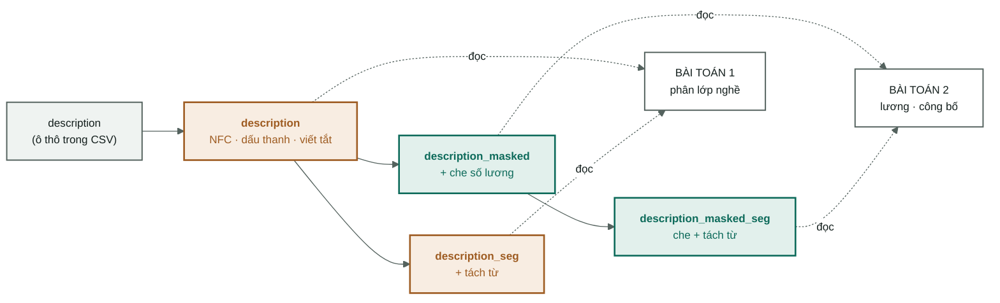

[← Tổng quan](00-tong-quan.md) · [Xử lý tiếng Việt →](02-vietnamese-nlp.md)

# Dữ liệu và làm sạch

Từ `VietJobs.csv` đến ba file parquet đã đóng băng. Đây là chuyện xảy ra **trước**
khi có bất kỳ mô hình nào — và là nơi phần lớn sai lầm chết người xảy ra, vì
chúng không báo lỗi.

Code: [`dataset.py`](../src/vietjobs/dataset.py) — `clean()` và `group_stratified_split()`.
Bằng chứng: [`data/processed/manifest.json`](../data/processed/manifest.json).

> Chưa rõ vì sao phải làm sạch? Đọc
> [nền tảng: vì sao phải làm sạch](nen-tang/01-vi-sao-phai-lam-sach.md) trước.

---

## 1. Nguồn

| Thuộc tính | Giá trị | Nguồn |
|---|---|---|
| File | `data/raw/VietJobs.csv` | `manifest.source_file` |
| Số dòng | **48.092** | `manifest.source_rows` |
| Số cột | **18** | header của CSV |
| sha256 | `85862b06fda…c49d477` | `manifest.source_sha256` |
| Đơn vị lương | triệu VND/tháng | `manifest.salary_unit` |

Băm sha256 nằm trong manifest có một việc duy nhất: nếu file thô đổi, mọi con số
trong [04-results.md](04-results.md) mất giá trị so sánh và ta phải biết điều đó
ngay, chứ không phải sau ba tuần.

Mười tám cột gốc, chia làm bốn nhóm:

| Nhóm | Cột | Dùng làm gì |
|---|---|---|
| Văn bản tự do | `job_title` · `description` · `requirements_text` | Nguồn tín hiệu chính, nuôi TF-IDF |
| Danh sách | `qualifications` · `technical_skills` · `soft_skills` · `benefits` | Vừa nuôi TF-IDF vừa đếm ra cột số |
| Cấu trúc | `location` · `country` · `languages_required` · `experience_required` · `contract_type` · `working_hours` | One-hot và cột số |
| **Nhãn** | `category` · `salary` · `salary_min` · `salary_max` · `salary_avg` | Đáp án. Bốn cột lương **không bao giờ** vào ma trận đặc trưng |

`load_raw` đọc **mọi cột thành chuỗi** (`dtype=str`) và chỉ coi chuỗi rỗng là
thiếu (`keep_default_na=False`). Lý do: để pandas tự đoán kiểu là để nó tự ý
biến `"01"` thành `1`, biến `"NA"` (một mã ngành) thành giá trị thiếu. Ép chuỗi
rồi tự phân tích là chậm hơn nhưng không có bất ngờ.

---

## 2. Khử trùng lặp — hai tầng, hai mục đích khác nhau

Đây là chỗ dễ nhầm nhất trong cả pipeline, nên nói rõ ngay:

| Tầng | Hàm | Làm gì | Kết quả |
|---|---|---|---|
| **1. Trùng tuyệt đối** | `df.drop_duplicates()` | **Xoá hẳn** dòng giống hệt nhau ở cả 18 cột | 48.092 → **47.707** (bỏ **385**) |
| **2. Gộp nhóm gần giống** | `V.group_key()` | **Không xoá dòng nào.** Chỉ gán id chung cho các tin gần giống nhau | 47.707 dòng → **34.899 nhóm** |

**Tầng 1 xoá, tầng 2 không.** Vì sao khác nhau:

- Dòng giống hệt nhau ở cả 18 cột là **lỗi nhập liệu**, không phải thông tin.
  Giữ lại chỉ làm mô hình đếm một tin thành hai lần — nó nhân trọng số một cách
  ngẫu nhiên, không thêm gì.
- Tin *gần* giống nhau ("Nhân viên kinh doanh" đăng lại tuần sau, sửa một câu
  phúc lợi) thì **vẫn là dữ liệu thật**. Xoá đi là vứt mẫu. Nhưng để chúng nằm
  ở hai tập khác nhau là rò rỉ. Nên: giữ lại, và bắt cả nhóm đi cùng một tập —
  xem [mục 7](#7-chia-tập--theo-nhóm-không-theo-dòng).

**12.808 dòng (26,8 %)** là tin đăng lại. Nhóm lớn nhất có 33 dòng.

---

## 3. Bốn bản sao của mỗi cột văn bản

Đây là cơ chế thực thi **quy tắc số 3 — chống rò rỉ**. Mỗi cột văn bản tồn tại
ở tối đa bốn dạng, dựng sẵn một lần trong `clean()`:



**Cam = có thể còn con số lương trong đó. Xanh = đã che.**

| Bản | Tạo bằng | Ai được đọc |
|---|---|---|
| `<tên>` | `preprocess(tone, abbrev, mask=False)` | chỉ phân lớp nghề |
| `<tên>_seg` | + tách từ | chỉ phân lớp nghề |
| `<tên>_masked` | `preprocess(..., mask=True)` | chỉ bài toán lương |
| `<tên>_masked_seg` | che + tách từ | chỉ bài toán lương |

Vì sao dựng sẵn cả bốn thay vì tính lúc cần: **để việc chọn bản trở thành một
phép tra bảng, không phải một nhánh `if` rải khắp code.** Nơi duy nhất quyết định
là `features.resolve_column` — xem [05-dac-trung-tfidf.md](05-dac-trung-tfidf.md#1-resolve_column--cửa-duy-nhất).
Một cửa duy nhất thì test được; mười nhánh `if` thì không.

Bốn cột được che: `job_title`, `description`, `requirements_text` (qua `preprocess`)
và `benefits_text` (gọi thẳng `V.mask_salary` — phúc lợi nhắc lại lương nhiều nhất,
**10,65 %** số dòng).

---

## 4. Cột dạng danh sách — một cột thô, hai đặc trưng

Bốn cột `qualifications`, `technical_skills`, `soft_skills`, `benefits` lưu trong
CSV dưới dạng **repr của list Python**:

```
"['Cao đẳng', 'Đại học']"
```

Đây là chuỗi, không phải danh sách. `parse_list_field` dùng `ast.literal_eval`,
và khi chuỗi hỏng thì rơi về `strip("[]").split(",")` — dữ liệu thật luôn có vài
dòng hỏng, và một pipeline chết vì một dòng hỏng là một pipeline vô dụng.

Mỗi cột đẻ ra **hai** đặc trưng khác hẳn nhau:

| Đặc trưng | Ví dụ | Trả lời câu hỏi |
|---|---|---|
| `<tên>_text` — nối bằng `" ; "`, hạ chữ thường | `"cao đẳng ; đại học"` | *Yêu cầu **những gì**?* |
| `n_<tên>` — đếm số phần tử | `2` | *Yêu cầu **bao nhiêu thứ**?* |

Cột đếm không thừa. Một tin liệt kê 12 kỹ năng kỹ thuật và một tin liệt kê 2 là
hai loại tin khác nhau — thường là cấp bậc khác nhau — nhưng TF-IDF chuẩn hoá
độ dài nên **không thấy** sự khác biệt đó. Cột `n_*` là cách duy nhất đưa nó vào.

---

## 5. Nhãn — dựng và sửa

### `category` — bài toán 1

Chỉ chuẩn Unicode, không đụng gì thêm. 16 lớp, lệch **27:1** giữa lớp lớn nhất
và nhỏ nhất; ba lớp nhỏ nhất chỉ 196–258 dòng ([03-protocol.md](03-protocol.md)).
Đó là lý do metric chính là macro-F1 chứ không phải accuracy —
[nền tảng: đo lường và baseline](nen-tang/06-do-luong-va-baseline.md).

Lớp `nhóm_nghề_khác` là thùng rác: nó chứa cả tin marketing, IT, sản xuất lẽ ra
thuộc lớp khác. Vì vậy macro-F1 luôn báo cáo kèm bản bỏ lớp này (`f1_macro_no_junk`).

### `salary_*` — bài toán 2

Bốn phép sửa, mỗi phép chữa một dạng bẩn có thật:

| Vấn đề trong dữ liệu | Phép sửa | Code |
|---|---|---|
| Vài dòng có `salary_min > salary_max` | `np.minimum` / `np.maximum` — hoán vị lại | [dataset.py:119](../src/vietjobs/dataset.py#L119) |
| Chỉ công bố **một** biên (min = 0, max > 0) | Lấy biên có thật cho cả hai | [dataset.py:120](../src/vietjobs/dataset.py#L120) |
| Không công bố số nào | `salary_mid = 0` → `salary_disclosed = 0` | [dataset.py:126](../src/vietjobs/dataset.py#L126) |
| Phân bố lương lệch phải rất mạnh | Đích hồi quy là `log1p(salary_mid)` | [dataset.py:128](../src/vietjobs/dataset.py#L128) |

Cột dẫn xuất: `salary_mid` (trung bình hai biên) · `salary_disclosed` (0/1) ·
`salary_is_range` (có công bố khoảng hay chỉ một số) · `salary_mid_log`.

**Giá trị cực đoan được gắn cờ, không bị xoá.** `salary_extreme = 1` khi mức lương
giữa ≥ 100 triệu. p99 là 52,5 triệu, cao nhất 500 triệu
([dataset.py:131](../src/vietjobs/dataset.py#L131)).

Vì sao không cắt đuôi: **đuôi là thật.** Giám đốc điều hành thật sự nhận 500 triệu.
Cắt bỏ những dòng đó là dạy mô hình rằng thế giới không có lương cao — nó sẽ dự
đoán tốt hơn *trên tập đã cắt*, và sai hệ thống ngoài đời. Đánh dấu rồi báo cáo
riêng là trung thực; xoá đi rồi khoe MAE đẹp là tự lừa mình.

Đích hồi quy dùng `log1p` chính là cách xử lý cái đuôi đó **mà không vứt dữ liệu**:
sai 5 triệu ở mức lương 10 triệu là sai nặng, sai 5 triệu ở mức 200 triệu là gần
đúng. Thang log nói đúng điều đó, thang tuyến tính thì không.

---

## 6. Cột dẫn xuất — 14 cột số

`NUMERIC_COLUMNS` trong [features.py:152](../src/vietjobs/features.py#L152).
Chúng chỉ chiếm 14 chiều trên 236.596 — nhưng giữ tỷ lệ trọng số cao gấp hàng
chục lần mỗi chiều văn bản ([06-mo-hinh-phan-lop.md](06-mo-hinh-phan-lop.md)).

Ba cột đáng nói:

**`n_acronyms`** — đếm token viết hoa toàn bộ, dài hơn 1 ký tự, trong tiêu đề:
`SEO`, `IT`, `PHP`, `QA`, `HR`. Đây là dấu hiệu ngành cực mạnh và gần như miễn phí.
Nó chỉ tồn tại được vì `normalize_unicode` **không** hạ chữ thường — nếu hạ sớm
thì đặc trưng này biến mất hoàn toàn.

**`experience_months`** — đưa mọi cách viết về một đơn vị: `"2 năm"` → 24,
`"6 tháng"` → 6, `"Không yêu cầu"` → 0, `"Chưa có kinh nghiệm"` → 0.
Không quy đổi thì `"2 năm"` và `"24 tháng"` là hai chiều rời nhau, và không cái
nào so sánh được với cái nào.

**`is_major_city`** — 1 nếu tỉnh nằm trong năm thành phố lớn.
Lưu ý: nó tính từ cột `province` **bất kể** cờ `prep.province` có bật hay không.
Đây là một vết mờ trong bảng ablation — xem
[02-vietnamese-nlp.md §4](02-vietnamese-nlp.md#4-ablation--bước-nào-thật-sự-đáng-giữ).

---

## 7. Chia tập — theo nhóm, không theo dòng

`group_stratified_split` phải thoả **hai** ràng buộc cùng lúc, và chúng kéo ngược nhau:

1. **Nhóm không được lọt.** Mọi dòng cùng `group_id` phải nằm trọn một tập.
2. **Lớp hiếm phải sống sót.** Lớp 196 dòng phải có mặt ở cả val lẫn test, nếu
   không macro-F1 tính trên số lớp khác nhau giữa các lần chạy và bảng kết quả
   mất khả năng so sánh.

Thuật toán: với **mỗi** lớp nghề, xáo nhóm, rồi xếp **nhóm to trước** vào tập nào
đang thiếu nhiều nhất so với chỉ tiêu. Xếp nhóm to trước vì chúng khó đặt nhất —
để cuối cùng thì chúng làm lệch tỷ lệ mà không còn gì để bù.

```python
pick = max(fractions, key=lambda k: targets[k] - filled[k])
```

Kết quả, chốt trong manifest:

| Tập | Dòng | Nhóm | Tin có công bố lương | Số lớp |
|---|---|---|---|---|
| train | 33.396 | 21.506 | 23.965 | 16 |
| val | 7.159 | 6.699 | 5.095 | 16 |
| test | 7.152 | 6.694 | 5.033 | 16 |

**`groups_straddling_splits` = 0**, và `build()` có `assert` cho nó
([dataset.py:229](../src/vietjobs/dataset.py#L229)). Assert này không được phép tắt.
Tỷ lệ thật lệch nhẹ khỏi 70/15/15 vì đơn vị chia là nhóm chứ không phải dòng —
đó là cái giá phải trả, và nó rẻ.

`SPLIT_SEED = 20260826` **đóng băng vĩnh viễn**. Đổi seed là mọi dòng trong
[04-results.md](04-results.md) mất khả năng so sánh với nhau.

---

## 8. Tách từ chạy ở đây — đúng một lần

Chín cột được tách từ và **cache thẳng vào parquet**. Chi phí: **1.533,7 giây**
(hơn 25 phút), **0 lỗi** trên 47.707 tin.

Vì sao ở đây chứ không trong vòng huấn luyện: 27 thí nghiệm × 25 phút là hơn
11 giờ chỉ để tách đi tách lại đúng một kết quả. Tách một lần, ghi ra đĩa, mọi
lần chạy sau đọc thẳng. **Không có gì trong vòng huấn luyện gọi bộ tách từ.**

Đây cũng là lý do `dataset build` hiếm khi phải chạy lại — và là lý do nó có cờ
`--no-segment` để gỡ lỗi nhanh.

---

## Đọc tiếp

- [Xử lý tiếng Việt](02-vietnamese-nlp.md) — chín bước bên trong `preprocess`
- [Đặc trưng & TF-IDF](05-dac-trung-tfidf.md) — 50 cột này biến thành ma trận thế nào
- [Giao thức thí nghiệm](03-protocol.md) — hợp đồng về train/val/test
- Nền tảng: [vì sao phải làm sạch](nen-tang/01-vi-sao-phai-lam-sach.md) ·
  [rò rỉ dữ liệu](nen-tang/05-ro-ri-du-lieu.md)
