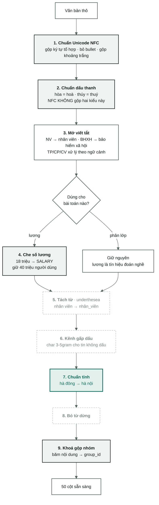

[← Tổng quan](00-tong-quan.md) · [← Làm sạch dữ liệu](01-data-audit.md) · [Đặc trưng & TF-IDF →](05-dac-trung-tfidf.md)

# Xử lý tiếng Việt

Chín bước biến một ô văn bản thô thành chuỗi mà TF-IDF đếm được **đúng**.
Mọi con số ở đây tái lập bằng `python scripts/measure_vitext.py`.

> Chưa quen TF-IDF, n-gram, hay "rò rỉ dữ liệu"? Đọc
> [nền tảng: vì sao phải làm sạch](nen-tang/01-vi-sao-phai-lam-sach.md) và
> [nền tảng: TF-IDF là gì](nen-tang/02-tf-idf-la-gi.md) trước.

---

## 1. `vitext.py` làm gì bên trong

**Vào:** một ô văn bản thô lấy thẳng từ CSV — tiêu đề, mô tả, yêu cầu, phúc lợi, địa điểm.
**Ra:** chuỗi đã chuẩn hoá để đưa vào TF-IDF, cộng vài cột dẫn xuất: `province`,
`experience_months`, `group_id`.

Cả 9 bước đều là **hàm thuần khiết** — cùng đầu vào cho cùng đầu ra, không đọc
trạng thái ngoài, không học gì từ dữ liệu. Nhờ vậy cùng một đoạn code chạy được ở
ba nơi mà không lệch kết quả: `dataset.py` (trước khi chia tập), `features.py`
(khi dựng đặc trưng), `predict.py` (khi suy luận). Đây là quy tắc số 4 trong
[../CLAUDE.md](../CLAUDE.md) — lệch đường code giữa train và suy luận là bug im lặng.

### Chín bước chạy ở ba chỗ khác nhau — đừng đọc sơ đồ thành một dây thẳng

Chỉ **sáu** bước nằm trong hàm `preprocess()`. Ba bước còn lại chạy ở nơi khác:

| Bước | Chạy ở đâu | Vì sao ở đó |
|---|---|---|
| 1 NFC · 2 dấu thanh · 3 viết tắt · 4 che lương · 5 tách từ · 8 từ dừng | `V.preprocess()`, gọi từ `dataset.clean` | Đây là chuỗi biến đổi trên **một** ô văn bản |
| 6 gấp dấu | `TfidfVectorizer(preprocessor=V.fold_accents)` | Chỉ kênh ký tự được thấy bản gấp dấu. Kênh từ **không bao giờ** |
| 7 chuẩn tỉnh | `dataset.clean`, riêng cột `location` | Nó tạo ra một **cột mới** (`province`), không sửa văn bản |
| 9 khoá gộp nhóm | `dataset.clean`, sau khi văn bản đã sạch | Nó tạo ra **id**, không tạo ra đặc trưng |

Thứ tự trong `preprocess` là cố định và có lý do:
**NFC → dấu thanh → viết tắt → che lương → tách từ → bỏ từ dừng.**
Che lương phải chạy **sau** mở viết tắt (vì "8tr" phải thành số trước khi bị che)
và **trước** tách từ (vì `<SALARY>` không được đem đi tách).

### Hai điều `vitext.py` cố ý **không** làm

- **Không bóc HTML.** Kho này không có thẻ HTML — thêm bước bóc thẻ là thêm một
  bước không có gì để làm, và mỗi bước thừa là một chỗ để bug trốn.
- **Không hạ chữ thường.** Việc đó để `TfidfVectorizer(lowercase=True)` làm.
  Nhờ giữ hoa/thường qua `clean`, cột `n_acronyms` mới đếm được `SEO`, `IT`,
  `PHP`, `QA` — chữ viết hoa trong tiêu đề là dấu hiệu ngành rất mạnh.
  Hạ chữ thường sớm là **xoá mất một đặc trưng**.

---

## 2. Tại sao phải xử lý

TF-IDF **đếm chuỗi ký tự**, nó không biết tiếng Việt. Với nó `hoà` và `hòa` là hai
từ khác nhau, `NV` không liên quan gì đến `nhân viên`, `hà đông` không liên quan gì
đến `hà nội`. Mỗi biến thể chính tả chiếm **một chiều riêng** trong ma trận 236.596
chiều: tần suất của cùng một khái niệm bị cắt vụn, mỗi mảnh yếu đi, và mô hình học
trên tín hiệu đã băm nhỏ.

Chín bước chia làm ba nhóm mục đích:

- **Gộp biến thể về một mặt chữ** — bước 1, 2, 3, 7. Cùng một khái niệm phải rơi vào cùng một chiều.
- **Sửa ranh giới từ** — bước 5, 6. Khoảng trắng tiếng Việt tách *âm tiết*, không tách *từ*.
- **Chặn rò rỉ** — bước 4 và 9. Không cho mô hình nhìn thấy đáp án, dù đáp án nằm
  trong chính đầu vào (4) hay nằm ở tập test (9).

Bước 8 (bỏ từ dừng) là bước duy nhất chỉ nhằm giảm nhiễu — và cũng là bước đo ra tệ nhất.

**Đường nét đứt = đo rồi thấy không giúp gì, nên bỏ.**

> Sơ đồ vẽ chín bước thành một dây cho dễ nhìn. Thực tế bước 6, 7, 9 chạy ở chỗ
> khác — xem bảng "chín bước chạy ở ba chỗ khác nhau" phía trên.

---

## 3. Chín bước — làm gì, vì sao, đo được gì

Mọi con số ở cột cuối đo trên 47.707 tin sau khử trùng lặp, tái lập bằng
`python scripts/measure_vitext.py`.

| # | Bước · hàm | Làm gì | Vì sao phải xử lý | Đo được trên kho dữ liệu |
|---|---|---|---|---|
| 1 | **Chuẩn Unicode** `normalize_unicode` | NFC hoá, bỏ bullet `- • ▪`, bỏ ký tự điều khiển, gộp khoảng trắng | Chữ `ế` viết được bằng **một** code point hoặc bằng `e` + hai dấu tổ hợp. Nhìn giống hệt nhau trên màn hình, nhưng TF-IDF đếm ra hai token khác nhau | **529 dòng (1,11 %)** chứa ký tự tổ hợp chưa gộp |
| 2 | **Chuẩn dấu thanh** `normalize_tone` | Đưa dấu về nguyên âm thứ hai trong `oa`/`oe`/`uy`: hòa → hoà, thúy → thuý | Hai lối đặt dấu **đều đúng chính tả** và NFC **không** gộp chúng. Cả hai lối cùng tồn tại trong một kho, nên mỗi từ như "hoà" bị chia đôi tần suất. Chuẩn về nguyên âm thứ hai là hướng an toàn: "quý" giữ nguyên, còn chuẩn ngược lại sẽ bẻ nó thành "qúy" | Mô tả dùng kiểu "hoà" **76,6 %**, kiểu "hòa" **30,3 %** — phần lớn tin lẫn cả hai. 13 cặp token tiêu đề gộp lại sau bước này: họa 565 + hoạ 64 · hóa 307 + hoá 50 |
| 3 | **Mở viết tắt** `expand_abbreviations` | 39 viết tắt rõ nghĩa thay theo token (NV → nhân viên, BHXH → bảo hiểm xã hội); 6 viết tắt nhập nhằng (TP, CP, CV…) chỉ mở khi regex ngữ cảnh khớp | "NV kinh doanh" và "nhân viên kinh doanh" cùng nghĩa nhưng là hai chiều rời nhau. Chiều ngược lại cũng thật: mở bừa "TP" thành "trưởng phòng" trong "TP HCM" tạo tín hiệu giả — **mở sai tệ hơn không mở**, nên mục nhập nhằng phải có ngữ cảnh mới bung | **3.436 mô tả (7,2 %)** chứa ít nhất một viết tắt trong bảng: bhxh 748 · cskh 446 · ncc 414 · bhyt 298. Riêng "TP" xuất hiện trong 419 mô tả |
| 4 | **Che số lương** `mask_salary` | Chỉ cho nhánh lương: "15 - 22 triệu" → `<SALARY>`. `_is_pay` chừa lại số đang **đếm** thứ khác: "40 triệu người dùng", "500 triệu đồng doanh thu" | `salary_*` chính là **nhãn** của bài toán 2. Nếu con số lương còn nằm trong mô tả hay phúc lợi thì mô hình đọc đáp án ngay trên đầu vào: R² đẹp trong báo cáo, hỏng ngoài đời. Che giữ lại *sự kiện* "tin có nhắc tới lương" (vẫn là tín hiệu hợp lệ) và chỉ bỏ *giá trị*. Với bài phân lớp nghề thì **không che** — mức lương là manh mối hợp lệ để đoán nghề | Số dòng nhắc lại con số lương trong văn bản: phúc lợi **5.081 (10,65 %)** · mô tả 250 (0,52 %) · yêu cầu 103 (0,22 %) · tiêu đề 121 (0,25 %) |
| 5 | **Tách từ** `segment` · underthesea | "Nhân viên kinh doanh" → "Nhân_viên kinh_doanh" | Tiếng Việt là ngôn ngữ đơn lập: khoảng trắng tách **âm tiết**, không tách **từ**. Ở mức unigram, một token "viên" gộp chung nhân viên / chuyên viên / kỹ thuật viên / giáo viên — bốn nghề khác nhau | Âm tiết "viên" xuất hiện **27.053 lần** trong tiêu đề, đứng sau **70 âm tiết** khác nhau: nhân 20.138 · chuyên 4.858 · thuật 498 |
| 6 | **Kênh gấp dấu** `fold_accents` | Tạo bản sao bỏ dấu để nuôi kênh char 3-5gram. **Không bao giờ** áp lên kênh từ | Một phần tin viết không dấu ("Nhan Vien Kinh Doanh"); kênh từ không cách nào khớp chúng với bản có dấu. Nhưng dấu trong tiếng Việt **là** từ — má / mà / mả / mã / mạ là năm từ khác nhau — nên bản gấp dấu chỉ được sống ở kênh ký tự | **2.148 tiêu đề (4,50 %)** không có dấu nào |
| 7 | **Chuẩn tỉnh** `normalize_province` | Quy địa danh về 42 tỉnh qua bảng 183 alias: "hà đông" → "hà nội", "Tp. HCM" → "hồ chí minh". Địa danh lạ giữ nguyên tên có dấu, chỉ cắt tiền tố hành chính | Cột địa điểm bị vụn thành gần một nghìn giá trị, one-hot ra gần một nghìn chiều gần như rỗng. Quận, huyện, phường nằm rời khỏi tỉnh chứa nó nên tín hiệu vùng miền không bao giờ cộng dồn được | 984 chuỗi địa điểm → **265 giá trị**; **7.481 dòng (15,7 %)** đổi giá trị. Riêng "hà nội" gom **136 biến thể**: hà đông 1.166 · bắc từ liêm 166 · cầu giấy 136 |
| 8 | **Bỏ từ dừng** `remove_stopwords` | Bỏ 161 mục trong `stopwords_vi.txt` (193 dạng, tính cả dạng gạch dưới cho văn bản đã tách từ) | Lý thuyết: từ dừng chiếm chỗ mà không mang nghĩa nghề. Thực tế `idf` **đã** tự hạ trọng số những từ có mặt khắp nơi, nên bước này chỉ lặp lại việc TF-IDF làm sẵn. Danh sách cố ý chừa "không", "trên", "tối thiểu": "không yêu cầu kinh nghiệm" ngược nghĩa "yêu cầu kinh nghiệm" | So cùng cấu hình ở C=0,5: bật 0,5756 (`cat-P5-svm-stop`) so với tắt 0,5754 (`cat-P4-svm-charfold`) — chênh **0,0002**, nằm sâu dưới nhiễu 0,0077 |
| 9 | **Khoá gộp nhóm** `group_key` | Băm SHA-1 (tiêu đề + mô tả + yêu cầu) sau khi hạ chữ thường, gấp dấu, bỏ dấu câu → id 16 ký tự | Nhà tuyển dụng đăng lại cùng một tin nhiều lần với sửa đổi vặt. Chia tập theo dòng thì cùng một tin nằm ở cả train lẫn test: mô hình chỉ cần **thuộc lòng** là có điểm cao, và điểm đó không nói gì về khả năng tổng quát hoá | 47.707 dòng chỉ có **34.899 nhóm** — **12.808 dòng (26,8 %)** là tin đăng lại, nhóm lớn nhất 33 dòng. `dataset.build()` assert 0 nhóm lọt giữa hai tập |

### Ba chỗ tinh tế đáng đọc kỹ

**Bước 2 — vì sao chuẩn *về* nguyên âm thứ hai chứ không phải ngược lại.**
Tiếng Việt có hai lối đặt dấu hợp lệ cho vần `oa`, `oe`, `uy`. Phải chọn một lối
làm chuẩn, và chọn lối nào là quyết định có hậu quả. Chuẩn về nguyên âm **thứ hai**
(`hoà`, `thuý`) an toàn vì nó không đụng tới `quý` — chữ `qu` là phụ âm đầu, không
phải nguyên âm. Chuẩn theo hướng ngược lại sẽ bẻ `quý` thành `qúy`, một chuỗi
không tồn tại trong tiếng Việt, và tạo ra một chiều rác.

**Bước 4 — vì sao che mà không xoá.** Câu "Lương 15 triệu" sau khi che thành
"Lương `<SALARY>`". Con số biến mất, nhưng chữ "Lương" **ở lại**. Đó là cố ý:
"tin này có nhắc tới lương" là tín hiệu hợp lệ cho tầng 1 (tin có công bố lương
không?), còn "lương bằng bao nhiêu" mới là đáp án phải giấu. Xoá cả câu là vứt
mất tín hiệu tốt cùng với đáp án.

Phần khó nhất của bước này là phân biệt số **tiền** với số **đếm**. `_is_pay`
nhìn 48 ký tự phía sau con số: nếu ngay sau đó là danh từ đếm được
(`người`, `khách`, `lượt xem`, `đơn hàng`, `doanh thu`…) thì nhìn tiếp cửa sổ
40 ký tự hai bên tìm ngữ cảnh trả công (`lương`, `thu nhập`, `thưởng`, `/tháng`…).
Không có ngữ cảnh đó thì để yên. `tests/test_vitext.py:210` giữ đúng bốn ca này —
comment trong test ghi thẳng "this was a real bug".

**Bước 8 — vì sao danh sách từ dừng lại chừa "không".** Bỏ từ dừng máy móc sẽ
biến "không yêu cầu kinh nghiệm" thành "yêu cầu kinh nghiệm" — **đảo ngược nghĩa**.
Đầu file [../resources/stopwords_vi.txt](../resources/stopwords_vi.txt) liệt kê
những từ cố ý giữ lại vì lý do đó: `không`, `chưa`, `trên/dưới`, `ít/nhiều`,
`tối/thiểu`, `từ/đến`, `ưu/tiên`.

---

## 4. Ablation — bước nào thật sự đáng giữ

Cố định SVM ở `C = 0,02`, chỉ bật/tắt từng bước. Bootstrap 200 lần cho độ lệch
chuẩn macro-F1 ≈ **0,0077** — chênh lệch nhỏ hơn ngưỡng đó là nhiễu, không phải cải thiện.
Con số này đo được từ 34 run của cụm so sánh, xem
[10-so-sanh-mo-hinh.md §7](10-so-sanh-mo-hinh.md#7-σ--lần-đầu-được-tính-bằng-code).
Cảnh báo: ba kết luận "trong nhiễu" dưới đây được rút ra bằng cách so hai điểm
**độc lập**. Phép so **cặp** (paired bootstrap) nhạy hơn nhiều, nhưng các run
trong bảng này không lưu `y_pred` nên chưa kiểm lại được.

| Cấu hình | Cờ `PrepConfig` | macro-F1 (val) | Run trong [04-results.md](04-results.md) |
|---|---|---|---|
| Không bước nào | `raw` | 0,6033 | `cat-R-svm-C0.02-noprep` |
| Chuẩn tỉnh | `province` | **0,6050** | `cat-T-svm-C0.02` |
| Chuẩn tỉnh + tách từ | `segment+province` | 0,5998 | `cat-R-svm-C0.02-seg` |
| Chuẩn tỉnh + tách từ + gấp dấu | `segment+charfold+province` | 0,6024 | `cat-R-svm-C0.02-all` |

**Chỉ chuẩn hoá tỉnh sống sót** — rẻ nhất trong chín bước, P(>0) = 0,97. Tách từ và
gấp dấu đều kéo điểm xuống dưới mức không làm gì.

Bỏ từ dừng chưa có dòng nào ở `C = 0,02`. So sánh hợp lệ duy nhất nằm ở nhóm chạy
trước với `C` mặc định: `cat-P4-svm-charfold` 0,5754 → `cat-P5-svm-stop` 0,5756, tức
**+0,0002** — không phân biệt được với nhiễu. Kết luận vẫn là bỏ, nhưng vì nó không
mang lại gì, không phải vì nó phá điểm.

Tách từ không giúp vì `ngram_range=(1,2)` **đã** bắt "nhân viên" dưới dạng bigram —
bước 5 giải đúng một bài toán mà bộ vectơ hoá đã giải sẵn. Chi tiết ở
[nền tảng: n-gram và ranh giới từ](nen-tang/03-ngram-va-ranh-gioi-tu.md).

Đặt cạnh nhau để thấy tỷ lệ công sức: chỉnh `C` từ 0,5 xuống 0,02 (cùng cấu hình
`province`) đưa macro-F1 từ 0,5763 lên 0,6050, **+0,0287**; toàn bộ pipeline tiếng
Việt đóng góp **+0,0017**. Một dòng siêu tham số ăn đứt chín bước xử lý ngôn ngữ
**gấp gần 17 lần**.

Ba bước bị gỡ (5, 6, 8) vẫn nằm trong code, tắt mặc định bằng cờ trong
`PrepConfig`, để bảng trên tái lập được bất cứ lúc nào.

> **Một vết mờ phải nói ra.** Dòng `raw` không hoàn toàn "không xử lý gì".
> Cột `is_major_city` luôn tính từ `province` bất kể cờ `prep.province`
> ([dataset.py:92](../src/vietjobs/dataset.py#L92)), nên dòng `raw` vẫn hưởng
> một phần lợi ích của chuẩn tỉnh. Khoảng cách thật giữa `raw` và `province` do
> đó **hẹp hơn** 0,0017 đo được. Kết luận "chuẩn tỉnh là bước duy nhất sống sót"
> không đổi, nhưng bằng chứng cho nó yếu hơn bảng trông có vẻ.

Bốn bước **bắt buộc giữ** dù không tăng điểm, vì chúng thuộc về tính đúng đắn
chứ không thuộc về hiệu năng:

| Bước | Bỏ đi thì hỏng chỗ nào |
|---|---|
| 1 · NFC | Cùng một từ nằm ở hai chiều. Mọi dòng ablation sau đó đo trên hai ma trận khác nhau, bảng so sánh mất nghĩa |
| 2 · chuẩn dấu thanh | Như trên, và tần suất bị chia đôi đúng ở những từ phổ biến nhất |
| 4 · che số lương | Rò rỉ nhãn — quy tắc số 3. Không báo lỗi, chỉ lặng lẽ cho ra mô hình đọc chính đáp án của mình |
| 9 · khoá gộp nhóm | Rò rỉ giữa các tập — [03-protocol.md](03-protocol.md) §1. Điểm test cao lên mà không có thật |

Bài học chung, đáng nhớ hơn cả bảng số: **một bước tiền xử lý có hai loại lý do
tồn tại** — nó làm điểm cao lên, hoặc nó làm con số đo được có nghĩa. Loại thứ
hai không bao giờ xuất hiện trong bảng ablation, và cũng không bao giờ được gỡ.

---

## Đọc tiếp

- [Đặc trưng & TF-IDF](05-dac-trung-tfidf.md) — văn bản đã sạch biến thành ma trận thế nào
- [Làm sạch dữ liệu](01-data-audit.md) — chuyện xảy ra trước chín bước này
- [Giao thức thí nghiệm](03-protocol.md) — vì sao mỗi dòng ablation đều hợp lệ
- Nền tảng: [vì sao phải làm sạch](nen-tang/01-vi-sao-phai-lam-sach.md) ·
  [n-gram và ranh giới từ](nen-tang/03-ngram-va-ranh-gioi-tu.md) ·
  [rò rỉ dữ liệu](nen-tang/05-ro-ri-du-lieu.md)
