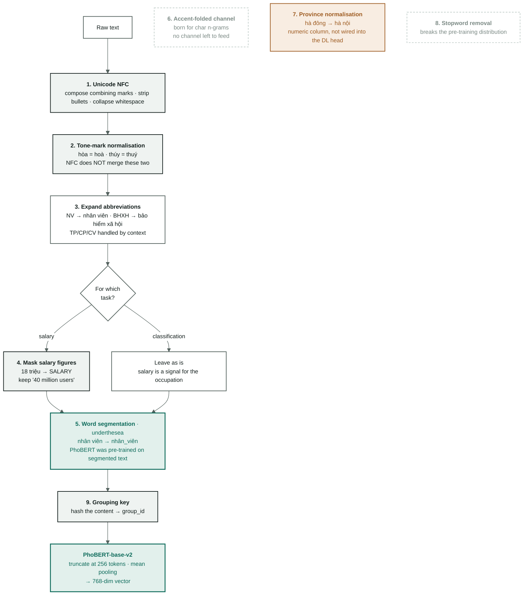

[← Overview](00-tong-quan.md) · [← Data cleaning](01-data-audit.md) · [Deep-learning baseline →](06-baseline-dl.md)

# Vietnamese processing

Nine steps that turn a raw text cell into a string **PhoBERT** tokenises
correctly. Every number is measured on the corpus and reproducible with
`python scripts/measure_vitext.py`.

> **Track change, 2026-09-08.** This note was originally written for TF-IDF. The
> main track is now PhoBERT, so the "why" of every step has been rewritten around
> the BPE mechanism, and **two steps reversed their verdict**: word segmentation
> went from "removed" to **mandatory**, accent folding from "kept" to **dropped**.
>
> The ablation tables in §5 and §6 were measured on TF-IDF + LinearSVC and are
> **kept unchanged** — they are the evidence of a closed phase
> ([archive/](archive/README.md)), not a direction. Read them as history, not as
> instructions.

> New to "data leakage" or "semantic vectors"? Read
> [background: why clean at all](nen-tang/01-vi-sao-phai-lam-sach.md) first.

---

## 1. What `vitext.py` does inside

**In:** one raw text cell taken straight from the CSV — title, description,
requirements, benefits, location.
**Out:** a normalised string ready for PhoBERT, plus a few derived columns:
`province`, `experience_months`, `group_id`.

All 9 steps are **pure functions** — same input, same output, no external state
read, nothing learned from the data. That is what lets the same code run in three
places without diverging: `dataset.py` (before splitting), `features.py` (the
`resolve_column` door), `predict.py` (at inference). This is Rule 4 in
[../AGENTS.md](../AGENTS.md) — a divergence between the training and inference
code paths is a silent bug.

### The nine steps run in three different places — do not read the diagram as one straight line

Only **six** steps live inside `preprocess()`. The other three run elsewhere:

| Step | Where it runs | Why there |
|---|---|---|
| 1 NFC · 2 tone marks · 3 abbreviations · 4 salary masking · 5 segmentation · 8 stopwords | `V.preprocess()`, called from `dataset.clean` | This is the transformation chain over **one** text cell |
| 6 accent folding | `fold_accents`, no longer called on the main track | It was born to feed the TF-IDF character n-gram channel. PhoBERT has no such channel |
| 7 province normalisation | `dataset.clean`, on the `location` column only | It creates a **new column** (`province`), it does not edit text |
| 9 grouping key | `dataset.clean`, after the text is clean | It creates an **id**, not a feature |

The order inside `preprocess` is fixed and has reasons:
**NFC → tone marks → abbreviations → salary masking → segmentation → stopwords.**
Masking has to run **after** abbreviation expansion (because "8tr" must become a
number before it can be masked) and **before** segmentation (because `<SALARY>`
must not be segmented).

### Two things `vitext.py` deliberately does **not** do

- **No HTML stripping.** This corpus has no HTML tags — adding a stripping step
  is adding a step with nothing to do, and every redundant step is a place for a
  bug to hide.
- **No lowercasing.** PhoBERT's tokeniser is case-sensitive, so keeping case is
  correct. It also lets the `n_acronyms` column count `SEO`, `IT`, `PHP`, `QA` —
  uppercase in a title is a very strong sector signal.

---

## 2. Why the processing is needed — the PhoBERT mechanism

PhoBERT does not count words; it cuts text into **BPE subwords** and looks them up
in an embedding table. That table was learned from a pre-training corpus with a
specific distribution. Every step below exists for exactly one reason: **to move
our text closer to the distribution PhoBERT learned**.

Distribution drift raises no error. It merely shatters the subword sequence into
rare fragments, and the semantic vector that comes out the other end fades with no
sign of it on screen.

The nine steps fall into three purposes:

- **Collapse variants onto one spelling** — steps 1, 2, 3, 7. An unfamiliar
  spelling is an unfamiliar subword sequence.
- **Match the pre-training distribution** — step 5. PhoBERT was trained on
  **word-segmented** text.
- **Block leakage** — steps 4 and 9. Do not let the model see the answer, whether
  the answer sits inside the input itself (4) or inside the test split (9).

Steps 6 and 8 lost their footing: step 6 was born for a character channel that no
longer exists, and step 8 deletes exactly the function words a contextual model
needs to understand a sentence.



**Green = mandatory for PhoBERT. Dashed = no place left to use it. Orange = still
there, not wired in.**

> The three detached nodes on the right are deliberately **not** connected: they
> are no longer on the path to the semantic vector. Steps 6, 7 and 9 still run
> elsewhere — see the "nine steps run in three different places" table above.

---

## 3. The nine steps — what, why, and what is measurable

Every number in the last column is measured over the 47,707 postings that remain
after de-duplication, reproducible with `python scripts/measure_vitext.py`.

| # | Step · function | What it does | Why PhoBERT needs it | Measured on the corpus |
|---|---|---|---|---|
| 1 | **Unicode normalisation**<br/>`normalize_unicode` | NFC composition, strip bullets `- • ▪`, strip control characters, collapse whitespace | The letter `ế` can be written as **one** code point or as `e` plus two combining marks. Identical on screen, but PhoBERT's BPE table only has the composed form — the other one shatters into rare fragments or falls into `<unk>` | **529 rows (1.11 %)** contain uncomposed combining characters |
| 2 | **Tone-mark normalisation**<br/>`normalize_tone` | Move the tone mark onto the second vowel in `oa`/`oe`/`uy`: hòa → hoà, thúy → thuý | Both placements are **orthographically correct** and NFC does **not** merge them. BPE cuts the two spellings into two different subword sequences, so one word gets two different vectors. Normalising onto the second vowel is the safe direction: "quý" is left alone, whereas the opposite convention would break it into "qúy" | Descriptions use the "hoà" style **76.6 %** of the time, the "hòa" style **30.3 %** — most postings mix both. 13 title-token pairs merge after this step: họa 565 + hoạ 64 · hóa 307 + hoá 50 |
| 3 | **Expand abbreviations**<br/>`expand_abbreviations` | 39 unambiguous abbreviations replaced per token (NV → nhân viên, BHXH → bảo hiểm xã hội); 6 ambiguous ones (TP, CP, CV…) expand only when a context regex matches | "NV" is a rare token in the pre-training corpus; "nhân viên" is not. Expanding an abbreviation trades a rare fragment for a common one — exactly what PhoBERT has good vectors for. The reverse is just as real: blindly expanding "TP" into "trưởng phòng" inside "TP HCM" manufactures a false signal — **a wrong expansion is worse than none**, so the ambiguous entries need context before they fire | **3,436 descriptions (7.2 %)** contain at least one abbreviation from the table: bhxh 748 · cskh 446 · ncc 414 · bhyt 298. "TP" alone appears in 419 descriptions |
| 4 | **Mask salary figures**<br/>`mask_salary` | For the salary branch only: "15 - 22 triệu" → `<SALARY>`. `_is_pay` spares numbers that **count** something else: "40 triệu người dùng" (40 million users), "500 triệu đồng doanh thu" (500 million in revenue) | `salary_*` is the **label** of task 2. If a salary figure is still inside the description or the benefits, the model reads the answer right off its input: a pretty R² in the report, broken in the world. Masking preserves the *fact* that "this posting mentions pay" (a legitimate signal) and removes only the *value*. For occupation classification nothing is masked — the pay level is a legitimate clue to the occupation | Rows restating a salary figure in the text: benefits **5,081 (10.65 %)** · description 250 (0.52 %) · requirements 103 (0.22 %) · title 121 (0.25 %) |
| 5 | **Word segmentation**<br/>`segment` · underthesea or pyvi | "Nhân viên kinh doanh" → "Nhân_viên kinh_doanh" | **Mandatory, and this is where the verdict reverses versus TF-IDF.** PhoBERT-base-v2 was pre-trained on word-segmented text; its BPE table contains `nhân_viên` as one unit. Feeding unsegmented text means feeding the wrong distribution at the very first layer. For TF-IDF the opposite held — `ngram_range=(1,2)` already caught "nhân viên" as a bigram, so the step was redundant (§5) | The syllable "viên" appears **27,053 times** in titles, following **70 different** syllables: nhân 20,138 · chuyên 4,858 · thuật 498. The two segmenters cut differently on **84.8 %** of descriptions — see §6 |
| 6 | **Accent-folded channel**<br/>`fold_accents` | Makes an accent-stripped copy. Used to feed the TF-IDF char 3–5-gram channel | **No place left to use it.** PhoBERT has a single channel and the folded copy must not enter it: in Vietnamese the diacritics **are** the word — má / mà / mả / mã / mạ are five different words. The function survives because `group_key` calls it (step 9). Consequence: accent-less postings currently have **no processing path at all** — see §4 | **2,148 titles (4.50 %)** carry no diacritics at all |
| 7 | **Province normalisation**<br/>`normalize_province` | Maps place names onto 42 provinces through a table of 183 aliases: "hà đông" → "hà nội", "Tp. HCM" → "hồ chí minh". Unknown places keep their accented name, only the administrative prefix is stripped | It creates a **numeric/categorical** column, not text. The DL head currently accepts only the 768 dims from PhoBERT ([heads.py](../src/vietjobs/dl/heads.py)), so this step is **not wired in yet**. It returns the day the tabular features are concatenated to the semantic vector | 984 location strings → **265 values**; **7,481 rows (15.7 %)** change value. "hà nội" alone absorbs **136 variants**: hà đông 1,166 · bắc từ liêm 166 · cầu giấy 136 |
| 8 | **Stopword removal**<br/>`remove_stopwords` | Removes the 161 entries in `stopwords_vi.txt` (193 forms, counting the underscored forms for segmented text) | **Dropped, and with PhoBERT it is worse than useless.** A contextual model uses those very function words to build the relations between words; deleting them presents a kind of sentence it never saw during pre-training. With TF-IDF it was merely useless: `idf` already downweights words that appear everywhere | Same TF-IDF configuration at C=0.5: on 0.5756 (`cat-P5-svm-stop`) versus off 0.5754 (`cat-P4-svm-charfold`) — a difference of **0.0002**, far below the 0.0077 noise floor |
| 9 | **Grouping key**<br/>`group_key` | SHA-1 of (title + description + requirements) after lowercasing, accent folding and punctuation removal → a 16-character id | Employers repost the same advert many times with small edits. Split by row and the same advert lands in both train and test: the model scores high by **memorising**, and that score says nothing about generalisation. Model-independent — as true for TF-IDF as for PhoBERT | 47,707 rows hold only **34,899 groups** — **12,808 rows (26.8 %)** are reposts, the largest group 33 rows. `dataset.build()` asserts 0 groups straddling splits |

### Three subtleties worth reading closely

**Step 2 — why normalise *onto* the second vowel and not the other way.**
Vietnamese has two valid tone-mark placements for the rimes `oa`, `oe`, `uy`. One
has to be chosen as the standard, and which one is a decision with consequences.
Normalising onto the **second** vowel (`hoà`, `thuý`) is safe because it leaves
`quý` alone — `qu` is an initial consonant cluster, not a vowel. The opposite
direction would break `quý` into `qúy`, a sequence that does not exist in
Vietnamese, and manufacture a junk token.

**Step 4 — why mask rather than delete.** The sentence "Lương 15 triệu" ("Salary
15 million") becomes "Lương `<SALARY>`" after masking. The figure is gone but the
word "Lương" **stays**. That is deliberate: "this posting mentions pay" is a
legitimate signal for tier 1 (does the posting disclose a salary?), while "how
much the pay is" is the answer that must be hidden. Deleting the whole sentence
throws away the good signal along with the answer.

The hard part of this step is telling **money** from **counts**. `_is_pay` looks
at the 48 characters after the figure: if a countable noun follows immediately
(`người`, `khách`, `lượt xem`, `đơn hàng`, `doanh thu` — people, customers, views,
orders, revenue), it then scans a 40-character window on both sides for a
remuneration context (`lương`, `thu nhập`, `thưởng`, `/tháng` — salary, income,
bonus, per month). Without that context the figure is left alone.
`tests/test_vitext.py:210` pins exactly these four cases — the comment in the test
says plainly "this was a real bug".

**Step 8 — why the stopword list spares "không".** Mechanical stopword removal
would turn "không yêu cầu kinh nghiệm" ("no experience required") into "yêu cầu
kinh nghiệm" ("experience required") — the **opposite meaning**. The head of
[../resources/stopwords_vi.txt](../resources/stopwords_vi.txt) lists the words
deliberately kept for that reason: `không`, `chưa`, `trên/dưới`, `ít/nhiều`,
`tối/thiểu`, `từ/đến`, `ưu/tiên`. With PhoBERT the whole list goes unused — the
file is kept so the §5 ablation stays reproducible.

---

## 4. Which steps the PhoBERT path actually runs

This is the quick lookup table. The source of truth is
[`dl/text.py`](../src/vietjobs/dl/text.py): it calls
`features.resolve_column(..., segmented=True)`, meaning it reads the `*_seg` or
`*_masked_seg` column family that `dataset.clean` prepared.

| # | Step | Status on the PhoBERT track |
|---|---|---|
| 1 | NFC | **runs** — baked into every column |
| 2 | Tone-mark normalisation | **runs** — `tone=True` |
| 3 | Expand abbreviations | **runs** — `abbrev=True`. With a constraint, see below |
| 4 | Salary masking | **runs** for `salary`/`disclosed`, not for `category` |
| 5 | Word segmentation | **runs** — `segmented=True` is the default in `dl/text.py` |
| 6 | Accent folding | **does not run** on the input text |
| 7 | Province normalisation | **not wired in** — the DL head takes only 768 dims |
| 8 | Stopword removal | **does not run** |
| 9 | Grouping key | **already done** — the splits are frozen at `SPLIT_SEED = 20260826` |

### The constraint: changing step 3 changes the splits

`group_key` hashes the column **after** `preprocess`
([dataset.py:137](../src/vietjobs/dataset.py#L137)), and it lowercases and folds
accents itself before hashing. So steps 1 and 2 are neutralised by `group_key` —
`hoà` and `hòa` both become `hoa`. Step 3 is **not**: `NV` → `nhân viên` →
`nhan vien` survives accent folding and changes the hash.

Turning `abbrev` off changes `group_id`, which changes the splits, which loses
comparability with every row in [04-results.md](04-results.md) **and** every
benchmark in [archive/](archive/README.md) — a violation of Rule 2, item 1.

### Three things PhoBERT adds that TF-IDF did not have

1. **Truncation at 256 tokens** ([encode.py](../src/vietjobs/dl/encode.py)). This
   is why `FIELDS` puts the title before the description: what gets cut must be
   the tail of the description, not the part that identifies the occupation.
   **Not measured yet**: what percentage of postings lose their requirements
   section to truncation.
2. **Two cache families, `raw` / `masked`**, in `artifacts/embeddings/`. This is
   `resolve_column` materialised as files. Mixing up the two `.npy` files is a
   silent salary leak — Rule 3.
3. **No lowercasing needed.** `TfidfVectorizer(lowercase=True)` used to do it;
   the PhoBERT tokeniser is case-sensitive, so uppercase goes straight into the
   model.

### Two holes left by step 6 — both unmeasured

- **2,148 titles (4.50 %) written without diacritics** now have no processing
  path at all. The accent-folded channel used to catch them for TF-IDF; BPE will
  shred "Nhan Vien" into rare fragments.
- **The segmenter does not match the source.** This project uses
  underthesea/pyvi; PhoBERT was segmented by VinAI with VnCoreNLP's RDRSegmenter.
  The two segmenters *inside* this project already disagree on 84.8 % of
  descriptions (§6) — the divergence from a third one has never been measured, and
  §6's "do not switch segmenter" verdict is a TF-IDF verdict, from a setting where
  step 5 was switched off. With PhoBERT step 5 is always on, so the question
  "which one" reopens.

All three unmeasured items above are tracked in [09-lo-trinh.md](09-lo-trinh.md).

---

## 5. The closed track's ablation — evidence, not direction

> All of §5 and §6 was measured on **TF-IDF + LinearSVC**, the track closed on
> 2026-09-08. Kept because of the "record the failures too" rule: they explain why
> the pipeline has the shape it has. Do not use them to decide anything for
> PhoBERT — the two models read text through different mechanisms, and step 5 is
> the living proof.

SVM fixed at `C = 0.02`, one step toggled at a time. 200 bootstrap resamples give
a macro-F1 standard deviation of ≈ **0.0077** — a difference smaller than that is
noise, not an improvement. The figure comes from the 34 runs of the comparison
cluster, see
[10-so-sanh-mo-hinh.md §7](archive/10-so-sanh-mo-hinh.md#8-σ--lần-đầu-được-tính-bằng-code).
Caveat: the "within noise" verdicts below were reached by comparing two
**independent** points. A **paired** comparison (paired bootstrap) is far more
sensitive, but the runs in this table did not store `y_pred`, so they cannot be
rechecked — **except for word segmentation**, which was re-run and compared
pairwise in §6.

| Configuration | `PrepConfig` flags | macro-F1 (dev) | Run in [archive/04-results-ml.md](archive/04-results-ml.md) |
|---|---|---|---|
| No steps | `raw` | 0.6033 | `cat-R-svm-C0.02-noprep` |
| Province normalisation | `province` | **0.6050** | `cat-T-svm-C0.02` |
| Province + segmentation (underthesea) | `segment+province` | 0.5998 | `cat-R-svm-C0.02-seg` |
| Province + segmentation (pyvi) | `segment+province` | 0.5982 | `cat-SEG-pyvi` |
| Province + segmentation + accent folding | `segment+charfold+province` | 0.6024 | `cat-R-svm-C0.02-all` |

**With TF-IDF, only province normalisation survives** — the cheapest of the nine
steps, P(>0) = 0.97. Segmentation and accent folding both pull the score below
doing nothing at all.

Stopword removal has no row at `C = 0.02`. The only valid comparison sits in an
earlier cluster run with the default `C`: `cat-P4-svm-charfold` 0.5754 →
`cat-P5-svm-stop` 0.5756, i.e. **+0.0002** — indistinguishable from noise. The
verdict is still "drop", but because it brings nothing, not because it hurts.

Segmentation does not help TF-IDF because `ngram_range=(1,2)` **already** catches
"nhân viên" as a bigram — step 5 solves a problem the vectoriser had already
solved. PhoBERT has no bigram solving it in advance, and its BPE table was built
on segmented text — so the same step yields opposite verdicts. The mechanism is
detailed in [background: n-grams and word boundaries](nen-tang/03-ngram-va-ranh-gioi-tu.md).

Put side by side to see the effort ratio: tuning `C` from 0.5 down to 0.02 (same
`province` configuration) moved macro-F1 from 0.5763 to 0.6050, **+0.0287**; the
entire Vietnamese pipeline contributed **+0.0017**. One hyper-parameter line beat
nine language-processing steps by **nearly 17×**.

The three steps dropped from the TF-IDF configuration (5, 6, 8) remain in the
code, off by default behind `PrepConfig` flags, so the table above stays
reproducible at any time. The DL path **does not** read `PrepConfig` — it goes
straight through `resolve_column`.

> **One smudge that has to be stated.** The `raw` row is not entirely
> "no processing". The `is_major_city` column is always computed from `province`
> regardless of the `prep.province` flag
> ([dataset.py:92](../src/vietjobs/dataset.py#L92)), so the `raw` row still enjoys
> part of the benefit of province normalisation. The true gap between `raw` and
> `province` is therefore **narrower** than the measured 0.0017. The verdict
> "province normalisation is the only surviving step" does not change, but the
> evidence for it is weaker than the table looks.

Four steps are **kept regardless** of whether they raise the score, because they
belong to correctness rather than to performance — and this holds on both tracks:

| Step | What breaks without it |
|---|---|
| 1 · NFC | The same word lives in two places. Every ablation row afterwards measures over two different inputs, and the comparison table becomes meaningless |
| 2 · tone-mark normalisation | As above, and the frequency is halved precisely on the most common words |
| 4 · salary masking | Label leakage — Rule 3. No error is raised; it quietly yields a model reading its own answer key |
| 9 · grouping key | Leakage between splits — [03-protocol.md](03-protocol.md) §1. The test score rises without being real |

The general lesson, worth more than the table of numbers: **a preprocessing step
has two kinds of reason to exist** — it raises the score, or it makes the measured
number meaningful. The second kind never shows up in an ablation table, and is
never removed either.

---

## 6. Where the two segmenters differ — and why the question reopens

§5 concludes that segmentation is not worth keeping **for TF-IDF**. But that
conclusion is tied to **one** library: underthesea. If it cuts badly, what was
measured is the quality of that library, not the value of segmentation. So the
whole thing was re-run with a second one —
[pyvi](https://github.com/trungtv/pyvi) — holding everything else fixed: the same
frozen splits, the same LinearSVC `C = 0.02`, the same province normalisation, the
same five text columns.

Reproduce with `python scripts/archive/segmenter_ablation.py`; the figures are in
`artifacts/segmenter-ablation/metrics.json`.

**The two really do cut differently.** 84.8 % of description rows come out as
different strings — these are not two runs of the same thing:

```
Nhân Viên Vận Hành Hệ Thống Xử Lí Nước Thải
pyvi         Nhân_Viên Vận_Hành Hệ_Thống Xử_Lí Nước_Thải
underthesea  Nhân_Viên Vận_Hành Hệ_Thống Xử_Lí_Nước_Thải     ← 4 syllables merged into 1 token
```

| Configuration | macro-F1 (dev) | Δ versus no segmentation (**paired** bootstrap) |
|---|---|---|
| Province only — no segmentation | **0.6050** | baseline |
| + segmentation · underthesea | 0.5998 | −0.0050 · CI95 [−0.0109; +0.0013] · P(>0) = 0.059 |
| + segmentation · pyvi | 0.5982 | −0.0067 · CI95 [−0.0125; −0.0012] · P(>0) = 0.009 |

The two libraries are **indistinguishable from each other**: pyvi − underthesea =
−0.0017, CI95 [−0.0070; +0.0038], P(>0) = 0.266.

The paired comparison also tightens the old conclusion. §5 called segmentation
"within noise" because the 0.0052 gap is smaller than σ ≈ 0.0077. Compared
pairwise over the **same** dev rows, pyvi's confidence interval **does not contain
zero**: with TF-IDF, segmentation is not harmless, it is **mildly harmful** —
exactly as the mechanism in
[background: n-grams and word boundaries](nen-tang/03-ngram-va-ranh-gioi-tu.md)
predicts, since the bigrams already caught "nhân viên" while segmentation destroys
bridging bigrams like "viên kinh".

**Where pyvi wins is speed, not score.** Same five columns, same 40,555 rows:

| Segmenter | Seconds | |
|---|---|---|
| underthesea | 461.2 | |
| pyvi | 63.8 | **7.2× faster** |

For TF-IDF that number is irrelevant, because the segmentation step is off. **For
PhoBERT it matters**: step 5 is always on, so both the speed and the cutting style
become open questions again. Two things are unmeasured, and cannot be inferred
from the table above:

- Which segmenter yields better PhoBERT vectors? The table measures the effect on
  TF-IDF and says nothing about BPE.
- Neither library is the RDRSegmenter VinAI used during pre-training.

The switch is in the code — the environment variable `VIETJOBS_SEGMENTER=pyvi`,
default `underthesea`. Changing the segmenter means rebuilding the `*_seg` columns
and re-encoding the whole embedding cache.

---

## Read next

- [Deep-learning baseline](06-baseline-dl.md) — how a clean string becomes a 768-dim vector
- [Data cleaning](01-data-audit.md) — what happens before these nine steps
- [Experiment protocol](03-protocol.md) — why every ablation row is valid
- Background: [why clean at all](nen-tang/01-vi-sao-phai-lam-sach.md) ·
  [n-grams and word boundaries](nen-tang/03-ngram-va-ranh-gioi-tu.md) ·
  [data leakage](nen-tang/05-ro-ri-du-lieu.md)
