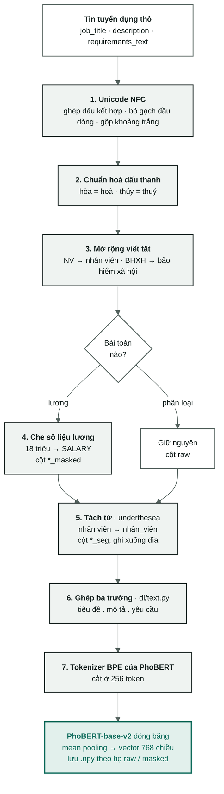

[← Tổng quan](00-tong-quan.md) · [← Làm sạch dữ liệu](01-data-audit.md) · [Baseline học sâu →](06-baseline-dl.md)

# Xử lý tiếng Việt

Chín bước biến một ô văn bản thô thành chuỗi mà **PhoBERT** tách token đúng
cách. Mọi con số đều được đo trên corpus và có thể tái lập bằng
`python scripts/measure_vitext.py`.

> **Thay đổi hướng đi, 2026-09-08.** Ghi chú này ban đầu được viết cho TF-IDF.
> Hướng chính hiện nay là PhoBERT, nên phần "vì sao" của từng bước đã được viết
> lại xoay quanh cơ chế BPE, và **hai bước đã đảo ngược kết luận**: tách từ đi
> từ "loại bỏ" thành **bắt buộc**, còn bỏ dấu đi từ "giữ lại" thành **loại bỏ**.
>
> Các bảng ablation ở §5 và §6 được đo trên TF-IDF + LinearSVC và được
> **giữ nguyên không đổi** — đó là bằng chứng của một giai đoạn đã khép lại
> ([archive/](archive/README.md)), không phải định hướng. Hãy đọc chúng như
> lịch sử, không phải như chỉ dẫn.

> Chưa quen với "rò rỉ dữ liệu" hay "vector ngữ nghĩa"? Hãy đọc
> [nền tảng: vì sao phải làm sạch](nen-tang/01-vi-sao-phai-lam-sach.md) trước.

> **Đối chiếu với code, 2026-09-17.** Bảng chín bước ở §3 và §4 vẫn đúng từng
> dòng. Ba chỗ diễn đạt được sửa cho khớp cơ chế thật: tách từ chạy ở một lượt
> riêng (`segment_many`) chứ không qua `preprocess(do_segment=True)`; câu
> "không viết thường hoá" chỉ đúng cho ba cột đi vào PhoBERT, không đúng cho
> toàn bộ `vitext.py`; anchor `group_key` trỏ đúng dòng. Thêm hai kiểm thử
> chốt PhoBERT không lọc stopword và không viết thường
> ([tests/test_dl_text.py](../tests/test_dl_text.py)).

---

## 1. Bên trong `vitext.py` làm gì

**Đầu vào:** một ô văn bản thô lấy trực tiếp từ CSV — title, description,
requirements, benefits, location.
**Đầu ra:** một chuỗi đã chuẩn hoá sẵn sàng cho PhoBERT, cùng vài cột phái
sinh: `province`, `experience_months`, `group_id`.

Cả 9 bước đều là **hàm thuần (pure functions)** — cùng đầu vào cho cùng đầu
ra, không đọc trạng thái bên ngoài, không học gì từ dữ liệu. Chính điều đó cho
phép cùng một đoạn code chạy ở ba nơi mà không lệch nhau: `dataset.py` (trước
khi chia tập), `features.py` (cửa `resolve_column`), `predict.py` (lúc suy
luận). Đây là Rule 4 trong [../AGENTS.md](../AGENTS.md) — sự lệch nhau giữa
luồng code huấn luyện và luồng code suy luận là một lỗi âm thầm.

### Chín bước chạy ở ba nơi khác nhau

`V.preprocess()` **biết** sáu bước (tham số `tone`, `abbrev`, `mask`,
`do_segment`, `drop_stopwords`), nhưng `dataset.clean` chỉ bật **bốn**:
`tone=True, abbrev=True, mask=(True cho salary/disclosed)` — xem
[`dataset.py`](../src/vietjobs/dataset.py). Tách từ **không** chạy qua
`do_segment`: nó là một lượt riêng, `segment_many`, gọi ngay sau trên các cột
đã tiền xử lý. Stopword thì không nơi nào bật `drop_stopwords=True` cả — tham
số này chỉ tồn tại để `preprocess()` vẫn còn khả năng làm việc đó khi cần.

| Bước | Chạy ở đâu | Vì sao ở đó |
|---|---|---|
| 1 NFC · 2 dấu thanh · 3 viết tắt · 4 che lương | `V.preprocess(tone=True, abbrev=True, mask=…)`, gọi từ `dataset.clean` | Đây là chuỗi biến đổi trên **một** ô văn bản |
| 5 tách từ | `V.segment_many`, lượt riêng ngay sau `preprocess` trong `dataset.clean` | Chạy trên toàn cột (Series), không phải trên một ô — khác cơ chế với 1–4 |
| 6 bỏ dấu | `fold_accents`, không còn được gọi trên hướng chính | Nó sinh ra để nuôi kênh n-gram ký tự của TF-IDF. PhoBERT không có kênh như vậy |
| 7 chuẩn hoá tỉnh/thành | `dataset.clean`, chỉ trên cột `location` | Nó tạo ra một **cột mới** (`province`), không chỉnh sửa văn bản |
| 8 stopword | `remove_stopwords`, có trong `preprocess()` qua `drop_stopwords` nhưng không có lời gọi nào bật nó | Tham số còn đó cho ablation ở §5, nhưng đường build thật sự không dùng |
| 9 khoá gộp nhóm | `dataset.clean`, sau khi văn bản đã sạch | Nó tạo ra một **id**, không phải một đặc trưng |

Thứ tự **hiệu dụng** trong `dataset.clean` là cố định và có lý do:
**NFC → dấu thanh → viết tắt → che lương → (lượt riêng) tách từ.**
Việc che phải chạy **sau** khi mở rộng viết tắt (vì "8tr" phải trở thành một
con số trước khi có thể bị che) và **trước** khi tách từ (vì `<SALARY>` không
được phép bị tách từ) — `preprocess()` tự nó giữ đúng thứ tự 1→4, còn bước 5
chỉ đến sau vì `dataset.clean` gọi nó sau, không phải vì `preprocess()` ép
buộc.

### Hai điều `vitext.py` cố tình **không** làm

- **Không gỡ HTML.** Corpus này không có thẻ HTML — thêm một bước gỡ thẻ là
  thêm một bước không có việc gì để làm, và mỗi bước dư thừa là một nơi để bug
  ẩn náu.
- **Không viết thường hoá ba cột đi vào PhoBERT** (`job_title`, `description`,
  `requirements_text` và các biến thể `_masked`/`_seg` của chúng). Tokenizer
  của PhoBERT phân biệt hoa thường, nên giữ nguyên hoa thường là đúng. Điều
  này cũng cho phép cột `n_acronyms` đếm `SEO`, `IT`, `PHP`, `QA` — chữ hoa
  trong tiêu đề là một tín hiệu ngành nghề rất mạnh. Đây là quy tắc cho ba cột
  văn bản, **không phải** cho toàn bộ `vitext.py`: các cột dạng danh sách gộp
  bằng `join_list_field` (`benefits_text`, `technical_skills_text`,
  `qualifications_text`, `soft_skills_text`, `languages_text`) **bị viết
  thường**, nhưng không cột nào trong số đó nằm trong `FIELDS` của
  `dl/text.py`, nên PhoBERT không bao giờ nhìn thấy.

---

## 2. Vì sao cần xử lý — cơ chế của PhoBERT

PhoBERT không đếm từ; nó cắt văn bản thành các **subword BPE** rồi tra chúng
trong một bảng nhúng. Bảng đó được học từ một corpus tiền huấn luyện với một
phân phối cụ thể. Mỗi bước dưới đây tồn tại vì đúng một lý do: **đưa văn bản
của ta đến gần hơn phân phối mà PhoBERT đã học**.

Sự trôi dạt phân phối không gây ra lỗi nào. Nó chỉ âm thầm băm chuỗi subword
thành các mảnh hiếm, và vector ngữ nghĩa xuất ra ở đầu kia mờ dần mà không có
dấu hiệu nào hiện trên màn hình.

Chín bước rơi vào ba mục đích:

- **Gộp các biến thể về một cách viết** — các bước 1, 2, 3, 7. Một cách viết
  lạ là một chuỗi subword lạ.
- **Khớp với phân phối tiền huấn luyện** — bước 5. PhoBERT được huấn luyện
  trên văn bản **đã tách từ**.
- **Chặn rò rỉ dữ liệu** — các bước 4 và 9. Không để mô hình nhìn thấy đáp án,
  dù đáp án nằm trong chính đầu vào (4) hay trong tập kiểm tra (9).

Bước 6 và 8 đã mất chỗ đứng: bước 6 sinh ra cho một kênh ký tự nay không còn
tồn tại, còn bước 8 xoá đi đúng những hư từ mà một mô hình theo ngữ cảnh cần để
hiểu một câu.



**Đường văn bản từ tin thô tới vector PhoBERT, đúng thứ tự trong mã nguồn.** Các
bước không nằm trên đường này (bỏ dấu, tỉnh/thành, từ dừng, khoá nhóm) ở bảng
[Chín bước chạy ở ba nơi khác nhau](#chín-bước-chạy-ở-ba-nơi-khác-nhau) (§1).

---

## 3. Chín bước — làm gì, vì sao, và điều gì đo được

Mọi con số trong cột cuối được đo trên 47.707 tin tuyển dụng còn lại sau khi
loại trùng lặp, có thể tái lập bằng `python scripts/measure_vitext.py`.

| # | Bước · hàm | Làm gì | Vì sao PhoBERT cần nó | Đo trên corpus |
|---|---|---|---|---|
| 1 | **Chuẩn hoá Unicode**<br/>`normalize_unicode` | Ghép NFC, bỏ ký hiệu gạch đầu dòng `- • ▪`, bỏ ký tự điều khiển, gộp khoảng trắng | Chữ `ế` có thể được viết dưới dạng **một** code point duy nhất hoặc dưới dạng `e` cộng hai dấu kết hợp. Giống hệt nhau trên màn hình, nhưng bảng BPE của PhoBERT chỉ có dạng đã ghép — dạng còn lại bị băm thành các mảnh hiếm hoặc rơi vào `<unk>` | **529 dòng (1,11 %)** chứa ký tự kết hợp chưa được ghép |
| 2 | **Chuẩn hoá dấu thanh**<br/>`normalize_tone` | Chuyển dấu thanh sang nguyên âm thứ hai trong `oa`/`oe`/`uy`: hòa → hoà, thúy → thuý | Cả hai cách đặt dấu đều **đúng chính tả**, và NFC **không** gộp chúng lại. BPE cắt hai cách viết thành hai chuỗi subword khác nhau, nên cùng một từ nhận hai vector khác nhau. Chuẩn hoá về nguyên âm thứ hai là hướng an toàn: "quý" được giữ nguyên, trong khi quy ước ngược lại sẽ phá nó thành "qúy" | Description dùng kiểu "hoà" **76,6 %** số lần, kiểu "hòa" **30,3 %** — phần lớn tin đăng trộn lẫn cả hai. 13 cặp token tiêu đề được gộp lại sau bước này: họa 565 + hoạ 64 · hóa 307 + hoá 50 |
| 3 | **Mở rộng viết tắt**<br/>`expand_abbreviations` | 39 từ viết tắt không mơ hồ được thay theo từng token (NV → nhân viên, BHXH → bảo hiểm xã hội); 6 từ viết tắt mơ hồ (TP, CP, CV…) chỉ mở rộng khi một regex ngữ cảnh khớp | "NV" là một token hiếm trong corpus tiền huấn luyện; "nhân viên" thì không. Mở rộng một từ viết tắt là đổi một mảnh hiếm lấy một mảnh phổ biến — đúng thứ mà PhoBERT có vector tốt. Điều ngược lại cũng thật không kém: mở rộng mù quáng "TP" thành "trưởng phòng" bên trong "TP HCM" tạo ra một tín hiệu sai — **mở rộng sai còn tệ hơn không mở rộng**, nên các mục mơ hồ cần ngữ cảnh trước khi kích hoạt | **3.436 description (7,2 %)** chứa ít nhất một từ viết tắt trong bảng: bhxh 748 · cskh 446 · ncc 414 · bhyt 298. Riêng "TP" xuất hiện trong 419 description |
| 4 | **Che số liệu lương**<br/>`mask_salary` | Chỉ áp dụng cho nhánh lương: "15 - 22 triệu" → `<SALARY>`. `_is_pay` bỏ qua các con số **đếm** thứ khác: "40 triệu người dùng", "500 triệu đồng doanh thu" | `salary_*` là **nhãn** của tác vụ 2. Nếu một con số lương vẫn còn trong description hay benefits, mô hình đọc thẳng đáp án ngay trên đầu vào của nó: một R² đẹp trong báo cáo, nhưng vỡ trận ngoài thực tế. Việc che vẫn giữ *sự kiện* rằng "tin này có nhắc đến lương" (một tín hiệu hợp lệ) và chỉ xoá đi *giá trị*. Với phân lớp ngành nghề thì không gì bị che cả — mức lương là một manh mối hợp lệ cho ngành nghề | Các dòng nhắc lại số liệu lương trong văn bản: benefits **5.081 (10,65 %)** · description 250 (0,52 %) · requirements 103 (0,22 %) · title 121 (0,25 %) |
| 5 | **Tách từ**<br/>`segment` · underthesea hoặc pyvi | "Nhân viên kinh doanh" → "Nhân_viên kinh_doanh" | **Bắt buộc, và đây là nơi kết luận đảo ngược so với TF-IDF.** PhoBERT-base-v2 được tiền huấn luyện trên văn bản đã tách từ; bảng BPE của nó chứa `nhân_viên` như một đơn vị. Đưa vào văn bản chưa tách từ nghĩa là đưa sai phân phối ngay từ lớp đầu tiên. Với TF-IDF thì ngược lại — `ngram_range=(1,2)` đã bắt được "nhân viên" như một bigram, nên bước này dư thừa (§5) | Âm tiết "viên" xuất hiện **27.053 lần** trong title, đứng sau **70 âm tiết khác nhau**: nhân 20.138 · chuyên 4.858 · thuật 498. Hai bộ tách từ cắt khác nhau trên **84,8 %** description — xem §6 |
| 6 | **Kênh bỏ dấu**<br/>`fold_accents` | Tạo một bản sao đã bỏ dấu. Dùng để nuôi kênh n-gram ký tự 3–5 của TF-IDF | **Không còn chỗ để dùng.** PhoBERT chỉ có một kênh duy nhất và bản sao bỏ dấu không được đi vào đó: trong tiếng Việt, dấu thanh **chính là** từ — má / mà / mả / mã / mạ là năm từ khác nhau. Hàm này vẫn tồn tại vì `group_key` gọi nó (bước 9). Các tin không dấu hiện không có đường xử lý riêng (theo dõi ở [09](09-lo-trinh.md) Ưu tiên 4) | **2.148 title (4,50 %)** hoàn toàn không mang dấu thanh nào |
| 7 | **Chuẩn hoá tỉnh/thành**<br/>`normalize_province` | Ánh xạ tên địa danh vào 42 tỉnh/thành qua một bảng 183 tên gọi khác: "hà đông" → "hà nội", "Tp. HCM" → "hồ chí minh". Địa danh không rõ giữ nguyên tên có dấu, chỉ tiền tố hành chính bị bỏ | Nó tạo ra một cột **số/phân loại**, không phải văn bản. Đầu học sâu hiện chỉ nhận 768 chiều từ PhoBERT ([heads.py](../src/vietjobs/dl/heads.py)), nên cột này không đi vào mô hình học sâu | 984 chuỗi location → **265 giá trị**; **7.481 dòng (15,7 %)** đổi giá trị. Riêng "hà nội" hấp thụ **136 biến thể**: hà đông 1.166 · bắc từ liêm 166 · cầu giấy 136 |
| 8 | **Loại bỏ stopword**<br/>`remove_stopwords` | Loại bỏ 161 mục trong `stopwords_vi.txt` (193 dạng, tính cả các dạng có gạch dưới cho văn bản đã tách từ) | **Bị loại bỏ, và với PhoBERT nó còn tệ hơn là vô dụng.** Một mô hình theo ngữ cảnh dùng chính những hư từ đó để dựng quan hệ giữa các từ; xoá chúng đi tạo ra một kiểu câu mà mô hình chưa từng thấy trong lúc tiền huấn luyện. Với TF-IDF nó chỉ đơn thuần vô dụng: `idf` đã hạ trọng số các từ xuất hiện ở khắp nơi | Cùng cấu hình TF-IDF ở C=0.5: bật 0,5756 (`cat-P5-svm-stop`) so với tắt 0,5754 (`cat-P4-svm-charfold`) — chênh lệch **0,0002**, thấp hơn nhiều so với ngưỡng nhiễu 0,0077 |
| 9 | **Khoá gộp nhóm**<br/>`group_key` | SHA-1 của (title + description + requirements) sau khi viết thường, bỏ dấu và loại bỏ dấu câu → một id 16 ký tự | Nhà tuyển dụng đăng lại cùng một tin nhiều lần với chỉnh sửa nhỏ. Nếu chia theo dòng, cùng một tin có thể rơi vào cả train lẫn test: mô hình đạt điểm cao nhờ **học thuộc lòng**, và điểm đó không nói lên điều gì về khả năng tổng quát hoá. Không phụ thuộc mô hình — đúng với cả TF-IDF lẫn PhoBERT | 47.707 dòng chỉ có **34.899 nhóm** — **12.808 dòng (26,8 %)** là tin đăng lại, nhóm lớn nhất có 33 dòng. `dataset.build()` khẳng định 0 nhóm bị chia lệch giữa các tập |

### Ba điểm tinh tế đáng đọc kỹ

**Bước 2 — vì sao chuẩn hoá *về* nguyên âm thứ hai chứ không phải chiều ngược
lại.** Tiếng Việt có hai cách đặt dấu thanh hợp lệ cho các vần `oa`, `oe`,
`uy`. Phải chọn một cách làm chuẩn, và chọn cách nào là một quyết định có hệ
quả. Chuẩn hoá về nguyên âm **thứ hai** (`hoà`, `thuý`) là an toàn vì nó để
yên `quý` — `qu` là một tổ hợp phụ âm đầu, không phải nguyên âm. Chiều ngược
lại sẽ phá `quý` thành `qúy`, một chuỗi không tồn tại trong tiếng Việt, và tạo
ra một token rác.

**Bước 4 — vì sao che chứ không xoá.** Câu "Lương 15 triệu" trở thành "Lương
`<SALARY>`" sau khi che. Con số biến mất nhưng từ "Lương" **vẫn còn**. Đó là
chủ ý: "tin này có nhắc đến lương" là một tín hiệu hợp lệ cho tầng 1 (tin có
công khai lương hay không?), trong khi "lương bao nhiêu" mới là đáp án cần
giấu đi. Xoá cả câu sẽ vứt luôn cả tín hiệu tốt lẫn đáp án.

Phần khó của bước này là phân biệt **tiền** với **số đếm**. `_is_pay` xem 48
ký tự sau con số: nếu một danh từ đếm được xuất hiện ngay sau (`người`,
`khách`, `lượt xem`, `đơn hàng`, `doanh thu`), nó sẽ quét tiếp một cửa sổ 40
ký tự ở cả hai phía để tìm ngữ cảnh thù lao (`lương`, `thu nhập`, `thưởng`,
`/tháng`). Không có ngữ cảnh đó thì con số được để yên.
`tests/test_vitext.py:210` chốt đúng bốn trường hợp này — comment trong test
nói thẳng "đây từng là một bug thật".

**Bước 8 — vì sao danh sách stopword tha cho "không".** Loại bỏ stopword một
cách máy móc sẽ biến "không yêu cầu kinh nghiệm" thành "yêu cầu kinh nghiệm" —
**nghĩa ngược lại hoàn toàn**. Phần đầu của
[../resources/stopwords_vi.txt](../resources/stopwords_vi.txt) liệt kê các từ
được cố tình giữ lại vì lý do đó: `không`, `chưa`, `trên/dưới`, `ít/nhiều`,
`tối/thiểu`, `từ/đến`, `ưu/tiên`. Với PhoBERT thì cả danh sách này không được
dùng đến — file vẫn được giữ để ablation ở §5 còn tái lập được.

---

## 4. Luồng PhoBERT thực sự chạy những bước nào

Đây là bảng tra nhanh. Nguồn chân lý là
[`dl/text.py`](../src/vietjobs/dl/text.py): nó gọi
`features.resolve_column(..., segmented=True)`, nghĩa là nó đọc họ cột
`*_seg` hoặc `*_masked_seg` mà `dataset.clean` đã chuẩn bị.

| # | Bước | Trạng thái trên hướng PhoBERT |
|---|---|---|
| 1 | NFC | **chạy** — được nướng sẵn vào mọi cột |
| 2 | Chuẩn hoá dấu thanh | **chạy** — `tone=True` |
| 3 | Mở rộng viết tắt | **chạy** — `abbrev=True`. Có một ràng buộc, xem bên dưới |
| 4 | Che lương | **chạy** cho `salary`/`disclosed`, không chạy cho `category` |
| 5 | Tách từ | **chạy** — `segmented=True` là mặc định trong `dl/text.py` |
| 6 | Bỏ dấu | **không chạy** trên văn bản đầu vào |
| 7 | Chuẩn hoá tỉnh/thành | **không đi vào mô hình** — đầu học sâu chỉ nhận 768 chiều |
| 8 | Loại bỏ stopword | **không chạy** |
| 9 | Khoá gộp nhóm | **đã làm xong** — các tập được đóng băng ở `SPLIT_SEED = 20260826` |

### Ràng buộc: đổi bước 3 sẽ đổi cả các tập chia

`group_key` băm cột **sau** `preprocess`
([dataset.py:149-152](../src/vietjobs/dataset.py#L149-L152)), và tự nó viết
thường rồi bỏ dấu trước khi băm. Vì vậy bước 1 và 2 bị `group_key` vô hiệu hoá
— `hoà` và `hòa` đều trở thành `hoa`. Bước 3 thì **không**: `NV` →
`nhân viên` → `nhan vien` sống sót qua việc bỏ dấu và làm đổi giá trị băm.

Tắt `abbrev` sẽ làm đổi `group_id`, làm đổi các tập chia, làm mất khả năng so
sánh với mọi dòng trong [04-results.md](04-results.md) **và** mọi benchmark
trong [archive/](archive/README.md) — vi phạm Rule 2, mục 1.

### Từ cột `_seg` tới vector 768 chiều — những gì xảy ra sau chín bước

Chín bước dừng lại ở việc tạo ra cột `*_seg` / `*_masked_seg`. Từ đó tới lúc
có vector, hai module khác còn thêm bốn phép biến đổi mà bảng chín bước không
nói tới — nguồn chân lý là
[`dl/text.py`](../src/vietjobs/dl/text.py) và
[`dl/encode.py`](../src/vietjobs/dl/encode.py):

| Bước thêm | Làm gì | Ở đâu |
|---|---|---|
| Ghép trường | `title . description . requirements`, `" . "` làm dấu nối, title trước để phần bị cắt luôn là đuôi của description | `dl/text.py` `build_text` |
| Gộp khoảng trắng lần cuối | `fillna("")`, `.strip()` từng trường, rồi `\s+ → " "` trên chuỗi đã ghép | `dl/text.py` `build_text` |
| Token hoá BPE | `AutoTokenizer.from_pretrained("vinai/phobert-base-v2", use_fast=False)` — PhoBERT chỉ có tokenizer "chậm", cờ này ghim để một bản `transformers` sau này không đổi âm thầm; thêm `<s>` … `</s>` | `dl/encode.py` `encode_texts` |
| Cắt + đệm | `truncation=True, max_length=256`; đệm động theo batch | `dl/encode.py` `encode_texts` |

Không bước nào trong bốn bước này viết thường hoặc bỏ dấu — chúng chỉ nối
chuỗi và cắt token.

### Ba điều PhoBERT thêm vào mà TF-IDF không có

1. **Cắt ở 256 token** ([encode.py](../src/vietjobs/dl/encode.py)). Đây không
   phải một lựa chọn mà là **trần cứng** của `phobert-base-v2`
   (`max_position_embeddings = 258`, tức 256 vị trí dùng được); chuỗi dài hơn
   làm mô hình báo `IndexError`. Cái giá đo được ở
   [05](05-phan-tich-du-lieu.md): 19,8% số tin bị cắt, nhưng 91,5% tổng token
   vẫn được giữ. Quyết định thật sự của người làm là **thứ tự trường**:
   `FIELDS` đặt title trước description để phần bị cắt là đuôi của
   description, không phải phần định danh ngành nghề.
2. **Hai họ cache, `raw` / `masked`**, trong `artifacts/embeddings/`. Đây là
   `resolve_column` được hiện thực hoá thành file. Lẫn lộn hai file `.npy` này
   là một rò rỉ lương âm thầm — Rule 3. Mỗi file `.npy` nay có một sidecar
   `.json` cùng tên ghi lại lớp tokenizer, `max_len`, cột nguồn và số dòng đã
   nhúng — bằng chứng để so hai cache với nhau, không phải để đọc lại vector.
3. **Không cần viết thường hoá.** `TfidfVectorizer(lowercase=True)` từng làm
   việc đó; tokenizer của PhoBERT phân biệt hoa thường, nên chữ hoa đi thẳng
   vào mô hình.

---

## 5. Ablation của hướng đã khép lại — bằng chứng, không phải định hướng

> Toàn bộ §5 và §6 được đo trên **TF-IDF + LinearSVC**, hướng đã khép lại vào
> ngày 2026-09-08. Được giữ lại vì quy tắc "ghi lại cả những thất bại": chúng
> giải thích vì sao pipeline có hình dạng như hiện tại. Đừng dùng chúng để
> quyết định bất cứ điều gì cho PhoBERT — hai mô hình đọc văn bản qua các cơ
> chế khác nhau, và bước 5 là bằng chứng sống động cho điều đó.

SVM cố định ở `C = 0.02`, mỗi lần bật/tắt một bước. 200 lần lấy mẫu lại
bootstrap cho độ lệch chuẩn macro-F1 xấp xỉ **0,0077** — chênh lệch nhỏ hơn con
số đó là nhiễu, không phải cải thiện. Con số này đến từ 34 lần chạy của cụm so
sánh, xem
[10-so-sanh-mo-hinh.md §7](archive/10-so-sanh-mo-hinh.md#8-σ--lần-đầu-được-tính-bằng-code).
Lưu ý: các kết luận "trong ngưỡng nhiễu" dưới đây đạt được bằng cách so sánh
hai điểm **độc lập**. So sánh **theo cặp** (paired bootstrap) nhạy hơn nhiều,
nhưng các lần chạy trong bảng này không lưu `y_pred`, nên không thể kiểm tra
lại — **trừ trường hợp tách từ**, vốn đã được chạy lại và so sánh theo cặp ở
§6.

| Cấu hình | cờ `PrepConfig` | macro-F1 (dev) | Lần chạy trong [archive/04-results-ml.md](archive/04-results-ml.md) |
|---|---|---|---|
| Không bước nào | `raw` | 0,6033 | `cat-R-svm-C0.02-noprep` |
| Chuẩn hoá tỉnh/thành | `province` | **0,6050** | `cat-T-svm-C0.02` |
| Tỉnh/thành + tách từ (underthesea) | `segment+province` | 0,5998 | `cat-R-svm-C0.02-seg` |
| Tỉnh/thành + tách từ (pyvi) | `segment+province` | 0,5982 | `cat-SEG-pyvi` |
| Tỉnh/thành + tách từ + bỏ dấu | `segment+charfold+province` | 0,6024 | `cat-R-svm-C0.02-all` |

**Với TF-IDF, chỉ chuẩn hoá tỉnh/thành sống sót** — bước rẻ nhất trong chín
bước, P(>0) = 0,97. Cả tách từ lẫn bỏ dấu đều kéo điểm xuống thấp hơn cả việc
không làm gì.

Loại bỏ stopword không có dòng nào ở `C = 0.02`. So sánh hợp lệ duy nhất nằm ở
một cụm chạy trước đó với `C` mặc định: `cat-P4-svm-charfold` 0,5754 →
`cat-P5-svm-stop` 0,5756, tức **+0,0002** — không phân biệt được với nhiễu.
Kết luận vẫn là "loại bỏ", nhưng vì nó không mang lại gì, không phải vì nó gây
hại.

Tách từ không giúp ích cho TF-IDF vì `ngram_range=(1,2)` **đã** bắt được
"nhân viên" như một bigram — bước 5 giải quyết một vấn đề mà vectoriser đã
giải quyết sẵn. PhoBERT không có bigram nào giải trước, và bảng BPE của nó
được xây trên văn bản đã tách từ — nên cùng một bước lại cho ra hai kết luận
trái ngược. Cơ chế này được trình bày chi tiết ở
[nền tảng: n-gram và ranh giới từ](nen-tang/03-ngram-va-ranh-gioi-tu.md).

Đặt cạnh nhau để thấy tỷ lệ công sức: chỉnh `C` từ 0,5 xuống 0,02 (cùng cấu
hình `province`) đưa macro-F1 từ 0,5763 lên 0,6050, **+0,0287**; toàn bộ
pipeline tiếng Việt chỉ đóng góp **+0,0017**. Một dòng siêu tham số đã vượt
chín bước xử lý ngôn ngữ tới **gần 17 lần**.

Ba bước bị loại khỏi cấu hình TF-IDF (5, 6, 8) vẫn còn trong code, tắt theo
mặc định phía sau các cờ `PrepConfig`, nên bảng trên vẫn tái lập được bất cứ
lúc nào. Luồng học sâu **không** đọc `PrepConfig` — nó đi thẳng qua
`resolve_column`.

> **Một vết mờ cần phải nói rõ.** Dòng `raw` không hoàn toàn là "không xử lý
> gì". Cột `is_major_city` luôn được tính từ `province` bất kể cờ
> `prep.province` ([dataset.py:92](../src/vietjobs/dataset.py#L92)), nên dòng
> `raw` vẫn hưởng một phần lợi ích của việc chuẩn hoá tỉnh/thành. Vì vậy
> khoảng cách thật giữa `raw` và `province` **hẹp hơn** con số 0,0017 đã đo
> được. Kết luận "chuẩn hoá tỉnh/thành là bước duy nhất sống sót" không đổi,
> nhưng bằng chứng cho nó yếu hơn so với vẻ ngoài của bảng.

Bốn bước được **giữ lại bất kể** chúng có nâng điểm hay không, vì chúng thuộc
về tính đúng đắn chứ không phải hiệu năng — và điều này đúng trên cả hai
hướng:

| Bước | Thiếu nó thì hỏng gì |
|---|---|
| 1 · NFC | Cùng một từ tồn tại ở hai nơi. Mọi dòng ablation về sau đo trên hai đầu vào khác nhau, và bảng so sánh trở nên vô nghĩa |
| 2 · chuẩn hoá dấu thanh | Như trên, và tần suất bị chia đôi đúng vào những từ phổ biến nhất |
| 4 · che lương | Rò rỉ nhãn — Rule 3. Không có lỗi nào được báo; nó âm thầm tạo ra một mô hình đọc chính đáp án của nó |
| 9 · khoá gộp nhóm | Rò rỉ giữa các tập — [03-protocol.md](03-protocol.md) §1. Điểm test tăng lên mà không có thật |

Bài học chung, đáng giá hơn cả bảng số liệu: **một bước tiền xử lý có hai loại
lý do để tồn tại** — nó nâng điểm, hoặc nó làm cho con số đo được có ý nghĩa.
Loại thứ hai không bao giờ xuất hiện trong bảng ablation, và cũng không bao
giờ bị loại bỏ.

---

## 6. Hai bộ tách từ khác nhau ở đâu — và vì sao câu hỏi mở lại

§5 kết luận rằng tách từ không đáng giữ lại **đối với TF-IDF**. Nhưng kết
luận đó gắn với **một** thư viện duy nhất: underthesea. Nếu nó cắt tồi, thứ
được đo là chất lượng của thư viện đó, không phải giá trị của việc tách từ.
Vì vậy toàn bộ việc này được chạy lại với một thư viện thứ hai —
[pyvi](https://github.com/trungtv/pyvi) — giữ nguyên mọi thứ khác: cùng các
tập chia đã đóng băng, cùng LinearSVC `C = 0.02`, cùng chuẩn hoá tỉnh/thành,
cùng năm cột văn bản.

Tái lập bằng `python scripts/archive/segmenter_ablation.py`; số liệu nằm
trong `artifacts/segmenter-ablation/metrics.json`.

**Hai bộ thật sự cắt khác nhau.** 84,8 % dòng description cho ra chuỗi khác
nhau — đây không phải hai lần chạy của cùng một thứ:

```
Nhân Viên Vận Hành Hệ Thống Xử Lí Nước Thải
pyvi         Nhân_Viên Vận_Hành Hệ_Thống Xử_Lí Nước_Thải
underthesea  Nhân_Viên Vận_Hành Hệ_Thống Xử_Lí_Nước_Thải     ← 4 âm tiết gộp thành 1 token
```

| Cấu hình | macro-F1 (dev) | Δ so với không tách từ (bootstrap **theo cặp**) |
|---|---|---|
| Chỉ tỉnh/thành — không tách từ | **0,6050** | baseline |
| + tách từ · underthesea | 0,5998 | −0,0050 · CI95 [−0,0109; +0,0013] · P(>0) = 0,059 |
| + tách từ · pyvi | 0,5982 | −0,0067 · CI95 [−0,0125; −0,0012] · P(>0) = 0,009 |

Hai thư viện **không phân biệt được với nhau**: pyvi − underthesea = −0,0017,
CI95 [−0,0070; +0,0038], P(>0) = 0,266.

So sánh theo cặp cũng siết chặt lại kết luận cũ. §5 gọi tách từ là "trong
ngưỡng nhiễu" vì khoảng cách 0,0052 nhỏ hơn σ ≈ 0,0077. Khi so sánh theo cặp
trên **cùng** các dòng dev, khoảng tin cậy của pyvi **không chứa số 0**: với
TF-IDF, tách từ không vô hại, nó **gây hại nhẹ** — đúng như cơ chế trong
[nền tảng: n-gram và ranh giới từ](nen-tang/03-ngram-va-ranh-gioi-tu.md) dự
đoán, vì bigram đã bắt được "nhân viên" trong khi tách từ phá huỷ các bigram
bắc cầu như "viên kinh".

**Chỗ pyvi thắng là tốc độ, không phải điểm số.** Cùng năm cột, cùng 40.555
dòng:

| Bộ tách từ | Giây | |
|---|---|---|
| underthesea | 461,2 | |
| pyvi | 63,8 | **nhanh hơn 7,2×** |

Với TF-IDF thì con số này không quan trọng, vì bước tách từ đang tắt. **Với
PhoBERT thì nó quan trọng**: bước 5 luôn bật, nên cả tốc độ lẫn cách cắt đều
lại trở thành câu hỏi mở (theo dõi ở [09-lo-trinh.md](09-lo-trinh.md) Ưu tiên 4).

Công tắc chuyển đổi nằm trong code — biến môi trường
`VIETJOBS_SEGMENTER=pyvi`, mặc định là `underthesea`. Đổi bộ tách từ nghĩa là
phải xây lại các cột `*_seg` và mã hoá lại toàn bộ cache embedding.

---

## Đọc tiếp

- [Baseline học sâu](06-baseline-dl.md) — chuỗi sạch trở thành vector 768
  chiều như thế nào
- [Làm sạch dữ liệu](01-data-audit.md) — điều gì xảy ra trước chín bước này
- [Giao thức thực nghiệm](03-protocol.md) — vì sao mỗi dòng ablation đều hợp
  lệ
- Nền tảng: [vì sao phải làm sạch](nen-tang/01-vi-sao-phai-lam-sach.md) ·
  [n-gram và ranh giới từ](nen-tang/03-ngram-va-ranh-gioi-tu.md) ·
  [rò rỉ dữ liệu](nen-tang/05-ro-ri-du-lieu.md)
