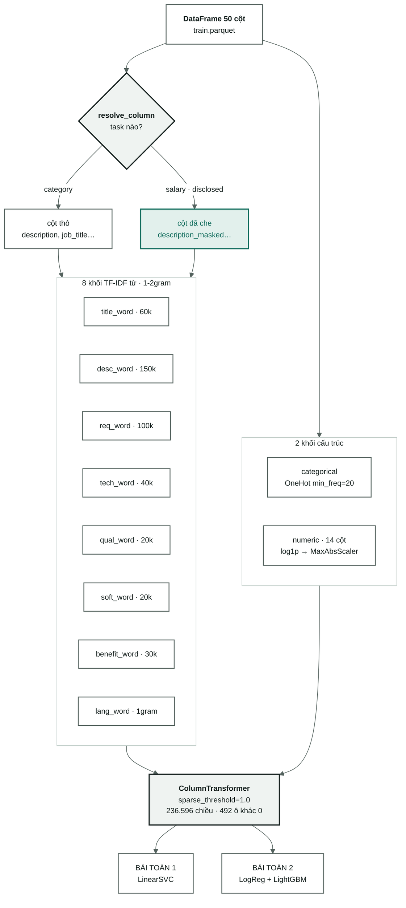

[← Tổng quan](00-tong-quan.md) · [← Xử lý tiếng Việt](02-vietnamese-nlp.md) · [Mô hình phân lớp →](06-mo-hinh-phan-lop.md)

# Đặc trưng và TF-IDF

Từ 50 cột đã sạch đến ma trận thưa **236.596 chiều** nuôi cả hai bài toán.
Đây là chỗ chữ biến thành số.

Code: [`features.py`](../src/vietjobs/features.py) — toàn bộ 268 dòng.

> Chưa biết TF-IDF hoạt động thế nào? Đọc
> [nền tảng: TF-IDF là gì](nen-tang/02-tf-idf-la-gi.md) trước — có ví dụ tính tay.

---

## 1. `resolve_column` — cửa duy nhất

Trước khi nói tới TF-IDF, phải nói tới câu hỏi đứng trước nó: **bài toán này được
đọc cột nào?**

```python
def resolve_column(name: str, *, task: str, segmented: bool) -> str:
    col = _MASKABLE[name] if (task in C.MASKED_TASKS and name in _MASKABLE) else name
    if segmented:
        seg = _SEG_NAME.get(col)
        if seg is not None:
            return seg
    return col
```

Bốn ca, đọc từ trái sang phải:

| Gọi | Trả về | Vì sao |
|---|---|---|
| `("description", task="category", segmented=False)` | `description` | Phân lớp nghề đọc bản thô. Lương là manh mối hợp lệ để đoán nghề |
| `("description", task="category", segmented=True)` | `description_seg` | Như trên, bản đã tách từ |
| `("description", task="salary", segmented=False)` | `description_masked` | Bài lương **chỉ** được đọc bản đã che số |
| `("description", task="salary", segmented=True)` | `description_masked_seg` | Như trên, bản đã tách từ |

**Vì sao gom vào một hàm.** Sai ở đây **không báo lỗi**. Nó cho ra một mô hình
lương đọc chính đáp án của mình, báo cáo R² đẹp, rồi hỏng ngoài đời. Một cửa duy
nhất thì viết test được; mười nhánh `if` rải khắp code thì không.

[`tests/test_no_leak.py`](../tests/test_no_leak.py) giữ nó bằng 7 test, chạy
trên mọi tổ hợp `scope × segment × task`. Test cốt lõi chỉ có một dòng:

```python
assert set(F.source_columns(ct)) & F.UNMASKED_COLUMNS == set()
```

> ⚠️ **Test này chỉ bảo vệ được những cột người viết test nghĩ tới.**
> `soft_skills_text` và `qualifications_text` đi vào mô hình lương ở dạng
> **chưa che** và **không** nằm trong `UNMASKED_COLUMNS`, nên test không bắt.
> Chưa đo xem hai cột đó có nhắc lại con số lương hay không. Việc phải làm ghi
> ở [09-lo-trinh.md — Ưu tiên 0](09-lo-trinh.md#ưu-tiên-0b--đóng-lỗ-hổng-che-lương-chưa-được-test-phủ).

---

## 2. `PrepConfig` — vì sao mặc định là "không làm gì"

```python
@dataclass(frozen=True)
class PrepConfig:
    segment: bool = False       # tách từ
    charfold: bool = False      # kênh ký tự gấp dấu
    province: bool = False      # hà đông → hà nội
    stopwords: bool = False     # bỏ từ dừng
```

Cả bốn cờ mặc định `False`. Đó là một tuyên bố về phương pháp: **sàn là "không
xử lý gì", và mỗi bước phải tự kiếm chỗ đứng bằng một dòng ablation.**

Cách làm ngược lại — bật hết rồi tin rằng nó giúp — là cách để có một pipeline
dài đầy nghi lễ mà không ai biết bước nào thật sự đóng góp. Kết quả đo được:
ba trong bốn bước bị gỡ. Xem
[02-vietnamese-nlp.md §4](02-vietnamese-nlp.md#4-ablation--bước-nào-thật-sự-đáng-giữ).

`tag()` biến cấu hình thành nhãn ngắn (`raw`, `segment+province`) đi thẳng vào
run id và vào cột `Prep` của [04-results.md](04-results.md). Mỗi cấu hình là
một dòng, truy ngược được.

---

## 3. Mười khối đặc trưng

`build_features` lắp một `ColumnTransformer` từ tối đa 11 khối (10 khi `charfold`
tắt — và cấu hình chốt thì tắt).



**Cùng một `ColumnTransformer` nuôi cả hai bài toán.** Khác biệt duy nhất giữa
hai nhánh nằm ở chỗ `resolve_column` trả về cột nào — không có hai pipeline song
song để lệch nhau.

| Khối | Bộ vectơ | `max_features` | Đọc cột |
|---|---|---|---|
| `title_word` | TF-IDF từ, 1-2gram | 60.000 | `col("job_title")` |
| `title_char` *(chỉ khi `charfold`)* | TF-IDF `char_wb`, 3-5gram, gấp dấu | 60.000 | bản **chưa tách từ** |
| `desc_word` | TF-IDF từ, 1-2gram | 150.000 | `col("description")` |
| `req_word` | TF-IDF từ, 1-2gram | 100.000 | `col("requirements_text")` |
| `tech_word` | TF-IDF từ, 1-2gram | 40.000 | `col("technical_skills_text")` |
| `qual_word` | TF-IDF từ, 1-2gram | 20.000 | `col("qualifications_text")` |
| `soft_word` | TF-IDF từ, 1-2gram | 20.000 | `soft_skills_text` |
| `benefit_word` | TF-IDF từ, 1-2gram | 30.000 | `col("benefits_text")` |
| `lang_word` | TF-IDF từ, **1gram**, `min_df=1` | — | `languages_text` |
| `categorical` | `OneHotEncoder(min_frequency=20)` | — | tỉnh · loại hợp đồng · kinh nghiệm |
| `numeric` | `log1p` → `MaxAbsScaler` | — | 14 cột số |

**Vì sao mỗi khối một bộ vectơ riêng thay vì nối chữ lại rồi vectơ hoá một lần.**
Từ "tiếng Anh" trong ô *ngoại ngữ* và từ "tiếng Anh" trong ô *mô tả* mang hai sức
nặng khác nhau: ở ô ngoại ngữ nó là yêu cầu chính thức, ở mô tả nó có thể chỉ là
một câu quảng cáo. Tách khối cho phép mô hình học hai trọng số khác nhau cho cùng
một từ tuỳ theo nó xuất hiện ở đâu. Nối chung là vứt bỏ thông tin vị trí đó.

`lang_word` là ngoại lệ có chủ ý: `min_df=1` (nhận cả ngôn ngữ chỉ xuất hiện một
lần) và chỉ unigram. Cột này có ít giá trị khác nhau, mỗi giá trị đều quan trọng,
và bigram trên nó là vô nghĩa.

---

## 4. Từng tham số TF-IDF — và bỏ đi thì sao

```python
lowercase=True, ngram_range=(1, 2), min_df=3, max_df=0.6,
sublinear_tf=True, strip_accents=None
```

### `lowercase=True`

Hạ chữ thường **ở đây**, không phải sớm hơn. `Nhân Viên` và `nhân viên` phải là
một chiều. Việc hạ muộn cho phép `dataset.clean` đếm được chữ viết hoa
(`n_acronyms`: `SEO`, `IT`, `QA`) **trước khi** thông tin đó mất.

*Bỏ đi:* mỗi từ tách thành nhiều chiều theo cách viết hoa — tin tiêu đề kiểu
Title Case không bao giờ khớp tin viết thường.

### `ngram_range=(1, 2)`

Đếm cả từ đơn lẻ **và** cặp từ liền nhau. `"nhân viên kinh doanh"` sinh ra 7 đặc trưng:
`nhân`, `viên`, `kinh`, `doanh` + `nhân viên`, `viên kinh`, `kinh doanh`.

Đây là tham số quan trọng nhất trong cả file, và là lý do bước tách từ đo ra
**không giúp gì**: bigram `nhân viên` đã bắt đúng cái mà `nhân_viên` định bắt.
Bộ vectơ hoá giải sẵn bài toán mà bước 5 định giải. Chi tiết ở
[nền tảng: n-gram và ranh giới từ](nen-tang/03-ngram-va-ranh-gioi-tu.md).

*Bỏ đi (chỉ `(1,1)`):* token `viên` gộp chung nhân viên / chuyên viên / kỹ thuật
viên / giáo viên — bốn nghề khác nhau đổ vào một chiều.

*Tăng lên `(1,3)`:* số chiều nổ ra, phần lớn trigram chỉ xuất hiện vài lần và bị
`min_df` cắt ngay — trả giá bộ nhớ mà không được gì.

### `min_df=3`

Bỏ mọi n-gram xuất hiện trong **dưới 3 tài liệu**.

Một từ chỉ có ở 1–2 tin thì mô hình không thể học được gì tổng quát từ nó — nó
chỉ có thể **nhớ** đúng hai tin đó. Đó là định nghĩa của quá khớp. Tham số này
là hàng rào chống quá khớp rẻ nhất trong cả pipeline, và nó cắt đi phần lớn từ
sai chính tả, tên riêng, mã nội bộ của công ty.

*Bỏ đi (`min_df=1`):* số chiều tăng gấp nhiều lần, gần như toàn bộ phần thêm vào
là chiều xuất hiện đúng một lần — thuần tuý là nhiễu, và làm `C` tối ưu phải
tụt xuống thấp hơn nữa.

### `max_df=0.6`

Bỏ mọi n-gram xuất hiện trong **hơn 60 % tài liệu**.

Đây là bộ lọc từ dừng **tự động, học từ chính dữ liệu**. Từ "công ty" có mặt ở
gần như mọi tin tuyển dụng — nó không phân biệt được nghề nào với nghề nào.
Và vì nó học từ dữ liệu, nó bắt được cả những từ chỉ phổ biến *trong kho này*
mà không có trong bất kỳ danh sách từ dừng chuẩn nào ("ứng viên", "phúc lợi").

Đây cũng là lý do bước 8 (bỏ từ dừng thủ công) đo ra **+0,0002**: `max_df` và
`idf` đã làm sẵn việc đó, tốt hơn, và không có rủi ro bỏ nhầm chữ "không".

### `sublinear_tf=True`

Đổi công thức đếm từ `tf` sang `1 + log(tf)`.

Một từ xuất hiện 10 lần trong một tin **không** quan trọng gấp 10 lần một từ xuất
hiện 1 lần. Nó quan trọng hơn, nhưng theo thang giảm dần. Mô tả tuyển dụng hay
lặp lại từ khoá ngành ("bán hàng… bán hàng… bán hàng") vì lý do SEO chứ không
phải vì tin đó "bán hàng hơn" tin khác.

*Bỏ đi:* những tin dài lặp từ sẽ áp đảo, và mô hình học độ dài văn bản thay vì
học nội dung.

### `strip_accents=None`

**Không bao giờ bỏ dấu ở kênh từ.** Đây là dòng có comment dài nhất trong file, vì
nó là mặc định mà một người viết TF-IDF cho tiếng Anh sẽ bật theo phản xạ:

> Vietnamese diacritics are meaning-bearing: má/mà/mả/mã/mạ are five different words.

`má` (mẹ), `mà` (liên từ), `mả` (mộ), `mã` (mã số), `mạ` (mạ kim loại) — năm từ.
Bỏ dấu là gộp năm chiều có nghĩa thành một chiều vô nghĩa.

Nhu cầu khớp tin viết không dấu (**4,50 %** tiêu đề) được giải bằng một **kênh
riêng**, không bằng cách phá kênh từ — mục kế tiếp.

---

## 5. Kênh ký tự — và vì sao nó đọc bản chưa tách từ

```python
analyzer="char_wb", ngram_range=(3, 5), preprocessor=V.fold_accents
```

`char_wb` cắt chuỗi thành đoạn 3–5 ký tự, **trong phạm vi từng từ**. `"nhan vien"`
sinh `nha`, `han`, `nhan`, `vie`, `ien`, `vien`… Vì nó đọc bản đã gấp dấu,
`"Nhan Vien"` và `"Nhân Viên"` sinh ra **cùng** một bộ n-gram và khớp được nhau.

Kênh này **bổ sung**, không thay thế kênh từ. Kênh từ giữ nghĩa của dấu; kênh ký
tự bắc cầu cho những tin không có dấu.

**Nó cố ý đọc bản chưa tách từ** ([features.py:213](../src/vietjobs/features.py#L213)):

```python
raw_title = resolve_column("job_title", task=task, segmented=False)
```

Vì bộ tách từ chèn gạch dưới (`nhân_viên`), mà gạch dưới là **ký tự** — n-gram
`n_v`, `ân_`, `_vi` sẽ tràn vào từ điển và chúng chẳng đại diện cho gì cả.
`tests/test_no_leak.py:79` giữ đúng điều này.

Kênh ký tự chỉ bật khi `prep.charfold=True`. Ablation cho thấy nó **không giúp**
(0,6024 so với 0,6050), nên cấu hình chốt **tắt** nó.

---

## 6. Khối số — vì sao `log1p` rồi `MaxAbsScaler`

```python
Pipeline([("log1p", FunctionTransformer(np.log1p)), ("scale", MaxAbsScaler())])
```

Mười bốn cột số có thang đo lệch nhau rất xa:

| Cột | Khoảng giá trị |
|---|---|
| `requires_english` · `is_major_city` · `has_working_hours` | 0 hoặc 1 |
| `n_languages` · `n_qualifications` | 0–5 |
| `experience_months` | 0–120 |
| `desc_len` · `req_len` | hàng nghìn |

Với một mô hình tuyến tính, thang đo **là** trọng số ban đầu. Không co giãn thì
`desc_len` một mình lấn át 13 cột còn lại, đơn giản vì con số của nó to hơn —
không phải vì nó quan trọng hơn.

**Hai bước, hai việc khác nhau:**

- `log1p` nén cái đuôi. Chênh lệch giữa mô tả 500 và 1.000 ký tự có ý nghĩa;
  chênh lệch giữa 9.500 và 10.000 thì không. `log1p` (chứ không phải `log`) vì
  giá trị 0 là hợp lệ và phổ biến — `log(0)` là âm vô cùng.
- `MaxAbsScaler` đưa mọi cột về khoảng `[-1, 1]`.

**Vì sao `MaxAbsScaler` chứ không phải `StandardScaler`.** `StandardScaler` trừ
trung bình — phép đó biến mọi số 0 thành khác 0, và **phá ma trận thưa**. Từ
236.596 × 33.396 ô thưa thành đặc: nhân lên khoảng 480 lần bộ nhớ. `MaxAbsScaler`
chỉ chia cho giá trị tuyệt đối lớn nhất, nên số 0 vẫn là số 0.

---

## 7. `sparse_threshold=1.0` — ép giữ thưa

`ColumnTransformer` mặc định sẽ tự chuyển sang ma trận đặc nếu phần đặc "đủ lớn".
Ở đây không được phép: 236.596 × 33.396 số thực 8 byte là khoảng **63 GB**.

Ma trận thật chỉ có **492 ô khác 0 mỗi dòng** — đặc 0,2 phần nghìn. Lưu thưa là
khoảng 130 MB. Xem [nền tảng: ma trận thưa và số chiều](nen-tang/04-ma-tran-thua-va-so-chieu.md).

`remainder="drop"` cũng quan trọng: **cột nào không được liệt kê thì bị vứt.**
Đây là mặc định an toàn — thêm một cột mới vào parquet không tự động cho nó chảy
vào mô hình, và bốn cột lương thô (`salary`, `salary_min`, `salary_max`,
`salary_avg`) không bao giờ lọt vào bằng đường vô ý.

---

## 8. Ba `scope` — ba câu hỏi khác nhau

| `scope` | Khối nào có | Số chiều | Dùng để trả lời |
|---|---|---|---|
| `structured` | chỉ one-hot + số | ~60 | "Không đọc chữ thì đoán được đến đâu?" |
| `title` | chỉ `title_word` (+ `title_char`) | ~6.800 | "Chỉ tiêu đề thì đến đâu?" |
| `full` | tất cả | 236.596 | Cấu hình thật |

Hai điều dễ hiểu nhầm:

**`scope="title"` không có khối số và khối one-hot.** Điều kiện ở
[features.py:228](../src/vietjobs/features.py#L228) chỉ nhận `full` và `structured`.
Nên dòng `cat-P0b-svm-title` 0,5547 là điểm của **chỉ chữ trong tiêu đề**, không
kèm tỉnh, không kèm số năm kinh nghiệm. So sánh nó với `cat-P1-svm-raw` 0,5719
(toàn văn) là so sánh hai thứ khác nhau về cả chữ lẫn cấu trúc.

**`scope="structured"` tồn tại vì bài toán 2.** Với ~60 chiều trên 23.965 mẫu
huấn luyện, tỷ lệ p/n ≈ 0,0025 — đây là sân chơi công bằng **duy nhất** cho
`LinearRegression` không chính quy hoá. Chạy hồi quy tuyến tính thuần trên 236.596
chiều rồi kết luận "nó tệ" là không công bằng: nó tệ vì bị đặt vào tình huống
không giải được. Có `scope=structured` thì kết luận mới có sức nặng.
Xem [nền tảng: chính quy hoá](nen-tang/07-chinh-quy-hoa.md).

Tuỳ chọn `svd=N` bọc thêm `TruncatedSVD` để nén ma trận thưa xuống `N` chiều đặc —
dùng cho ablation số chiều của KNN và cho cấu hình `LinearRegression` thứ tư.

---

## 9. Khối nào thật sự được dùng

Sau khi huấn luyện `LinearSVC` ở `C = 0,02`, cộng tổng `|w|` theo từng khối:

| Khối | Số chiều | % tổng trọng số `\|w\|` | Trọng số / chiều so với trung bình |
|---|---|---|---|
| mô tả | 103.459 | 31,0 % | 0,7× |
| yêu cầu | 65.737 | 23,0 % | 0,8× |
| phúc lợi | 29.936 | 15,8 % | 1,2× |
| kỹ năng KT | 14.163 | 9,0 % | 1,5× |
| kỹ năng mềm | 10.747 | 8,3 % | 1,8× |
| **tiêu đề** | 6.835 | 7,8 % | **2,7×** |
| bằng cấp | 5.626 | 4,7 % | 2,0× |
| one-hot | 57 | 0,2 % | **8×** |
| ngoại ngữ | 22 | 0,1 % | **11×** |
| số | 14 | 0,1 % | **17×** |

Cột cuối là tỷ số tự tính ra từ hai cột trước:
`(% trọng số ÷ số chiều) ÷ (100 % ÷ 236.596)`. Đọc bảng theo cột này, không theo
cột giữa. **Ba khối cấu trúc chỉ có 93 chiều, giữ 0,4 % trọng số — mỗi chiều của
chúng nặng gấp khoảng 10 lần một chiều văn bản trung bình.**

Đó là bằng chứng đo được cho một điều dễ nói mà khó tin: vài đặc trưng cấu trúc
làm cẩn thận có sức nặng ngang hàng chục nghìn chiều văn bản. Và nó gợi thẳng ra
hai việc tiếp theo — nhân trọng số khối tiêu đề, và cắt bớt chiều văn bản —
ghi ở [09-lo-trinh.md — Ưu tiên 3](09-lo-trinh.md#ưu-tiên-3--hai-đòn-bẩy-rẻ-cho-phân-lớp-làm-trước-khi-nghĩ-đến-dl).

---

## Đọc tiếp

- [Mô hình phân lớp](06-mo-hinh-phan-lop.md) — ma trận này được dùng thế nào
- [Bài toán lương](07-bai-toan-luong.md) — cũng ma trận này, cột đã che
- [Xử lý tiếng Việt](02-vietnamese-nlp.md) — chuyện xảy ra trước khi vào TF-IDF
- Nền tảng: [TF-IDF là gì](nen-tang/02-tf-idf-la-gi.md) ·
  [n-gram và ranh giới từ](nen-tang/03-ngram-va-ranh-gioi-tu.md) ·
  [ma trận thưa và số chiều](nen-tang/04-ma-tran-thua-va-so-chieu.md)
