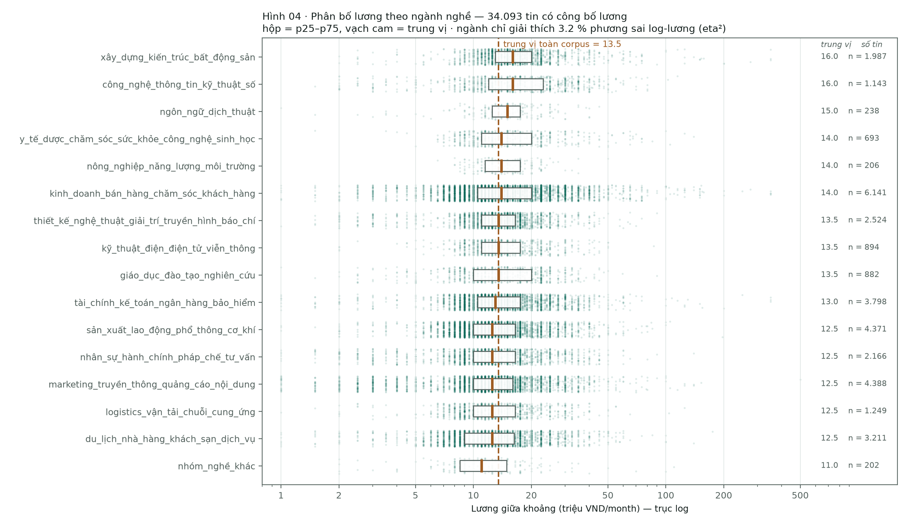
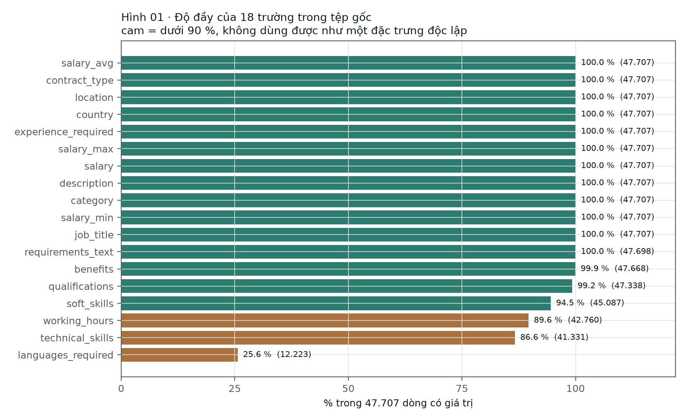
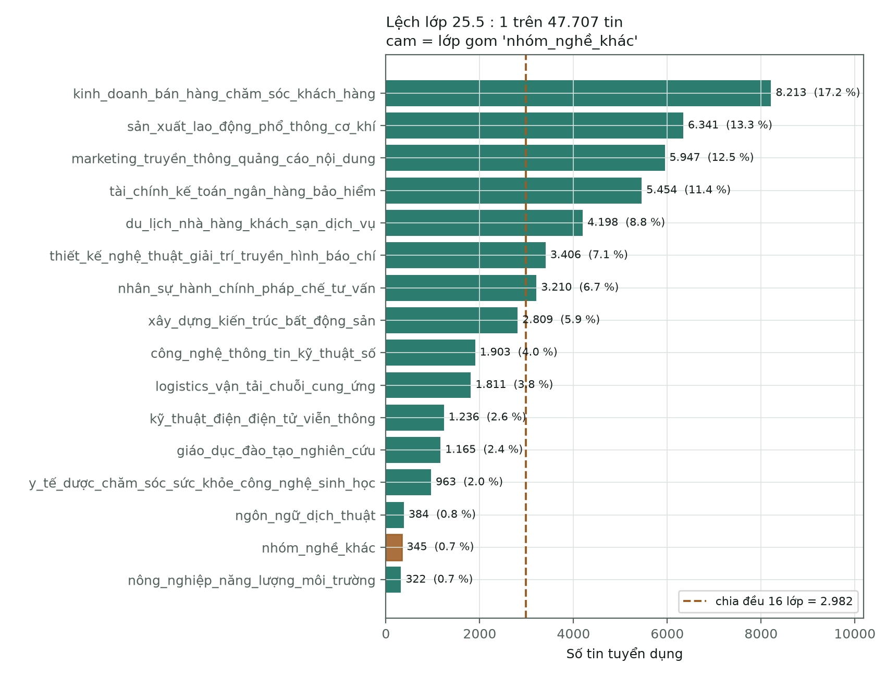
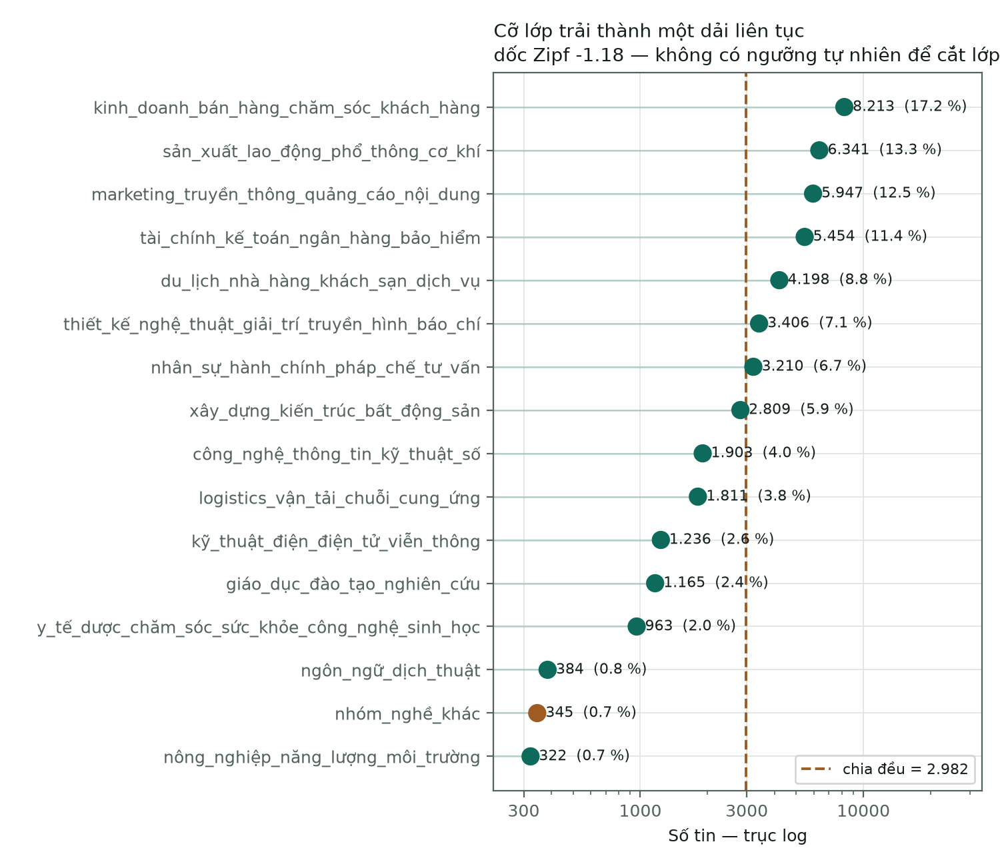
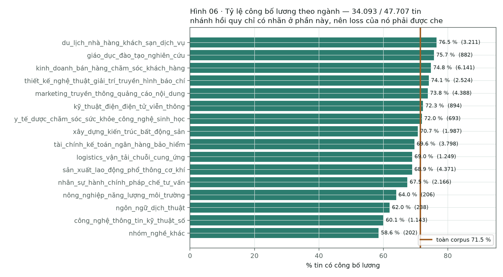

[← Overview](00-tong-quan.md) · [← Vietnamese processing](02-vietnamese-nlp.md) · [Deep-learning baseline →](06-baseline-dl.md)

# Data analysis before any model is built

**Scope — the original file.** Every descriptive number below is measured on
`data/raw/VietJobs.csv` after exact de-duplication: **47,707 rows**, the whole
corpus as collected, not a split ([AGENTS.md Rule 8](../AGENTS.md#rule-8--data-analysis-is-measured-on-the-original-file)).
The **decision** numbers — the no-model floors, the `--max-len` choice — are the
only ones measured on a split, they are fitted on `train` and scored on `dev`,
and they are marked as such. `test` is never read here.

```bash
python scripts/analyze_data.py                                   # measure + plot
PYTHONPATH=src .venv-dl/bin/python scripts/analyze_data.py --tokens   # figure 07
```

Full output: [`artifacts/eda/summary.json`](../artifacts/eda/summary.json).

> **Re-measured 2026-09-12** (T1.1). `artifacts/eda/summary.json` was
> regenerated by the command above, including `--tokens` inside `.venv-dl`, and
> the floors in [section 7](#7-the-floors--decision-numbers-fitted-on-train-scored-on-dev)
> were fitted and scored on the current v2 splits (`train` 34,354 / `dev` 3,812).
> No `⛔` remains below.

---

## 1. Seven questions, seven figures

| Question | Figure | One-sentence answer |
|---|---|---|
| Which fields are actually filled in? | [eda-01](figures/eda/eda-01-do-day-truong.png) | Eleven of eighteen columns are 100 % filled; `languages_required` is filled in only **25.6 %** of rows |
| How skewed are the classes? | [eda-02a](figures/eda/eda-02a-lech-lop.png) · [eda-02b](figures/eda/eda-02b-lorenz.png) | **25.5 : 1** between the largest and the smallest class, Gini **0.439** |
| How do the 16 sectors spread out by size? | [eda-03a](figures/eda/eda-03a-co-lop.png) · [eda-03b](figures/eda/eda-03b-cong-bo-luong.png) | A continuous band, Zipf slope **−1.18**; the smaller the class, the less often salary is disclosed (r = **0.610**) |
| How does salary spread within each sector? | [eda-04](figures/eda/eda-04-luong-theo-nganh.png) | The medians of all 16 sectors span only **11.0 → 16.0**, while each sector spans from 1 to several hundred |
| How is salary distributed? | [eda-05a](figures/eda/eda-05a-thang-tho.png) · [eda-05b](figures/eda/eda-05b-sau-log1p.png) | Skew **11.90** on the raw scale, **0.10** after `log1p` |
| Where do the salary labels exist? | [eda-06](figures/eda/eda-06-cong-bo-luong.png) | **71.5 %** of postings disclose a salary; the lowest sector is 58.6 % |
| How much text does PhoBERT lose at 256 tokens? | [eda-07](figures/eda/eda-07-do-dai-token.png) | Median **178** tokens, p95 **370**; `max_len=256` truncates **19.8 %** of postings but keeps **91.5 %** of all tokens |



---

## 2. Field completeness — which columns are real features



Source: [eda-01](figures/eda/eda-01-do-day-truong.png), 47,707 rows.

| Column | Filled | Fill rate |
|---|---|---|
| `salary_avg` · `salary_max` · `salary_min` · `category` · `description` · `salary` · `contract_type` · `location` · `job_title` · `experience_required` · `country` | 47,707 | **100 %** |
| `requirements_text` | 47,698 | 100.0 % |
| `benefits` | 47,668 | 99.9 % |
| `qualifications` | 47,338 | 99.2 % |
| `soft_skills` | 45,087 | 94.5 % |
| `working_hours` | 42,760 | **89.6 %** |
| `technical_skills` | 41,331 | **86.6 %** |
| `languages_required` | 12,223 | **25.6 %** |

The three columns below 90 % are the ones to read carefully. A field that is empty
in three rows out of four is **not a feature** — a model trained on it learns
"this posting did not fill that field in", which is a property of the data-entry
process, not of the job. `languages_required` at 25.6 % is exactly that case, and
it is worth remembering that the same column is the worst hit by the empty-versus-
missing collapse in the CSV split files
([01-data-audit.md §8](01-data-audit.md#8-segmentation-runs-here--exactly-once)).

The three free-text columns that feed PhoBERT — `job_title`, `description`,
`requirements_text` — are filled in essentially every row. The input to the main
track is not affected by any of this.

---

## 3. Class skew — 25.5 : 1



Source: [eda-02a](figures/eda/eda-02a-lech-lop.png) and
[eda-03a](figures/eda/eda-03a-co-lop.png), 47,707 rows.

| Sector | Postings | Share | Salary disclosed | Rate | Median salary |
|---|---|---|---|---|---|
| `kinh_doanh_bán_hàng_chăm_sóc_khách_hàng` | **8,213** | 17.2 % | 6,141 | 74.8 % | 14.0 |
| `sản_xuất_lao_động_phổ_thông_cơ_khí` | 6,341 | 13.3 % | 4,371 | 68.9 % | 12.5 |
| `marketing_truyền_thông_quảng_cáo_nội_dung` | 5,947 | 12.5 % | 4,388 | 73.8 % | 12.5 |
| `tài_chính_kế_toán_ngân_hàng_bảo_hiểm` | 5,454 | 11.4 % | 3,798 | 69.6 % | 13.0 |
| `du_lịch_nhà_hàng_khách_sạn_dịch_vụ` | 4,198 | 8.8 % | 3,211 | **76.5 %** | 12.5 |
| `thiết_kế_nghệ_thuật_giải_trí_truyền_hình_báo_chí` | 3,406 | 7.1 % | 2,524 | 74.1 % | 13.5 |
| `nhân_sự_hành_chính_pháp_chế_tư_vấn` | 3,210 | 6.7 % | 2,166 | 67.5 % | 12.5 |
| `xây_dựng_kiến_trúc_bất_động_sản` | 2,809 | 5.9 % | 1,987 | 70.7 % | **16.0** |
| `công_nghệ_thông_tin_kỹ_thuật_số` | 1,903 | 4.0 % | 1,143 | 60.1 % | **16.0** |
| `logistics_vận_tải_chuỗi_cung_ứng` | 1,811 | 3.8 % | 1,249 | 69.0 % | 12.5 |
| `kỹ_thuật_điện_điện_tử_viễn_thông` | 1,236 | 2.6 % | 894 | 72.3 % | 13.5 |
| `giáo_dục_đào_tạo_nghiên_cứu` | 1,165 | 2.4 % | 882 | 75.7 % | 13.5 |
| `y_tế_dược_chăm_sóc_sức_khỏe_công_nghệ_sinh_học` | 963 | 2.0 % | 693 | 72.0 % | 14.0 |
| `ngôn_ngữ_dịch_thuật` | 384 | 0.8 % | 238 | 62.0 % | 15.0 |
| `nhóm_nghề_khác` | 345 | 0.7 % | 202 | **58.6 %** | **11.0** |
| `nông_nghiệp_năng_lượng_môi_trường` | **322** | 0.7 % | 206 | 64.0 % | 14.0 |
| **Total** | **47,707** | 100 % | **34,093** | **71.5 %** | 13.5 |

| Quantity | Value | How to read it |
|---|---|---|
| Skew ratio | **25.5 : 1** | largest 8,213 against smallest 322 |
| An even split over 16 classes | 2,982 postings/class | only **7** classes reach that level, the other 9 sit below |
| Median class size | 2,356 postings | below the mean of 2,982 — a right-skewed band |
| The four largest classes | **54.4 %** of the data | four sectors hold more than half the corpus |
| The four smallest classes | **4.2 %** of the data | all four together are still under a quarter of the largest class |
| Gini of the class sizes | **0.439** | |
| Zipf slope (log n against log rank) | **−1.18** | a long continuous tail, not a handful of isolated rare classes |



The slope of −1.18 is the most important number in the table: it says the class
skew here is **a smooth band**, not two clusters of "normal classes" and "rare
classes". So there is no natural threshold at which to carve off a few rare
classes and fold them into `nhóm_nghề_khác` — any cut point is arbitrary, and
every folded class loses its true label.

The consequence for scoring: always predicting the largest class gives an accuracy
close to its share (17.2 % on the corpus) and a macro-F1 near 1/16 of that. The
exact figures on `dev` are decision numbers and are in [section 7](#7-the-floors--decision-numbers-fitted-on-train-scored-on-dev).
That is why the headline metric is macro-F1 — see
[nen-tang/06-do-luong-va-baseline.md](nen-tang/06-do-luong-va-baseline.md).

The consequence for training: a bare cross-entropy loss will favour the four large
classes (54 % of the data). The `--class-weight` flag in
[`dl/train_dl.py`](../src/vietjobs/dl/train_dl.py) exists to **measure** whether
class balancing helps, not to be on by default.

## 4. Salary distribution — a long tail, and that is why `log1p`

Counting only the **34,093** postings that disclose a salary, in million
VND/month. Source: [eda-05a](figures/eda/eda-05a-thang-tho.png) · [eda-05b](figures/eda/eda-05b-sau-log1p.png).

| Quantity | Value |
|---|---|
| Median | **13.5** |
| Mean | **15.6** |
| Maximum | **500.0** |
| Skew — raw scale | **11.90** |
| Skew — after `log1p` | **0.10** |
| Kurtosis — raw scale | **282** |
| p01 · p05 · p25 · p75 · p95 · p99 | **2.5 · 6.5 · 10.5 · 17.5 · 30.0 · 50.0** |

The mean of 15.6 sits **above the median of 13.5** — the classic signature of a
right tail. Training a regression on the raw scale means letting a few dozen
postings above 200 million drag the entire gradient; training on `log1p` brings
the skew to 0.10, nearly symmetric. So the regression head learns
`log1p(salary_mid)` and every report converts back to million VND
([`evaluate.regression_metrics`](../src/vietjobs/evaluate.py)).

## 5. The edges — what is a real tail and what is junk

Source: [eda-05c](figures/eda/eda-05c-duoi-iqr.png).

| Threshold | Postings | How to read it |
|---|---|---|
| Above the IQR fence (> 28.00) | **2,204** (6.5 % of the disclosed labels) | Mostly genuine management salaries — **not trimmed** |
| > 200 million/month | **15** | Almost certainly annual pay, or the wrong unit |
| < 2 million/month | **132** | Almost certainly hourly or per-shift pay entered in the wrong field |
| Below the IQR fence | **0** | The fence's lower bound is 0.0, so nothing falls under it |
| Already flagged `salary_extreme` (≥ 100) by `dataset.clean` | **99** | Below the 2,204 above the IQR fence — the filter does **not** cover every suspicious posting |
| Share of disclosed postings giving a *range*, not a figure | **92.9 %** | `salary_mid` is the midpoint of that range, so the label is itself an approximation |

Dealing with the postings at the two edges is still an open work item
([section 8](#8-work-items-that-came-out-of-this-analysis)). They are few but sit
exactly where they do the most damage to MAE.

## 6. Salary labels exist for only 71.5 % of the data



**34,093 of 47,707** postings disclose a salary — **71.5 %**. By sector the rate
spans **58.6 %** (`nhóm_nghề_khác`) to **76.5 %** (`du_lịch…`), the per-class
column in [section 3](#3-class-skew--255--1), and it **does not spread at
random**: [eda-03b](figures/eda/eda-03b-cong-bo-luong.png) shows
that the smaller the class, the less often a salary is disclosed.

| What class size drags along | Coefficient | p |
|---|---|---|
| Disclosure rate — Pearson(log n) | **0.610** | 0.0122 |
| Median salary — Spearman | **−0.227** | 0.398 (not significant) |

Class size is tightly bound to **whether a salary label exists**. The five smallest
sectors therefore take a double penalty: fewer postings to learn the class from,
and fewer labels still for the regression head. Three consequences:

1. The regression head has labels for only 7 postings in 10. In the multi-task
   merge, `loss_B` **must be masked** — the remaining **28.5 %** contribute 0 to
   the loss, not a contribution of zero.
2. The `disclosed` task has a majority baseline near the disclosure rate itself.
   Any model that does not beat it is useless; the exact figure on `dev` is in
   [section 7](#7-the-floors--decision-numbers-fitted-on-train-scored-on-dev).
3. Disclosure is **sector-dependent**, so ignoring the other 28.5 % is not a random
   omission: the regression model learns on an already-selected sample. The same
   selection sits underneath the eta² of [section 7](#7-the-floors--decision-numbers-fitted-on-train-scored-on-dev)
   as well, since that number is also computed on the disclosed subset only.

## 7. The floors — decision numbers, fitted on `train`, scored on `dev`

This is the one section that does **not** read the original file. A floor is what
a model has to beat, so it has to be measured where models are measured: fitted on
`train`, scored on `dev`, never on `test` (Rule 5, Rule 8).

> **Re-measured on the v2 split scheme** (`train` 34,354 / `dev` 3,812 / `test`
> 9,541), 2026-09-12. The rows below replace the v1 numbers (train 33,396 / dev
> 7,159); the deep-learning results in [06-baseline-dl.md](06-baseline-dl.md)
> that were scored under v1 are re-run under T1.3/T1.4 and will carry
> `(lược đồ v1)` until then.

| Floor | Value | R² |
|---|---|---|
| Salary — the `train` median for every posting (13.0) | MAE **5.70** million | −0.059 |
| Salary — **knowing the true sector**, predict its median | MAE **5.57** million | −0.022 |
| Occupation — always predict the largest class | accuracy 0.2062 · macro-F1 **0.0214** | — |
| Disclosed — always predict "yes" | accuracy **0.7078** | — |

## 8. The most important finding: the sector says almost nothing about the salary

Variance decomposition of `log1p(salary_mid)` across the 16 sectors, on the 34,093
disclosed labels of the original file. Source:
[eda-04](figures/eda/eda-04-luong-theo-nganh.png).

| Quantity | Value |
|---|---|
| eta² (between-sector variance / total) | **0.032** — the sector explains **3.2 %** |
| Lowest median | `nhóm_nghề_khác` — 11.0 |
| Highest median | `xây_dựng_kiến_trúc_bất_động_sản` and `công_nghệ_thông_tin_kỹ_thuật_số` — 16.0 |
| Corpus median | 13.5 |

The floors in [section 7](#7-the-floors--decision-numbers-fitted-on-train-scored-on-dev)
reach the same conclusion from the other side: knowing 100 % of the sector labels
moved MAE only from 5.86 to 5.75, a reduction of **1.8 %**. Three conclusions, and
all three shape the rest of the project:

1. **The bar for the regression head is roughly the median-prediction floor**, not
   0. A model that lands on that floor has learned nothing.
2. The salary signal lives in the **details of the posting** — seniority, years of
   experience, languages, location — not in the sector label. That is exactly what
   PhoBERT has a chance to read and a sector-level TF-IDF does not.
3. Expectations for **multi-task must come down**. The theory that "the two heads
   help each other" rests on the assumption that the two labels share signal; here
   the measurable shared part is 3.2 %. So the roadmap builds **two separate
   networks first**, gets a number for each, and only then merges them — if the
   merged version is not better, we already know why.

Read the 3.2 % with the selection bias of [section 6](#6-salary-labels-exist-for-only-715--of-the-data)
in mind: it is measured on the disclosed subset, and disclosure itself correlates
with class size (r = 0.610).

---

## 9. Work items that came out of this analysis

| Item | Why | Status |
|---|---|---|
| Re-run `analyze_data.py` to regenerate `summary.json` | the JSON still holds v1 `train` values while the figures hold original-file values; every `⛔` above closes with this one command | **done** (2026-09-12, T1.1) |
| Generate figure 07 with `--tokens` | the cost of truncating at 256 tokens has never been measured — `--max-len 256` is currently an assumption | **done** (2026-09-12, T1.1) |
| Re-measure the floors on the v2 splits | the whole of [section 7](#7-the-floors--decision-numbers-fitted-on-train-scored-on-dev) | **done** (2026-09-12, T1.1) |
| Deal with the salary edge cases | 15 postings > 200 million plus the sub-2-million group, almost certainly the wrong unit | not started |
| Measure `--class-weight` on the classification head | the 25.5 : 1 skew | waiting on the baseline |
| Mask `loss_B` in the multi-task merge | 28.5 % of postings have no salary label | not yet due |
| Measure the selection bias of the salary head | the disclosure rate varies by sector (58.6 % → 76.5 %) and **with class size** (r = 0.610) | not started |
| Decide what to do with `languages_required` | filled in only 25.6 % of rows — either a documented missingness indicator or dropped, not silently one-hot encoded | not started |

---

[← Overview](00-tong-quan.md) · [Deep-learning baseline →](06-baseline-dl.md)
