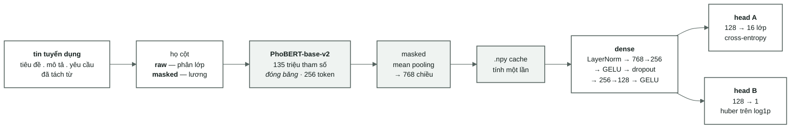

[← Tổng quan](00-tong-quan.md) · [← Phân tích dữ liệu](05-phan-tich-du-lieu.md) · [Bài toán lương →](07-bai-toan-luong.md)

# Baseline học sâu — PhoBERT đóng băng + dense

Hai bài toán, hai mạng riêng biệt. Phiên bản đa nhiệm (multi-task) sẽ đến sau,
khi mỗi head đã có con số của riêng mình — nếu mô hình gộp lại tệ hơn, cần biết
là tệ hơn so với cái gì.

---

## 1. Kiến trúc



Ở mức baseline, **head A và head B sống trong hai mạng khác nhau**, mỗi mạng có
khối dense riêng. Sơ đồ vẽ chúng cùng nhau để chỉ ra nơi thân mạng và các nhánh
sẽ tách ra trong lần hợp nhất đa nhiệm (multi-task) sau này — chỗ đó chính là
khối `dense`.

## 2. Năm quyết định, và lý do đo được cho mỗi quyết định

| Quyết định | Lý do |
|---|---|
| **Đóng băng PhoBERT trước** | Mức đóng băng chạy trong vài phút, mức tinh chỉnh (fine-tune) chạy trong vài giờ. Nếu phiên bản đóng băng không vượt được ngưỡng TF-IDF **0,6112**, lỗi nhiều khả năng nằm ở đường dữ liệu (data path) — phát hiện ở đây rẻ hơn nhiều |
| **Đầu vào đã tách từ** | PhoBERT được tiền huấn luyện trên văn bản đã tách từ ("nhân_viên kinh_doanh"). Đưa vào văn bản chưa tách từ nghĩa là đưa sai phân phối. Ngược lại hoàn toàn với kết luận của TF-IDF, nơi việc tách từ **gây hại nhẹ** ([02 §6](02-vietnamese-nlp.md#6-hai-bộ-tách-từ-khác-nhau-ở-đâu--và-vì-sao-câu-hỏi-mở-lại)) — cùng một bước, hai kết luận trái ngược, vì đó là hai mô hình khác nhau |
| **Mean pooling, không dùng vector `<s>`** | Khi không tinh chỉnh, vector `<s>` của PhoBERT chưa từng được huấn luyện cho bất kỳ tác vụ nào; lấy trung bình các token giữ lại nhiều tín hiệu từ vựng hơn |
| **Cache vector vào `.npy`** | Trọng số đóng băng ⇒ các vector không đổi giữa các epoch. Nhúng (embed) 33.396 tin tuyển dụng của tập `train` lược đồ v1 mất khoảng 20 phút trên CPU; một epoch trên các vector đã cache chỉ mất vài giây. Từ 2026-09-17, mỗi file `.npy` có một sidecar `.json` cùng tên ghi lớp tokenizer (`use_fast=False`), `max_len`, cột nguồn và số dòng — bằng chứng để so hai cache, không phải bắt buộc để đọc lại vector |
| **Dùng Huber cho hồi quy, không dùng MSE** | Lương lệch phải mạnh (skew **11,90**, tối đa 500 triệu trên file gốc — [05 §4](05-phan-tich-du-lieu.md#4-phân-phối-lương--đuôi-dài-và-đó-là-lý-do-dùng-log1p)). MSE để cho một nhúm giá trị ngoại lai kéo lệch toàn bộ gradient |

Hai họ cache được tách riêng — `raw` cho phân lớp, `masked` cho lương. Đó
không phải là chi tiết cài đặt: trộn hai file này là một **rò rỉ (leak) lương
âm thầm**, một mô hình đọc chính đáp án của mình.
[`dl/text.py`](../src/vietjobs/dl/text.py) đi qua
`features.resolve_column` giống hệt đường TF-IDF, và
[`tests/test_dl_text.py`](../tests/test_dl_text.py) canh giữ điều đó.

## 3. Các ngưỡng cần vượt qua

| Bài toán | Ngưỡng | Nguồn |
|---|---|---|
| Phân lớp — sàn tuyệt đối | macro-F1 **0,0210** (luôn dự đoán lớp lớn nhất) | [archive/04-results-ml.md](archive/04-results-ml.md) |
| Phân lớp — sàn có ý nghĩa | macro-F1 **0,4321** (luật từ khóa) | như trên |
| Phân lớp — **ngưỡng thật** | test macro-F1 **0,6112** · dev 0,6049 (TF-IDF + LinearSVC) | như trên |
| Lương — **ngưỡng thật** *(lược đồ v1)* | dev MAE **5,86 triệu** (dự đoán trung vị, 13,0, cho tất cả) | [05 §7](05-phan-tich-du-lieu.md#7-ngưỡng-sàn--các-con-số-quyết-định-khớp-trên-train-chấm-điểm-trên-dev) |
| Lương — trần "biết ngành" *(lược đồ v1)* | dev MAE **5,75 triệu** (khi biết nhãn ngành thật) | như trên |

Con số cuối cùng gây ấn tượng nhất: nhãn ngành **gần như không nói lên điều gì
về lương** (eta² = 0,032). Nếu head hồi quy chỉ đạt khoảng 5,8 triệu, nó chưa
học được gì từ văn bản cả — nó chỉ đang dự đoán trung vị bằng một đường vòng.

## 4. Cách chạy

```bash
# 1. nhúng (embed) một lần cho mỗi họ cột (~20 phút cho mỗi 33 nghìn tin trên CPU)
PYTHONPATH=src .venv-dl/bin/python -m vietjobs.dl.encode --task category --splits train dev
PYTHONPATH=src .venv-dl/bin/python -m vietjobs.dl.encode --task salary   --splits train dev

# 2. huấn luyện phần dense (vài giây mỗi epoch)
PYTHONPATH=src .venv-dl/bin/python -m vietjobs.dl.train_dl --task category --class-weight
PYTHONPATH=src .venv-dl/bin/python -m vietjobs.dl.train_dl --task salary
```

Môi trường được tách riêng — lý do và cách thiết lập nằm trong
[`requirements-dl.txt`](../requirements-dl.txt).

Mỗi lượt chạy ghi ra `artifacts/<run_id>/` chứa `config.json`, `env.json`,
`history.jsonl` (mỗi dòng một epoch), `metrics.json`, `best.pt`,
`predictions_dev.parquet`, và **một** dòng trong [04-results.md](04-results.md).
Chi tiết ở [03-protocol.md §3b](03-protocol.md#3b-học-sâu-ghi-thêm-những-gì).

## 5. Kết quả

Lược đồ chia tách đổi vào ngày 2026-09-09 (`train:test` = 8:2, sau đó
`train:dev` = 9:1 → 34.354 / 3.812 / 9.541). **Các con số đo trước ngày đó
không so sánh được với các con số đo sau đó**, nên mỗi bảng dưới đây ghi rõ nó
thuộc lược đồ nào. Lược đồ v2 tính điểm trên `dev` (3.812 tin cho phân lớp);
lược đồ v1 tính điểm trên tập khi đó gọi là `val` (7.159 tin cho phân lớp;
5.095 cho hồi quy). Mỗi dòng đều có `run_id` trong [04-results.md](04-results.md)
và một thư mục `artifacts/<run_id>/`.

### 5.1 Phân lớp nghề nghiệp

**Lược đồ chia tách v2 — tính điểm trên `dev`, 3.812 tin.** Đây là các con số
hiện tại.

| Run | Cấu hình | macro-F1 | acc | balAcc | top-3 | epoch tốt nhất |
|---|---|---|---|---|---|---|
| *sàn* | luôn dự đoán lớp đa số | *0,0214* | *0,2062* | — | — | — |
| `probe-cat-s2` | LogReg trên **cùng** bộ vector | 0,5898 | 0,6388 | 0,5969 | 0,9258 | — |
| **`dl-cat-s2`** | lr 3e-4 + clipping + chuẩn hóa | **0,6025** | 0,6511 | 0,6199 | **0,9318** | 16/24 |
| `dl-cat-s2-cw` | như trên + trọng số theo lớp (class weighting) | 0,5710 | 0,5976 | **0,6931** | 0,9208 | 15/23 |
| *ngưỡng TF-IDF + LinearSVC* | `cat-SW-svm-1` — **lược đồ v1**, chưa đo lại | *0,6050 ± 0,0071* | *0,6445* | *0,6713* | — | — |

`f1_macro_no_junk` — macro-F1 khi loại `nhóm_nghề_khác` — là **0,6454** đối với
`dl-cat-s2` và 0,5958 đối với `dl-cat-s2-cw`. Riêng lớp 48 mẫu đó làm con số
đầu bảng mất 0,043; xử lý nó thế nào là một quyết định riêng (T2.2).

Head dense chỉ đạt hơn **0,0127** macro-F1 so với probe tuyến tính trên cùng
bộ vector (0,6025 so với 0,5898) — khớp với chênh lệch 0,0120 ở v1. Phần lớn
tín hiệu mà một mô hình tuyến tính trích được, head phi tuyến cũng trích được;
dung lượng thêm vào chỉ mua được một biên độ nhỏ, ổn định, chứ không phải một
chế độ khác.

**Lược đồ chia tách v1 — tính điểm trên `val`, 7.159 tin. Dữ liệu lịch sử,
không so sánh được với bảng trên.**

| Run | Cấu hình | macro-F1 | acc | balAcc | top-3 | epoch tốt nhất |
|---|---|---|---|---|---|---|
| `dl-cat-h256` | lr 1e-3 · không chuẩn hóa · không clip gradient | **0,0420** | 0,2127 | 0,0752 | 0,4577 | 3/11 — **phân kỳ** |
| `dl-cat-h256-cw` | như trên + trọng số theo lớp | 0,0747 | 0,1904 | 0,1117 | 0,3519 | 3/11 — **phân kỳ** |
| `probe-cat` | LogReg trên **cùng** bộ vector | 0,5867 | 0,6423 | 0,5782 | 0,9225 | — |
| `dl-cat-v2-nostd` | lr 3e-4 + clipping · không chuẩn hóa | 0,5934 | 0,6466 | 0,5917 | 0,9250 | 31/39 |
| **`dl-cat-v2`** | lr 3e-4 + clipping + chuẩn hóa | **0,5987** | 0,6493 | 0,6048 | **0,9257** | 14/22 |
| `dl-cat-v2-cw` | như trên + trọng số theo lớp | 0,5637 | 0,5913 | **0,6687** | 0,9012 | 6/14 |
| *ngưỡng TF-IDF + LinearSVC* | `cat-SW-svm-1` | *0,6050 ± 0,0071* | *0,6445* | *0,6713* | — | — |

**Ở lược đồ v2, `dl-cat-s2` thấp hơn ngưỡng TF-IDF + LinearSVC của lược đồ v1
đúng 0,0025** — nhỏ hơn cả khoảng tin cậy ±0,0071 của chính ngưỡng đó, và
ngưỡng đó chưa từng được đo lại trên lược đồ này, nên so sánh này chỉ mang
tính định hướng, không phải một phép kiểm định phân biệt. Đo lại ngưỡng đó
trên `dev` nằm ngoài phạm vi công việc này.

Độ chính xác top-3 ở v2 là **0,9318**, khớp với con số 0,9257 ở v1 — mô hình
vẫn đưa được lớp đúng vào top ba đáng tin cậy hơn nhiều so với việc đoán đúng
chính xác top-1.

`--class-weight` một lần nữa là một **sự đánh đổi, không phải một cải thiện**
ở v2: macro-F1 giảm 0,0315 (0,6025 → 0,5710) trong khi độ chính xác cân bằng
tăng 0,0733 (0,6199 → 0,6931). Nó kéo mô hình về phía các lớp nhỏ, đúng như
thiết kế. Chọn cái nào tùy vào ứng dụng thực tế; mặc định là tắt.

### 5.2 Ước lượng lương

**Lược đồ chia tách v2 — tính điểm trên `dev`, 2.698 tin có công khai mức
lương.** Đây là các con số hiện tại.

| Run | Phương pháp | MAE (triệu) | MedAE | R²(log) | trong ±20 % |
|---|---|---|---|---|---|
| *ngưỡng* | dự đoán trung vị, 13,0, cho tất cả | *5,70* | — | *−0,059* | — |
| *trần "biết ngành"* | trung vị theo ngành, dùng nhãn thật | *5,57* | — | *−0,022* | — |
| `probe-sal-s2` | Ridge trên vector PhoBERT | 4,42 | 2,77 | 0,466 | 48,0 % |
| **`dl-sal-s2`** | dense(256), lr 3e-4, đã chuẩn hóa | **4,15** | **2,50** | **0,512** | **51,6 %** |

Head hồi quy **vượt ngưỡng 1,55 triệu (−27,2 %)**: R² trên thang log đi từ âm
lên **0,512**, nghĩa là mô hình đọc được tín hiệu lương từ văn bản mà riêng
nhãn ngành không cung cấp được ([05 §6](05-phan-tich-du-lieu.md)). Đây là biên
độ rõ ràng hơn so với kết quả lược đồ v1 bên dưới (−17,6 %) — tập v2 nhỏ hơn,
tách rời theo nhóm, vẫn cho cùng kiến trúc này tổng quát hóa tốt hơn ở đây.

**Kết quả probe tuyến tính đảo ngược phát hiện ở v1.** Ở v1, Ridge trên cùng
bộ vector (`probe-sal`) đạt điểm **tệ hơn cả dự đoán trung vị** (MAE 6,60) —
kết luận khi đó là tín hiệu lương tồn tại trong các vector nhưng chỉ ở dạng
phi tuyến. Ở v2, `probe-sal-s2` đạt R² **0,466**, đã đi được phần lớn quãng
đường tới 0,512 của head dense, và rõ ràng tốt hơn ngưỡng. Có hai cách giải
thích khả dĩ, chưa cái nào được xác nhận: tập dev v2 (2.698 dòng có công khai
lương, tách rời theo nhóm) có thể đơn giản là một lát cắt dễ hơn hoặc ít nhiễu
hơn so với `val` cũ; hoặc kết luận "không tuyến tính" trước đây tự nó là một
hiện tượng giả (artefact) của lược đồ v1. Làm lại phân tích lỗi kiểu §5.3 trên
v2 (T1.7/T2.x) sẽ giải quyết được câu hỏi này.

**Lược đồ chia tách v1 — tính điểm trên `val`, 5.095 tin. Dữ liệu lịch sử,
không so sánh được với bảng trên.**

| Run | Phương pháp | MAE (triệu) | MedAE | R²(log) | trong ±20 % |
|---|---|---|---|---|---|
| *ngưỡng* | dự đoán trung vị, 13,0, cho tất cả | *5,86* | — | *−0,063* | — |
| *trần "biết ngành"* | trung vị theo ngành, dùng nhãn thật | *5,75* | — | *−0,032* | — |
| `probe-sal` | Ridge trên vector PhoBERT | 6,60 | 3,26 | −0,004 | 42,1 % |
| `dl-sal-v2` | dense(256), 40 epoch | 4,83 | 2,86 | 0,381 | 47,1 % |
| `dl-sal-v3-long` | cùng cấu hình, patience 15 | 4,88 | 2,86 | 0,357 | 45,9 % |

Hai lượt chạy v1 cùng cấu hình cho ra 4,83 và 4,88: **biến thiên giữa các lượt
chạy vào khoảng 0,05 triệu**, nên đừng đọc một chênh lệch nhỏ hơn thế như một
cải thiện.

Đáng chú ý từ v1: Ridge trên cùng bộ vector cho ra **6,60** — *tệ hơn cả dự
đoán trung vị*. Cùng đặc trưng, cùng nhãn; khác biệt là khối dense chuẩn hóa
đầu vào và học một hàm phi tuyến. Tín hiệu nằm trong các vector, nhưng không ở
dạng tuyến tính. Điều này chưa được kiểm tra lại trên v2 (T1.5).

### 5.3 Nó sai ở đâu

Phân lớp (`dl-cat-v2`, đọc từ `predictions_dev.parquet`):

| Lớp | F1 | n |
|---|---|---|
| `nhóm_nghề_khác` | **0,000** | 48 |
| `kỹ_thuật_điện_điện_tử_viễn_thông` | 0,411 | 207 |
| `thiết_kế_nghệ_thuật_giải_trí…` | 0,441 | 470 |
| `tài_chính_kế_toán_ngân_hàng_bảo_hiểm` | **0,851** | 713 |

Lớp gộp chung (catch-all) `nhóm_nghề_khác` bị bỏ rơi hoàn toàn — đúng như
[05 §2](05-phan-tich-du-lieu.md) đã dự đoán: 48 mẫu, nội dung lẫn lộn. Ba cặp
bị nhầm lẫn nhiều nhất đều là **ranh giới nhãn thật sự mờ nhòe**, không phải
lỗi mô hình:

| Nhầm lẫn | Số tin |
|---|---|
| `kinh_doanh…` → `du_lịch_nhà_hàng…` | 202 |
| `du_lịch_nhà_hàng…` → `kinh_doanh…` | 180 |
| `thiết_kế_nghệ_thuật…` → `xây_dựng_kiến_trúc…` | 133 |

Hồi quy (`dl-sal-v2`): MAE **3,70 triệu** trên các tin ≤ 30 triệu (4.833 tin)
nhưng **25,58 triệu** trên các tin > 30 triệu (262 tin). Mô hình dự đoán tối
đa **80,7** trong khi dữ liệu có một tin ở mức 275 triệu — nó **không dám đi
vào đuôi phải**, một hệ quả trực tiếp của việc huấn luyện trên `log1p` với hàm
mất mát huber. Ngành khó nhất là `nhóm_nghề_khác` (MAE 11,03), dễ nhất là
`nông_nghiệp_năng_lượng_môi_trường` (2,67).

### 5.4 Thất bại đầu tiên, giữ lại làm bằng chứng

Hai lượt chạy đầu tiên (`dl-cat-h256`, `dl-cat-h256-cw`) cho ra macro-F1
**0,042** — thấp hơn cả việc thay vector PhoBERT bằng số ngẫu nhiên.
`history.jsonl` cho biết lý do chỉ trong bốn dòng:

```
epoch 1  loss 2.63    val_macro_f1 0.028
epoch 2  loss 2.57    val_macro_f1 0.033
epoch 3  loss 2.65    val_macro_f1 0.042
epoch 4  loss 321.6   val_macro_f1 0.011   ← blew up
epoch 5  loss 1941.8  val_macro_f1 0.019
```

Vòng lặp huấn luyện phân kỳ tại epoch 4. Hai nguyên nhân, cả hai đều đo được:

1. **Các vector PhoBERT có tính dị hướng (anisotropic).** Cosin giữa hai tin
   tuyển dụng bất kỳ có trung vị **0,896** (p05 0,838 · p95 0,943) — mọi tin
   đều nằm trong một hình nón hẹp. `LayerNorm` chuẩn hóa *theo từng mẫu*, nên
   nó không thể loại bỏ hướng chung đó.
2. **lr 1e-3 quá lớn** cho loại đầu vào này, khi không có clip gradient.

Cách sửa: chuẩn hóa theo từng chiều bằng thống kê của `train` (lưu thành
`scaler.npz` cùng với lượt chạy, vì đường suy luận phải dùng chính xác các con
số đó), clip chuẩn gradient (gradient norm) ở 1,0, hạ lr xuống 3e-4. Kết quả:
**0,042 → 0,5987**.

Bài học đáng giá hơn cả con số: `probe-cat` (LogReg trên cùng bộ vector,
macro-F1 **0,5867**) chính là thứ phân biệt "đặc trưng kém" với "head mô hình
bị hỏng". Một mô hình tuyến tính có nghiệm lồi và không có tốc độ học nào để
sai — nếu nó đạt 0,59, vấn đề chắc chắn không nằm ở đặc trưng. Chạy lại bằng
`python scripts/probe_embeddings.py --task category`.

> **Về cột thời gian trong [04-results.md](04-results.md):** các lượt chạy
> này chồng lấn nhau trên cùng một máy 6 lõi, nên số giây **không so sánh
> được giữa các dòng**. Một epoch trên các vector đã cache tốn khoảng 10–15
> giây trên máy rảnh.


---

[← Phân tích dữ liệu](05-phan-tich-du-lieu.md) · [Lộ trình →](09-lo-trinh.md)
