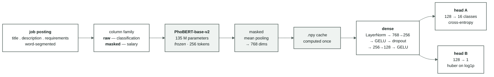

[← Overview](00-tong-quan.md) · [← Data analysis](05-phan-tich-du-lieu.md) · [The salary task →](07-bai-toan-luong.md)

# Deep-learning baseline — frozen PhoBERT + dense

Two tasks, two separate networks. The multi-task version comes later, once each
head has a number of its own — if the merged model is worse, we need to know worse
than what.

---

## 1. Architecture



At the baseline level, **head A and head B live in two different networks**, each
with its own dense block. The diagram draws them together to show where the trunk
and the branches will split in the multi-task merge — that place is the `dense`
block.

## 2. Five decisions, and the measurable reason for each

| Decision | Why |
|---|---|
| **Freeze PhoBERT first** | The frozen level runs in minutes, the fine-tuned level in hours. If the frozen version cannot beat the TF-IDF bar of **0.6112**, the fault most likely lies in the data path — far cheaper to discover here |
| **Word-segmented input** | PhoBERT was pre-trained on segmented text ("nhân_viên kinh_doanh"). Feeding unsegmented text means feeding the wrong distribution. The opposite of the TF-IDF verdict, where segmentation was **mildly harmful** ([02 §6](02-vietnamese-nlp.md#6-where-the-two-segmenters-differ--and-why-the-question-reopens)) — one step, two opposite verdicts, because they are two different models |
| **Mean pooling, not the `<s>` vector** | Without fine-tuning, PhoBERT's `<s>` vector was never trained for any task; averaging the tokens retains more lexical signal |
| **Cache the vectors to `.npy`** | Frozen weights ⇒ the vectors do not change between epochs. Embedding the 33,396 postings of the v1 `train` split took ~20 minutes on CPU; an epoch over cached vectors takes seconds |
| **Huber for the regression, not MSE** | Salary is heavily right-skewed (skew **11.90**, max 500 million on the original file — [05 §4](05-phan-tich-du-lieu.md#4-salary-distribution--a-long-tail-and-that-is-why-log1p)). MSE lets a handful of outliers drag the whole gradient |

The two cache families are kept apart — `raw` for classification, `masked` for
salary. That is not an implementation detail: mixing the two files is a **silent
salary leak**, a model reading its own answer key.
[`dl/text.py`](../src/vietjobs/dl/text.py) goes through
`features.resolve_column` exactly like the TF-IDF path, and
[`tests/test_dl_text.py`](../tests/test_dl_text.py) guards it.

## 3. The bars to beat

| Task | Bar | Source |
|---|---|---|
| Classification — absolute floor | macro-F1 **0.0210** (always predict the largest class) | [archive/04-results-ml.md](archive/04-results-ml.md) |
| Classification — meaningful floor | macro-F1 **0.4321** (keyword rules) | as above |
| Classification — **the real bar** | test macro-F1 **0.6112** · dev 0.6049 (TF-IDF + LinearSVC) | as above |
| Salary — **the real bar** *(lược đồ v1)* | dev MAE **5.86 million** (predict the median, 13.0, for everything) | [05 §7](05-phan-tich-du-lieu.md#7-the-floors--decision-numbers-fitted-on-train-scored-on-dev) |
| Salary — the "knows the sector" ceiling *(lược đồ v1)* | dev MAE **5.75 million** (given the true sector label) | as above |

The last number is the most striking: the sector label **says almost nothing about
salary** (eta² = 0.032). If the regression head only reaches around 5.8 million, it
has learned nothing from the text — it is just predicting the median by a detour.

## 4. Running it

```bash
# 1. embed once per column family (~20 minutes per 33k postings on CPU)
PYTHONPATH=src .venv-dl/bin/python -m vietjobs.dl.encode --task category --splits train dev
PYTHONPATH=src .venv-dl/bin/python -m vietjobs.dl.encode --task salary   --splits train dev

# 2. train the dense part (seconds per epoch)
PYTHONPATH=src .venv-dl/bin/python -m vietjobs.dl.train_dl --task category --class-weight
PYTHONPATH=src .venv-dl/bin/python -m vietjobs.dl.train_dl --task salary
```

The environment is kept separate — the reasoning and the setup are in
[`requirements-dl.txt`](../requirements-dl.txt).

Each run writes `artifacts/<run_id>/` containing `config.json`, `env.json`,
`history.jsonl` (one line per epoch), `metrics.json`, `best.pt`,
`predictions_dev.parquet`, and **one** row in [04-results.md](04-results.md).
Details in [03-protocol.md §3b](03-protocol.md#3b-what-deep-learning-logs-on-top).

## 5. Results

Everything is scored on `val` (7,159 postings for classification; the 5,095
postings with a disclosed salary for the regression). Every row has a `run_id` in
[04-results.md](04-results.md) and a directory `artifacts/<run_id>/`.

### 5.1 Occupation classification

| Run | Configuration | macro-F1 | acc | balAcc | top-3 | best epoch |
|---|---|---|---|---|---|---|
| `dl-cat-h256` | lr 1e-3 · no standardisation · no gradient clipping | **0.0420** | 0.2127 | 0.0752 | 0.4577 | 3/11 — **diverged** |
| `dl-cat-h256-cw` | as above + class weighting | 0.0747 | 0.1904 | 0.1117 | 0.3519 | 3/11 — **diverged** |
| `probe-cat` | LogReg on the **same** vectors | 0.5867 | 0.6423 | 0.5782 | 0.9225 | — |
| `dl-cat-v2-nostd` | lr 3e-4 + clipping · no standardisation | 0.5934 | 0.6466 | 0.5917 | 0.9250 | 31/39 |
| **`dl-cat-v2`** | lr 3e-4 + clipping + standardisation | **0.5987** | 0.6493 | 0.6048 | **0.9257** | 14/22 |
| `dl-cat-v2-cw` | as above + class weighting | 0.5637 | 0.5913 | **0.6687** | 0.9012 | 6/14 |
| *TF-IDF + LinearSVC bar* | `cat-SW-svm-1` | *0.6050 ± 0.0071* | *0.6445* | *0.6713* | — | — |

**The gap to the old bar is 0.0063 — less than half that bar's own ±0.0071
confidence interval.** The two models are not yet distinguishable. But at top-3
PhoBERT is clearly ahead: **0.9257** against 0.8631 for TF-IDF + LogReg (LinearSVC
gives no probabilities, hence no top-3). For a product that suggests three
occupations, that is a meaningful difference.

`--class-weight` is a **trade, not an improvement**: macro-F1 drops 0.035 while
balanced accuracy rises 0.064. It pulls the model toward the small classes, exactly
as designed. Which one to pick depends on the real application; the default is off.

### 5.2 Salary estimation

| Run | Method | MAE (million) | MedAE | R²(log) | within ±20 % |
|---|---|---|---|---|---|
| *bar* | predict the median, 13.0, for everything | *5.86* | — | *−0.063* | — |
| *"knows the sector" ceiling* | the sector median, using the true label | *5.75* | — | *−0.032* | — |
| `probe-sal` | Ridge on the PhoBERT vectors | 6.60 | 3.26 | −0.004 | 42.1 % |
| **`dl-sal-v2`** | dense(256), 40 epochs | **4.83** | **2.86** | **0.381** | **47.1 %** |
| `dl-sal-v3-long` | same configuration, patience 15 | 4.88 | 2.86 | 0.357 | 45.9 % |

The regression head **beats the bar by 1.03 million (−17.6 %)** and is the clearest
result of the whole round: R² on the log scale goes from negative to **0.381**,
meaning the model genuinely reads salary signal out of the text — which the sector
label does not provide ([05 §6](05-phan-tich-du-lieu.md)).

Two runs of the same configuration give 4.83 and 4.88: **run-to-run variation is
around 0.05 million**, so do not read a smaller difference as an improvement.

Worth noting: Ridge on the same vectors gives **6.60** — *worse than predicting the
median*. Same features, same labels; the difference is that the dense block
standardises its input and learns a non-linearity. The signal is in the vectors,
but not in a linear form.

### 5.3 Where it is wrong

Classification (`dl-cat-v2`, read from `predictions_dev.parquet`):

| Class | F1 | n |
|---|---|---|
| `nhóm_nghề_khác` | **0.000** | 48 |
| `kỹ_thuật_điện_điện_tử_viễn_thông` | 0.411 | 207 |
| `thiết_kế_nghệ_thuật_giải_trí…` | 0.441 | 470 |
| `tài_chính_kế_toán_ngân_hàng_bảo_hiểm` | **0.851** | 713 |

The catch-all class `nhóm_nghề_khác` is abandoned entirely — exactly as
[05 §2](05-phan-tich-du-lieu.md) predicted: 48 samples, mixed content. The three
most-confused pairs are all **genuinely blurred label boundaries**, not model
errors:

| Confusion | Postings |
|---|---|
| `kinh_doanh…` → `du_lịch_nhà_hàng…` | 202 |
| `du_lịch_nhà_hàng…` → `kinh_doanh…` | 180 |
| `thiết_kế_nghệ_thuật…` → `xây_dựng_kiến_trúc…` | 133 |

Regression (`dl-sal-v2`): MAE **3.70 million** on postings ≤ 30 million (4,833
postings) but **25.58 million** on postings > 30 million (262 postings). The model
predicts at most **80.7** while the data contains a posting at 275 million — it
**dares not go out into the right tail**, a direct consequence of training on
`log1p` with a huber loss. The hardest sector is `nhóm_nghề_khác` (MAE 11.03), the
easiest `nông_nghiệp_năng_lượng_môi_trường` (2.67).

### 5.4 The first failure, kept as evidence

The first two runs (`dl-cat-h256`, `dl-cat-h256-cw`) gave macro-F1 **0.042** —
lower than replacing the PhoBERT vectors with random numbers. `history.jsonl` gives
the reason in four lines:

```
epoch 1  loss 2.63    val_macro_f1 0.028
epoch 2  loss 2.57    val_macro_f1 0.033
epoch 3  loss 2.65    val_macro_f1 0.042
epoch 4  loss 321.6   val_macro_f1 0.011   ← blew up
epoch 5  loss 1941.8  val_macro_f1 0.019
```

The training loop diverged at epoch 4. Two causes, both measurable:

1. **PhoBERT vectors are anisotropic.** The cosine between any two postings has
   median **0.896** (p05 0.838 · p95 0.943) — every posting sits inside a narrow
   cone. `LayerNorm` normalises *per sample*, so it cannot remove that shared
   direction.
2. **lr 1e-3 is too large** for such an input, with no gradient clipping.

The fix: standardise per dimension with `train` statistics (saved as `scaler.npz`
alongside the run, because the inference path must use exactly those numbers), clip
the gradient norm at 1.0, drop lr to 3e-4. Result: **0.042 → 0.5987**.

The lesson worth more than the number: `probe-cat` (LogReg on the same vectors,
macro-F1 **0.5867**) is what separates "poor features" from "a broken model head".
A linear model has a convex solution and no learning rate to get wrong — if it
reaches 0.59, the problem is certainly not in the features. Re-run it with
`python scripts/probe_embeddings.py --task category`.

> **About the time column in [04-results.md](04-results.md):** these runs overlapped
> on the same 6-core machine, so the seconds **are not comparable across rows**. An
> epoch over cached vectors costs roughly 10–15 seconds on an idle machine.


---

[← Data analysis](05-phan-tich-du-lieu.md) · [Roadmap →](09-lo-trinh.md)
