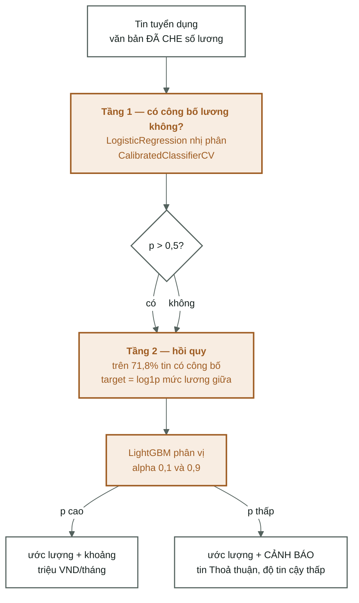

[← Tổng quan](00-tong-quan.md) · [← Mô hình phân lớp](06-mo-hinh-phan-lop.md) · [Mã nguồn →](08-ma-nguon.md)

# Bài toán 2 — ước lượng lương (chưa chạy)

Code đã đủ, chưa huấn luyện. Chưa có dòng nào trong [04-results.md](04-results.md)
cho `salary` hoặc `disclosed` — mọi con số dưới đây là **đo trước** hoặc **sàn
phải vượt**, không phải kết quả.

Việc phải làm, theo thứ tự: [09-lo-trinh.md — Ưu tiên 1](09-lo-trinh.md#ưu-tiên-1--chạy-bài-toán-lương).

---

Chia 2 tầng vì **28,2% tin ghi "Thoả thuận"** thay vì con số. Vứt bỏ 28% dữ liệu là
lãng phí, nên tầng 1 học xem tin có công bố lương không, tầng 2 ước lượng mức.

---

## Vì sao bài này khó hơn bài phân lớp

Ba lý do, không lý do nào sửa được bằng mô hình tốt hơn:

**1. Đầu vào bị cố ý làm nghèo đi.** Phân lớp nghề đọc bản thô, bài lương chỉ
được đọc bản **đã che số lương**. Đó là bắt buộc — `salary_*` chính là nhãn, và
**10,65 %** dòng nhắc lại con số lương trong ô phúc lợi
([02-vietnamese-nlp.md](02-vietnamese-nlp.md#3-chín-bước--làm-gì-vì-sao-đo-được-gì) bước 4).
Không che thì mô hình đọc chính đáp án của mình.

**2. Nhãn chỉ có ở một phần dữ liệu, và phần đó không ngẫu nhiên.** Xem mục
thiên lệch chọn mẫu bên dưới.

**3. Đích là số thực có đuôi dài**, không phải nhãn rời rạc. Đó là lý do đích
hồi quy là `log1p(salary_mid)` chứ không phải `salary_mid`
([01-data-audit.md §5](01-data-audit.md#5-nhãn--dựng-và-sửa)).

---

## Bẫy đã biết trước

`LinearRegression` thuần **sẽ hỏng**. Đã đo trên tiêu đề, p/n = 0,22 — điều kiện
thuận lợi nhất cho bình phương tối thiểu:

| Mô hình | R² train | R² val | MAE val |
|---|---|---|---|
| LinearRegression thuần | 0,718 | **0,081** | **6,00 tr** |
| Ridge alpha=1 | 0,657 | **0,507** | **4,25 tr** |

MAE 6,00 triệu còn tệ hơn baseline "trung vị theo nhóm nghề" (5,54 tr) — tức tệ hơn
không dùng mô hình nào. Kế hoạch: chạy LinearRegression ở 4 cấu hình và **báo cáo cả
thất bại**, vì đó là mục có giá trị nhất trong báo cáo.

Đọc hai dòng này cho kỹ: R² train tụt (0,718 → 0,657) mà R² val **tăng gấp sáu lần**
(0,081 → 0,507). Đó là định nghĩa của quá khớp, và là toàn bộ lý do chính quy hoá
tồn tại — [nền tảng: chính quy hoá](nen-tang/07-chinh-quy-hoa.md).

---

## Thiên lệch chọn mẫu — hạn chế không sửa được

Tỷ lệ công bố lương khác nhau rõ rệt theo ngành:

| Ngành | Tỷ lệ công bố |
|---|---|
| công_nghệ_thông_tin | 0,615 — thấp nhất |
| nhóm_nghề_khác | 0,568 |
| du_lịch_nhà_hàng · giáo_dục | 0,764 — cao nhất |

Mô hình lương chỉ học trên tin **có** công bố. CNTT vừa công bố ít nhất vừa trả cao,
nên mô hình sẽ **ước lượng thấp cho CNTT**. Đây là hạn chế cấu trúc, không sửa được
bằng mô hình tốt hơn — phải ghi vào báo cáo.

---

## Đọc tiếp

- [09-lo-trinh.md — Ưu tiên 1](09-lo-trinh.md#ưu-tiên-1--chạy-bài-toán-lương) — bốn bước phải chạy, đúng thứ tự
- [Đặc trưng & TF-IDF](05-dac-trung-tfidf.md) — vì sao bài này đọc cột `*_masked`
- [Làm sạch dữ liệu](01-data-audit.md#5-nhãn--dựng-và-sửa) — nhãn lương được dựng thế nào
- Nền tảng: [chính quy hoá](nen-tang/07-chinh-quy-hoa.md) · [rò rỉ dữ liệu](nen-tang/05-ro-ri-du-lieu.md)
