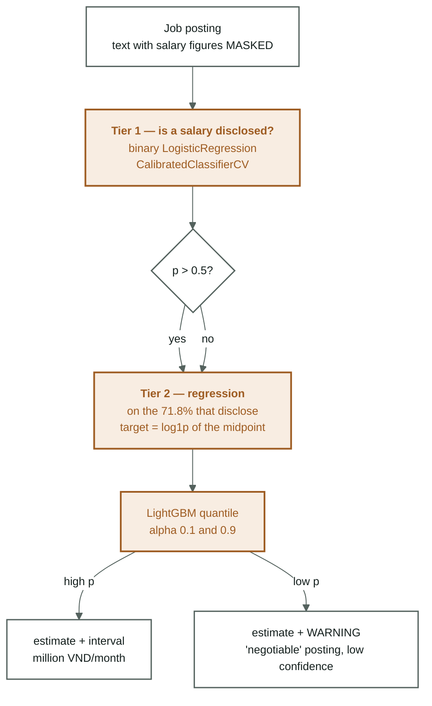

[← Overview](00-tong-quan.md) · [← Classification models](archive/06-mo-hinh-phan-lop.md) · [Source code →](08-ma-nguon.md)

# Task 2 — salary estimation (the two-tier plan, never run)

> **Update 2026-09-08.** The two-tier LightGBM architecture described below is
> **no longer the main track**; it was never run. The salary head is now a dense
> network on PhoBERT vectors ([06-baseline-dl.md](06-baseline-dl.md)). What stays
> valuable in this note are **the traps of the task itself** — they are independent
> of the model. Two numbers to remember, measured in
> [05](05-phan-tich-du-lieu.md): only **71.8 %** of postings carry a salary label,
> and knowing the true sector only moves MAE from **5.86** to **5.75** million.

The code is in place, nothing was trained. There is no row in
[04-results.md](archive/04-results-ml.md) for `salary` or `disclosed` — every
number below is a **prior measurement** or a **floor to beat**, not a result.

The work items, in order:
[09-lo-trinh.md — Priority 1](archive/09-lo-trinh-ml.md#ưu-tiên-1--chạy-bài-toán-lương).

---

Two tiers because **28.2 % of postings say "Thoả thuận" ("negotiable")** instead
of a figure. Throwing away 28 % of the data is wasteful, so tier 1 learns whether
a posting discloses a salary and tier 2 estimates the amount.

---

## Why this task is harder than classification

Three reasons, and none of them is fixable with a better model:

**1. The input is deliberately impoverished.** Occupation classification reads the
raw text; the salary task may only read the **salary-masked** copy. That is
mandatory — `salary_*` is the label, and **10.65 %** of rows restate the salary
figure in the benefits field
([02-vietnamese-nlp.md](02-vietnamese-nlp.md#3-the-nine-steps--what-why-and-what-is-measurable),
step 4). Without masking, the model reads its own answer key.

**2. The label exists on only part of the data, and that part is not random.** See
the selection-bias section below.

**3. The target is a real number with a long tail**, not a discrete label. That is
why the regression target is `log1p(salary_mid)` and not `salary_mid`
([01-data-audit.md §5](01-data-audit.md#5-labels--building-and-repairing)).

---

## Traps known in advance

Plain `LinearRegression` **will break**. Measured on titles, with p/n = 0.22 — the
most favourable possible condition for least squares:

| Model | R² train | R² dev | MAE dev |
|---|---|---|---|
| Plain LinearRegression | 0.718 | **0.081** | **6.00 M** |
| Ridge alpha=1 | 0.657 | **0.507** | **4.25 M** |

An MAE of 6.00 million is worse than the "median per occupation group" baseline
(5.54 M) — i.e. worse than using no model at all. The plan: run LinearRegression in
4 configurations and **report the failure too**, because that is the most valuable
entry in the report.

Read those two rows closely: R² on train drops (0.718 → 0.657) while R² on dev
**rises sixfold** (0.081 → 0.507). That is the definition of overfitting, and the
entire reason regularisation exists —
[background: regularisation](nen-tang/07-chinh-quy-hoa.md).

---

## Selection bias — an unfixable limitation

The salary disclosure rate differs markedly by sector:

| Sector | Disclosure rate |
|---|---|
| công_nghệ_thông_tin (IT) | 0.615 — the lowest |
| nhóm_nghề_khác (other) | 0.568 |
| du_lịch_nhà_hàng · giáo_dục (tourism, education) | 0.764 — the highest |

The salary model learns only on postings that **do** disclose. IT both discloses
least often and pays most, so the model will **underestimate IT**. This is a
structural limitation, not something a better model fixes — it has to go into the
report.

---

## Read next

- [Roadmap](09-lo-trinh.md) — what the salary head still lacks, ordered by value
- [Vietnamese processing §4](02-vietnamese-nlp.md#4-which-steps-the-phobert-path-actually-runs) — why this task reads the `*_masked` columns
- [Data cleaning](01-data-audit.md#5-labels--building-and-repairing) — how the salary labels are built
- Background: [regularisation](nen-tang/07-chinh-quy-hoa.md) · [data leakage](nen-tang/05-ro-ri-du-lieu.md)
