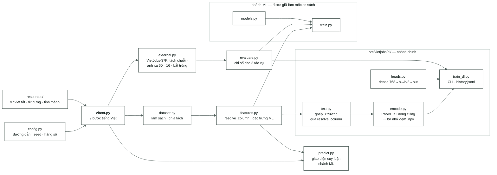

[← Tổng quan](00-tong-quan.md) · [← Đường cơ sở học sâu](06-baseline-dl.md) · [Lộ trình →](09-lo-trinh.md)

# Mã nguồn

13 mô-đun trong `src/vietjobs/` (không tính `__init__.py`) · 3.474 dòng · 123 kiểm thử xanh. Nhánh chính là gói
[`dl/`](../src/vietjobs/dl/); phần học máy được giữ lại làm mốc so sánh.

---




| Tệp | Số dòng | Vai trò | Tài liệu |
|---|---|---|---|
| [`vitext.py`](../src/vietjobs/vitext.py) | 584 | Toàn bộ xử lý tiếng Việt. Các hàm thuần túy (pure functions), mỗi bước được kiểm thử riêng | [02](02-vietnamese-nlp.md) |
| [`dataset.py`](../src/vietjobs/dataset.py) | 381 | Làm sạch + tập chia cố định (frozen split). Việc tách từ chỉ chạy **một lần** và được lưu vào bộ nhớ đệm trong CSV. `load_split` là hàm đọc duy nhất được hỗ trợ | [01](01-data-audit.md) |
| [`features.py`](../src/vietjobs/features.py) | 279 | `resolve_column` — cánh cửa duy nhất quyết định tác vụ nào đọc cột nào. Cả nhánh DL lẫn nhánh ML cũ đều đi qua đây | [05](05-phan-tich-du-lieu.md) |
| [`evaluate.py`](../src/vietjobs/evaluate.py) | 267 | Chỉ số cho cả ba tác vụ + bootstrap và so sánh theo cặp (paired comparison). Dùng chung cho ML và DL nên các con số có thể so sánh được | [03](03-protocol.md) |
| [`config.py`](../src/vietjobs/config.py) | 85 | Đường dẫn · `SPLIT_SEED` · nhóm cột · tên tác vụ | — |
| **[`dl/text.py`](../src/vietjobs/dl/text.py)** | 40 | Ghép ba trường văn bản thành đầu vào cho PhoBERT. Không phụ thuộc torch nên kiểm thử của nó chạy được trên mọi máy | [06](06-baseline-dl.md) |
| **[`dl/encode.py`](../src/vietjobs/dl/encode.py)** | 153 | PhoBERT đông cứng → vector 768 chiều, lưu vào `.npy` tách theo họ cột `raw`/`masked`, cùng một sidecar `.json` ghi lớp tokenizer/`max_len`/cột nguồn | [06](06-baseline-dl.md) |
| **[`dl/heads.py`](../src/vietjobs/dl/heads.py)** | 37 | Phần dense: 768 → h → h/2 → out. Mỗi bài toán có một mạng riêng | [06](06-baseline-dl.md) |
| **[`dl/train_dl.py`](../src/vietjobs/dl/train_dl.py)** | 275 | Một lượt chạy = một dòng trong [04-results.md](04-results.md) + `history.jsonl` theo từng epoch | [03](03-protocol.md) · [06](06-baseline-dl.md) |
| [`external.py`](../src/vietjobs/external.py) | 549 | VietJobs-37K làm tập ngoài: tách `[TITLE]/[REQ]/[DESC]` về ba cột của ta, ánh xạ 60 → 16 (`apply_crosswalk`), bắt tin trùng với ba tập chia bằng băm chính xác **hoặc** cùng tiêu đề + Jaccard ≥ 0,5 (`overlap_mask`), quy ước lenient. Đọc lương bạc từ văn bản: `extract_salary` (mỏ neo từ lương hoặc tiêu đề mục → con số cùng câu), `audit_salary` xếp mọi tin vào một nhóm phủ, `salary_note`, `salary_rule`, `template_ids`. Không phụ thuộc torch | [10](10-danh-gia-ngoai.md) |
| [`scripts/eval_external.py`](../scripts/eval_external.py) | 199 | Chấm một run `category` trên VietJobs-37K: khử trùng → ánh xạ → mã hóa PhoBERT (cache `ext37k-*`) → nạp `best.pt` + `scaler.npz` → strict/lenient + bootstrap → một dòng [04-results.md](04-results.md) mỗi tập | [10](10-danh-gia-ngoai.md) |
| [`scripts/build_ext37k.py`](../scripts/build_ext37k.py) | 127 | Gộp bốn tập con 37K + cột lương bạc → `ext37k.csv`, `ext37k-sal.csv`. `--audit` in bảng nhóm phủ kín (không ghi tệp), `--review N` sinh `review-salary.csv` để người soát | [10](10-danh-gia-ngoai.md) §3 |
| [`scripts/analyze_data.py`](../scripts/analyze_data.py) | 415 | Các phép đo + 11 hình cho [05](05-phan-tich-du-lieu.md). Số mô tả đo trên tệp gốc 47.707 dòng; mốc sàn khớp trên `train`, chấm trên `dev` (Rule 8) | [05](05-phan-tich-du-lieu.md) |
| [`scripts/probe_embeddings.py`](../scripts/probe_embeddings.py) | 83 | Một đầu dò tuyến tính (linear probe) trên các vector PhoBERT — tách biệt "đặc trưng kém" khỏi "đầu ra bị hỏng" | [06 §5.4](06-baseline-dl.md#54-thất-bại-đầu-tiên-giữ-lại-làm-bằng-chứng) |
| [`scripts/measure_vitext.py`](../scripts/measure_vitext.py) | 125 | Đo lại bằng chứng cho bảng chín bước | [02](02-vietnamese-nlp.md) |
| [`train.py`](../src/vietjobs/train.py) · [`models.py`](../src/vietjobs/models.py) | 362 · 466 | Nhánh học máy. Không phát triển thêm, giữ lại để chạy lại mốc so sánh | [archive/](archive/README.md) |
| [`predict.py`](../src/vietjobs/predict.py) | 260 | Giao diện suy luận của nhánh học máy | [archive/](archive/README.md) |
| [`scripts/archive/*.py`](../scripts/archive/) | 749 | Quét tham số 6×6, báo cáo phân cụm, bảng loại bỏ bộ tách từ — thuộc giai đoạn đã đóng | [archive/](archive/README.md) |

---

## Ba bất biến giữ cho toàn hệ thống đứng vững

**0. Một cánh cửa cho cả hai nhánh.** Nhánh DL không tự nối vào một cột thô:
nó gọi `features.resolve_column` qua
[`dl/text.py`](../src/vietjobs/dl/text.py), cùng cổng mà nhánh học máy
đã dùng. Đó là lý do vì sao quy tắc chống rò rỉ lương chỉ cần được canh giữ ở một nơi.

**1. `vitext.py` hoàn toàn là các hàm thuần túy.** Cùng đầu vào, cùng đầu ra, không
đọc trạng thái bên ngoài, không học gì từ dữ liệu. Đó là điều cho phép `dataset.py`,
`features.py` và `predict.py` gọi cùng một đoạn mã mà không bị lệch nhau. Đây là Quy tắc 4
trong [../AGENTS.md](../AGENTS.md).

**2. Chỉ có một cánh cửa duy nhất quyết định tác vụ nào đọc cột nào** —
`features.resolve_column`. Quy tắc 3, được giữ bởi
[`tests/test_no_leak.py`](../tests/test_no_leak.py).

---

## Kiểm thử

123 kiểm thử, đếm bằng `pytest --collect-only -q`:

| Tệp | Số kiểm thử | Giữ điều gì |
|---|---|---|
| [`tests/test_vitext.py`](../tests/test_vitext.py) | 56 | Mọi bước xử lý tiếng Việt, bao gồm bốn trường hợp cụm từ "40 triệu người dùng" phải **không** bị che · cờ chuyển đổi bộ tách từ phải thực sự chuyển được bộ tách từ |
| [`tests/test_no_leak.py`](../tests/test_no_leak.py) | 22 | Các tác vụ lương không bao giờ đọc cột chưa che · **mọi tên trong lá chắn phải là cột có thật** · ba cột kỹ năng không chứa số liệu lương |
| [`tests/test_train_overrides.py`](../tests/test_train_overrides.py) | 16 | `--set` thực sự truyền tới bộ ước lượng; một khóa không xác định sẽ báo lỗi thay vì bị bỏ qua; ô `Headline` không chứa ký tự `\|` |
| [`tests/test_dl_text.py`](../tests/test_dl_text.py) | 8 | Nhánh DL đọc đúng cột: các tác vụ lương chỉ thấy `*_masked`, phân loại thấy văn bản thô, cả hai đều được tách từ, đầu vào không bị lọc stopword và không bị viết thường |
| [`tests/test_external.py`](../tests/test_external.py) | 46 | Tách chuỗi 37K đúng thứ tự cột của ta, `nan` → rỗng · nhãn `null` bị loại và được đếm · strict chỉ nhận tin đúng một nhãn · băm chính xác bắt tin đăng lại, đường mờ sống sót qua `[COMPANY]`, cùng tiêu đề khác mô tả **không** bị coi là trùng · bảng ánh xạ phủ đủ 60 nhãn và chỉ trỏ tới 16 lớp có thật · lương đọc từ văn bản: mỗi luật một cặp nhận/từ chối, nhóm phủ kín, `salary_note` luôn có giá trị khi không có lương, thân tin giống hệt chung một `template_id` |
| [`tests/test_bootstrap.py`](../tests/test_bootstrap.py) | 8 | Bootstrap tất định khi biết trước seed; hai mô hình giống hệt nhau hòa ở mức 0,5; so sánh theo cặp nhạy hơn so với σ độc lập |

---

## Các lệnh dùng thường xuyên

```bash
python scripts/analyze_data.py                      # đo lường + vẽ hình cho tài liệu 05
python -m vietjobs.dl.encode   --task category --splits train dev   # embed, đã lưu vào bộ nhớ đệm
python -m vietjobs.dl.train_dl --task category --class-weight
python -m vietjobs.dl.train_dl --task salary
PYTHONPATH=src .venv-dl/bin/python scripts/probe_embeddings.py --task category   # mốc chẩn đoán
pytest -q

# nhánh học máy — chỉ để chạy lại mốc cũ
python -m vietjobs.dataset build                    # xây lại các tập chia (hiếm khi cần)
python -m vietjobs.train --task category --model svm --C 0.02 --province
python -m vietjobs.predict --title "..." --description "..."
python scripts/measure_vitext.py                    # đo lại bảng chín bước
./scripts/render_figures.sh                         # xuất các sơ đồ ra SVG/PNG
```

---

## Đọc tiếp

- [Những gì còn lại trên lộ trình](09-lo-trinh.md) — các hạng mục công việc, theo thứ tự
- [Giao thức thí nghiệm](03-protocol.md) — hợp đồng mà cả `train.py` và `dl/train_dl.py` đều tuân thủ
- [../AGENTS.md](../AGENTS.md) — các quy tắc làm việc
