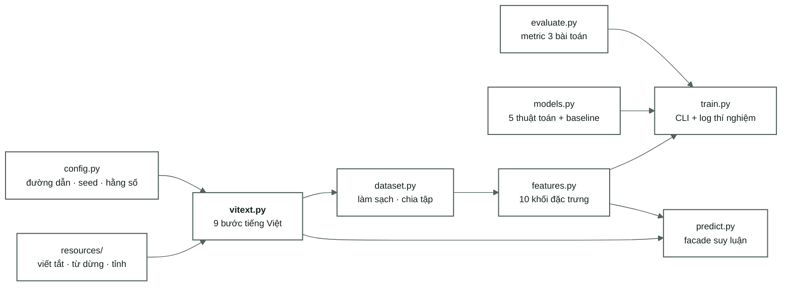

[← Tổng quan](00-tong-quan.md) · [← Bài toán lương](07-bai-toan-luong.md) · [Lộ trình →](09-lo-trinh.md)

# Mã nguồn

9 module · 2.042 dòng · 73 test xanh · 27 thí nghiệm đã ghi log.

---



| File | Dòng | Vai trò | Tài liệu |
|---|---|---|---|
| [`vitext.py`](../src/vietjobs/vitext.py) | 534 | Toàn bộ xử lý tiếng Việt. Hàm thuần khiết, có test riêng từng bước | [02](02-vietnamese-nlp.md) |
| [`dataset.py`](../src/vietjobs/dataset.py) | 275 | Làm sạch + chia tập đóng băng. Tách từ chạy **một lần** rồi cache vào parquet | [01](01-data-audit.md) |
| [`features.py`](../src/vietjobs/features.py) | 279 | `PrepConfig` bật/tắt từng bước → mỗi cấu hình là một dòng ablation | [05](05-dac-trung-tfidf.md) |
| [`train.py`](../src/vietjobs/train.py) | 362 | Một lần chạy = một dòng trong [04-results.md](04-results.md), không sửa dòng đã ghi | [03](03-protocol.md) |
| [`predict.py`](../src/vietjobs/predict.py) | 260 | Dùng **đúng** code path tiền xử lý đã tạo dữ liệu train | [09](09-lo-trinh.md) |
| [`models.py`](../src/vietjobs/models.py) | 466 | KNN · SVM · LogReg · LinearRegression · LightGBM (bắt buộc) + RandomForest · LightGBM · XGBoost cho trục so sánh thuật toán + baseline phải vượt | [06](06-mo-hinh-phan-lop.md) |
| [`evaluate.py`](../src/vietjobs/evaluate.py) | 267 | Metric cho cả ba bài toán + bootstrap và so cặp | [03](03-protocol.md) · [10](10-so-sanh-mo-hinh.md) |
| [`config.py`](../src/vietjobs/config.py) | 59 | Đường dẫn · `SPLIT_SEED` · nhóm cột · tên task | — |
| [`scripts/measure_vitext.py`](../scripts/measure_vitext.py) | 125 | Đo lại bằng chứng cho bảng chín bước. Không dính vào train, chạy lúc nào cũng được | [02](02-vietnamese-nlp.md) |
| [`scripts/sweep_category.py`](../scripts/sweep_category.py) | 362 | Chạy lưới 6×6 tuần tự trong một tiến trình, resume được, xếp theo wave | [10](10-so-sanh-mo-hinh.md) |
| [`scripts/report_sweep.py`](../scripts/report_sweep.py) | 206 | Đọc artifact cụm → bảy bảng markdown. In ra stdout, không tự ghi vào `docs/` | [10](10-so-sanh-mo-hinh.md) |

---

## Hai bất biến giữ cả hệ thống đứng vững

**1. `vitext.py` toàn hàm thuần khiết.** Cùng đầu vào cho cùng đầu ra, không đọc
trạng thái ngoài, không học gì từ dữ liệu. Nhờ vậy `dataset.py`, `features.py` và
`predict.py` gọi chung một đoạn code mà không lệch kết quả. Đây là quy tắc số 4
trong [../CLAUDE.md](../CLAUDE.md).

**2. Chỉ có một cửa quyết định bài toán nào đọc cột nào** — `features.resolve_column`.
Quy tắc số 3, giữ bởi [`tests/test_no_leak.py`](../tests/test_no_leak.py).

---

## Test

100 test, đếm bằng `pytest --collect-only -q`:

| File | Test | Giữ điều gì |
|---|---|---|
| [`tests/test_vitext.py`](../tests/test_vitext.py) | 54 | Từng bước tiếng Việt, kể cả bốn ca "40 triệu người dùng" **không** được che |
| [`tests/test_no_leak.py`](../tests/test_no_leak.py) | 22 | Bài lương không bao giờ đọc cột chưa che · **mọi tên trong lá chắn phải là cột có thật** · ba cột kỹ năng không chứa con số lương |
| [`tests/test_train_overrides.py`](../tests/test_train_overrides.py) | 16 | `--set` thật sự tới được estimator; khoá lạ báo lỗi thay vì im lặng; ô `Headline` không chứa `\|` |
| [`tests/test_bootstrap.py`](../tests/test_bootstrap.py) | 8 | Bootstrap tất định theo seed; hai mô hình y hệt cho hoà 0,5; so cặp nhạy hơn σ độc lập |

**Còn thiếu:** `tests/test_predict.py` — được nhắc trong docstring của
[predict.py:67](../src/vietjobs/predict.py#L67) và trong `CLAUDE.md`, nhưng
**chưa tồn tại**. Không có test cho `dataset.clean` và `group_stratified_split`. Xem
[09-lo-trinh.md — Ưu tiên 0](09-lo-trinh.md#ưu-tiên-0--khoá-trainserve-skew-chặn-mọi-thứ-khác).

---

## Lệnh hay dùng

```bash
python -m vietjobs.dataset build                    # dựng lại splits (hiếm khi cần)
python -m vietjobs.train --task category --model svm --C 0.02 --province
python -m vietjobs.train --task disclosed --model logreg --province
python -m vietjobs.train --task salary --model lgbm --province
python -m vietjobs.predict --title "..." --description "..."
pytest -q
python scripts/measure_vitext.py                    # đo lại bảng chín bước
./scripts/render_figures.sh                         # xuất sơ đồ ra SVG/PNG
```

---

## Đọc tiếp

- [Lộ trình còn lại](09-lo-trinh.md) — việc phải làm, xếp theo thứ tự
- [Giao thức thí nghiệm](03-protocol.md) — hợp đồng mà `train.py` thực thi
- [../CLAUDE.md](../CLAUDE.md) — bốn quy tắc làm việc
