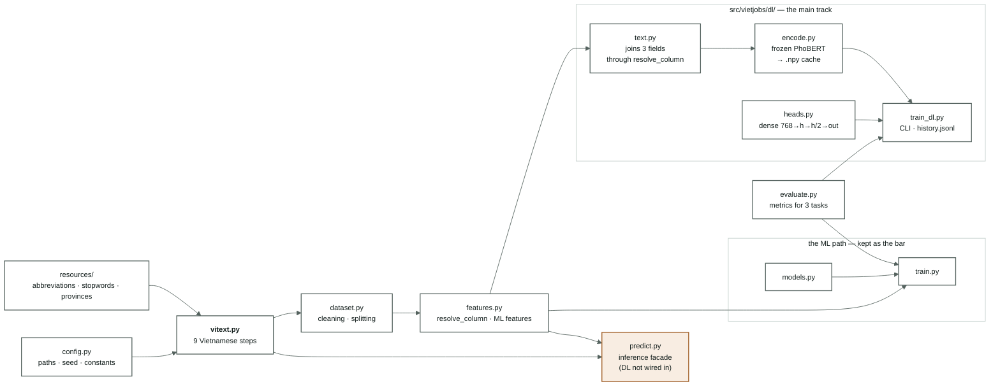

[← Overview](00-tong-quan.md) · [← Deep-learning baseline](06-baseline-dl.md) · [Roadmap →](09-lo-trinh.md)

# Source code

13 modules · 3,033 lines · 108 green tests. The main track is the
[`dl/`](../src/vietjobs/dl/) package; the machine-learning part is kept as the
comparison bar.

---




| File | Lines | Role | Documentation |
|---|---|---|---|
| [`vitext.py`](../src/vietjobs/vitext.py) | 584 | All Vietnamese processing. Pure functions, each step separately tested | [02](02-vietnamese-nlp.md) |
| [`dataset.py`](../src/vietjobs/dataset.py) | 276 | Cleaning + the frozen split. Segmentation runs **once** and is cached into the CSV. `load_split` is the only supported reader | [01](01-data-audit.md) |
| [`features.py`](../src/vietjobs/features.py) | 279 | `resolve_column` — the single door deciding which task reads which column. Both the DL path and the old ML path go through it | [05](05-phan-tich-du-lieu.md) |
| [`evaluate.py`](../src/vietjobs/evaluate.py) | 267 | Metrics for all three tasks + bootstrap and paired comparison. Shared by ML and DL, so the numbers are comparable | [03](03-protocol.md) |
| [`config.py`](../src/vietjobs/config.py) | 59 | Paths · `SPLIT_SEED` · column groups · task names | — |
| **[`dl/text.py`](../src/vietjobs/dl/text.py)** | 40 | Joins three text fields into the PhoBERT input. No torch dependency, so its tests run on any machine | [06](06-baseline-dl.md) |
| **[`dl/encode.py`](../src/vietjobs/dl/encode.py)** | 122 | Frozen PhoBERT → 768-dim vectors, cached to `.npy` split by the `raw`/`masked` column family | [06](06-baseline-dl.md) |
| **[`dl/heads.py`](../src/vietjobs/dl/heads.py)** | 37 | The dense part: 768 → h → h/2 → out. Where the trunk and branches will split in the multi-task merge | [06](06-baseline-dl.md) |
| **[`dl/train_dl.py`](../src/vietjobs/dl/train_dl.py)** | 274 | One run = one row in [04-results.md](04-results.md) + a per-epoch `history.jsonl` | [03](03-protocol.md) · [06](06-baseline-dl.md) |
| [`scripts/analyze_data.py`](../scripts/analyze_data.py) | 415 | Eleven measurements + five figures for [05](05-phan-tich-du-lieu.md). Reads `train` only, never touches `test` | [05](05-phan-tich-du-lieu.md) |
| [`scripts/probe_embeddings.py`](../scripts/probe_embeddings.py) | 83 | A linear probe on the PhoBERT vectors — separates "poor features" from "a broken head" | [06 §5.4](06-baseline-dl.md#54-the-first-failure-kept-as-evidence) |
| [`scripts/measure_vitext.py`](../scripts/measure_vitext.py) | 125 | Re-measures the evidence for the nine-step table | [02](02-vietnamese-nlp.md) |
| [`train.py`](../src/vietjobs/train.py) · [`models.py`](../src/vietjobs/models.py) | 362 · 466 | The machine-learning path. Not developed further, kept to re-run the bar | [archive/](archive/README.md) |
| [`predict.py`](../src/vietjobs/predict.py) | 260 | The inference facade — **does not know the DL path**, see [09 Priority 5](09-lo-trinh.md#priority-5--the-system) | [09](09-lo-trinh.md) |
| [`scripts/archive/*.py`](../scripts/archive/) | 749 | The 6×6 sweep, the cluster report, the segmenter ablation — part of the closed phase | [archive/](archive/README.md) |

---

## Three invariants that hold the whole system up

**0. One door for both tracks.** The DL path does not wire itself to a raw column:
it calls `features.resolve_column` through
[`dl/text.py`](../src/vietjobs/dl/text.py), the same gate the machine-learning path
used. That is why the salary-leak rule only has to be guarded in one place.

**1. `vitext.py` is entirely pure functions.** Same input, same output, no external
state read, nothing learned from the data. That is what lets `dataset.py`,
`features.py` and `predict.py` call the same code without diverging. This is Rule 4
in [../AGENTS.md](../AGENTS.md).

**2. There is only one door deciding which task reads which column** —
`features.resolve_column`. Rule 3, held by
[`tests/test_no_leak.py`](../tests/test_no_leak.py).

---

## Tests

108 tests, counted with `pytest --collect-only -q`:

| File | Tests | What it holds |
|---|---|---|
| [`tests/test_vitext.py`](../tests/test_vitext.py) | 56 | Every Vietnamese step, including the four cases where "40 triệu người dùng" (40 million users) must **not** be masked · the segmenter-switch flag must actually switch segmenter |
| [`tests/test_no_leak.py`](../tests/test_no_leak.py) | 22 | The salary tasks never read an unmasked column · **every name in the shield must be a real column** · the three skill columns contain no salary figures |
| [`tests/test_train_overrides.py`](../tests/test_train_overrides.py) | 16 | `--set` really reaches the estimator; an unknown key errors instead of being ignored; the `Headline` cell contains no `\|` |
| [`tests/test_dl_text.py`](../tests/test_dl_text.py) | 6 | The DL path reads the right columns: the salary tasks see only `*_masked`, classification sees raw text, and both are segmented because PhoBERT was trained on segmented text |
| [`tests/test_bootstrap.py`](../tests/test_bootstrap.py) | 8 | The bootstrap is deterministic given the seed; two identical models tie at 0.5; the paired comparison is more sensitive than an independent σ |

**Missing:** `tests/test_predict.py` — mentioned in the docstring of
[predict.py:67](../src/vietjobs/predict.py#L67) and in `AGENTS.md`, but it **does
not exist**. There are no tests for `dataset.clean` or `group_stratified_split`.
See
[09-lo-trinh.md — Priority 0](archive/09-lo-trinh-ml.md#ưu-tiên-0--khoá-trainserve-skew-chặn-mọi-thứ-khác).

---

## Commands in regular use

```bash
python scripts/analyze_data.py                      # measure + draw the five figures for note 05
python -m vietjobs.dl.encode   --task category --splits train dev   # embed, cached
python -m vietjobs.dl.train_dl --task category --class-weight
python -m vietjobs.dl.train_dl --task salary
PYTHONPATH=src .venv-dl/bin/python scripts/probe_embeddings.py --task category   # diagnostic bar
pytest -q

# the machine-learning path — only to re-run the old bar
python -m vietjobs.dataset build                    # rebuild the splits (rarely needed)
python -m vietjobs.train --task category --model svm --C 0.02 --province
python -m vietjobs.predict --title "..." --description "..."
python scripts/measure_vitext.py                    # re-measure the nine-step table
./scripts/render_figures.sh                         # export the diagrams to SVG/PNG
```

---

## Read next

- [What is left on the roadmap](09-lo-trinh.md) — the work items, in order
- [Experiment protocol](03-protocol.md) — the contract `train.py` and `dl/train_dl.py` both enforce
- [../AGENTS.md](../AGENTS.md) — the working rules
