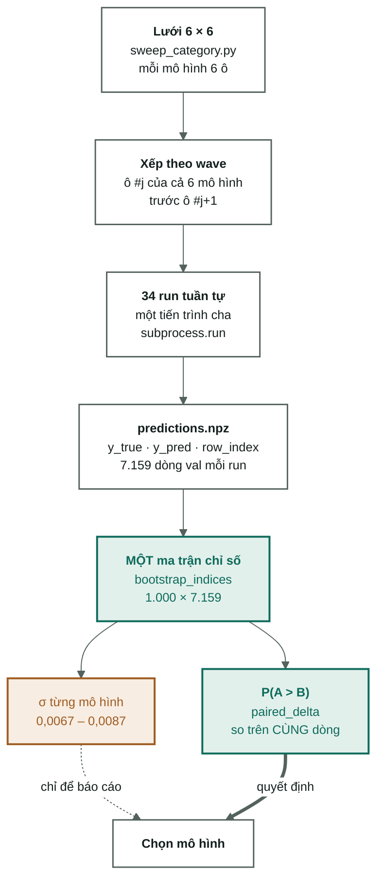

[← Tổng quan](00-tong-quan.md) · [← Mô hình phân lớp](06-mo-hinh-phan-lop.md) · [Lộ trình →](09-lo-trinh.md)

# So sánh mô hình — cụm quét công bằng

Sáu thuật toán, **sáu cấu hình mỗi thuật toán**, cùng tập train, cùng đặc trưng,
cùng seed, chấm trên `val`. 34/36 ô chạy xong trong **6 giờ 03 phút**.

Cụm này tồn tại vì một lý do: bảng so sánh trước nó **không công bằng**. `svm`
từng được quét chín giá trị `C` rồi lấy cái tốt nhất, còn ba mô hình cây mỗi cái
chạy đúng **một** cấu hình do người viết đoán. So "cái tốt nhất trong chín lần"
với "lần thử đầu tiên" thì chênh lệch 0,019 giữa `svm` và `xgb` không nói lên gì.

---

## 1. Kết luận

**Giữ `LinearSVC C=0,02`.** Không phải vì nó có điểm cao nhất — mà vì mô hình có
điểm cao hơn nó không hơn một cách phân biệt được, trong khi đắt hơn bảy lần.

| Mô hình | Cấu hình thắng | macro-F1 | σ | fit | P(> `svm`) |
|---|---|---|---|---|---|
| `logreg` | `C=0.5` | **0,6072** | ±0,0070 | 4,8 ph | **0,685** |
| **`svm`** | **`C=0.02`** | **0,6050** | ±0,0071 | **42s** | — |
| `xgb` | `100@0.3 depth4 cs0.1` | 0,5912 | ±0,0076 | 18,7 ph | 0,012 |
| `lgbm` | `200@0.15 leaves31` | 0,5830 | ±0,0081 | 12,9 ph | 0,001 |
| `rf` | `600 cây` | 0,5644 | ±0,0078 | 5,3 ph | 0,000 |
| `knn` | `k=5` | 0,4361 | ±0,0082 | 17s | 0,000 |

`P(logreg > svm) = 0,685` — **hoà**. Ngưỡng để gọi là khác biệt rõ là 0,975.
Khi hai mô hình hoà, thứ tách chúng ra là chi phí: **42 giây so với 4,8 phút**.

---

## 2. Cách cụm được dựng

**Ma trận chỉ số dùng chung là điểm mấu chốt.** Cùng 1.000 mẫu lấy lại được áp cho
cả 34 mô hình, nên mọi so sánh là **so cặp**: hỏi "A có hơn B trên *cùng* những
dòng đó không", chứ không phải "hai con số này có thể đến từ cùng một mô hình
không". Vì hai mô hình sai ở phần lớn cùng những tin nhập nhằng, phần phương sai
chung bị triệt tiêu và phép so nhạy hơn hẳn.

Xếp theo **wave** để nếu cụm bị cắt ngang thì cái còn lại là *k* cấu hình cho mỗi
mô hình — vẫn công bằng, chỉ nhỏ hơn. Xếp theo mô hình sẽ để lại "knn xong hết,
xgb chưa chạy gì", không so được gì.

---

## 3. Tái lập — sáu trên sáu

Ô #1 của mỗi mô hình lặp lại một dòng đã có trong [04-results.md](04-results.md).
Đây là canary miễn phí: lệch một chữ số là cả cụm đáng ngờ.

| Mô hình | Dòng cũ | Đo lại | Lệch |
|---|---|---|---|
| `knn` k=30 | 0,4059 | 0,4059 | 0 |
| `svm` C=0,02 | 0,6050 | 0,6050 | 0 |
| `logreg` C=1,0 | 0,6038 | 0,6038 | 0 |
| `rf` 100 cây | 0,5630 | 0,5630 | 0 |
| `lgbm` 100@0,3 | 0,5555 | 0,5555 | 0 |
| `xgb` 100@0,3 d6 | 0,5861 | 0,5861 | 0 |

Sáu trên sáu, không lệch tới chữ số thứ tư — dù giữa hai lần chạy đã thêm `--set`,
`predictions.npz`, bootstrap và mở khoá siêu tham số của `xgb`.

---

## 4. Ma trận P(hàng > cột)

| | `logreg` | `svm` | `xgb` | `lgbm` | `rf` | `knn` |
|---|---|---|---|---|---|---|
| `logreg` | — | 0,685 | 0,995 | 1,000 | 1,000 | 1,000 |
| `svm` | 0,315 | — | 0,988 | 0,999 | 1,000 | 1,000 |
| `xgb` | 0,005 | 0,012 | — | 0,854 | 1,000 | 1,000 |
| `lgbm` | 0,000 | 0,001 | 0,146 | — | 0,996 | 1,000 |
| `rf` | 0,000 | 0,000 | 0,000 | 0,004 | — | 1,000 |
| `knn` | 0,000 | 0,000 | 0,000 | 0,000 | 0,000 | — |

> 0,500 = không phân biệt được · >0,975 hoặc <0,025 = khác biệt rõ.

Ba tầng, đọc từ trên xuống:

1. **`logreg` ≈ `svm`** (0,685) — hoà, không tách được.
2. **Cả hai thắng cả ba mô hình cây** (0,988 – 1,000) — thật.
3. **`xgb` ≈ `lgbm`** (0,854) nhưng cả hai **thắng `rf`** (1,000 · 0,996).
   `knn` thua tất cả với P = 0,000.

Quy ước ngành "tuyến tính thắng cây trên TF-IDF" giờ là một dòng đo được trong
dự án này, không còn là điều nghe nói.

---

## 5. Giá của điểm số

| Mô hình | macro-F1 | fit | F1 / phút | so `knn` |
|---|---|---|---|---|
| `knn` | 0,4361 | 17s | 1,567 | 1,0× |
| **`svm`** | **0,6050** | **42s** | **0,861** | 2,5× |
| `logreg` | 0,6072 | 4,8 ph | 0,127 | 17,1× |
| `rf` | 0,5644 | 5,3 ph | 0,107 | 18,9× |
| `lgbm` | 0,5830 | 12,9 ph | 0,045 | 46,2× |
| `xgb` | 0,5912 | 18,7 ph | 0,032 | 67,2× |

`xgb` tốn **67 lần** thời gian của `knn` và **27 lần** của `svm` để về thứ ba.
Ở cấu hình đầy đủ hơn (400 vòng, `max_depth=8`) nó từng bị **dừng sau 4 giờ 07
phút mà chưa xong** — không có dòng kết quả, và bản thân điều đó là dữ liệu.

---

## 6. Độ nhạy siêu tham số — và lời nguyền của người thắng

| Mô hình | tệ nhất | trung vị | tốt nhất | biên độ |
|---|---|---|---|---|
| `xgb` | 0,5861 | 0,5874 | 0,5912 | **0,0051** |
| `rf` | 0,5502 | 0,5629 | 0,5644 | 0,0142 |
| `svm` | 0,5865 | 0,5980 | 0,6050 | **0,0185** |
| `lgbm` | 0,5555 | 0,5655 | 0,5830 | 0,0275 |
| `knn` | 0,3736 | 0,4235 | 0,4361 | 0,0624 |
| `logreg` | 0,5519 | 0,5936 | 0,6072 | **0,0553** |

Cột cuối là thứ đáng đọc kỹ nhất trong cả note.

Chọn cấu hình tốt nhất trên `val` rồi báo cáo nó **trên chính `val`** là *lời
nguyền của người thắng* — con số thu được lạc quan hơn thực tế. Và độ thổi phồng
**tỉ lệ với biên độ**: mô hình có 6 ô trải rộng có nhiều cơ hội "trúng" một ô may
mắn hơn.

`logreg` trải **0,0553**, gấp ba `svm` (0,0185). Nghĩa là 0,6072 của nó bị thổi
phồng nhiều hơn 0,6050 của `svm` — **khoảng cách thật còn nhỏ hơn +0,0022 đo
được**, chứ không lớn hơn. Kết luận "hoà" ở mục 1 vì thế còn chắc hơn con số
0,685 gợi ý.

Ở chiều ngược lại, `xgb` biên độ **0,0051**: sáu cấu hình gần như cho cùng một
kết quả. Nó không nhạy với việc chỉnh tay, nên 0,5912 là ước lượng đáng tin —
và nó vẫn thua hai mô hình tuyến tính rõ ràng.

---

## 7. σ — lần đầu được tính bằng code

| | |
|---|---|
| σ của `svm C=0,02` | **0,0071** · CI95 [0,5906; 0,6177] |
| σ trên cả 34 run | 0,0067 – 0,0087, **trung vị 0,0077** |
| Số lần lấy lại mẫu | 1.000 |

Trước cụm này, `docs/` viện dẫn **σ ≈ 0,009** ở năm chỗ để phán "chênh lệch này
là nhiễu" — mà **không có file `.py` nào trong repo tính ra nó**. Con số ở trên là
lần đầu nó được tính bằng code có thể chạy lại: `evaluate.bootstrap_scores`, gọi
từ mọi `train.py` và từ `scripts/report_sweep.py`.

Ngưỡng thật thấp hơn ~15% so với con số đang dùng, tức **quy tắc cũ quá bảo thủ**.

> **Nhưng đừng dùng σ để so hai mô hình.** σ trả lời "điểm này dao động bao nhiêu
> nếu đổi tập val". Câu cần hỏi là "A có hơn B trên cùng những dòng đó không" —
> và đó là mục 4, nhạy hơn nhiều.
>
> 33 run cũ **không lưu `y_pred`**, nên chúng không tham gia được vào so cặp. Ba
> kết luận "trong nhiễu" của bảng ablation tiếng Việt vì thế **chưa được kiểm lại**
> bằng phép so nhạy hơn. Muốn biết thì phải chạy lại chúng.

---

## 8. Hai ô không hoàn thành

| Ô | Cấu hình | Chuyện gì |
|---|---|---|
| `rf-4` | 300 cây, `min_samples_leaf=1` | DNF ở timeout 45 phút |
| `xgb-5` | 200@0,15 depth4 `colsample=0,2` | DNF ở timeout 45 phút |

Nên `rf` và `xgb` mỗi cái chỉ có **5/6 ô**, bốn mô hình kia đủ 6. Đây là bất đối
xứng ngược chiều với bất đối xứng cụm này sinh ra để sửa — lần này nó **thiệt**
cho hai mô hình cây.

Không chạy lại, vì cả hai đều thua hai mô hình tuyến tính với P < 0,013: thêm một
ô không lật được kết luận. Và việc chúng **không chạy nổi trong 45 phút** trên
ma trận này bản thân là một kết quả, thuộc đúng cột chi phí ở mục 5.

---

## 9. Điều cụm này *không* trả lời

- **Bảng 5 là ước lượng lạc quan cho mọi mô hình**, không riêng `logreg`. Muốn
  con số không thiên vị thì phải chấm cấu hình đã chọn trên một tập chưa từng
  dùng để chọn — mà `test` đã chạm một lần rồi ([03-protocol.md](03-protocol.md) §2).
  **Không được lấy `test` ra "kiểm chứng" kết quả này.**
- **6 ô cho `knn` (1 nút vặn) không tương đương 6 ô cho `xgb` (5 nút vặn).**
  Bằng nhau về *số cấu hình* không phải bằng nhau về *độ phủ không gian siêu
  tham số*. Đây là giới hạn của định nghĩa "công bằng" mà cụm này dùng.
- **`svm_plain`** (`class_weight=None`) vẫn chưa từng chạy ở `scope=full`.
- Cụm chạy trên không gian 236.596 chiều **chưa cắt**. Việc `C` tối ưu của `svm`
  rơi tận 0,02 vẫn là triệu chứng thừa chiều —
  [09-lo-trinh.md Ưu tiên 3b](09-lo-trinh.md) vẫn còn nguyên đó.

---

## Đọc tiếp

- [06-mo-hinh-phan-lop.md](06-mo-hinh-phan-lop.md) — bậc thang kết quả và mô hình chốt
- [04-results.md](04-results.md) — 69 dòng thí nghiệm đầy đủ
- [03-protocol.md](03-protocol.md) — luật chơi cụm này tuân theo
- Nền tảng: [đo lường và baseline](nen-tang/06-do-luong-va-baseline.md) ·
  [chính quy hoá](nen-tang/07-chinh-quy-hoa.md) ·
  [ma trận thưa và số chiều](nen-tang/04-ma-tran-thua-va-so-chieu.md)
