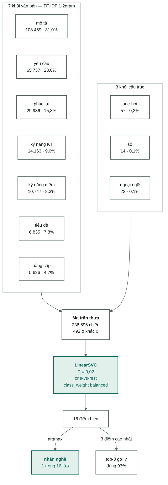

[← Tổng quan](../00-tong-quan.md) · [← Đặc trưng & TF-IDF](05-dac-trung-tfidf.md) · [Bài toán lương →](../07-bai-toan-luong.md)

# Bài toán 1 — phân lớp nghề

16 lớp, lệch 27:1. **Đã xong và đã chấm test một lần: macro-F1 0,6112.**
101 thí nghiệm ghi trong [04-results.md](04-results-ml.md). Lựa chọn mô hình được
kiểm lại bằng một cụm quét công bằng **11 thuật toán × 6 cấu hình** —
[10-so-sanh-mo-hinh.md](10-so-sanh-mo-hinh.md).

---

Con số sau dấu `·` là **phần trăm tổng trọng số `|w|` mà SVM đặt lên khối đó**.
Ba khối cấu trúc chỉ có 93 chiều mà giữ 0,4 % trọng số — mỗi chiều của chúng
nặng gấp khoảng **10 lần** một chiều văn bản trung bình. Bảng đầy đủ với tỷ số
từng khối ở [05-dac-trung-tfidf.md §9](05-dac-trung-tfidf.md#9-khối-nào-thật-sự-được-dùng).

> Sơ đồ xếp `lang_word` (22 chiều) vào nhóm "cấu trúc" cho gọn. Về mặt code nó là
> khối TF-IDF thứ tám — xem bảng mười khối trong
> [05-dac-trung-tfidf.md §3](05-dac-trung-tfidf.md#3-mười-khối-đặc-trưng).

---

## Bậc thang kết quả

| Mức | Mô hình | macro-F1 (val) | fit |
|---|---|---|---|
| Sàn | đoán lớp đa số | 0,0210 | — |
| Không dùng ML | trùng từ khoá tiêu đề | 0,4321 | — |
| KNN toàn văn | k=30 | 0,4059 | 17,3s |
| KNN tốt nhất | k=15, chỉ tiêu đề | 0,5307 | 0,7s |
| Rocchio (centroid) | cosine, 16 vectơ trung bình | 0,3204 | 18s |
| KNN tốt nhất (cụm công bằng) | k=5, toàn văn | 0,4361 | 17s |
| Naive Bayes | ComplementNB, alpha=0,1 | 0,5535 | **24s** |
| RandomForest tốt nhất | 600 cây | 0,5644 | 5,3 ph |
| SVM mặc định | C=0,5, toàn văn | 0,5763 | 77,2s |
| ExtraTrees tốt nhất | 600 cây | 0,5665 | 6,4 ph |
| LightGBM tốt nhất | 200 vòng @ lr 0,15, leaves 31 | 0,5830 | 12,9 ph |
| SVM **không** `class_weight` | C=0,05 | 0,5927 | 42s |
| XGBoost tốt nhất | 100 @ lr 0,3, depth 4, colsample 0,1 | 0,5912 | 18,7 ph |
| SGD tốt nhất | log_loss, alpha=1e-4 | 0,6010 | **40s** |
| **Tốt nhất** | **SVM C=0,02, toàn văn + chuẩn tỉnh** | **0,6050** | **42s** |
| LogReg tốt nhất | C=0,5 | 0,6072 | 4,8 ph |

**Ba mô hình tuyến tính dẫn đầu đều hoà nhau** — `P(logreg > svm) = 0,685`,
`P(svm > sgd) = 0,829`, đều dưới ngưỡng 0,975. Và thứ hạng **đảo** khi so trung
vị thay vì so cực đại: theo trung vị thì `svm` đứng nhất, `sgd` tụt năm bậc.
Khi hoà thì thứ tách chúng ra là chi phí — **42 giây** so với 4,8 phút.

Cả ba thắng mọi mô hình cây và mọi baseline văn bản cổ điển với `P > 0,975`.
Chi tiết, kèm mục **điểm yếu của từng mô hình**, ở
[10-so-sanh-mo-hinh.md](10-so-sanh-mo-hinh.md); các khái niệm dùng trong đó
giải thích ở [nền tảng note 8](../nen-tang/08-doc-mot-bang-so-sanh.md).

**Test (chạy một lần duy nhất): macro-F1 0,6112 · accuracy 0,6527 · balanced accuracy 0,6816.**
Test cao hơn val nên không có dấu hiệu overfit vào val.

KNN càng nhiều đặc trưng càng tệ — chỉ tiêu đề 0,5266, toàn văn 0,4059, **thấp hơn cả
baseline từ khoá không dùng ML**. Đây là lời nguyền số chiều, ngược hẳn SVM và LogReg.
Vì sao KNN sụp mà SVM thì không:
[nền tảng: ma trận thưa và số chiều](../nen-tang/04-ma-tran-thua-va-so-chieu.md).

### Cây so với tuyến tính — cùng dữ liệu, hai kết luận ngược nhau

Ba mô hình cây được thêm vào **chỉ để so sánh**, không thuộc bộ ba thuật toán bắt
buộc. Chúng chạy hai lần, khác nhau đúng một thứ: số chiều.

| Mô hình | `structured` ~60 chiều | `full` 236.596 chiều | fit ở `full` |
|---|---|---|---|
| LinearSVC | 0,1603 | **0,6050** | **27,8s** |
| RandomForest | 0,2093 | 0,5630 | 69,3s |
| LightGBM | 0,2182 | 0,5555 | 744,3s |
| XGBoost | 0,2134 | 0,5861 | 3.208,8s |

**Ở 60 chiều cây thắng tuyến tính +0,05; ở 236.596 chiều cây thua tuyến tính
−0,04 đến −0,05.** Cùng thuật toán, cùng dữ liệu, cùng seed — chỉ đổi số chiều,
và kết luận lật ngược. Cả hai khoảng cách đều lớn hơn σ = 0,0077 nhiều lần.

Vì sao: cây tách theo **một chiều mỗi lần**. Với 480 ô khác 0 trên 236.596 cột,
hầu hết phép tách rơi vào vùng toàn số 0. Còn tín hiệu văn bản là **cộng dồn** —
nhiều từ yếu cộng lại — đúng thứ một siêu phẳng làm gọn trong một phép nhân.
Ở `structured` thì ngược lại: 60 chiều đặc, và lương/nghề phụ thuộc **tương tác**
giữa tỉnh × kinh nghiệm × độ dài, thứ mô hình tuyến tính không biểu diễn nổi.

**Cột `fit` mới là kết luận thực dụng.** XGBoost là mô hình cây tốt nhất
(0,5861) nhưng vẫn thua SVM 0,0189 trong khi tốn **gấp 115 lần** thời gian.
Ở cấu hình đầy đủ hơn (400 vòng, `max_depth=8`) nó bị **dừng sau 4 giờ 07 phút mà
chưa xong** — không có dòng kết quả, và bản thân điều đó là dữ liệu.

> Ngân sách của ba dòng `full` được hạ có chủ ý và khớp nhau: `lr × vòng = 30`
> cho hai mô hình boosting, kích thước cây cùng khoảng. Tên registry ghi rõ
> (`lgbm100`, `rf100`, `xgb100`) nên không dòng nào đổi nghĩa ngầm. Bốn dòng
> `structured` chạy ở ngân sách đầy đủ vì ở 60 chiều chúng chỉ tốn 5–32 giây.

---

### Cách đọc bậc thang này

Bảng không phải danh sách mô hình xếp hạng. Nó là một lập luận, đọc từ trên xuống:

1. **0,0210** — đoán bừa lớp đông nhất. Bất kỳ thứ gì không vượt được con số này
   là chưa học được gì.
2. **0,4321** — trùng từ khoá tiêu đề, không dùng ML. Đây mới là sàn thật.
   Một mô hình học máy thua nó thì không đáng tồn tại. Hai mô hình KNN toàn văn
   **thua nó**.
3. **0,5547** (`cat-P0b-svm-title`) — SVM chỉ đọc tiêu đề. Chênh so với mức 2 là
   phần mà học máy thật sự mua được.
4. **0,5719** — thêm cả sáu khối văn bản còn lại, chỉ lên **0,017**. Dấu hiệu pha
   loãng: mô tả dài lấn át tiêu đề ngắn nhưng đậm tín hiệu.
5. **0,6050** — chỉnh `C` xuống 0,02. Một dòng siêu tham số mua **+0,0287**, gấp
   gần 17 lần toàn bộ pipeline xử lý tiếng Việt.

Bài học đắt nhất nằm ở bước 4 → 5: **thời gian bỏ vào chỉnh siêu tham số ăn đứt
thời gian bỏ vào thêm đặc trưng.** Xem [nền tảng: chính quy hoá](../nen-tang/07-chinh-quy-hoa.md)
để hiểu vì sao `C` tối ưu lại rơi xuống tận 0,02.

### Vì sao macro-F1 chứ không phải accuracy

Lớp lớn nhất gấp 27 lần lớp nhỏ nhất. Baseline "đoán lớp đa số" đạt accuracy
**0,2014** nhưng macro-F1 chỉ **0,0210** — accuracy vui vẻ che giấu một mô hình bỏ
qua hoàn toàn 15 lớp. Chi tiết ở [03-protocol.md §4](../03-protocol.md) và
[nền tảng: đo lường và baseline](../nen-tang/06-do-luong-va-baseline.md).

> **Về cột lệch trong [04-results.md](04-results-ml.md):** đã sửa. Ô `Headline` từng
> ngăn các metric bằng dấu `|`, làm trình render đẩy `Time` và `Commit` ra ngoài.
> Dòng mới dùng dấu ` · ` và render đúng 11 cột; 34 dòng cũ giữ nguyên vì log là
> append-only, nên chúng vẫn hiển thị lệch.

---

## Đọc tiếp

- [Bài toán lương](../07-bai-toan-luong.md) — bài toán thứ hai, chưa chạy
- [Đặc trưng & TF-IDF](05-dac-trung-tfidf.md) — ma trận 236.596 chiều dựng thế nào
- [04-results.md](04-results-ml.md) — 27 dòng thí nghiệm đầy đủ
- Nền tảng: [đo lường và baseline](../nen-tang/06-do-luong-va-baseline.md) ·
  [ma trận thưa và số chiều](../nen-tang/04-ma-tran-thua-va-so-chieu.md) ·
  [chính quy hoá](../nen-tang/07-chinh-quy-hoa.md)
