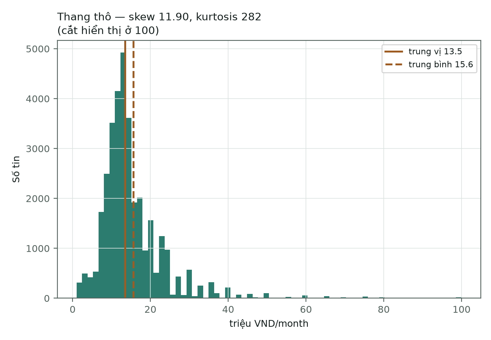
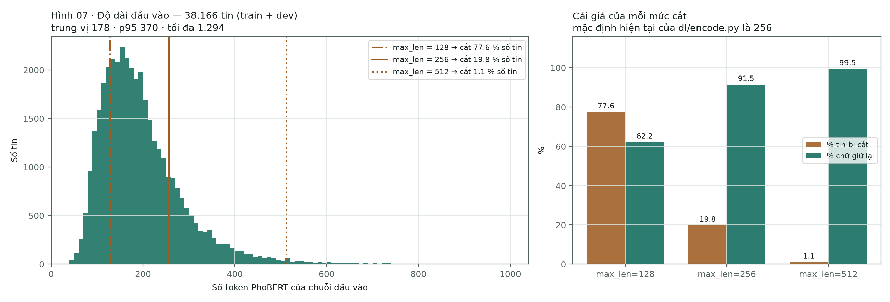

[← Chương 2](03-chuong-2-tong-quan.md) · [Bảng điều khiển](00-index.md) · [Chương 4 →](05-chuong-4-thuc-nghiem.md)

# CHƯƠNG 3. PHƯƠNG PHÁP THỰC HIỆN

Chương này trình bày toàn bộ đường đi của dữ liệu, từ tệp CSV thô đến vectơ đưa vào
mạng nơ-ron. Mỗi bước được trình bày theo ba nhịp: **nguyên lý hoạt động**, **cách
áp dụng trong đề tài**, và **lý do lệch khỏi giá trị mặc định** kèm số đo.

---

## 3.1. Tổng quan quy trình thực hiện


**Hình 3.1: Sơ đồ tổng quan quy trình thực hiện đề tài**

Quy trình gồm sáu khâu nối tiếp:

**Bảng 3.1: Sáu khâu của quy trình**

| Khâu | Việc làm | Mô-đun | Đầu ra |
|---|---|---|---|
| 1 | Làm sạch, loại trùng | `dataset.py` | 47.707 dòng |
| 2 | Xử lý tiếng Việt, tách từ | `vitext.py` | 9 cột đã tách từ |
| 3 | Chia tập theo nhóm | `dataset.py` | 34.354 / 3.812 / 9.541 |
| 4 | Phân tích khám phá | `scripts/analyze_data.py` | 5 hình + `summary.json` |
| 5 | Biểu diễn bằng PhoBERT | `dl/encode.py` | vectơ 768 chiều, lưu đệm |
| 6 | Huấn luyện phần dày đặc | `dl/train_dl.py` | mô hình + `metrics.json` |

Một quyết định kiến trúc bao trùm cả sáu khâu: **các khâu 1–3 chạy một lần và kết
quả được ghi xuống đĩa**, các khâu 5–6 đọc lại kết quả đó. Lý do là chi phí: riêng
việc tách từ cho 47.707 tin mất **780,3 giây** (13 phút), với **0 lỗi**. Nếu tách từ
nằm trong vòng lặp huấn luyện thì 27 lần thí nghiệm sẽ tiêu gần 6 giờ chỉ để tính đi
tính lại đúng một kết quả.

---

## 3.2. Dữ liệu và kiểm toán dữ liệu

### 3.2.1. Mô tả nguồn dữ liệu

**Bảng 3.2: Thuộc tính của tệp dữ liệu thô**

| Thuộc tính | Giá trị |
|---|---|
| Tệp | `data/raw/VietJobs.csv` |
| Số dòng | 48.092 |
| Số cột | 18 |
| sha256 | `85862b06fda4e814…d0c49d477` |
| Đơn vị lương | triệu VND/tháng |

Mã băm sha256 được ghi vào `manifest.json` với đúng một nhiệm vụ: nếu tệp thô thay
đổi, mọi con số đã đo mất tính so sánh được, và điều đó phải được phát hiện ngay lập
tức chứ không phải ba tuần sau.

Mười tám cột gốc chia thành bốn nhóm:

**Bảng 3.3: Mô tả các trường dữ liệu**

| Nhóm | Các cột | Vai trò |
|---|---|---|
| Văn bản tự do | `job_title` · `description` · `requirements_text` | Tín hiệu chính, là đầu vào của PhoBERT |
| Danh sách | `qualifications` · `technical_skills` · `soft_skills` · `benefits` | Vừa cho ra văn bản, vừa cho ra một cột đếm |
| Có cấu trúc | `location` · `country` · `languages_required` · `experience_required` · `contract_type` · `working_hours` | Cột số và cột one-hot |
| **Nhãn** | `category` · `salary` · `salary_min` · `salary_max` · `salary_avg` | Đáp án. Bốn cột lương **không bao giờ** vào ma trận đặc trưng |

**Một chi tiết đọc dữ liệu có hệ quả lớn.** Hàm `load_raw` đọc **mọi cột dưới dạng
chuỗi** và chỉ coi chuỗi rỗng là giá trị khuyết. Lý do: để thư viện tự suy kiểu là để
nó âm thầm biến `"01"` thành `1`, và biến `"NA"` — một mã ngành có thật — thành giá
trị khuyết. Ép kiểu chuỗi rồi tự phân tích thì chậm hơn nhưng không có bất ngờ.

### 3.2.2. Loại trùng lặp — hai tầng, hai mục đích khác nhau

Đây là chỗ dễ nhầm nhất trong toàn bộ quy trình, nên cần nói rõ:

**Bảng 3.4: Hai tầng xử lý trùng lặp**

| Tầng | Hàm | Việc làm | Kết quả |
|---|---|---|---|
| 1. Trùng khớp hoàn toàn | `drop_duplicates()` | **Xoá** dòng giống nhau trên cả 18 cột | 48.092 → **47.707** (xoá **385**) |
| 2. Gom nhóm trùng gần | `group_key()` | **Không xoá gì.** Chỉ gán một mã chung cho các tin gần giống nhau | 47.707 dòng → **34.899 nhóm** |

**Vì sao hai tầng xử lý khác nhau.** Dòng giống nhau trên cả 18 cột là **lỗi nhập
liệu**, không phải thông tin; giữ lại chỉ khiến mô hình đếm một tin hai lần, tức tự
gán lại trọng số một cách ngẫu nhiên. Ngược lại, tin *gần* giống nhau — "Nhân viên
kinh doanh" đăng lại tuần sau với một câu phúc lợi sửa khác đi — **vẫn là dữ liệu
thật**. Xoá chúng là vứt mẫu đi. Nhưng để chúng rơi vào hai tập khác nhau là rò rỉ.
Giải pháp: giữ lại, và ép cả nhóm vào cùng một tập (§3.5).

**Số đo:** **12.808 dòng (26,8 %)** là tin đăng lại; nhóm lớn nhất có 33 dòng.

### 3.2.3. Sửa chữa nhãn lương

Bốn phép sửa, mỗi phép ứng với một dạng bẩn có thật trong dữ liệu:

**Bảng 3.5: Bốn phép sửa nhãn lương**

| Hiện tượng trong dữ liệu | Cách sửa |
|---|---|
| Có dòng `salary_min > salary_max` | Hoán đổi lại bằng `np.minimum` / `np.maximum` |
| Chỉ công bố **một** biên (min = 0, max > 0) | Dùng biên có thật cho cả hai |
| Không công bố con số nào | `salary_mid = 0` → `salary_disclosed = 0` |
| Phân bố lệch phải nặng | Nhãn hồi quy là `log1p(salary_mid)` |

**Giá trị cực trị được đánh dấu, không bị xoá.** Cột `salary_extreme = 1` khi trung
điểm ≥ 100 triệu.

*Lý do không cắt đuôi phân bố:* **cái đuôi là thật**. Một giám đốc điều hành thực sự
nhận 500 triệu. Xoá những dòng đó là dạy mô hình rằng lương cao không tồn tại — nó sẽ
đạt điểm cao hơn *trên tập đã bị cắt*, và sai một cách có hệ thống ngoài đời. Đánh
dấu rồi báo cáo riêng là trung thực; xoá đi rồi khoe một MAE đẹp là tự lừa mình.

*Cách xử lý cái đuôi mà không vứt dữ liệu:* dùng `log1p` làm nhãn hồi quy. Sai 5
triệu ở mức lương 10 triệu là sai nặng; sai 5 triệu ở mức 200 triệu là gần đúng.
Thang logarit nói được điều đó, thang tuyến tính thì không.

> **Nguồn số liệu:** `data/processed/manifest.json` ·
> [01-data-audit.md](../01-data-audit.md).

---

## 3.3. Xử lý ngôn ngữ tiếng Việt


**Hình 3.2: Chín bước xử lý tiếng Việt và nơi từng bước được gọi**

### 3.3.1. Nguyên lý — vì sao phải chuẩn hoá cho PhoBERT

PhoBERT không đếm từ; nó cắt văn bản thành **đơn vị con BPE** rồi tra trong một bảng
nhúng. Bảng đó học từ một kho văn bản có phân bố cụ thể. Mọi bước chuẩn hoá dưới đây
tồn tại vì đúng một lý do: **kéo văn bản của đề tài về gần phân bố mà PhoBERT đã
học**.

Lệch phân bố không sinh ra thông báo lỗi. Nó chỉ làm vỡ chuỗi đơn vị con thành những
mảnh hiếm, và vectơ ngữ nghĩa thu được nhạt đi mà không có dấu hiệu nào trên màn
hình.

### 3.3.2. Chín bước và ba nhóm mục đích

**Bảng 3.6: Chín bước xử lý tiếng Việt**

| # | Bước | Ví dụ | Mục đích | Trạng thái |
|---|---|---|---|---|
| 1 | Chuẩn hoá Unicode NFC | gộp dấu tổ hợp, bỏ ký tự đầu dòng, gộp khoảng trắng | Gộp biến thể | dùng |
| 2 | Chuẩn hoá vị trí dấu thanh | `hòa` = `hoà` · `thúy` = `thuý` | Gộp biến thể | dùng |
| 3 | Mở rộng từ viết tắt | `NV` → `nhân viên` · `BHXH` → `bảo hiểm xã hội` | Gộp biến thể | dùng |
| 4 | Che con số lương | `18 triệu` → `<SALARY>` | Chặn rò rỉ | dùng |
| 5 | Tách từ | `nhân viên` → `nhân_viên` | Khớp phân bố tiền huấn luyện | **bắt buộc** |
| 6 | Kênh bỏ dấu | `nhân viên` → `nhan vien` | — | **đã gỡ** |
| 7 | Chuẩn hoá tỉnh thành | `hà đông` → `hà nội` | Gộp biến thể | dùng (tạo cột mới) |
| 8 | Loại từ dừng | bỏ `và`, `của`, `các` | — | **đã gỡ** |
| 9 | Khoá gom nhóm | băm nội dung → `group_id` | Chặn rò rỉ | dùng |

Ba nhóm mục đích:

- **Gộp biến thể về một cách viết** — bước 1, 2, 3, 7. Một cách viết lạ là một chuỗi
  đơn vị con lạ.
- **Khớp phân bố tiền huấn luyện** — bước 5.
- **Chặn rò rỉ** — bước 4 và 9. Không để mô hình nhìn thấy đáp án, dù đáp án nằm
  trong chính đầu vào (bước 4) hay nằm ở tập kiểm tra (bước 9).

**Thứ tự hiệu dụng trong `dataset.clean` là cố định và có lý do:** NFC → dấu thanh →
viết tắt → che lương → tách từ. Bốn bước đầu chạy trong một lời gọi
`V.preprocess(tone=True, abbrev=True, mask=…)`; tách từ là một lượt riêng
(`segment_many`) chạy ngay sau, không phải bước thứ năm bên trong `preprocess`.
Che lương phải chạy **sau** khi mở rộng viết tắt (vì `8tr` phải thành một con số
trước khi che được) và **trước** khi tách từ (vì `<SALARY>` không được phép bị
tách). Từ dừng có tham số riêng trong `preprocess` (`drop_stopwords`) nhưng không
lời gọi nào trong dự án bật nó — xem §3.3.3.

### 3.3.3. Hai bước bị gỡ bỏ, và vì sao đó là kết quả chứ không phải thiếu sót

Theo Quy tắc 2 của giao thức thực nghiệm, **bước nào không có dòng đo chứng minh
đóng góp thì bị gỡ**. Hai bước đã bị gỡ, và cả hai đảo ngược kết luận khi trục mô
hình chuyển từ TF-IDF sang PhoBERT:

- **Bước 6 — bỏ dấu.** Bước này sinh ra để nuôi kênh n-gram ký tự của TF-IDF. Khi
  chuyển sang PhoBERT thì không còn kênh nào để nuôi, nên bước này mất chỗ đứng.
- **Bước 8 — loại từ dừng.** Từ dừng chính là các hư từ mà một mô hình ngữ cảnh cần
  để hiểu câu. Xoá chúng là phá vỡ phân bố tiền huấn luyện.

Ngược lại, **bước 5 (tách từ) đổi kết luận từ "có hại nhẹ" sang "bắt buộc"** — vì
TF-IDF và PhoBERT là hai mô hình khác nhau, cùng một bước có thể cho hai kết luận
trái ngược. Đây là một bài học phương pháp luận đáng ghi lại hơn cả con số.

### 3.3.4. Hai việc `vitext.py` cố tình **không** làm

- **Không bóc thẻ HTML.** Kho dữ liệu này không có thẻ HTML nào. Thêm một bước không
  có gì để làm là thêm một chỗ cho lỗi ẩn nấp.
- **Không chuyển chữ thường ba cột đi vào PhoBERT** (`job_title`, `description`,
  `requirements_text`). Bộ tách đơn vị con của PhoBERT phân biệt hoa thường,
  nên giữ nguyên là đúng. Việc này còn cho phép đếm cột `n_acronyms` — số token viết
  hoa toàn bộ trong tiêu đề (`SEO`, `IT`, `PHP`, `QA`, `HR`). Đây là tín hiệu ngành
  nghề rất mạnh và gần như miễn phí; chuyển chữ thường sớm là xoá sạch đặc trưng này.
  Đây không phải quy tắc cho toàn bộ `vitext.py`: các cột gộp từ danh sách bằng
  `join_list_field` (`benefits_text`, `technical_skills_text`,
  `qualifications_text`, `soft_skills_text`, `languages_text`) bị viết thường,
  nhưng không cột nào trong số đó nằm trong `FIELDS` của `dl/text.py`.

---

## 3.4. Cơ chế chống rò rỉ dữ liệu


**Hình 3.3: Bốn bản sao của mỗi cột văn bản và quyền đọc của từng bài toán**

### 3.4.1. Nguyên lý

Rò rỉ dữ liệu là tình huống mô hình nhìn thấy thông tin mà lúc dự đoán thật nó không
có. Trong đề tài này có hai đường rò rỉ, và **cả hai đều không sinh ra thông báo
lỗi** — chúng chỉ tạo ra một điểm số đẹp không có giá trị.

### 3.4.2. Cách áp dụng — bốn bản sao và một cửa duy nhất

Mỗi cột văn bản tồn tại ở tối đa bốn dạng, dựng sẵn một lần trong `clean()`:

**Bảng 3.7: Bốn bản sao của một cột văn bản**

| Bản sao | Dựng bằng | Ai được đọc |
|---|---|---|
| `<tên>` | `preprocess(mask=False)` | chỉ bài toán phân loại |
| `<tên>_seg` | thêm bước tách từ | chỉ bài toán phân loại |
| `<tên>_masked` | `preprocess(mask=True)` | chỉ hai bài toán lương |
| `<tên>_masked_seg` | che rồi tách từ | chỉ hai bài toán lương |

**Lý do dựng sẵn cả bốn thay vì tính khi cần:** để việc chọn bản sao trở thành một
phép tra bảng, chứ không phải một nhánh `if` rải rác khắp mã nguồn. Nơi duy nhất
quyết định là hàm `features.resolve_column`. Một cánh cửa thì kiểm thử được; mười
nhánh `if` thì không.

Bốn cột được che: `job_title`, `description`, `requirements_text` và `benefits_text`.
Cột phúc lợi được che riêng vì nó nhắc lại con số lương nhiều hơn mọi cột khác —
**10,65 %** số dòng.

**Điểm quan trọng đối với nhánh học sâu:** bộ đệm vectơ PhoBERT được tách thành hai
họ tệp riêng trong `artifacts/embeddings/` — họ `raw` cho phân loại và họ `masked`
cho lương. Trộn hai tệp này là một vụ rò rỉ lương âm thầm. Ràng buộc được giữ bằng
`tests/test_no_leak.py` (22 kiểm thử) và `tests/test_dl_text.py` (8 kiểm thử).

**Một hạn chế cần nói thẳng:** danh sách cột được bảo vệ (`UNMASKED_COLUMNS`) hiện
vẫn là **danh sách viết tay**, nên bộ kiểm thử chỉ canh được những cột mà người viết
nghĩ ra. Hai cột `soft_skills_text` và `qualifications_text` từng lọt qua danh sách
này. Đường học sâu hiện chỉ đọc ba trường văn bản nên chưa bị ảnh hưởng, nhưng đây là
một việc còn tồn đọng, không phải một vấn đề đã đóng.

---

## 3.5. Phân chia tập dữ liệu

### 3.5.1. Nguyên lý — chia theo nhóm, không chia theo dòng

Thuật toán `group_stratified_split` phải thoả **hai** ràng buộc cùng lúc, và hai ràng
buộc này kéo ngược nhau:

1. **Không nhóm nào được nằm ở hai tập.** Mọi dòng cùng `group_id` phải rơi trọn vào
   một tập.
2. **Lớp hiếm phải sống sót.** Một lớp có 196 dòng phải xuất hiện ở cả tập kiểm định
   lẫn tập kiểm tra, nếu không macro-F1 sẽ được tính trên số lớp khác nhau giữa các
   lần chạy và bảng kết quả mất tính so sánh.

**Cách áp dụng:** với **mỗi** lớp ngành nghề, xáo trộn các nhóm, rồi đặt **nhóm lớn
nhất trước** vào tập nào đang thiếu so với hạn mức nhiều nhất. Đặt nhóm lớn trước vì
chúng khó xếp nhất — để đến cuối thì chúng làm lệch tỷ lệ mà không còn gì để bù.

### 3.5.2. Lược đồ hai tầng

Từ ngày 2026-09-09, phép chia chạy **hai lần**:

1. `train_pool : test` = **8 : 2**
2. tập pool đó chia tiếp, `train : dev` = **9 : 1**

Kết quả là tỷ lệ 72 / 8 / 20 trên số dòng. **Lý do chia hai lần thay vì một lần chia
ba:** tầng 2 phải chạy lại được — đổi lát cắt dev khác, hoặc chạy k-fold trên pool —
**mà không một dòng nào của `test` bị dịch chuyển**. Đó chính là điều giữ cho `test`
dùng được đúng một lần, ở cuối. Tầng 2 rút với `seed + 1` để hai tầng không dùng
chung một hoán vị. Hạt giống `SPLIT_SEED = 20260826` không đổi.

**Bảng 3.8: Kết quả phân chia tập dữ liệu**

| Tập | Số dòng | Tỷ lệ | Số nhóm | Tin có công bố lương | Số lớp |
|---|---|---|---|---|---|
| train | 34.354 | 72,01 % | 22.026 | 24.669 | 16 |
| dev | 3.812 | 7,99 % | 3.728 | 2.705 | 16 |
| test | 9.541 | 20,00 % | 9.145 | 6.719 | 16 |

`groups_straddling_splits` = **0**, và hàm `build()` có một câu lệnh `assert` kiểm
tra điều đó. Câu lệnh này không bao giờ được phép tắt đi. Tỷ lệ thực tế lệch không
quá 0,01 điểm phần trăm so với mục tiêu, dù đơn vị chia là nhóm chứ không phải dòng.

**Cái giá của lược đồ mới là tập dev mỏng:** lớp nhỏ nhất, `nhóm_nghề_khác`, chỉ có
**25** dòng trong dev (198 trong train, 64 trong test). F1 của lớp đó trên dev được
đo trên 25 mẫu và sẽ dao động mạnh; phải đọc kèm `f1_macro_no_junk` và xác nhận trên
`test` ở cuối.

### 3.5.3. Chính sách chạm vào tập kiểm tra

**Bảng 3.9: Chính sách sử dụng ba tập dữ liệu**

| Tập | Dùng để | Được chạm bao nhiêu lần |
|---|---|---|
| `train` | Huấn luyện | Không giới hạn |
| `dev` | Chọn mô hình, siêu tham số, cấu hình tiền xử lý | Không giới hạn |
| `test` | Báo cáo con số cuối cùng | **Đúng một lần**, ở cuối |

`test` không chỉ hiếm khi được chạm — nó **không bao giờ bị biến đổi**. Không lọc,
không loại trùng, không cân bằng lớp, không cắt ngoại lệ, không chia lại. Mọi phép
làm sạch hay điều chỉnh chỉ áp lên `train` và `dev`. Chương trình huấn luyện từ chối
chạy với `--eval test` nếu không có cờ `--confirm-test`; cờ này tồn tại để việc chạm
vào test là một hành động có chủ ý, không phải một mặc định.

Lý do sâu hơn: mỗi lần nhìn vào test rồi quay lại chỉnh mô hình là một lần thông tin
từ test rò vào một quyết định thiết kế. Làm vài lần thì test không còn là một ước
lượng không thiên lệch nữa.

---

## 3.6. Phân tích khám phá dữ liệu

**Phạm vi đo — tệp gốc.** Mọi con số **mô tả** trong mục này đo trên
`data/raw/VietJobs.csv` sau khi khử trùng lặp chính xác: **47.707 dòng**, tức toàn
bộ kho dữ liệu như đã thu thập, không phải một tập con. Chỉ những con số **quyết
định** — mốc cơ sở không dùng mô hình, việc chọn `--max-len` — mới đo trên tập chia,
và chúng được học trên `train`, chấm trên `dev`. Tập `test` không được đọc ở đây.
Quy ước này là bắt buộc, xem `AGENTS.md` Rule 8.

Lý do đặt phần mô tả trên tệp gốc: một chương mô tả dữ liệu phải mô tả kho dữ liệu
**như nó vốn có**, và tệp gốc **không đổi khi lược đồ chia thay đổi** — nhờ vậy mọi
con số mô tả dưới đây sống sót qua lần chia lại ngày 09/09/2026, trong khi những con
số cũ đo trên tập `train` của lược đồ v1 thì không.

> **Đã đo lại toàn bộ, 12/09/2026** (T1.1). `artifacts/eda/summary.json` được
> sinh lại bằng lệnh trên, kèm `--tokens` trong `.venv-dl`, và mốc cơ sở ở mục
> 3.6.6 được học và chấm trên lược đồ chia v2 hiện hành (`train` 34.354 / `dev`
> 3.812). Không còn dấu `⛔` nào bên dưới.

### 3.6.1. Độ đầy của các trường dữ liệu


**Hình 3.4: Tỷ lệ điền của 18 trường trong tệp gốc**

> **Nguồn số liệu:** `docs/figures/eda/eda-01-do-day-truong.png`, 47.707 dòng.

**Bảng 3.10: Độ đầy của 18 trường dữ liệu**

| Trường | Số dòng có giá trị | Tỷ lệ |
|---|---|---|
| `salary_avg` · `salary_max` · `salary_min` · `category` · `description` · `salary` · `contract_type` · `location` · `job_title` · `experience_required` · `country` | 47.707 | **100 %** |
| `requirements_text` | 47.698 | 100,0 % |
| `benefits` | 47.668 | 99,9 % |
| `qualifications` | 47.338 | 99,2 % |
| `soft_skills` | 45.087 | 94,5 % |
| `working_hours` | 42.760 | **89,6 %** |
| `technical_skills` | 41.331 | **86,6 %** |
| `languages_required` | 12.223 | **25,6 %** |

Ba trường dưới 90 % là ba trường phải đọc kỹ. Một trường rỗng ở ba dòng trên bốn
**không phải là một đặc trưng**: mô hình học trên nó chỉ học được "tin này không điền
trường ấy" — một tính chất của quy trình nhập liệu, không phải của công việc.
`languages_required` với 25,6 % rơi đúng vào trường hợp đó.

Ba trường văn bản tự do nuôi PhoBERT — `job_title`, `description`,
`requirements_text` — được điền ở gần như mọi dòng, nên đầu vào của nhánh chính không
bị ảnh hưởng bởi vấn đề này.

### 3.6.2. Độ lệch lớp


**Hình 3.5: Phân bố số tin theo 16 nhóm ngành nghề**


**Hình 3.6: Tán xạ cỡ lớp trên thang logarit, và tỷ lệ công bố lương theo cỡ lớp**

> **Nguồn số liệu:** `docs/figures/eda/eda-02a-lech-lop.png`,
> `eda-03a-co-lop.png`, `eda-03b-cong-bo-luong.png`, `eda-04-luong-theo-nganh.png`,
> `eda-06-cong-bo-luong.png` — tất cả trên 47.707 dòng.

**Bảng 3.11: Mười sáu nhóm ngành nghề trên tệp gốc**

| Nhóm ngành nghề | Số tin | Tỷ lệ | Có công bố lương | Tỷ lệ công bố | Trung vị lương |
|---|---|---|---|---|---|
| `kinh_doanh_bán_hàng_chăm_sóc_khách_hàng` | **8.213** | 17,2 % | 6.141 | 74,8 % | 14,0 |
| `sản_xuất_lao_động_phổ_thông_cơ_khí` | 6.341 | 13,3 % | 4.371 | 68,9 % | 12,5 |
| `marketing_truyền_thông_quảng_cáo_nội_dung` | 5.947 | 12,5 % | 4.388 | 73,8 % | 12,5 |
| `tài_chính_kế_toán_ngân_hàng_bảo_hiểm` | 5.454 | 11,4 % | 3.798 | 69,6 % | 13,0 |
| `du_lịch_nhà_hàng_khách_sạn_dịch_vụ` | 4.198 | 8,8 % | 3.211 | **76,5 %** | 12,5 |
| `thiết_kế_nghệ_thuật_giải_trí_truyền_hình_báo_chí` | 3.406 | 7,1 % | 2.524 | 74,1 % | 13,5 |
| `nhân_sự_hành_chính_pháp_chế_tư_vấn` | 3.210 | 6,7 % | 2.166 | 67,5 % | 12,5 |
| `xây_dựng_kiến_trúc_bất_động_sản` | 2.809 | 5,9 % | 1.987 | 70,7 % | **16,0** |
| `công_nghệ_thông_tin_kỹ_thuật_số` | 1.903 | 4,0 % | 1.143 | 60,1 % | **16,0** |
| `logistics_vận_tải_chuỗi_cung_ứng` | 1.811 | 3,8 % | 1.249 | 69,0 % | 12,5 |
| `kỹ_thuật_điện_điện_tử_viễn_thông` | 1.236 | 2,6 % | 894 | 72,3 % | 13,5 |
| `giáo_dục_đào_tạo_nghiên_cứu` | 1.165 | 2,4 % | 882 | 75,7 % | 13,5 |
| `y_tế_dược_chăm_sóc_sức_khỏe_công_nghệ_sinh_học` | 963 | 2,0 % | 693 | 72,0 % | 14,0 |
| `ngôn_ngữ_dịch_thuật` | 384 | 0,8 % | 238 | 62,0 % | 15,0 |
| `nhóm_nghề_khác` | 345 | 0,7 % | 202 | **58,6 %** | **11,0** |
| `nông_nghiệp_năng_lượng_môi_trường` | **322** | 0,7 % | 206 | 64,0 % | 14,0 |
| **Tổng** | **47.707** | 100 % | **34.093** | **71,5 %** | 13,5 |

**Bảng 3.12: Cấu trúc dải cỡ lớp**

| Đại lượng | Giá trị | Cách đọc |
|---|---|---|
| Tỷ lệ lệch | **25,5 : 1** | lớp lớn nhất 8.213 tin trên lớp nhỏ nhất 322 tin |
| Nếu chia đều 16 lớp | 2.982 tin/lớp | Chỉ **7** lớp đạt mức đó, 9 lớp còn lại nằm dưới |
| Cỡ lớp trung vị | 2.356 tin | Thấp hơn trung bình — dải lệch phải |
| Bốn lớp lớn nhất | **54,4 %** dữ liệu | Bốn ngành chiếm hơn nửa kho |
| Bốn lớp nhỏ nhất | **4,2 %** dữ liệu | Cả bốn cộng lại chưa bằng một phần tư lớp lớn nhất |
| Hệ số Gini của cỡ lớp | **0,439** | |
| Độ dốc Zipf | **−1,18** | Một cái đuôi liên tục, không phải vài lớp hiếm tách biệt |

Độ dốc −1,18 là con số quan trọng nhất bảng: nó nói rằng độ lệch lớp ở đây là **một
dải liên tục**, không phải hai cụm "lớp bình thường" và "lớp hiếm". Vì vậy **không
tồn tại một ngưỡng tự nhiên** để cắt ra vài lớp hiếm rồi gộp vào `nhóm_nghề_khác` —
mọi điểm cắt đều tuỳ tiện, và mỗi lớp bị gộp là mất nhãn thật của nó.

**Hệ quả trực tiếp cho việc chấm điểm:** luôn đoán lớp lớn nhất chỉ cho accuracy xấp
xỉ tỷ lệ của lớp đó (17,2 % trên tệp gốc) và macro-F1 quanh 1/16 của con số ấy. Giá
trị chính xác trên `dev` là con số quyết định, đặt ở mục 3.6.6. Đó là lý do độ đo
chính là macro-F1 chứ không phải accuracy.

**Hệ quả cho việc huấn luyện:** một hàm cross-entropy trần sẽ ưu ái bốn lớp lớn
(54 % dữ liệu). Cờ `--class-weight` tồn tại để **đo xem** cân bằng lớp có giúp ích
không, chứ không phải để bật mặc định.

### 3.6.3. Phân bố mức lương



**Hình 3.7: Phân bố mức lương trước và sau phép biến đổi `log1p`**

> **Nguồn số liệu:** `docs/figures/eda/eda-05a-thang-tho.png`,
> `eda-05b-sau-log1p.png` — 34.093 tin có
> công bố lương, đơn vị triệu VND/tháng.

**Bảng 3.13: Hình dạng phân bố mức lương**

| Đại lượng | Giá trị |
|---|---|
| Trung vị | **13,5** |
| Trung bình | **15,6** |
| Giá trị lớn nhất | **500,0** |
| Độ lệch (skewness) — thang thô | **11,90** |
| Độ lệch — sau `log1p` | **0,10** |
| Độ nhọn (kurtosis) — thang thô | **282** |
| p01 · p05 · p25 · p75 · p95 · p99 | **2,5 · 6,5 · 10,5 · 17,5 · 30,0 · 50,0** |

Trung bình 15,6 nằm **cao hơn** trung vị 13,5 — dấu hiệu kinh điển của đuôi phải.
Huấn luyện hồi quy trên thang thô là để vài chục tin trên 200 triệu kéo toàn bộ
gradient; huấn luyện trên `log1p` đưa độ lệch về 0,10, gần như đối xứng. Vì vậy nhánh
hồi quy học `log1p(salary_mid)` và mọi báo cáo đều quy đổi ngược về triệu VND.

### 3.6.4. Ranh giới — đâu là đuôi thật, đâu là rác

**Bảng 3.14: Các giá trị ở hai biên của phân bố lương**

| Ngưỡng | Số tin | Cách đọc |
|---|---|---|
| Trên hàng rào IQR (> 28,00) | **2.204** (6,5 % số nhãn) | Phần lớn là lương quản lý thật — **không cắt** |
| > 200 triệu/tháng | **15** | Gần như chắc chắn là lương năm, hoặc sai đơn vị |
| < 2 triệu/tháng | **132** | Gần như chắc chắn là lương theo giờ hoặc theo ca nhập nhầm ô |
| Dưới hàng rào IQR | **0** | Biên dưới của hàng rào là 0,0, nên không tin nào rơi xuống dưới |
| Đã bị `clean` đánh dấu `salary_extreme` (≥ 100) | **99** | Thấp hơn 2.204 tin trên hàng rào IQR — bộ lọc **chưa phủ hết** các tin đáng ngờ |
| Tỷ lệ tin công bố một *khoảng* thay vì một con số | **92,9 %** | `salary_mid` là trung điểm của khoảng, nên bản thân nhãn đã là xấp xỉ |

Đây là một việc còn tồn đọng: các tin ở hai biên chưa được xử lý. Chúng ít nhưng nằm
đúng chỗ gây hại nhiều nhất cho MAE.

### 3.6.5. Nhãn lương chỉ tồn tại trên 71,5 % dữ liệu


**Hình 3.8: Tỷ lệ tin có công bố mức lương theo ngành nghề**

**34.093 trên 47.707** tin có công bố lương — **71,5 %**. Theo ngành, tỷ lệ trải từ
**58,6 %** (`nhóm_nghề_khác`) đến **76,5 %** (`du_lịch…`), xem cột tương ứng của Bảng
3.11, và **không phân bố ngẫu nhiên**: panel bên phải của Hình 3.6 cho thấy lớp càng
nhỏ thì càng ít công bố lương.

**Bảng 3.15: Quan hệ giữa cỡ lớp và nhãn lương**

| Đại lượng | Hệ số | p |
|---|---|---|
| Tỷ lệ công bố — Pearson(log n) | **0,610** | 0,0122 |
| Mức lương trung vị — Spearman | **−0,227** | 0,398 (không có ý nghĩa thống kê) |

Cỡ lớp gắn chặt với **việc nhãn lương có tồn tại hay không**. Năm ngành nhỏ nhất vì
vậy chịu phạt hai lần: ít tin để học ra lớp, lại còn ít nhãn hơn nữa cho nhánh hồi
quy. Ba hệ quả:

1. Nhánh hồi quy chỉ có nhãn cho 7 tin trong 10. Khi hợp nhất đa nhiệm, `loss_B`
   **bắt buộc phải được che**: **28,5 %** còn lại đóng góp 0 vào hàm mất mát, chứ
   không phải đóng góp một nhãn bằng 0.
2. Bài toán `disclosed` có mốc đa số xấp xỉ chính tỷ lệ công bố. Mô hình nào không
   vượt được mốc đó là vô dụng; giá trị chính xác trên `dev` ở mục 3.6.6.
3. Việc công bố lương **phụ thuộc ngành**, nên bỏ qua 28,5 % còn lại không phải một
   phép bỏ sót ngẫu nhiên: mô hình hồi quy học trên một mẫu đã bị chọn lọc.

### 3.6.6. Mốc cơ sở không dùng mô hình — học trên `train`, chấm trên `dev`

Đây là mục duy nhất **không** đọc tệp gốc. Một mốc cơ sở là thứ mô hình phải vượt qua,
nên nó phải được đo ở đúng nơi mô hình được đo: học trên `train`, chấm trên `dev`,
không bao giờ chạm `test`.

> **Đo lại trên lược đồ chia v2** (`train` 34.354 / `dev` 3.812 / `test` 9.541),
> 12/09/2026. Các dòng dưới đây thay thế con số v1; kết quả học sâu ở Chương 4
> được chấm dưới v1 sẽ được chạy lại ở T1.3/T1.4 và mang nhãn `(lược đồ v1)` cho
> đến lúc đó.

**Bảng 3.16: Mốc cơ sở không dùng mô hình**

| Quy tắc dự đoán | Kết quả |
|---|---|
| Lương — đoán trung vị tập train (13,0) cho mọi tin | MAE **5,70** triệu · R² −0,059 |
| Lương — **biết trước ngành nghề thật**, đoán trung vị ngành đó | MAE **5,57** triệu · R² −0,022 |
| Ngành nghề — luôn đoán lớp lớn nhất | accuracy 0,2062 · macro-F1 **0,0214** |
| Công bố lương — luôn đoán "có" | accuracy **0,7078** |

### 3.6.7. Phát hiện quan trọng nhất — ngành nghề gần như không nói gì về lương


**Hình 3.9: Tán xạ mức lương trong từng nhóm ngành nghề**

Phân rã phương sai của `log1p(salary_mid)` trên 16 ngành, tính trên 34.093 nhãn có
công bố của tệp gốc:

**Bảng 3.17: Phân rã phương sai log-lương theo ngành nghề**

| Đại lượng | Giá trị |
|---|---|
| eta² (phương sai giữa ngành / tổng) | **0,032** — ngành nghề giải thích **3,2 %** |
| Trung vị thấp nhất | `nhóm_nghề_khác` — 11,0 |
| Trung vị cao nhất | `xây_dựng_kiến_trúc_bất_động_sản` và `công_nghệ_thông_tin_kỹ_thuật_số` — 16,0 |
| Trung vị toàn corpus | 13,5 |

Các mốc cơ sở ở mục 3.6.6 dẫn tới cùng kết luận từ phía kia: biết 100 % nhãn ngành
nghề chỉ kéo MAE từ 5,70 xuống 5,57 triệu, tức giảm **2,3 %**. Ba kết luận, và cả ba
định hình phần còn lại của đề tài:

1. **Mốc của nhánh hồi quy là mốc đoán trung vị**, không phải 0. Mô hình rơi đúng vào
   mốc ấy là mô hình chưa học được gì.
2. Tín hiệu lương nằm trong **chi tiết của tin đăng** — cấp bậc, số năm kinh nghiệm,
   ngoại ngữ, địa điểm — chứ không nằm ở nhãn ngành. Đây đúng là thứ PhoBERT có cơ
   hội đọc được mà TF-IDF ở mức ngành thì không.
3. **Kỳ vọng cho mô hình đa nhiệm phải hạ xuống.** Phần tín hiệu dùng chung đo được
   chỉ là 3,2 %. Vì vậy lộ trình xây hai mạng riêng trước, lấy số của từng mạng, rồi
   mới hợp nhất — nếu bản hợp nhất kém hơn thì đã biết vì sao.

Cần đọc con số 3,2 % kèm thiên lệch chọn mẫu ở mục 3.6.5: nó được đo trên tập đã công
bố lương, mà việc công bố lương lại tương quan với cỡ lớp (r = 0,610).

### 3.6.8. Cái giá của việc cắt văn bản ở 256 token



**Hình 3.10: Phân bố độ dài chuỗi sau khi tách bằng tokenizer PhoBERT**

> **Nguồn số liệu:** `docs/figures/eda/eda-07-do-dai-token.png`, đo bằng
> `PYTHONPATH=src .venv-dl/bin/python scripts/analyze_data.py --tokens` trên
> `train` + `dev` của lược đồ v2 (38.166 tin), tokenizer `vinai/phobert-base-v2`.

Đây là một **con số quyết định** (Rule 8): nó chỉ có ý nghĩa cho bước nhúng, không mô
tả kho dữ liệu nói chung, nên được đo trên `train`+`dev`, không phải tệp gốc.

**Bảng 3.18: Độ dài chuỗi (số token) và cái giá của việc cắt**

| Đại lượng | Giá trị |
|---|---|
| Trung vị | **178** token |
| p95 | **370** token |
| Tối đa | 1.294 token |

| `max_len` | Tỷ lệ tin bị cắt | Tỷ lệ token còn giữ được |
|---|---|---|
| 128 | 77,6 % | 62,2 % |
| **256 (trần cứng của PhoBERT)** | **19,8 %** | **91,5 %** |
| 512 | *1,1 %* | *99,5 %* |

**256 không phải một siêu tham số được chọn, mà là trần cứng của kiến trúc.**
`vinai/phobert-base-v2` khai báo `max_position_embeddings = 258`, tức chỉ 256 vị trí
thực sự dùng được; đưa vào chuỗi dài hơn thì mô hình **báo lỗi `IndexError`** chứ
không phải chạy kém đi (đo trực tiếp ngày 2026-09-16: 256 token chạy bình thường, 300
và 512 token đều sập). Vì vậy dòng `512` trong bảng trên chỉ là một phép **giả định**,
in nghiêng, trả lời câu hỏi "nếu dùng một mô hình có cửa sổ dài hơn thì được gì" — nó
không phải một lựa chọn khả thi với PhoBERT-base.

Đọc đúng của bảng này là **cái giá bắt buộc phải trả khi chọn PhoBERT-base**, không
phải căn cứ biện minh cho một tham số: gần một phần năm số tin bị cắt mất phần đuôi,
đổi lại vẫn giữ được **91,5 %** tổng khối lượng token. Phần bị mất chủ yếu nằm ở đuôi
mô tả dài, không phải ở tiêu đề hay các câu đầu của yêu cầu công việc, đúng như thứ tự
ghép trường đã chọn trong [`dl/text.py`](../../src/vietjobs/dl/text.py) — đây mới là
quyết định thật sự của người làm, và nó có tác dụng giảm nhẹ cái giá trên.

Chỉ có một lựa chọn thật sự còn lại là giữa 128 và 256, và bảng trả lời dứt khoát:
hạ xuống 128 để chạy nhanh hơn sẽ cắt tới 77,6 % số tin và vứt đi gần 38 % lượng
token. Muốn đọc được phần văn bản hiện đang bị mất thì phải đổi sang mô hình có cửa
sổ dài hơn, hoặc chia tin thành nhiều đoạn rồi gộp vectơ — cả hai đều nằm ngoài phạm
vi mức cơ sở.

---

## 3.7. Kiến trúc mô hình đề xuất


**Hình 3.10: Kiến trúc PhoBERT đóng băng + khối kết nối đầy đủ + hai nhánh đầu ra**

### 3.7.1. Luồng dữ liệu

```
tin tuyển dụng (tiêu đề · mô tả · yêu cầu, đã tách từ)
   → chọn họ cột: raw (phân loại) | masked (lương)
   → PhoBERT-base-v2, 135 triệu tham số, ĐÓNG BĂNG, cắt ở 256 token
   → gộp trung bình có mặt nạ → vectơ 768 chiều
   → lưu đệm .npy (tính một lần)
   → LayerNorm → 768→256 → GELU → dropout → 256→128 → GELU
   → nhánh A: 128 → 16 lớp   (cross-entropy)
   → nhánh B: 128 → 1        (Huber trên log1p)
```

Ở mức cơ sở, **nhánh A và nhánh B nằm trong hai mạng riêng biệt**, mỗi mạng có khối
dày đặc của mình. Hình 3.10 vẽ chúng cạnh nhau để chỉ ra chỗ thân và nhánh sẽ tách ra
khi hợp nhất đa nhiệm — chỗ đó chính là khối `dense`.

### 3.7.2. Năm quyết định thiết kế và lý do đo được của từng quyết định

**Bảng 3.18: Năm quyết định kiến trúc**

| Quyết định | Lý do |
|---|---|
| **Đóng băng PhoBERT trước** | Mức đóng băng chạy trong vài phút, mức tinh chỉnh chạy hàng giờ. Nếu bản đóng băng không vượt nổi mốc TF-IDF 0,6112 thì lỗi nhiều khả năng nằm ở đường dữ liệu — phát hiện ở mức rẻ tiền hơn nhiều |
| **Đầu vào đã tách từ** | PhoBERT được tiền huấn luyện trên văn bản tách từ. Đưa văn bản chưa tách là đưa sai phân bố |
| **Gộp trung bình, không dùng vectơ `<s>`** | Khi không tinh chỉnh, vectơ `<s>` của PhoBERT chưa từng được huấn luyện cho nhiệm vụ nào; lấy trung bình các token giữ lại nhiều tín hiệu từ vựng hơn |
| **Lưu đệm vectơ ra `.npy`** | Trọng số đóng băng ⇒ vectơ không đổi giữa các epoch. Nhúng 33 nghìn tin mất khoảng 20 phút trên CPU; một epoch trên vectơ đã đệm chỉ mất vài giây |
| **Huber cho hồi quy, không dùng MSE** | Lương lệch phải nặng (độ lệch 11,90, max 500 triệu trên tệp gốc). MSE để một nhúm điểm ngoại lệ kéo toàn bộ gradient |

### 3.7.3. Chuẩn hoá đầu vào — quyết định cứu cả nhánh phân loại

Vectơ PhoBERT **dị hướng**: cosin giữa hai tin bất kỳ có trung vị **0,896**
(p05 = 0,838 · p95 = 0,943) — mọi tin nằm trong một hình nón hẹp. `LayerNorm` chuẩn
hoá **theo từng mẫu**, nên nó không gỡ bỏ được hướng chung đó.

Giải pháp gồm ba phần, áp cùng lúc:

1. Chuẩn hoá **theo từng chiều** bằng thống kê của tập `train`, lưu thành
   `scaler.npz` bên cạnh mô hình — vì đường suy luận bắt buộc phải dùng đúng những
   con số đó (Quy tắc 4: huấn luyện và suy luận dùng chung một đường mã).
2. Cắt chuẩn gradient ở **1,0**.
3. Giảm tốc độ học từ 1e-3 xuống **3e-4**.

Sự cố dẫn tới ba quyết định này, và cách chẩn đoán nó, được trình bày ở §4.6 — vì đó
là một kết quả thực nghiệm, không phải một lựa chọn thiết kế có sẵn.

---

## 3.8. Các độ đo đánh giá

### 3.8.1. Bài toán phân loại ngành nghề

**Độ đo chính: macro-F1.** Lớp lớn nhất gấp hơn 25 lần lớp nhỏ nhất, nên accuracy sẽ
vui vẻ che giấu một mô hình bỏ qua toàn bộ cái đuôi.

*Nguyên lý:* với mỗi lớp, tính precision và recall rồi lấy trung bình điều hoà thành
F1; macro-F1 là trung bình cộng **không trọng số** của 16 giá trị F1 đó. Không trọng
số nghĩa là lớp 322 tin có tiếng nói ngang lớp 8.213 tin.

Báo cáo kèm theo:

- `f1_macro_no_junk` — macro-F1 trên 15 lớp, bỏ `nhóm_nghề_khác`. Lớp này là ngăn
  chứa tạp; báo cáo cả hai con số giữ cho **nhiễu nhãn** và **lỗi mô hình** không bị
  trộn làm một.
- `balanced_accuracy`, `accuracy`, `top3_accuracy`.
- Ma trận nhầm lẫn và 10 cặp lớp bị nhầm nhiều nhất.

### 3.8.2. Bài toán hồi quy mức lương

Mọi con số được **quy đổi về triệu VND/tháng** trước khi báo cáo. Một MAE trong không
gian logarit không phải con số ai hành động được.

**Bảng 3.19: Các độ đo của bài toán hồi quy**

| Độ đo | Ý nghĩa |
|---|---|
| MAE | Sai số tuyệt đối trung bình |
| MedAE | Sai số tuyệt đối trung vị — bền với ngoại lệ hơn MAE |
| R² (log) | Hệ số xác định, tính trên thang `log1p` |
| ±20 % | Tỷ lệ tin có dự đoán nằm trong ±20 % giá trị thật |

### 3.8.3. Quy tắc quyết định khi so sánh hai mô hình

Ba ràng buộc bắt buộc với mọi bảng so sánh:

1. **Mọi mô hình được thử cùng một số cấu hình.** So "cái tốt nhất trong chín lần
   thử" với "lần thử đầu tiên" là so công sức tinh chỉnh, không phải so thuật toán.
2. **Mỗi lần chạy đều lưu dự đoán từng dòng.** Không có nó thì lần chạy đó **không
   ghép cặp được** với lần chạy nào khác.
3. **Quyết định bằng bootstrap ghép cặp, không bằng độ lệch chuẩn.** Dùng **một** ma
   trận chỉ số dùng chung cho mọi mô hình được so, rồi đọc `P(A > B)`. Ngưỡng:
   **> 0,975 hoặc < 0,025** là khác biệt rõ; quanh 0,5 là không phân biệt được.

Độ lệch chuẩn theo từng mô hình vẫn được báo cáo nhưng **không dùng để ra quyết
định**: nó trả lời "điểm số này dịch chuyển bao nhiêu nếu đổi tập dev", trong khi câu
hỏi cần trả lời là "A có thắng B trên đúng những dòng đó không". Hai mô hình thường
sai trên cùng những tin mơ hồ, nên phép so ghép cặp nhạy hơn hẳn.

> **Nguồn số liệu:** [03-protocol.md](../03-protocol.md) §4 và §7 ·
> [05-phan-tich-du-lieu.md](../05-phan-tich-du-lieu.md) ·
> [06-baseline-dl.md](../06-baseline-dl.md) §2 và §5.4.

---

[← Chương 2](03-chuong-2-tong-quan.md) · [Chương 4 →](05-chuong-4-thuc-nghiem.md)
