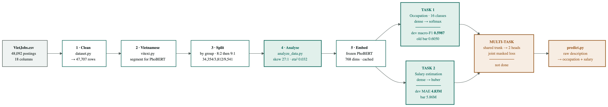
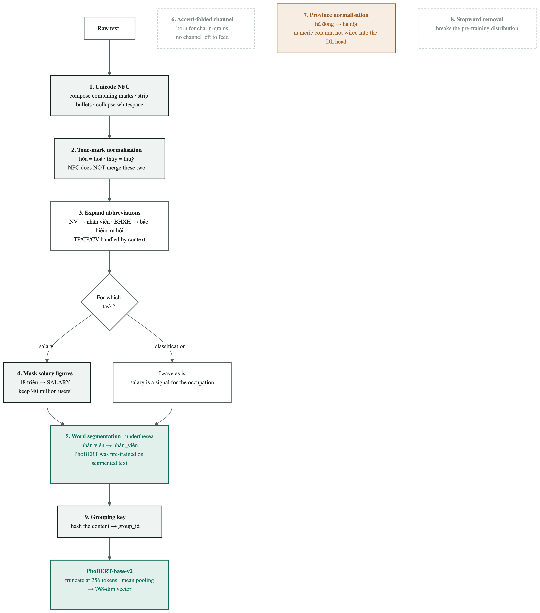
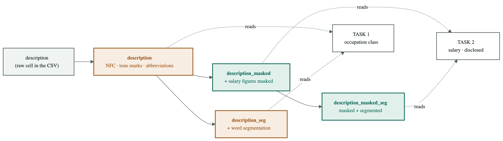
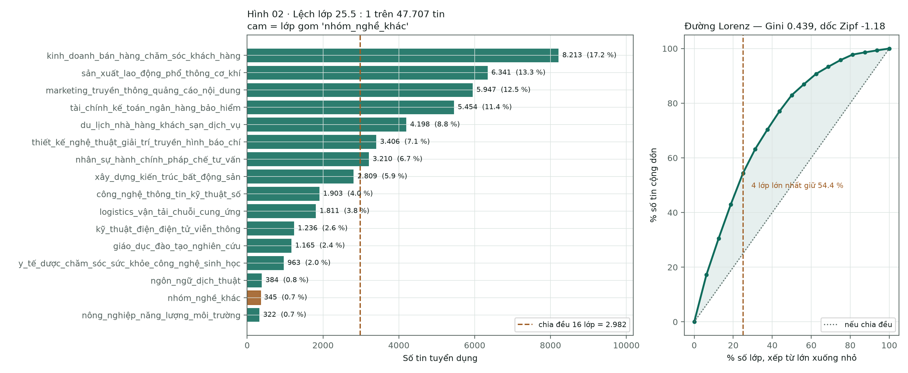
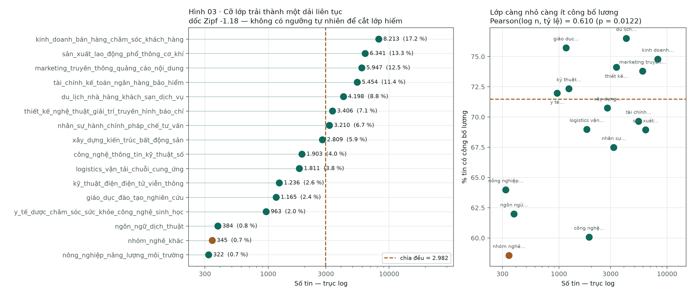
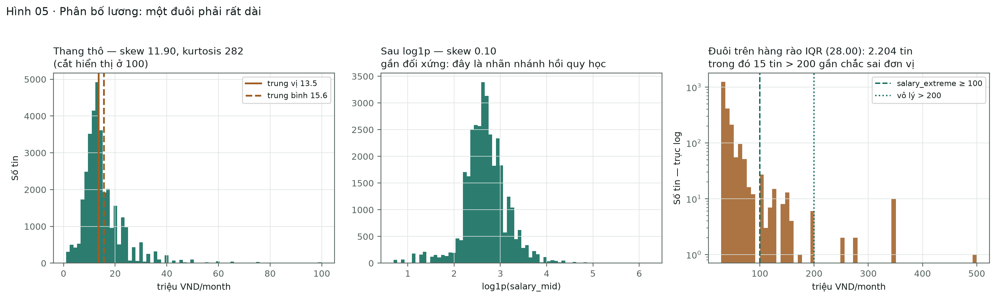
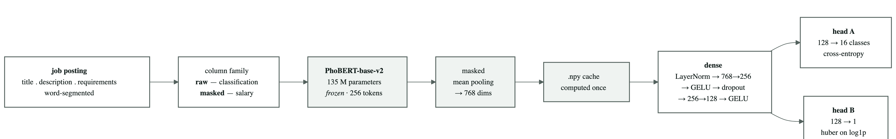

[← Chương 2](03-chuong-2-tong-quan.md) · [Bảng điều khiển](00-index.md) · [Chương 4 →](05-chuong-4-thuc-nghiem.md)

# CHƯƠNG 3. PHƯƠNG PHÁP THỰC HIỆN

Chương này trình bày toàn bộ đường đi của dữ liệu, từ tệp CSV thô đến vectơ đưa vào
mạng nơ-ron. Mỗi bước được trình bày theo ba nhịp: **nguyên lý hoạt động**, **cách
áp dụng trong đề tài**, và **lý do lệch khỏi giá trị mặc định** kèm số đo.

---

## 3.1. Tổng quan quy trình thực hiện



**Hình 3.1: Sơ đồ tổng quan quy trình thực hiện đề tài**

Quy trình gồm sáu khâu nối tiếp:

**Bảng 3.1: Sáu khâu của quy trình**

| Khâu | Việc làm | Mô-đun | Đầu ra |
|---|---|---|---|
| 1 | Làm sạch, loại trùng | `dataset.py` | 47.707 dòng |
| 2 | Xử lý tiếng Việt, tách từ | `vitext.py` | 9 cột đã tách từ |
| 3 | Chia tập theo nhóm | `dataset.py` | 34.354 / 3.812 / 9.541 |
| 4 | Phân tích khám phá | `scripts/analyze_data.py` | 5 hình + `summary.json` |
| 5 | Biểu diễn bằng PhoBERT | `dl/encode.py` | vectơ 768 chiều, lưu đệm |
| 6 | Huấn luyện phần dày đặc | `dl/train_dl.py` | mô hình + `metrics.json` |

Một quyết định kiến trúc bao trùm cả sáu khâu: **các khâu 1–3 chạy một lần và kết
quả được ghi xuống đĩa**, các khâu 5–6 đọc lại kết quả đó. Lý do là chi phí: riêng
việc tách từ cho 47.707 tin mất **780,3 giây** (13 phút), với **0 lỗi**. Nếu tách từ
nằm trong vòng lặp huấn luyện thì 27 lần thí nghiệm sẽ tiêu gần 6 giờ chỉ để tính đi
tính lại đúng một kết quả.

---

## 3.2. Dữ liệu và kiểm toán dữ liệu

### 3.2.1. Mô tả nguồn dữ liệu

**Bảng 3.2: Thuộc tính của tệp dữ liệu thô**

| Thuộc tính | Giá trị |
|---|---|
| Tệp | `data/raw/VietJobs.csv` |
| Số dòng | 48.092 |
| Số cột | 18 |
| sha256 | `85862b06fda4e814…d0c49d477` |
| Đơn vị lương | triệu VND/tháng |

Mã băm sha256 được ghi vào `manifest.json` với đúng một nhiệm vụ: nếu tệp thô thay
đổi, mọi con số đã đo mất tính so sánh được, và điều đó phải được phát hiện ngay lập
tức chứ không phải ba tuần sau.

Mười tám cột gốc chia thành bốn nhóm:

**Bảng 3.3: Mô tả các trường dữ liệu**

| Nhóm | Các cột | Vai trò |
|---|---|---|
| Văn bản tự do | `job_title` · `description` · `requirements_text` | Tín hiệu chính, là đầu vào của PhoBERT |
| Danh sách | `qualifications` · `technical_skills` · `soft_skills` · `benefits` | Vừa cho ra văn bản, vừa cho ra một cột đếm |
| Có cấu trúc | `location` · `country` · `languages_required` · `experience_required` · `contract_type` · `working_hours` | Cột số và cột one-hot |
| **Nhãn** | `category` · `salary` · `salary_min` · `salary_max` · `salary_avg` | Đáp án. Bốn cột lương **không bao giờ** vào ma trận đặc trưng |

**Một chi tiết đọc dữ liệu có hệ quả lớn.** Hàm `load_raw` đọc **mọi cột dưới dạng
chuỗi** và chỉ coi chuỗi rỗng là giá trị khuyết. Lý do: để thư viện tự suy kiểu là để
nó âm thầm biến `"01"` thành `1`, và biến `"NA"` — một mã ngành có thật — thành giá
trị khuyết. Ép kiểu chuỗi rồi tự phân tích thì chậm hơn nhưng không có bất ngờ.

### 3.2.2. Loại trùng lặp — hai tầng, hai mục đích khác nhau

Đây là chỗ dễ nhầm nhất trong toàn bộ quy trình, nên cần nói rõ:

**Bảng 3.4: Hai tầng xử lý trùng lặp**

| Tầng | Hàm | Việc làm | Kết quả |
|---|---|---|---|
| 1. Trùng khớp hoàn toàn | `drop_duplicates()` | **Xoá** dòng giống nhau trên cả 18 cột | 48.092 → **47.707** (xoá **385**) |
| 2. Gom nhóm trùng gần | `group_key()` | **Không xoá gì.** Chỉ gán một mã chung cho các tin gần giống nhau | 47.707 dòng → **34.899 nhóm** |

**Vì sao hai tầng xử lý khác nhau.** Dòng giống nhau trên cả 18 cột là **lỗi nhập
liệu**, không phải thông tin; giữ lại chỉ khiến mô hình đếm một tin hai lần, tức tự
gán lại trọng số một cách ngẫu nhiên. Ngược lại, tin *gần* giống nhau — "Nhân viên
kinh doanh" đăng lại tuần sau với một câu phúc lợi sửa khác đi — **vẫn là dữ liệu
thật**. Xoá chúng là vứt mẫu đi. Nhưng để chúng rơi vào hai tập khác nhau là rò rỉ.
Giải pháp: giữ lại, và ép cả nhóm vào cùng một tập (§3.5).

**Số đo:** **12.808 dòng (26,8 %)** là tin đăng lại; nhóm lớn nhất có 33 dòng.

### 3.2.3. Sửa chữa nhãn lương

Bốn phép sửa, mỗi phép ứng với một dạng bẩn có thật trong dữ liệu:

**Bảng 3.5: Bốn phép sửa nhãn lương**

| Hiện tượng trong dữ liệu | Cách sửa |
|---|---|
| Có dòng `salary_min > salary_max` | Hoán đổi lại bằng `np.minimum` / `np.maximum` |
| Chỉ công bố **một** biên (min = 0, max > 0) | Dùng biên có thật cho cả hai |
| Không công bố con số nào | `salary_mid = 0` → `salary_disclosed = 0` |
| Phân bố lệch phải nặng | Nhãn hồi quy là `log1p(salary_mid)` |

**Giá trị cực trị được đánh dấu, không bị xoá.** Cột `salary_extreme = 1` khi trung
điểm ≥ 100 triệu.

*Lý do không cắt đuôi phân bố:* **cái đuôi là thật**. Một giám đốc điều hành thực sự
nhận 500 triệu. Xoá những dòng đó là dạy mô hình rằng lương cao không tồn tại — nó sẽ
đạt điểm cao hơn *trên tập đã bị cắt*, và sai một cách có hệ thống ngoài đời. Đánh
dấu rồi báo cáo riêng là trung thực; xoá đi rồi khoe một MAE đẹp là tự lừa mình.

*Cách xử lý cái đuôi mà không vứt dữ liệu:* dùng `log1p` làm nhãn hồi quy. Sai 5
triệu ở mức lương 10 triệu là sai nặng; sai 5 triệu ở mức 200 triệu là gần đúng.
Thang logarit nói được điều đó, thang tuyến tính thì không.

> **Nguồn số liệu:** `data/processed/manifest.json` ·
> [01-data-audit.md](../01-data-audit.md).

---

## 3.3. Xử lý ngôn ngữ tiếng Việt



**Hình 3.2: Chín bước xử lý tiếng Việt và nơi từng bước được gọi**

### 3.3.1. Nguyên lý — vì sao phải chuẩn hoá cho PhoBERT

PhoBERT không đếm từ; nó cắt văn bản thành **đơn vị con BPE** rồi tra trong một bảng
nhúng. Bảng đó học từ một kho văn bản có phân bố cụ thể. Mọi bước chuẩn hoá dưới đây
tồn tại vì đúng một lý do: **kéo văn bản của đề tài về gần phân bố mà PhoBERT đã
học**.

Lệch phân bố không sinh ra thông báo lỗi. Nó chỉ làm vỡ chuỗi đơn vị con thành những
mảnh hiếm, và vectơ ngữ nghĩa thu được nhạt đi mà không có dấu hiệu nào trên màn
hình.

### 3.3.2. Chín bước và ba nhóm mục đích

**Bảng 3.6: Chín bước xử lý tiếng Việt**

| # | Bước | Ví dụ | Mục đích | Trạng thái |
|---|---|---|---|---|
| 1 | Chuẩn hoá Unicode NFC | gộp dấu tổ hợp, bỏ ký tự đầu dòng, gộp khoảng trắng | Gộp biến thể | dùng |
| 2 | Chuẩn hoá vị trí dấu thanh | `hòa` = `hoà` · `thúy` = `thuý` | Gộp biến thể | dùng |
| 3 | Mở rộng từ viết tắt | `NV` → `nhân viên` · `BHXH` → `bảo hiểm xã hội` | Gộp biến thể | dùng |
| 4 | Che con số lương | `18 triệu` → `<SALARY>` | Chặn rò rỉ | dùng |
| 5 | Tách từ | `nhân viên` → `nhân_viên` | Khớp phân bố tiền huấn luyện | **bắt buộc** |
| 6 | Kênh bỏ dấu | `nhân viên` → `nhan vien` | — | **đã gỡ** |
| 7 | Chuẩn hoá tỉnh thành | `hà đông` → `hà nội` | Gộp biến thể | dùng (tạo cột mới) |
| 8 | Loại từ dừng | bỏ `và`, `của`, `các` | — | **đã gỡ** |
| 9 | Khoá gom nhóm | băm nội dung → `group_id` | Chặn rò rỉ | dùng |

Ba nhóm mục đích:

- **Gộp biến thể về một cách viết** — bước 1, 2, 3, 7. Một cách viết lạ là một chuỗi
  đơn vị con lạ.
- **Khớp phân bố tiền huấn luyện** — bước 5.
- **Chặn rò rỉ** — bước 4 và 9. Không để mô hình nhìn thấy đáp án, dù đáp án nằm
  trong chính đầu vào (bước 4) hay nằm ở tập kiểm tra (bước 9).

**Thứ tự trong `preprocess` là cố định và có lý do:** NFC → dấu thanh → viết tắt →
che lương → tách từ → từ dừng. Che lương phải chạy **sau** khi mở rộng viết tắt (vì
`8tr` phải thành một con số trước khi che được) và **trước** khi tách từ (vì
`<SALARY>` không được phép bị tách).

### 3.3.3. Hai bước bị gỡ bỏ, và vì sao đó là kết quả chứ không phải thiếu sót

Theo Quy tắc 2 của giao thức thực nghiệm, **bước nào không có dòng đo chứng minh
đóng góp thì bị gỡ**. Hai bước đã bị gỡ, và cả hai đảo ngược kết luận khi trục mô
hình chuyển từ TF-IDF sang PhoBERT:

- **Bước 6 — bỏ dấu.** Bước này sinh ra để nuôi kênh n-gram ký tự của TF-IDF. Khi
  chuyển sang PhoBERT thì không còn kênh nào để nuôi, nên bước này mất chỗ đứng.
- **Bước 8 — loại từ dừng.** Từ dừng chính là các hư từ mà một mô hình ngữ cảnh cần
  để hiểu câu. Xoá chúng là phá vỡ phân bố tiền huấn luyện.

Ngược lại, **bước 5 (tách từ) đổi kết luận từ "có hại nhẹ" sang "bắt buộc"** — vì
TF-IDF và PhoBERT là hai mô hình khác nhau, cùng một bước có thể cho hai kết luận
trái ngược. Đây là một bài học phương pháp luận đáng ghi lại hơn cả con số.

### 3.3.4. Hai việc `vitext.py` cố tình **không** làm

- **Không bóc thẻ HTML.** Kho dữ liệu này không có thẻ HTML nào. Thêm một bước không
  có gì để làm là thêm một chỗ cho lỗi ẩn nấp.
- **Không chuyển chữ thường.** Bộ tách đơn vị con của PhoBERT phân biệt hoa thường,
  nên giữ nguyên là đúng. Việc này còn cho phép đếm cột `n_acronyms` — số token viết
  hoa toàn bộ trong tiêu đề (`SEO`, `IT`, `PHP`, `QA`, `HR`). Đây là tín hiệu ngành
  nghề rất mạnh và gần như miễn phí; chuyển chữ thường sớm là xoá sạch đặc trưng này.

---

## 3.4. Cơ chế chống rò rỉ dữ liệu



**Hình 3.3: Bốn bản sao của mỗi cột văn bản và quyền đọc của từng bài toán**

### 3.4.1. Nguyên lý

Rò rỉ dữ liệu là tình huống mô hình nhìn thấy thông tin mà lúc dự đoán thật nó không
có. Trong đề tài này có hai đường rò rỉ, và **cả hai đều không sinh ra thông báo
lỗi** — chúng chỉ tạo ra một điểm số đẹp không có giá trị.

### 3.4.2. Cách áp dụng — bốn bản sao và một cửa duy nhất

Mỗi cột văn bản tồn tại ở tối đa bốn dạng, dựng sẵn một lần trong `clean()`:

**Bảng 3.7: Bốn bản sao của một cột văn bản**

| Bản sao | Dựng bằng | Ai được đọc |
|---|---|---|
| `<tên>` | `preprocess(mask=False)` | chỉ bài toán phân loại |
| `<tên>_seg` | thêm bước tách từ | chỉ bài toán phân loại |
| `<tên>_masked` | `preprocess(mask=True)` | chỉ hai bài toán lương |
| `<tên>_masked_seg` | che rồi tách từ | chỉ hai bài toán lương |

**Lý do dựng sẵn cả bốn thay vì tính khi cần:** để việc chọn bản sao trở thành một
phép tra bảng, chứ không phải một nhánh `if` rải rác khắp mã nguồn. Nơi duy nhất
quyết định là hàm `features.resolve_column`. Một cánh cửa thì kiểm thử được; mười
nhánh `if` thì không.

Bốn cột được che: `job_title`, `description`, `requirements_text` và `benefits_text`.
Cột phúc lợi được che riêng vì nó nhắc lại con số lương nhiều hơn mọi cột khác —
**10,65 %** số dòng.

**Điểm quan trọng đối với nhánh học sâu:** bộ đệm vectơ PhoBERT được tách thành hai
họ tệp riêng trong `artifacts/embeddings/` — họ `raw` cho phân loại và họ `masked`
cho lương. Trộn hai tệp này là một vụ rò rỉ lương âm thầm. Ràng buộc được giữ bằng
`tests/test_no_leak.py` (22 kiểm thử) và `tests/test_dl_text.py` (6 kiểm thử).

**Một hạn chế cần nói thẳng:** danh sách cột được bảo vệ (`UNMASKED_COLUMNS`) hiện
vẫn là **danh sách viết tay**, nên bộ kiểm thử chỉ canh được những cột mà người viết
nghĩ ra. Hai cột `soft_skills_text` và `qualifications_text` từng lọt qua danh sách
này. Đường học sâu hiện chỉ đọc ba trường văn bản nên chưa bị ảnh hưởng, nhưng đây là
một việc còn tồn đọng, không phải một vấn đề đã đóng.

---

## 3.5. Phân chia tập dữ liệu

### 3.5.1. Nguyên lý — chia theo nhóm, không chia theo dòng

Thuật toán `group_stratified_split` phải thoả **hai** ràng buộc cùng lúc, và hai ràng
buộc này kéo ngược nhau:

1. **Không nhóm nào được nằm ở hai tập.** Mọi dòng cùng `group_id` phải rơi trọn vào
   một tập.
2. **Lớp hiếm phải sống sót.** Một lớp có 196 dòng phải xuất hiện ở cả tập kiểm định
   lẫn tập kiểm tra, nếu không macro-F1 sẽ được tính trên số lớp khác nhau giữa các
   lần chạy và bảng kết quả mất tính so sánh.

**Cách áp dụng:** với **mỗi** lớp ngành nghề, xáo trộn các nhóm, rồi đặt **nhóm lớn
nhất trước** vào tập nào đang thiếu so với hạn mức nhiều nhất. Đặt nhóm lớn trước vì
chúng khó xếp nhất — để đến cuối thì chúng làm lệch tỷ lệ mà không còn gì để bù.

### 3.5.2. Lược đồ hai tầng

Từ ngày 2026-09-09, phép chia chạy **hai lần**:

1. `train_pool : test` = **8 : 2**
2. tập pool đó chia tiếp, `train : dev` = **9 : 1**

Kết quả là tỷ lệ 72 / 8 / 20 trên số dòng. **Lý do chia hai lần thay vì một lần chia
ba:** tầng 2 phải chạy lại được — đổi lát cắt dev khác, hoặc chạy k-fold trên pool —
**mà không một dòng nào của `test` bị dịch chuyển**. Đó chính là điều giữ cho `test`
dùng được đúng một lần, ở cuối. Tầng 2 rút với `seed + 1` để hai tầng không dùng
chung một hoán vị. Hạt giống `SPLIT_SEED = 20260826` không đổi.

**Bảng 3.8: Kết quả phân chia tập dữ liệu**

| Tập | Số dòng | Tỷ lệ | Số nhóm | Tin có công bố lương | Số lớp |
|---|---|---|---|---|---|
| train | 34.354 | 72,01 % | 22.026 | 24.669 | 16 |
| dev | 3.812 | 7,99 % | 3.728 | 2.705 | 16 |
| test | 9.541 | 20,00 % | 9.145 | 6.719 | 16 |

`groups_straddling_splits` = **0**, và hàm `build()` có một câu lệnh `assert` kiểm
tra điều đó. Câu lệnh này không bao giờ được phép tắt đi. Tỷ lệ thực tế lệch không
quá 0,01 điểm phần trăm so với mục tiêu, dù đơn vị chia là nhóm chứ không phải dòng.

**Cái giá của lược đồ mới là tập dev mỏng:** lớp nhỏ nhất, `nhóm_nghề_khác`, chỉ có
**25** dòng trong dev (198 trong train, 64 trong test). F1 của lớp đó trên dev được
đo trên 25 mẫu và sẽ dao động mạnh; phải đọc kèm `f1_macro_no_junk` và xác nhận trên
`test` ở cuối.

### 3.5.3. Chính sách chạm vào tập kiểm tra

**Bảng 3.9: Chính sách sử dụng ba tập dữ liệu**

| Tập | Dùng để | Được chạm bao nhiêu lần |
|---|---|---|
| `train` | Huấn luyện | Không giới hạn |
| `dev` | Chọn mô hình, siêu tham số, cấu hình tiền xử lý | Không giới hạn |
| `test` | Báo cáo con số cuối cùng | **Đúng một lần**, ở cuối |

`test` không chỉ hiếm khi được chạm — nó **không bao giờ bị biến đổi**. Không lọc,
không loại trùng, không cân bằng lớp, không cắt ngoại lệ, không chia lại. Mọi phép
làm sạch hay điều chỉnh chỉ áp lên `train` và `dev`. Chương trình huấn luyện từ chối
chạy với `--eval test` nếu không có cờ `--confirm-test`; cờ này tồn tại để việc chạm
vào test là một hành động có chủ ý, không phải một mặc định.

Lý do sâu hơn: mỗi lần nhìn vào test rồi quay lại chỉnh mô hình là một lần thông tin
từ test rò vào một quyết định thiết kế. Làm vài lần thì test không còn là một ước
lượng không thiên lệch nữa.

---

## 3.6. Phân tích khám phá dữ liệu

Mọi số trong mục này đo trên tập `train` và sinh lại được bằng
`python scripts/analyze_data.py`.

> ⛔ **CHƯA CÓ SỐ LIỆU** — bản `artifacts/eda/summary.json` hiện tại ghi
> `n_rows = 33.396`, tức đo trên tập train của **lược đồ chia v1**. Tập train hiện
> tại có 34.354 dòng. Phải chạy lại `scripts/analyze_data.py` trước khi nộp; các con
> số dưới đây gần như chắc chắn sẽ dịch chuyển ở chữ số thập phân.

### 3.6.1. Độ lệch lớp



**Hình 3.4: Phân bố số tin theo 16 nhóm ngành nghề**

**Bảng 3.10: Thống kê độ lệch lớp**

| Đại lượng | Giá trị |
|---|---|
| Số lớp | 16 |
| Lớp lớn nhất | `kinh_doanh_bán_hàng_chăm_sóc_khách_hàng` — 5.330 tin (16,0 %) |
| Lớp nhỏ nhất | `nông_nghiệp_năng_lượng_môi_trường` — 197 tin (0,6 %) |
| Tỷ lệ lệch | **27,1 : 1** |
| Lớp gom tạp `nhóm_nghề_khác` | 250 tin (0,7 %) |



**Hình 3.5: Tán xạ cỡ lớp trên thang logarit, và tỷ lệ công bố lương theo cỡ lớp**

Hình 3.5 cho thấy ba điều mà biểu đồ cột không cho thấy:

**Bảng 3.11: Cấu trúc dải cỡ lớp**

| Đại lượng | Giá trị | Cách đọc |
|---|---|---|
| Nếu chia đều 16 lớp | 2.087 tin/lớp | Chỉ 8 lớp đạt mức đó |
| Cỡ lớp trung vị | 1.690 tin | Thấp hơn trung bình — dải lệch phải |
| Bốn lớp lớn nhất | **55,2 %** dữ liệu | Bốn ngành chiếm hơn nửa kho |
| Bốn lớp nhỏ nhất | **4,2 %** dữ liệu | Cả bốn cộng lại chưa bằng một phần ba lớp lớn nhất |
| Độ dốc Zipf | **−1,19** | Một cái đuôi liên tục, không phải vài lớp hiếm tách biệt |

Độ dốc −1,19 là con số quan trọng nhất bảng: nó nói rằng độ lệch lớp ở đây là **một
dải liên tục**, không phải hai cụm "lớp bình thường" và "lớp hiếm". Vì vậy **không
tồn tại một ngưỡng tự nhiên** để cắt ra vài lớp hiếm rồi gộp vào `nhóm_nghề_khác` —
mọi điểm cắt đều tuỳ tiện, và mỗi lớp bị gộp là mất nhãn thật của nó.

**Hệ quả trực tiếp cho việc chấm điểm:** luôn đoán lớp lớn nhất cho accuracy
**0,2014** nhưng macro-F1 chỉ **0,0210**. Đó là lý do độ đo chính là macro-F1 chứ
không phải accuracy.

**Hệ quả cho việc huấn luyện:** một hàm cross-entropy trần sẽ ưu ái bốn lớp lớn
(55 % dữ liệu). Cờ `--class-weight` tồn tại để **đo xem** cân bằng lớp có giúp ích
không, chứ không phải để bật mặc định.

### 3.6.2. Phân bố mức lương



**Hình 3.6: Phân bố mức lương trước và sau phép biến đổi `log1p`**

**Bảng 3.12: Phân vị mức lương (đơn vị: triệu VND/tháng)**

| Phân vị | p01 | p05 | p25 | **trung vị** | p75 | p95 | p99 | max |
|---|---|---|---|---|---|---|---|---|
| Giá trị | 2,5 | 6,5 | 10,0 | **13,0** | 17,5 | 30,0 | 50,0 | **350,0** |

**Bảng 3.13: Hình dạng phân bố trước và sau `log1p`**

| Hình dạng | Thang thô | Sau `log1p` |
|---|---|---|
| Độ lệch (skewness) | **11,84** | **0,12** |
| Độ nhọn (kurtosis) | 255,2 | — |

Trung bình 15,5 nằm **cao hơn** trung vị 13,0 — dấu hiệu kinh điển của đuôi phải.
Huấn luyện hồi quy trên thang thô là để 13 tin trên 200 triệu kéo toàn bộ gradient;
huấn luyện trên `log1p` đưa độ lệch về 0,12, gần như đối xứng. Vì vậy nhánh hồi quy
học `log1p(salary_mid)` và mọi báo cáo đều quy đổi ngược về triệu VND.

### 3.6.3. Ranh giới — đâu là đuôi thật, đâu là rác

**Bảng 3.14: Các giá trị ở hai biên của phân bố lương**

| Ngưỡng | Số tin | Cách đọc |
|---|---|---|
| Trên hàng rào IQR (> 28,75) | **1.491** (6,2 %) | Phần lớn là lương quản lý thật — **không cắt** |
| Dưới hàng rào IQR | **0** | Phân bố bị chặn dưới, không có đuôi trái |
| < 2 triệu/tháng | **103** | Gần như chắc chắn là lương theo giờ hoặc theo ca nhập nhầm ô |
| > 200 triệu/tháng | **13** | Gần như chắc chắn là lương năm, hoặc sai đơn vị |
| Đã bị `clean` đánh dấu `salary_extreme` | 76 | Bộ lọc hiện tại **chưa phủ hết** 116 tin đáng ngờ ở trên |

Đây là một việc còn tồn đọng: 116 tin ở hai biên chưa được xử lý. Chúng ít (0,5 % số
nhãn) nhưng nằm đúng chỗ gây hại nhiều nhất cho MAE.

Một con số nữa cần cho bối cảnh: **93,0 %** tin có công bố lương đưa ra một *khoảng*
chứ không phải một con số. `salary_mid` là trung điểm của khoảng đó — nghĩa là bản
thân nhãn hồi quy đã là một xấp xỉ, và sai số dưới khoảng 1 triệu không nên đọc thành
tín hiệu.

### 3.6.4. Nhãn lương chỉ tồn tại trên 71,8 % dữ liệu


**Hình 3.7: Tỷ lệ tin có công bố mức lương theo ngành nghề**

Tỷ lệ công bố trải từ **56,8 %** (`nhóm_nghề_khác`) đến **76,4 %** (du lịch, giáo
dục), và **không phân bố ngẫu nhiên**:

**Bảng 3.15: Quan hệ giữa cỡ lớp và nhãn lương**

| Đại lượng | Hệ số | p |
|---|---|---|
| Tỷ lệ công bố — Pearson(log n) | **0,670** | 0,0045 |
| Mức lương trung vị — Spearman | −0,234 | 0,383 |

Cỡ lớp gắn chặt với **việc nhãn lương có tồn tại hay không**, nhưng không nói gì về
**mức lương là bao nhiêu**. Năm ngành nhỏ nhất vì vậy chịu phạt hai lần. Ba hệ quả:

1. Nhánh hồi quy chỉ có nhãn cho 7 tin trong 10. Khi hợp nhất đa nhiệm, `loss_B`
   **bắt buộc phải được che**: 28,2 % còn lại đóng góp 0 vào hàm mất mát, chứ không
   phải đóng góp một nhãn bằng 0.
2. Bài toán `disclosed` có mốc đa số là accuracy **0,7117**. Mô hình nào không vượt
   được mốc đó là vô dụng.
3. Việc công bố lương **phụ thuộc ngành**, nên bỏ qua 28,2 % còn lại không phải một
   phép bỏ sót ngẫu nhiên: mô hình hồi quy học trên một mẫu đã bị chọn lọc.

### 3.6.5. Phát hiện quan trọng nhất — ngành nghề gần như không nói gì về lương


**Hình 3.8: Tán xạ mức lương trong từng nhóm ngành nghề**

Phân rã phương sai của `log1p(salary_mid)` trên 16 ngành:

**Bảng 3.16: Phân rã phương sai log-lương theo ngành nghề**

| Đại lượng | Giá trị |
|---|---|
| eta² (phương sai giữa ngành / tổng) | **0,032** — ngành nghề giải thích **3,2 %** |
| Trung vị thấp nhất | `nhóm_nghề_khác` — 11,0 |
| Trung vị cao nhất | `xây_dựng_kiến_trúc_bất_động_sản` — 16,0 |

Một phép đo khác cho cùng kết luận:

**Bảng 3.17: Mốc cơ sở không dùng mô hình cho bài toán lương**

| Quy tắc dự đoán | MAE (triệu) | R² |
|---|---|---|
| Đoán trung vị tập train (13,0) cho mọi tin | **5,86** | −0,063 |
| **Biết trước ngành nghề thật**, đoán trung vị ngành đó | **5,75** | −0,032 |

Biết 100 % nhãn ngành nghề chỉ giảm MAE được **1,8 %**. Ba kết luận, và cả ba định
hình phần còn lại của đề tài:

1. **Mốc của nhánh hồi quy là MAE 5,86 triệu**, không phải 0. Mô hình cho ra 5,8
   triệu là mô hình chưa học được gì.
2. Tín hiệu lương nằm trong **chi tiết của tin đăng** — cấp bậc, số năm kinh nghiệm,
   ngoại ngữ, địa điểm — chứ không nằm ở nhãn ngành. Đây đúng là thứ PhoBERT có cơ
   hội đọc được mà TF-IDF ở mức ngành thì không.
3. **Kỳ vọng cho mô hình đa nhiệm phải hạ xuống.** Phần tín hiệu dùng chung đo được
   chỉ là 3,2 %. Vì vậy lộ trình xây hai mạng riêng trước, lấy số của từng mạng, rồi
   mới hợp nhất — nếu bản hợp nhất kém hơn thì đã biết vì sao.

---

## 3.7. Kiến trúc mô hình đề xuất



**Hình 3.9: Kiến trúc PhoBERT đóng băng + khối kết nối đầy đủ + hai nhánh đầu ra**

### 3.7.1. Luồng dữ liệu

```
tin tuyển dụng (tiêu đề · mô tả · yêu cầu, đã tách từ)
   → chọn họ cột: raw (phân loại) | masked (lương)
   → PhoBERT-base-v2, 135 triệu tham số, ĐÓNG BĂNG, cắt ở 256 token
   → gộp trung bình có mặt nạ → vectơ 768 chiều
   → lưu đệm .npy (tính một lần)
   → LayerNorm → 768→256 → GELU → dropout → 256→128 → GELU
   → nhánh A: 128 → 16 lớp   (cross-entropy)
   → nhánh B: 128 → 1        (Huber trên log1p)
```

Ở mức cơ sở, **nhánh A và nhánh B nằm trong hai mạng riêng biệt**, mỗi mạng có khối
dày đặc của mình. Hình 3.9 vẽ chúng cạnh nhau để chỉ ra chỗ thân và nhánh sẽ tách ra
khi hợp nhất đa nhiệm — chỗ đó chính là khối `dense`.

### 3.7.2. Năm quyết định thiết kế và lý do đo được của từng quyết định

**Bảng 3.18: Năm quyết định kiến trúc**

| Quyết định | Lý do |
|---|---|
| **Đóng băng PhoBERT trước** | Mức đóng băng chạy trong vài phút, mức tinh chỉnh chạy hàng giờ. Nếu bản đóng băng không vượt nổi mốc TF-IDF 0,6112 thì lỗi nhiều khả năng nằm ở đường dữ liệu — phát hiện ở mức rẻ tiền hơn nhiều |
| **Đầu vào đã tách từ** | PhoBERT được tiền huấn luyện trên văn bản tách từ. Đưa văn bản chưa tách là đưa sai phân bố |
| **Gộp trung bình, không dùng vectơ `<s>`** | Khi không tinh chỉnh, vectơ `<s>` của PhoBERT chưa từng được huấn luyện cho nhiệm vụ nào; lấy trung bình các token giữ lại nhiều tín hiệu từ vựng hơn |
| **Lưu đệm vectơ ra `.npy`** | Trọng số đóng băng ⇒ vectơ không đổi giữa các epoch. Nhúng 33 nghìn tin mất khoảng 20 phút trên CPU; một epoch trên vectơ đã đệm chỉ mất vài giây |
| **Huber cho hồi quy, không dùng MSE** | Lương lệch phải nặng (độ lệch 11,84, max 350 triệu). MSE để 13 điểm ngoại lệ kéo toàn bộ gradient |

### 3.7.3. Chuẩn hoá đầu vào — quyết định cứu cả nhánh phân loại

Vectơ PhoBERT **dị hướng**: cosin giữa hai tin bất kỳ có trung vị **0,896**
(p05 = 0,838 · p95 = 0,943) — mọi tin nằm trong một hình nón hẹp. `LayerNorm` chuẩn
hoá **theo từng mẫu**, nên nó không gỡ bỏ được hướng chung đó.

Giải pháp gồm ba phần, áp cùng lúc:

1. Chuẩn hoá **theo từng chiều** bằng thống kê của tập `train`, lưu thành
   `scaler.npz` bên cạnh mô hình — vì đường suy luận bắt buộc phải dùng đúng những
   con số đó (Quy tắc 4: huấn luyện và suy luận dùng chung một đường mã).
2. Cắt chuẩn gradient ở **1,0**.
3. Giảm tốc độ học từ 1e-3 xuống **3e-4**.

Sự cố dẫn tới ba quyết định này, và cách chẩn đoán nó, được trình bày ở §4.6 — vì đó
là một kết quả thực nghiệm, không phải một lựa chọn thiết kế có sẵn.

---

## 3.8. Các độ đo đánh giá

### 3.8.1. Bài toán phân loại ngành nghề

**Độ đo chính: macro-F1.** Lớp lớn nhất gấp 27 lần lớp nhỏ nhất, nên accuracy sẽ vui
vẻ che giấu một mô hình bỏ qua toàn bộ cái đuôi.

*Nguyên lý:* với mỗi lớp, tính precision và recall rồi lấy trung bình điều hoà thành
F1; macro-F1 là trung bình cộng **không trọng số** của 16 giá trị F1 đó. Không trọng
số nghĩa là lớp 197 tin có tiếng nói ngang lớp 5.330 tin.

Báo cáo kèm theo:

- `f1_macro_no_junk` — macro-F1 trên 15 lớp, bỏ `nhóm_nghề_khác`. Lớp này là ngăn
  chứa tạp; báo cáo cả hai con số giữ cho **nhiễu nhãn** và **lỗi mô hình** không bị
  trộn làm một.
- `balanced_accuracy`, `accuracy`, `top3_accuracy`.
- Ma trận nhầm lẫn và 10 cặp lớp bị nhầm nhiều nhất.

### 3.8.2. Bài toán hồi quy mức lương

Mọi con số được **quy đổi về triệu VND/tháng** trước khi báo cáo. Một MAE trong không
gian logarit không phải con số ai hành động được.

**Bảng 3.19: Các độ đo của bài toán hồi quy**

| Độ đo | Ý nghĩa |
|---|---|
| MAE | Sai số tuyệt đối trung bình |
| MedAE | Sai số tuyệt đối trung vị — bền với ngoại lệ hơn MAE |
| R² (log) | Hệ số xác định, tính trên thang `log1p` |
| ±20 % | Tỷ lệ tin có dự đoán nằm trong ±20 % giá trị thật |

### 3.8.3. Quy tắc quyết định khi so sánh hai mô hình

Ba ràng buộc bắt buộc với mọi bảng so sánh:

1. **Mọi mô hình được thử cùng một số cấu hình.** So "cái tốt nhất trong chín lần
   thử" với "lần thử đầu tiên" là so công sức tinh chỉnh, không phải so thuật toán.
2. **Mỗi lần chạy đều lưu dự đoán từng dòng.** Không có nó thì lần chạy đó **không
   ghép cặp được** với lần chạy nào khác.
3. **Quyết định bằng bootstrap ghép cặp, không bằng độ lệch chuẩn.** Dùng **một** ma
   trận chỉ số dùng chung cho mọi mô hình được so, rồi đọc `P(A > B)`. Ngưỡng:
   **> 0,975 hoặc < 0,025** là khác biệt rõ; quanh 0,5 là không phân biệt được.

Độ lệch chuẩn theo từng mô hình vẫn được báo cáo nhưng **không dùng để ra quyết
định**: nó trả lời "điểm số này dịch chuyển bao nhiêu nếu đổi tập dev", trong khi câu
hỏi cần trả lời là "A có thắng B trên đúng những dòng đó không". Hai mô hình thường
sai trên cùng những tin mơ hồ, nên phép so ghép cặp nhạy hơn hẳn.

> **Nguồn số liệu:** [03-protocol.md](../03-protocol.md) §4 và §7 ·
> [05-phan-tich-du-lieu.md](../05-phan-tich-du-lieu.md) ·
> [06-baseline-dl.md](../06-baseline-dl.md) §2 và §5.4.

---

[← Chương 2](03-chuong-2-tong-quan.md) · [Chương 4 →](05-chuong-4-thuc-nghiem.md)
