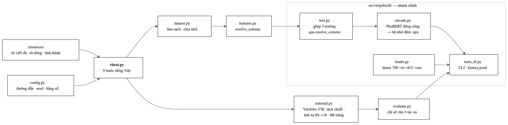

[← Chương 4](05-chuong-4-thuc-nghiem.md) · [Bảng điều khiển](00-index.md) · [Chương 6 →](07-chuong-6-ket-luan.md)

# CHƯƠNG 5. CÀI ĐẶT HỆ THỐNG MINH HOẠ

> ⛔ **CHƯA LÀM.** Hệ thống web chưa được xây dựng. Chương này hiện gồm hai phần:
> phần **đã có thật** — cấu trúc mã nguồn và bộ kiểm thử đang chạy (§5.1–§5.3), và
> phần **thiết kế dự kiến** — kiến trúc dịch vụ, API và giao diện (§5.4–§5.6), đánh
> dấu rõ là chưa hiện thực hoá. Không mục nào trong §5.4–§5.6 được viết như thể đã
> chạy.

---

## 5.1. Các công nghệ sử dụng

**Bảng 5.1: Công nghệ và thư viện đã dùng**

| Nhóm | Công nghệ | Vai trò trong đề tài |
|---|---|---|
| Ngôn ngữ | Python | Toàn bộ mã nguồn |
| Xử lý dữ liệu | pandas · NumPy · PyArrow | Đọc CSV, dựng cột dẫn xuất, ghi parquet |
| Xử lý tiếng Việt | `underthesea` | Tách từ tiếng Việt |
| Mô hình ngôn ngữ | `transformers` · PhoBERT-base-v2 | Sinh vectơ ngữ nghĩa 768 chiều |
| Học sâu | PyTorch | Khối kết nối đầy đủ và vòng huấn luyện |
| Học máy | scikit-learn | Mốc so sánh TF-IDF + LinearSVC, các phép dò tuyến tính |
| Kiểm thử | pytest | 108 kiểm thử, trong đó 28 kiểm thử canh rò rỉ dữ liệu |

**Bảng 5.2: Hai môi trường ảo và lý do tách riêng**

| Môi trường | Python | Chứa gì | Lý do tách |
|---|---|---|---|
| `.venv` | ≥ 3.10 | dữ liệu, tiếng Việt, học máy, kiểm thử | Môi trường chính |
| `.venv-dl` | 3.9 | gói `dl/`, PyTorch, transformers | `torch` không có bản dựng cho macOS x86_64 sau 2.2.2, và không có bản nào cho Python 3.14 |

Ràng buộc này định hình một quyết định thiết kế: **`dl/text.py` không được phép
import torch**. Nhờ đó bộ kiểm thử đường dữ liệu — phần canh rò rỉ lương — vẫn chạy
được ở môi trường chính, nơi không cài torch.

---

## 5.2. Kiến trúc mã nguồn



**Hình 5.1: Quan hệ phụ thuộc giữa các mô-đun**

Toàn bộ mã nguồn gồm **13 mô-đun · 3.033 dòng · 108 kiểm thử xanh**.

**Bảng 5.3: Vai trò từng mô-đun**

| Tệp | Dòng | Vai trò |
|---|---|---|
| `vitext.py` | 584 | Toàn bộ xử lý tiếng Việt. Hàm thuần tuý, mỗi bước có kiểm thử riêng |
| `dataset.py` | 276 | Làm sạch + chia tập cố định. Tách từ chạy **một lần** và ghi vào parquet |
| `features.py` | 279 | `resolve_column` — cửa duy nhất quyết định bài toán nào đọc cột nào |
| `evaluate.py` | 267 | Độ đo cho cả ba bài toán + bootstrap và so sánh ghép cặp |
| `config.py` | 59 | Đường dẫn · `SPLIT_SEED` · nhóm cột · tên bài toán |
| `dl/text.py` | 40 | Nối ba trường văn bản thành đầu vào PhoBERT. Không phụ thuộc torch |
| `dl/encode.py` | 122 | PhoBERT đóng băng → vectơ 768 chiều, lưu đệm `.npy` theo họ `raw`/`masked` |
| `dl/heads.py` | 37 | Phần dày đặc: 768 → h → h/2 → out |
| `dl/train_dl.py` | 274 | Một lần chạy = một dòng trong `04-results.md` + `history.jsonl` từng epoch |
| `train.py` · `models.py` | 362 · 466 | Đường học máy — giữ lại để chạy lại mốc so sánh |
| `predict.py` | 260 | Mặt tiền suy luận — **chưa biết đường học sâu** |

### 5.2.1. Ba bất biến giữ cả hệ thống đứng vững

**1. Một cánh cửa cho cả hai trục.** Đường học sâu không tự nối vào cột thô: nó gọi
`features.resolve_column` thông qua `dl/text.py`, đúng cánh cửa mà đường học máy dùng.
Nhờ vậy quy tắc chống rò rỉ lương chỉ phải canh ở một chỗ.

**2. `vitext.py` hoàn toàn là hàm thuần tuý.** Cùng đầu vào cho cùng đầu ra, không
đọc trạng thái ngoài, không học gì từ dữ liệu. Đó là thứ cho phép `dataset.py`,
`features.py` và `predict.py` gọi cùng một đoạn mã mà không phân kỳ.

**3. Chỉ có một nơi quyết định bài toán nào đọc cột nào** — `features.resolve_column`.

---

## 5.3. Kiểm thử

**Bảng 5.4: Bộ kiểm thử hiện có (108 kiểm thử)**

| Tệp | Số kiểm thử | Canh điều gì |
|---|---|---|
| `tests/test_vitext.py` | 56 | Từng bước xử lý tiếng Việt, gồm bốn trường hợp "40 triệu người dùng" **không được** che |
| `tests/test_no_leak.py` | 22 | Hai bài toán lương không bao giờ đọc cột chưa che; mọi tên trong danh sách bảo vệ phải là cột có thật |
| `tests/test_train_overrides.py` | 16 | Tham số ghi đè thật sự tới được bộ ước lượng; khoá lạ báo lỗi thay vì bị bỏ qua |
| `tests/test_dl_text.py` | 8 | Đường học sâu đọc đúng cột: bài toán lương chỉ thấy `*_masked`; đầu vào không bị lọc stopword, không bị viết thường |
| `tests/test_bootstrap.py` | 8 | Bootstrap tất định theo hạt giống; hai mô hình giống hệt hoà ở 0,5 |

### 5.3.1. Những kiểm thử còn thiếu — nói thẳng

> ⛔ **CHƯA CÓ SỐ LIỆU** — ba khoảng trống đã biết trong bộ kiểm thử:
>
> - `tests/test_predict.py` **không tồn tại**, dù được nhắc tới trong tài liệu mã
>   nguồn. Đây là chỗ đáng lo nhất vì nó canh Quy tắc 4 (huấn luyện và suy luận dùng
>   chung một đường mã) — sai lệch ở đây là lỗi âm thầm, chỉ lộ ra dưới dạng dự đoán
>   xấu dần đi.
> - Không có kiểm thử nào cho `dataset.clean`.
> - Không có kiểm thử nào cho `group_stratified_split`.

---

## 5.4. Thiết kế hệ thống dự kiến

> ⛔ **CHƯA LÀM** — toàn bộ mục 5.4, 5.5, 5.6 là thiết kế, chưa hiện thực hoá.

### 5.4.1. Kiến trúc ba tầng

```
[Trình duyệt]  ── HTTP ──▶  [Dịch vụ web]  ──▶  [Lớp suy luận]
  biểu mẫu nhập tin            định tuyến           vitext.preprocess
  hiển thị kết quả             kiểm tra đầu vào     → PhoBERT (đóng băng)
                               trả JSON             → khối dense
                                                    → 2 nhánh đầu ra
```

### 5.4.2. Ba việc bắt buộc phải làm trước khi hệ thống chạy được

**Bảng 5.5: Việc còn tồn đọng chặn khâu triển khai**

| # | Việc | Vì sao bắt buộc |
|---|---|---|
| 1 | Nối đường học sâu vào `predict.py` | Hiện `predict.py` **chỉ biết đường học máy**. Quy tắc 4 đang **không được canh** cho nhánh học sâu |
| 2 | Tạo `artifacts/PRODUCTION.json` ánh xạ bài toán → `run_id` | Hiện hệ thống chọn mô hình bằng **thời gian sửa tệp**, tức một lần chạy thử nghiệm cũng có thể vô tình lên sản phẩm |
| 3 | Nạp `scaler.npz` đúng của lần chạy được chọn | Đường suy luận phải chuẩn hoá đầu vào bằng **đúng** thống kê của tập train lúc huấn luyện; dùng sai bộ số là mô hình đọc sai thang đo |

Ba việc này không phải chi tiết kỹ thuật phụ. Chúng là ba chỗ mà sai sót **không sinh
ra thông báo lỗi** — hệ thống vẫn trả về một con số trông hợp lý.

---

## 5.5. Thiết kế API dự kiến

**Bảng 5.6: Đặc tả điểm cuối dự kiến**

| Phương thức | Đường dẫn | Đầu vào | Đầu ra |
|---|---|---|---|
| `POST` | `/api/predict` | `{title, description, requirements}` | `{category, top3, salary_estimate, disclosed_prob}` |
| `GET` | `/api/health` | — | trạng thái mô hình đang phục vụ + `run_id` |

Đầu ra dự kiến trả **ba ngành nghề** kèm độ tin cậy chứ không phải một, vì độ chính
xác top-3 đo được (0,9257) cao hơn hẳn top-1 (0,6493) — đây là một quyết định thiết
kế rút ra trực tiếp từ số liệu thực nghiệm.

Đầu ra lương cần kèm **cảnh báo khi tin rơi vào dải cao**: §4.5.2 cho thấy MAE ở dải
> 30 triệu là 25,58 so với 3,70 ở dải dưới. Trả về một con số duy nhất mà không kèm
cảnh báo là trình bày sai mức độ tin cậy cho người dùng.

---

## 5.6. Giao diện và kiểm thử hệ thống

> ⛔ **CHƯA LÀM** — cần bổ sung sau khi hệ thống chạy được:
>
> - Ảnh chụp màn hình biểu mẫu nhập tin và màn hình kết quả (Hình 5.2, 5.3…).
> - Bảng kịch bản kiểm thử: mỗi dòng gồm tin đầu vào, kết quả mong đợi, kết quả thực
>   tế, đạt/không đạt.
> - **Bảng đo độ trễ suy luận** — bắt buộc, vì mục tiêu cụ thể số 3 của đề tài yêu
>   cầu so sánh cả tốc độ xử lý giữa học sâu và học máy (xem §4.7.2).

---

## 5.7. Nhận xét

Phần **cơ sở hạ tầng thực nghiệm** của đề tài đã hoàn chỉnh và có bằng chứng: 13
mô-đun, 108 kiểm thử xanh, ba bất biến chống rò rỉ được canh bằng 28 kiểm thử, mọi
lần chạy đều ghi lại đủ để tái lập.

Phần **hệ thống phục vụ người dùng** thì chưa bắt đầu, và ba việc ở Bảng 5.5 là điều
kiện cần. Đánh giá trung thực: đây là hạng mục rủi ro nhất còn lại của đề tài, vì nó
nằm ở mục tiêu cụ thể số 4 và ở tuần 11–13 của kế hoạch.

---

[← Chương 4](05-chuong-4-thuc-nghiem.md) · [Chương 6 →](07-chuong-6-ket-luan.md)
