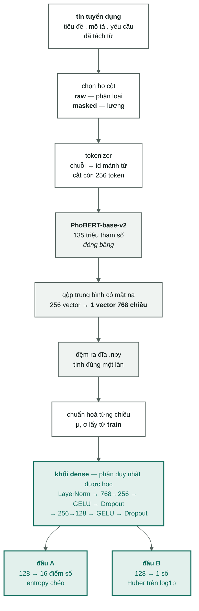

[← Hai bài toán](02-hai-bai-toan-va-doan-duong-chung.md) · [Mục lục](00-index.md) · [Kiến trúc B →](04-kien-truc-b-textcnn.md)

# 3. Kiến trúc A — PhoBERT đóng băng + khối dense

Đây là kiến trúc **đang chạy thật** trong repo. Bài này đi từng mắt xích, mỗi mắt
xích theo đúng một khuôn:

> **làm gì** → **vì sao cần** → **ở đâu trong mã**

Số đo thật của kiến trúc này nằm ở [`docs/06-baseline-dl.md`](../docs/06-baseline-dl.md),
không nằm ở đây.

---

## 1. Toàn cảnh



Phần tô xám là **đóng băng** — không học gì cả. Phần tô xanh là phần thật sự được
huấn luyện. Nhìn kỹ tỷ lệ: PhoBERT có 135 triệu tham số và **không cái nào được
chỉnh**; khối dense chỉ vài trăm nghìn tham số và đó là toàn bộ thứ đang học.

Hai đầu A và B **ở hai mạng khác nhau**, mỗi mạng một khối dense riêng. Sơ đồ vẽ chung
để chỉ ra chỗ sau này sẽ tách nhánh nếu làm bản đa nhiệm — chỗ đó chính là khối dense.

---

## 2. Tokenizer — chuỗi ký tự thành dãy số

**Làm gì.** Nhận chuỗi `"nhân_viên kinh_doanh . mô tả ..."`, trả về một dãy số nguyên,
mỗi số là mã của một **mảnh từ** trong từ điển của PhoBERT.

**Vì sao cần.** Mạng nơ-ron chỉ biết làm toán trên số. Chữ phải thành số trước đã. Và
phải thành số theo **đúng cách PhoBERT đã học lúc tiền huấn luyện**, nếu không thì
mỗi bên nói một ngôn ngữ.

Hai chi tiết quan trọng:

- **Mảnh từ.** Từ nào hiếm sẽ bị chẻ nhỏ, ví dụ `tuyển_dụng` có thể thành `tuyển@@` +
  `dụng`. Nhờ vậy **không có từ nào là từ lạ hoàn toàn** — cái gì cũng chẻ ra được.
  Đây là một khác biệt lớn so với TextCNN ở [bài 4](04-kien-truc-b-textcnn.md).
- **Gạch dưới.** PhoBERT được huấn luyện trên văn bản **đã tách từ**: `nhân_viên` là
  một token, không phải hai. Nên đường học sâu bật `segmented=True` mặc định — nói
  kỹ ở [`docs/02-vietnamese-nlp.md`](../docs/02-vietnamese-nlp.md).

**Ở đâu.** `AutoTokenizer.from_pretrained("vinai/phobert-base-v2")` trong
[`src/vietjobs/dl/encode.py`](../src/vietjobs/dl/encode.py), gọi với
`padding=True, truncation=True, max_length=256`.

---

## 3. Cắt ở 256 token, và đệm cho bằng nhau

**Làm gì.** Tin dài hơn 256 token bị **cắt đuôi**. Tin ngắn hơn được **đệm** thêm ô
rỗng cho đủ độ dài của tin dài nhất trong batch.

**Vì sao cần.** Một batch phải là một khối chữ nhật để tính toán theo lô. Còn giới hạn
256 không phải một lựa chọn — nó là **trần cứng** của `phobert-base-v2`
(`max_position_embeddings = 258`, tức 256 vị trí dùng được, hai vị trí còn lại
dành cho `<s>`/`</s>`); một chuỗi dài hơn làm mô hình báo `IndexError`, không
phải chạy chậm hơn. Chi phí thời gian của Transformer tăng nhanh theo độ dài chỉ
là một hệ quả đi kèm, không phải lý do chọn con số này.

Đây chính là lý do tiêu đề được đặt lên đầu chuỗi ở [bài 2](02-hai-bai-toan-va-doan-duong-chung.md#2-đoạn-đường-chung--từ-tin-tuyển-dụng-thành-một-chuỗi).

---

## 4. Mặt nạ chú ý (attention mask)

**Làm gì.** Một dãy 1/0 dài bằng chuỗi token: 1 là chữ thật, 0 là ô đệm.

**Vì sao cần.** Ô đệm là chỗ trống bịa ra cho đủ hình chữ nhật. Nếu để nó tham gia
phép tính trung bình ở bước sau, thì một tin ngắn sẽ bị pha loãng bởi một đống số 0 —
tin càng ngắn vector càng méo. Mặt nạ là cái thước nói "chỗ này đừng tính".

**Ở đâu.** `enc["attention_mask"]`, dùng ngay ở bước gộp.

---

## 5. PhoBERT đóng băng, và `last_hidden_state`

**Làm gì.** Đẩy dãy id qua PhoBERT, nhận về `last_hidden_state` — **một vector 768
chiều cho mỗi token**, tức một tensor `[số tin, số token, 768]`.

**Vì sao cần.** Đây là chỗ "nghĩa" xuất hiện. PhoBERT đã đọc hàng chục GB tiếng Việt và
học được rằng `bán_hàng` với `kinh_doanh` đứng cạnh những từ giống nhau, nên vector của
chúng gần nhau — dù hai từ không có ký tự nào chung. Biểu diễn chỉ dựa trên việc đếm
từ không bao giờ làm được việc đó. Chi tiết ở
[`docs/nen-tang/09-vector-ngu-nghia.md`](../docs/nen-tang/09-vector-ngu-nghia.md).

**"Đóng băng" nghĩa là gì.** Trọng số PhoBERT bị khoá: `.eval()`, và toàn bộ bước chạy
nằm trong `torch.no_grad()`. Nó chỉ làm **bộ trích đặc trưng**, không học gì từ dữ liệu
VietJobs.

**Vì sao đóng băng trước.** Hai lý do, lý do thứ hai mới là lý do chính:

1. Rẻ: bậc đóng băng chạy vài phút, bậc tinh chỉnh chạy hàng giờ và cần GPU.
2. **Chẩn đoán:** nếu bản đóng băng cho kết quả tệ bất thường, gần như chắc chắn lỗi
   nằm ở **đường dữ liệu** — sai cột, lệch nhãn, rò rỉ. Phát hiện điều đó ở bậc chạy
   vài phút rẻ hơn nhiều so với phát hiện sau vài giờ GPU.

---

## 6. Gộp trung bình có mặt nạ — 256 vector thành 1

**Làm gì.** Cộng vector của các token **thật** rồi chia cho số token thật. Trong mã
đúng một dòng:

```python
pooled = (hidden * mask).sum(1) / mask.sum(1).clamp(min=1e-9)
```

**Vì sao cần.** Tin dài ngắn khác nhau, nhưng khối dense phía sau cần đầu vào **cố
định kích thước**. Gộp trung bình biến một chuỗi dài tuỳ ý thành đúng 768 số.

**Vì sao trung bình chứ không lấy vector `<s>`.** Nhiều mô hình dùng vector của token
đặc biệt đứng đầu câu làm "vector đại diện cả câu". Nhưng vector đó chỉ có nghĩa **sau
khi đã tinh chỉnh**; PhoBERT chưa tinh chỉnh thì nó chưa được huấn luyện cho tác vụ
nào cả. Trung bình các token giữ được nhiều tín hiệu từ vựng hơn — mà nhãn ngành nghề
thì phụ thuộc nặng vào từ vựng.

**Cái giá phải trả:** trung bình **xoá sạch trật tự từ**. "Quản lý nhân viên" và
"nhân viên quản lý" cho ra cùng một vector. Đây là nhược điểm mà TextCNN ở
[bài 4](04-kien-truc-b-textcnn.md) tấn công.

---

## 7. Đệm ra đĩa `.npy` — và vì sao được phép làm thế

**Làm gì.** Ghi ma trận `[n, 768]` ra tệp
`artifacts/embeddings/{split}-{họ}-len{256}.npy`, lần sau nạp thẳng từ đĩa.

**Vì sao được phép.** Vì PhoBERT **đóng băng**. Trọng số không đổi ⇒ vector của một
tin không bao giờ đổi giữa các epoch. Tính lại là tính lại y hệt.

**Vì sao đáng làm.** Mã hoá cả tập `train` mất khoảng hai chục phút trên CPU. Một epoch
trên vector đã đệm chỉ mất vài giây. Không có bước này thì mỗi epoch lại tốn hai chục
phút, và không ai thử nổi mười cấu hình.

**Bẫy chết người:** tên họ cột nằm trong tên tệp là có chủ ý. Nạp tệp `raw` cho bài
lương = mô hình đọc được câu "lương 15 triệu" = rò rỉ. Không crash, không cảnh báo,
chỉ có điểm đẹp giả. Xem [bài 2 §3](02-hai-bai-toan-va-doan-duong-chung.md#3-cái-cổng-duy-nhất--và-vì-sao-trộn-cột-là-rò-rỉ-lương).

---

## 8. Chuẩn hoá từng chiều — bước suýt nữa thì không có

**Làm gì.** Với mỗi chiều trong 768 chiều, lấy trung bình μ và độ lệch chuẩn σ **trên
tập `train`**, rồi biến đổi mọi dữ liệu thành `(x − μ) / σ`.

**Vì sao cần.** Vector PhoBERT rất **bất đẳng hướng**: mọi tin tuyển dụng nằm chen chúc
trong một nón hẹp, hai tin bất kỳ đã giống nhau sẵn, và các chiều lệch tâm mỗi chiều
một kiểu. Đưa thẳng vào lớp `Linear` đầu tiên thì bài toán tối ưu bị "méo", gradient
lệch hẳn về vài chiều lớn nhất.

**Chuyện thật.** Lần chạy đầu tiên của dự án **không có** bước này: mất mát không giảm
mà tăng vọt, mô hình phân kỳ, macro-F1 gần như bằng 0. Toàn bộ câu chuyện — cùng các
con số đo được — nằm ở
[`docs/06-baseline-dl.md` §5.4](../docs/06-baseline-dl.md#54-the-first-failure-kept-as-evidence).
Đây là ví dụ tốt nhất trong dự án cho câu: **một bước tiền xử lý tưởng là chi tiết vặt
lại quyết định cả nhánh mô hình.**

**Vì sao μ, σ phải lấy từ `train`.** Nếu tính trên cả `dev`/`test` thì thông tin của tập
đánh giá đã rò vào quá trình huấn luyện. Và vì lúc suy diễn phải dùng **đúng** hai con
số đó, chúng được lưu cùng trọng số vào `scaler.npz`.

**Ở đâu.** [`src/vietjobs/dl/train_dl.py`](../src/vietjobs/dl/train_dl.py), ngay trước
khi dựng mô hình.

---

## 9. Khối dense, từng lớp một

Đây là phần duy nhất **được học**. Toàn bộ nằm ở
[`src/vietjobs/dl/heads.py`](../src/vietjobs/dl/heads.py), đọc theo đúng thứ tự trong mã:

### `LayerNorm(768)`
**Làm gì.** Với **một** tin, kéo 768 con số của nó về trung bình 0, độ lệch chuẩn 1.
**Vì sao cần.** Không cho một chiều "to tiếng" át cả lớp sau.
**Giới hạn.** Nó chuẩn hoá *trong một mẫu*, nên không gỡ được cái lệch **chung của mọi
mẫu** — việc đó là của bước §8, hai bước không thay thế nhau được.

### `Linear(768, 256)`
**Làm gì.** Nhân với một bảng trọng số rồi cộng thêm một hằng: 768 số vào, 256 số ra.
**Vì sao cần.** Trộn 768 chiều thành 256 đặc trưng mới **phù hợp với bài toán này** —
PhoBERT không hề biết dự án có 16 nhãn ngành nghề nào. Bảng trọng số này chính là thứ
máy đang học.

### `GELU`
**Làm gì.** Bẻ cong đường thẳng: một hàm phi tuyến áp lên từng số.
**Vì sao cần** — chỗ người mới hay bỏ qua: hai lớp `Linear` nối thẳng nhau **rút gọn
được thành một lớp `Linear`**. Không có hàm phi tuyến ở giữa thì mạng "sâu" chỉ sâu
trên hình vẽ. Phi tuyến là thứ làm cho lớp thứ hai có ý nghĩa.

### `Dropout(0.3)`
**Làm gì.** Khi huấn luyện, mỗi bước tắt ngẫu nhiên 30 % số tín hiệu. Khi suy diễn thì
tắt hẳn cơ chế này.
**Vì sao cần.** Chống quá khớp: mô hình không được phép dựa chết vào một vài chiều,
vì chiều nào cũng có thể biến mất ở bước sau. Cùng họ với các cơ chế chính quy hoá
khác —
[`docs/nen-tang/07-chinh-quy-hoa.md`](../docs/nen-tang/07-chinh-quy-hoa.md).

### `Linear(256, 128) → GELU → Dropout`
Lặp lại một lần nữa, hẹp dần. **Hai lớp ẩn là lựa chọn có chủ ý:** một lớp thì gần như
hồi quy tuyến tính trên đặc trưng PhoBERT, ba lớp trở lên thì quá khớp rất nhanh trên
vài chục nghìn mẫu. Muốn đổi thì phải có số đo trước.

### `Linear(128, out_dim)`
Lớp cuối, và **đây là lớp duy nhất phụ thuộc bài toán**: `out_dim = 16` cho phân loại,
`out_dim = 1` cho lương. Câu này làm cho hai đường ống cuối cùng cảm giác thành một.

---

## 10. Đầu ra A — 16 điểm số thành một nhãn

**`softmax`.** Lớp cuối nhả ra 16 số thô gọi là **logit**, âm dương tuỳ ý. `softmax`
biến chúng thành 16 số dương cộng lại đúng bằng 1 — đọc được như xác suất.

*Ví dụ minh hoạ (số bịa để cho dễ hình dung):* logit `2,1 · 0,3 · −1,0` sau softmax
thành khoảng `0,80 · 0,15 · 0,05`.

**Vì sao cần.** Để so được các nhãn với nhau, để lấy `argmax` ra nhãn cuối cùng, và để
lấy được **top-3** — với một sản phẩm gợi ý ba ngành nghề cho người dùng thì top-3 mới
là con số đáng quan tâm.

**Entropy chéo (`CrossEntropyLoss`).** Hàm mất mát: đo mức "bất ngờ" của mô hình trước
nhãn đúng. Đoán đúng với xác suất cao → mất mát gần 0. Đoán đúng nhưng lưỡng lự →
mất mát vừa. Tự tin mà sai → mất mát rất lớn. Chính vì thế mô hình bị ép phải vừa đúng
vừa **hiệu chỉnh được độ tự tin**.

**Cân bằng lớp (`--class-weight`).** Dữ liệu lệch nặng: lớp lớn nhất nhiều hơn lớp nhỏ
nhất khoảng 27 lần. Một lớp hiếm đóng góp rất ít vào tổng mất mát, nên mô hình có thể
bỏ rơi nó mà vẫn "lời". Cờ này nhân trọng số các lớp hiếm lên, theo công thức
`tổng_số_dòng / (số_lớp × số_dòng_của_lớp)`.

> **Đây là một cuộc đánh đổi, không phải một cải thiện miễn phí.** Nó kéo một độ đo
> lên và kéo độ đo khác xuống. Hướng đánh đổi đo được bao nhiêu thì đọc
> [`docs/06-baseline-dl.md` §5.1](../docs/06-baseline-dl.md#51-occupation-classification) —
> không chép số sang đây.

---

## 11. Đầu ra B — một con số thành một mức lương

**`log1p` — học trên thang log, không học trên triệu đồng.**
Phân bố lương lệch phải rất nặng: rất nhiều tin quanh mười mấy triệu, một dúm tin vài
trăm triệu. Hai hệ quả:

- Trên thang thẳng, sai 10 triệu ở một việc 20 triệu và sai 10 triệu ở một việc 200
  triệu bị tính **như nhau**. Thực tế cái đầu là sai be bét, cái sau là sai chấp nhận
  được. Trên thang log thì hai cái đó khác nhau, đúng như cảm nhận của con người.
- Cái đuôi vài trăm triệu kéo lệch toàn bộ quá trình học.

`log1p(x) = log(1 + x)` — có cộng 1 để lương bằng 0 không làm hàm log nổ.

**`expm1` — đường về.** Mô hình đoán trên thang log, rồi `expm1` đưa ngược về triệu
đồng trước khi ghi `predictions_*.parquet` và trước khi tính MAE. Lý do: **con số báo
cáo phải ở đơn vị con người hiểu được**. "Sai trung bình 5 triệu" thì ai cũng hình
dung được; "sai 0,23 đơn vị log" thì không.

**Huber (`SmoothL1Loss`).** Gần điểm 0 nó cư xử như bình phương (nhạy, học mượt), ra xa
nó chuyển thành đường thẳng (không phạt vô hạn).
**Vì sao cần.** Nếu dùng MSE (bình phương thuần), chỉ vài tin lương ngoại lai cũng
chiếm trọn gradient và lôi cả mô hình theo chúng. Huber chặn chuyện đó.

**Một điều phải nói thẳng.** Đầu B chỉ học trên những tin **có công khai lương** —
khoảng 71 % dữ liệu. Đó không phải mẫu ngẫu nhiên: tin giấu lương có thể lệch hẳn về
một phía. Mọi con số MAE đều phải đọc kèm giới hạn này.

---

## 12. Bộ tối ưu và các núm vặn

| Núm | Mặc định | Để làm gì |
|---|---|---|
| `AdamW` | — | Cách dùng gradient: tự điều chỉnh bước đi riêng cho từng tham số, khỏi phải chỉnh tay từng lớp. Chữ `W` là suy giảm trọng số — kéo trọng số về gần 0, một kiểu chống quá khớp |
| `--lr` | 3e-4 | Học suất: mỗi bước đi dài bao nhiêu. Quá lớn thì mất mát **tăng** thay vì giảm |
| `--weight-decay` | 1e-2 | Độ mạnh của suy giảm trọng số |
| `--clip` | 1,0 | Cắt gradient: nếu một batch cho gradient dài bất thường thì rút ngắn lại. Một batch dị thường không được quyền hất mô hình xuống vực |
| `--hidden` | 256 | Độ rộng lớp ẩn đầu tiên (lớp sau tự động bằng một nửa) |
| `--dropout` | 0,3 | Tỷ lệ tắt tín hiệu |

Học suất, cắt gradient và bước chuẩn hoá ở §8 là **bộ ba** đã cứu nhánh phân loại khỏi
phân kỳ ở lần chạy đầu.

---

## 13. Linear probe — que thử trước khi đổ lỗi cho mạng

**Làm gì.** [`scripts/probe_embeddings.py`](../scripts/probe_embeddings.py) huấn luyện
một mô hình **tuyến tính** đơn giản (hồi quy logistic, hoặc Ridge cho bài lương) ngay
trên chính bộ vector đã đệm.

**Vì sao cần.** Khi kết quả tệ, có hai khả năng rất khác nhau: (a) đặc trưng PhoBERT
vốn đã kém cho bài này, hay (b) đặc trưng thì tốt nhưng khối dense bị hỏng/đặt sai
siêu tham số. Que thử tách được hai khả năng đó: nếu mô hình tuyến tính cho điểm khá
mà mạng của bạn thấp hơn hẳn, lỗi nằm ở mạng, không nằm ở PhoBERT.

Đây là một thói quen tốt để mang sang mọi dự án học sâu khác: **luôn có một mốc cơ sở
rẻ tiền chạy trên cùng đầu vào.**

---

## Đọc tiếp

- [Bài 4 · kiến trúc B — TextCNN](04-kien-truc-b-textcnn.md)
- [Bài 5 · vòng huấn luyện và đo lường](05-vong-huan-luyen-va-do-luong.md)
- [`docs/06-baseline-dl.md`](../docs/06-baseline-dl.md) — cũng kiến trúc này, kèm số đo
