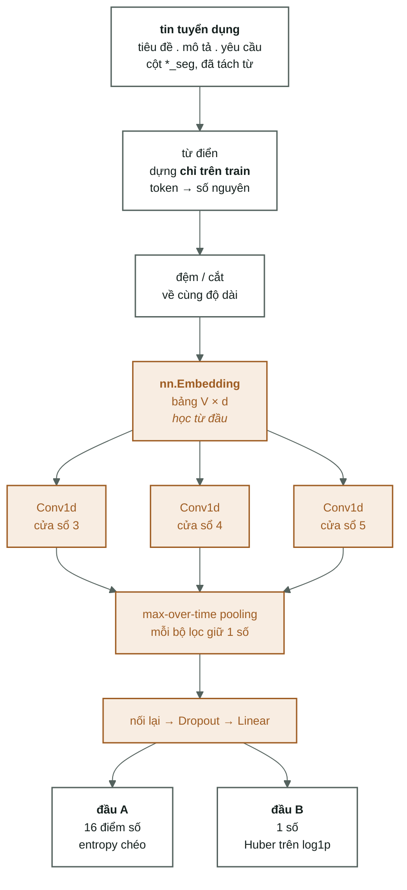

[← Kiến trúc A](03-kien-truc-a-phobert-dense.md) · [Mục lục](00-index.md) · [Vòng huấn luyện →](05-vong-huan-luyen-va-do-luong.md)

# 4. Kiến trúc B — TextCNN, một mạng học sâu cơ bản

> **Đề xuất, chưa đo.** Dự án **chưa từng** huấn luyện TextCNN: không có mã trong
> `src/vietjobs/dl/`, không có dòng nào trong [`docs/04-results.md`](../docs/04-results.md).
> Cả bài này mô tả đường ống đó **sẽ** làm gì, bằng đúng cách diễn đạt đã dùng cho
> kiến trúc A, để so sánh được hai **cơ chế**. Cái nào chấm điểm cao hơn thì phải chạy
> mới biết — và khi có số, số nằm ở [`docs/06-baseline-dl.md`](../docs/06-baseline-dl.md),
> không nằm ở đây.

Vì sao vẫn nên hiểu nó: TextCNN là **đối chứng**. Nó học nghĩa của từ từ mỗi ba vạn tin
của dự án, còn PhoBERT mang nghĩa có sẵn từ hàng chục GB tiếng Việt. Chạy cả hai thì
mới trả lời được câu hỏi: *bao nhiêu phần điểm số là nhờ PhoBERT, bao nhiêu phần là vì
bài toán vốn đã dễ?*

---

## 1. Toàn cảnh

Phần tô cam là phần **chưa tồn tại**. So với sơ đồ ở [bài 3](03-kien-truc-a-phobert-dense.md#1-toàn-cảnh):
hai đầu ra ở cuối **y hệt nhau**, mọi thứ khác đều khác.

---

## 2. Vì sao không dùng lại bộ đệm `.npy` được

Bộ đệm hiện có chứa **một vector 768 chiều cho mỗi tin** — đã gộp trung bình xong xuôi.
CNN cần thứ ngược lại: **cả chuỗi token**, còn nguyên thứ tự. Trung bình rồi thì không
tách ngược ra được.

Thêm nữa, bảng vector của CNN **được học**, nên nó đổi sau mỗi epoch. Cái gì đổi thì
không đệm được. Hệ quả thực tế: một epoch của TextCNN đắt hơn một epoch của kiến trúc
A, dù cả mạng nhỏ hơn nhiều.

---

## 3. Tách token — không cần tokenizer nào cả

**Làm gì.** Lấy các cột `*_seg` (đã có sẵn trong dữ liệu, từ ghép đã nối bằng gạch
dưới) rồi tách theo khoảng trắng. `nhân_viên kinh_doanh` → `["nhân_viên", "kinh_doanh"]`.

**Vì sao được phép đơn giản thế.** Bước tách từ tiếng Việt đã chạy một lần lúc dựng dữ
liệu và được lưu thẳng vào tệp. CNN dùng lại đúng thành quả đó — nghĩa là nó đọc
**đúng văn bản mà PhoBERT đọc**, chỉ khác cách chẻ nhỏ. Muốn so sánh công bằng thì
điều này là bắt buộc.

**Ràng buộc không được quên:** vẫn phải đi qua `resolve_column` như [bài 2 §3](02-hai-bai-toan-va-doan-duong-chung.md#3-cái-cổng-duy-nhất--và-vì-sao-trộn-cột-là-rò-rỉ-lương).
Bài lương đọc `*_masked_seg`, bài phân loại đọc `*_seg`. Luật rò rỉ không có ngoại lệ
cho kiến trúc mới.

---

## 4. Từ điển — và nó phải được dựng trên `train`

**Làm gì.** Đếm tần suất mọi token trong tập huấn luyện, giữ lại những token đủ phổ
biến, đánh số mỗi token một số nguyên. Thêm hai token đặc biệt: `<pad>` cho ô đệm và
`<unk>` cho mọi từ không có trong từ điển.

**Vì sao chỉ dựng trên `train`.** Cùng lý do với μ/σ ở [bài 3 §8](03-kien-truc-a-phobert-dense.md#8-chuẩn-hoá-từng-chiều--bước-suýt-nữa-thì-không-có):
nhìn vào `dev`/`test` để quyết định bất cứ điều gì đều là rò rỉ. Một từ chỉ xuất hiện
ở `dev` thì phải rơi vào `<unk>` — đúng như lúc gặp tin mới ngoài đời.

**Khác biệt lớn nhất so với kiến trúc A nằm ở đây.** PhoBERT chẻ từ lạ thành mảnh nên
**không có khái niệm từ hoàn toàn lạ**. TextCNN thì có: gặp `Kubernetes` mà từ điển
không chứa, nó nhận về `<unk>` — một ô trống, không mang nghĩa gì.

---

## 5. Đệm và cắt về cùng độ dài

**Làm gì.** Chọn một độ dài cố định (ví dụ 256 token cho khớp với kiến trúc A), tin
ngắn thì đệm thêm `<pad>`, tin dài thì cắt đuôi.

**Vì sao cần.** Conv1d chạy trên một khối chữ nhật, giống mọi phép tính theo lô khác.

**Cái bẫy.** Ô `<pad>` không được phép **thắng** ở bước max-pooling phía sau — nếu
không, tin càng ngắn càng bị chính phần đệm quyết định câu trả lời. Cách xử lý thông
thường: cho vector của `<pad>` cố định bằng 0 và không cho nó học.

---

## 6. `nn.Embedding` — bảng vector tự học

**Làm gì.** Một bảng tra `V × d`: `V` là số token trong từ điển, `d` là số chiều mỗi
token (thường 100–300, nhỏ hơn nhiều so với 768 của PhoBERT). Đưa vào một số nguyên,
lấy ra một dãy `d` số.

**Vì sao cần.** Số thứ tự của token trong từ điển là số vô nghĩa — token số 4.001
không "lớn hơn" token số 12. Bảng nhúng biến mỗi token thành một điểm trong không gian
để "gần nhau" mới có nghĩa.

**Khác PhoBERT ở chỗ nào — đây là điểm mấu chốt của cả bài.**

| | PhoBERT | `nn.Embedding` của TextCNN |
|---|---|---|
| ai dạy | VinAI, trên hàng chục GB tiếng Việt | chính vòng huấn luyện này |
| dạy bằng bao nhiêu dữ liệu | hàng chục GB | 34.354 tin của `train` |
| một token có mấy vector | tuỳ ngữ cảnh câu | đúng **một**, cố định |

Dòng cuối quan trọng: với TextCNN, `giám_đốc` trong "giám_đốc kinh_doanh" và trong
"trợ_lý giám_đốc" dùng **cùng một vector**. PhoBERT thì cho hai vector khác nhau vì nó
đọc cả câu. Đổi lại, TextCNN nhẹ hơn nhiều và không cần tải mô hình 135 triệu tham số.

*Ghi chú kỹ thuật:* trong môi trường `.venv-dl` hiện tại **không có** gensim hay
fastText, nên phương án "nạp vector tiếng Việt có sẵn" sẽ cần thêm thư viện và thêm
tệp vector tải từ ngoài. Bản cơ bản nhất là học từ đầu.

---

## 7. `Conv1d` — bộ dò cụm từ

Đây là ý tưởng trung tâm của cả kiến trúc.

**Làm gì.** Một **cửa sổ nhỏ trượt dọc câu**. Cửa sổ rộng 3 nghĩa là mỗi lần nó nhìn 3
token liên tiếp, tính một con số nói "đoạn này khớp với mẫu của tôi đến đâu". Trượt hết
câu thì được một dãy điểm số. Mỗi **bộ lọc** là một mẫu, và một lớp Conv1d có hàng
trăm bộ lọc chạy song song.

**Vì sao cần.** Nó bắt được **cụm từ**, thứ mà phép gộp trung bình của kiến trúc A đã
xoá sạch. Ví dụ một bộ lọc rộng 3 có thể học cách kích hoạt mạnh trên
`lập_trình_viên . java . senior`, một bộ lọc khác trên `kế_toán . tổng_hợp . thuế`.

**Đây chính là ý tưởng n-gram** của [`docs/nen-tang/03-ngram-va-ranh-gioi-tu.md`](../docs/nen-tang/03-ngram-va-ranh-gioi-tu.md),
nhưng **được học** thay vì **được đếm** — và khác biệt đó rất lớn: n-gram đếm chỉ khớp
khi cụm từ **trùng khít**, còn bộ lọc tích chập chạy trên vector nên nó kích hoạt cả
với cụm *gần giống*. `chuyên_viên kinh_doanh` có thể kích hoạt bộ lọc đã học từ
`nhân_viên bán_hàng`, dù không chung chữ nào.

**Ba cửa sổ 3/4/5.** Chạy song song ba lớp tích chập với ba bề rộng, nghĩa đen là "nhìn
3, nhìn 4, và nhìn 5 token liên tiếp". Cụm nghề nghiệp tiếng Việt dài ngắn khác nhau,
nên để mạng có cả ba cỡ kính lúp rồi tự chọn cái nào hữu ích.

---

## 8. Max-over-time pooling

**Làm gì.** Với mỗi bộ lọc, trong toàn bộ dãy điểm số dọc câu, **chỉ giữ lại số lớn
nhất**. Một bộ lọc → một con số.

**Vì sao cần.** Nó biến câu hỏi thành: *"mẫu này có xuất hiện ở đâu đó trong tin hay
không?"* Nhờ thế đầu ra **không phụ thuộc độ dài tin** — tin 40 từ và tin 400 từ đều
cho ra cùng số lượng đặc trưng, đúng thứ mà lớp `Linear` phía sau cần.

**Cái giá phải trả.** Vị trí bị vứt đi: mô hình biết cụm từ **có xuất hiện**, không biết
nó xuất hiện ở tiêu đề hay ở cuối phần phúc lợi. Đối chiếu: kiến trúc A mất trật tự từ
ở bước gộp trung bình; kiến trúc B giữ trật tự **trong phạm vi cửa sổ 3–5 token** rồi
mất nó ở bước này. Hai kiến trúc mất cùng một thứ, ở hai chỗ khác nhau.

---

## 9. Phần đuôi — giống hệt kiến trúc A

Nối kết quả của cả ba nhóm bộ lọc thành một vector, cho qua `Dropout`, rồi một lớp
`Linear`. Và sau đó:

- **phân loại**: `Linear(..., 16)` → `softmax` → entropy chéo, kèm tuỳ chọn cân bằng lớp;
- **lương**: `Linear(..., 1)` → Huber trên `log1p`, rồi `expm1` để về triệu đồng.

**Không khác một chữ nào** so với [bài 3 §10–§11](03-kien-truc-a-phobert-dense.md#10-đầu-ra-a--16-điểm-số-thành-một-nhãn).
Đây là lần thứ ba câu đó xuất hiện trong bộ ghi chú, và đó là chủ ý: **hai bài toán chỉ
khác nhau ở lớp cuối và hàm mất mát, bất kể kiến trúc nào ở phía trước.**

---

## 10. Nếu thực sự muốn làm thì cần gì

Không phải hướng dẫn thi công, chỉ là danh sách những chỗ dễ sai:

1. Từ điển và mọi thống kê **chỉ dựng trên `train`**.
2. Hai họ cột `raw` / `masked` phải tách riêng **từ đầu**, kể cả từ điển.
3. `<pad>` phải bị trung hoà trước bước max-pooling.
4. Dùng lại `src/vietjobs/evaluate.py` cho độ đo — nếu tự tính lại thì con số sẽ không
   so được với các dòng đã có trong `04-results.md`.
5. Mở một mục trong `TASKS.md` và đi theo [`docs/03-protocol.md`](../docs/03-protocol.md):
   cùng số cấu hình cho mỗi mô hình, lưu dự đoán, và quyết định bằng bootstrap bắt cặp
   chứ không bằng cảm giác.

---

## Đọc tiếp

- [Bài 5 · vòng huấn luyện và đo lường](05-vong-huan-luyen-va-do-luong.md) — kèm bảng
  so sánh A và B cạnh nhau
- [`docs/nen-tang/03-ngram-va-ranh-gioi-tu.md`](../docs/nen-tang/03-ngram-va-ranh-gioi-tu.md) —
  n-gram và ranh giới từ tiếng Việt
